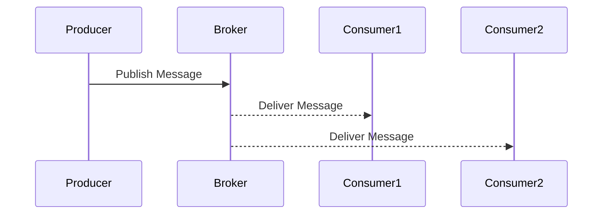

## 14.4 Message Brokers and Queues (RabbitMQ, Kafka)

In the world of distributed systems, message brokers and queues play a crucial role in enabling asynchronous communication between different components. This section delves into integrating Erlang applications with popular message brokers like RabbitMQ and Kafka. We will explore how to produce and consume messages using Erlang clients, discuss common messaging patterns, and highlight considerations for scalability and fault tolerance.

### Understanding Message Brokers

Message brokers are intermediary programs that facilitate the exchange of information between applications, systems, or services. They enable asynchronous communication, allowing systems to communicate without being directly connected. This decoupling is essential for building scalable and resilient systems.

#### Key Concepts

- **Asynchronous Communication**: Allows systems to send and receive messages without waiting for a response, improving system responsiveness and throughput.
- **Decoupling**: Separates the sender and receiver, allowing them to evolve independently.
- **Scalability**: Enables systems to handle increased loads by distributing messages across multiple consumers.
- **Fault Tolerance**: Ensures message delivery even in the event of system failures.

### RabbitMQ and Kafka: An Overview

RabbitMQ and Kafka are two of the most widely used message brokers, each with its unique strengths and use cases.

#### RabbitMQ

RabbitMQ is a robust, open-source message broker that implements the Advanced Message Queuing Protocol (AMQP). It is known for its flexibility, ease of use, and support for various messaging patterns, including:

- **Publish/Subscribe**: Allows multiple consumers to receive messages from a single publisher.
- **Work Queues**: Distributes tasks among multiple workers to balance the load.

#### Kafka

Kafka is a distributed streaming platform designed for high-throughput, fault-tolerant, and scalable message processing. It is ideal for:

- **Event Streaming**: Capturing and processing real-time data streams.
- **Log Aggregation**: Collecting and storing logs from multiple sources for analysis.

### Integrating Erlang with RabbitMQ

To integrate Erlang applications with RabbitMQ, we can use the `amqp_client` library, which provides an Erlang client for RabbitMQ.

#### Producing Messages

Let's start by producing messages to a RabbitMQ queue using the `amqp_client`.

```erlang
% Establish a connection to RabbitMQ
{ok, Connection} = amqp_connection:start(#amqp_params_network{host="localhost"}),

% Open a channel
{ok, Channel} = amqp_connection:open_channel(Connection),

% Declare a queue
ok = amqp_channel:call(Channel, #'queue.declare'{queue = <<"my_queue">>, durable = true}),

% Publish a message
Payload = <<"Hello, RabbitMQ!">>,
Exchange = <<"">>, % Default exchange
RoutingKey = <<"my_queue">>,
amqp_channel:cast(Channel, #'basic.publish'{exchange = Exchange, routing_key = RoutingKey}, #amqp_msg{payload = Payload}),

% Close the channel and connection
ok = amqp_channel:close(Channel),
ok = amqp_connection:close(Connection).
```

In this example, we establish a connection to RabbitMQ, open a channel, declare a queue, and publish a message to it. Finally, we close the channel and connection.

#### Consuming Messages

Next, let's consume messages from a RabbitMQ queue.

```erlang
% Establish a connection to RabbitMQ
{ok, Connection} = amqp_connection:start(#amqp_params_network{host="localhost"}),

% Open a channel
{ok, Channel} = amqp_connection:open_channel(Connection),

% Declare a queue
ok = amqp_channel:call(Channel, #'queue.declare'{queue = <<"my_queue">>, durable = true}),

% Define a consumer function
Consumer = fun(#amqp_msg{payload = Payload}, _Channel, _ConsumerTag) ->
    io:format("Received message: ~s~n", [Payload]),
    ok
end,

% Start consuming messages
ok = amqp_channel:subscribe(Channel, #'basic.consume'{queue = <<"my_queue">>}, Consumer),

% Keep the process alive to continue consuming messages
receive
    stop -> ok
end,

% Close the channel and connection
ok = amqp_channel:close(Channel),
ok = amqp_connection:close(Connection).
```

Here, we define a consumer function that processes incoming messages and subscribe to the queue to start receiving messages.

### Integrating Erlang with Kafka

For Kafka, we can use the `brod` library, which provides an Erlang client for Kafka.

#### Producing Messages

Let's produce messages to a Kafka topic using the `brod` client.

```erlang
% Start the brod application
ok = application:start(brod),

% Define Kafka endpoints
Endpoints = [{"localhost", 9092}],

% Start a Kafka client
ok = brod:start_client(Endpoints, client1),

% Produce a message
Topic = <<"my_topic">>,
Partition = 0,
Key = <<"key">>,
Value = <<"Hello, Kafka!">>,
ok = brod:produce_sync(client1, Topic, Partition, Key, Value).
```

In this example, we start the `brod` application, define Kafka endpoints, start a Kafka client, and produce a message to a Kafka topic.

#### Consuming Messages

Now, let's consume messages from a Kafka topic.

```erlang
% Start the brod application
ok = application:start(brod),

% Define Kafka endpoints
Endpoints = [{"localhost", 9092}],

% Start a Kafka client
ok = brod:start_client(Endpoints, client1),

% Define a consumer group
GroupId = <<"my_group">>,

% Define a consumer callback module
-module(my_consumer).
-behaviour(brod_group_subscriber).

-export([init/2, handle_message/3]).

init(_GroupId, _Topic) ->
    {ok, #{}}.

handle_message(_Partition, _Offset, Message) ->
    io:format("Received message: ~s~n", [Message]),
    ack.

% Start a consumer group
ok = brod:start_link_group_subscriber(client1, GroupId, [<<"my_topic">>], my_consumer, []).
```

Here, we define a consumer callback module that implements the `brod_group_subscriber` behavior and start a consumer group to receive messages from the Kafka topic.

### Messaging Patterns

#### Publish/Subscribe

In the publish/subscribe pattern, messages are broadcast to multiple consumers. RabbitMQ supports this pattern through exchanges, while Kafka uses topics.

#### Work Queues

Work queues distribute tasks among multiple workers, balancing the load and improving system throughput. RabbitMQ's queues and Kafka's partitions facilitate this pattern.

### Scalability and Fault Tolerance

When integrating with message brokers, consider the following:

- **Scalability**: Use multiple consumers and partitions to handle increased loads.
- **Fault Tolerance**: Implement retry mechanisms and message acknowledgments to ensure reliable message delivery.
- **Message Serialization**: Choose efficient serialization formats like JSON, Avro, or Protocol Buffers to reduce message size and improve performance.

### Visualizing Message Flow



*This diagram illustrates the publish/subscribe pattern, where a producer publishes a message to a broker, and the broker delivers it to multiple consumers.*

### Try It Yourself

Experiment with the provided code examples by modifying the message payloads, queue names, or topics. Try implementing additional features like message acknowledgments or error handling to deepen your understanding.

### References and Further Reading

- [RabbitMQ Erlang Client](https://github.com/rabbitmq/rabbitmq-erlang-client)
- [brod - Kafka Client for Erlang](https://github.com/klarna/brod)
- [RabbitMQ Documentation](https://www.rabbitmq.com/documentation.html)
- [Kafka Documentation](https://kafka.apache.org/documentation/)

### Knowledge Check

- What are the key differences between RabbitMQ and Kafka?
- How does the publish/subscribe pattern work in RabbitMQ and Kafka?
- What are some considerations for ensuring fault tolerance in message brokers?

### Embrace the Journey

Integrating Erlang applications with message brokers like RabbitMQ and Kafka opens up a world of possibilities for building scalable and resilient systems. Remember, this is just the beginning. As you progress, you'll discover more advanced patterns and techniques. Keep experimenting, stay curious, and enjoy the journey!

## Quiz: Message Brokers and Queues (RabbitMQ, Kafka)



### What is the primary role of a message broker?

- [x] Facilitate asynchronous communication between systems
- [ ] Store data persistently
- [ ] Execute business logic
- [ ] Manage user authentication

> **Explanation:** Message brokers enable asynchronous communication by decoupling the sender and receiver.

### Which Erlang library is used for integrating with RabbitMQ?

- [x] amqp_client
- [ ] brod
- [ ] cowboy
- [ ] lager

> **Explanation:** The `amqp_client` library provides an Erlang client for RabbitMQ.

### Which pattern is commonly used for distributing tasks among multiple workers?

- [x] Work Queues
- [ ] Publish/Subscribe
- [ ] Singleton
- [ ] Observer

> **Explanation:** Work queues distribute tasks among multiple workers to balance the load.

### What is a key feature of Kafka that makes it suitable for event streaming?

- [x] High throughput and fault tolerance
- [ ] Simple configuration
- [ ] Built-in user interface
- [ ] Support for SQL queries

> **Explanation:** Kafka is designed for high-throughput, fault-tolerant message processing, making it ideal for event streaming.

### How can you ensure reliable message delivery in RabbitMQ?

- [x] Implement message acknowledgments
- [ ] Use a single consumer
- [ ] Disable message persistence
- [ ] Avoid using exchanges

> **Explanation:** Message acknowledgments ensure that messages are reliably delivered and processed.

### What is the purpose of message serialization formats like JSON or Avro?

- [x] Reduce message size and improve performance
- [ ] Encrypt messages for security
- [ ] Provide a user-friendly interface
- [ ] Simplify message routing

> **Explanation:** Efficient serialization formats reduce message size and improve performance.

### Which Erlang library is used for integrating with Kafka?

- [x] brod
- [ ] amqp_client
- [ ] ranch
- [ ] rebar3

> **Explanation:** The `brod` library provides an Erlang client for Kafka.

### What is the benefit of using the publish/subscribe pattern?

- [x] Broadcast messages to multiple consumers
- [ ] Ensure messages are processed in order
- [ ] Simplify message serialization
- [ ] Reduce network latency

> **Explanation:** The publish/subscribe pattern allows messages to be broadcast to multiple consumers.

### How does RabbitMQ support the publish/subscribe pattern?

- [x] Through exchanges
- [ ] Using partitions
- [ ] With consumer groups
- [ ] Via direct connections

> **Explanation:** RabbitMQ uses exchanges to support the publish/subscribe pattern.

### True or False: Kafka topics can be partitioned to improve scalability.

- [x] True
- [ ] False

> **Explanation:** Kafka topics can be partitioned to distribute the load and improve scalability.




