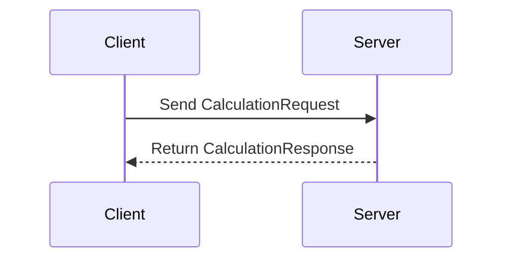

## 14.5 gRPC and Protocol Buffers Integration

In this section, we delve into the integration of gRPC and Protocol Buffers with Erlang, providing a robust framework for efficient, cross-language communication. This integration is particularly beneficial for building high-performance, strongly-typed APIs that can seamlessly interact with services written in different programming languages.

### Introduction to gRPC and Protocol Buffers

**gRPC** is a modern, open-source remote procedure call (RPC) framework that can run in any environment. It enables client and server applications to communicate transparently and simplifies the building of connected systems. gRPC uses HTTP/2 for transport, Protocol Buffers as the interface description language, and provides features such as authentication, load balancing, and more.

**Protocol Buffers** (Protobuf) is a language-neutral, platform-neutral extensible mechanism for serializing structured data. It is used by gRPC to define the structure of the data and the service interfaces.

#### Benefits of gRPC and Protocol Buffers

- **Efficiency**: Protocol Buffers are compact and efficient, reducing the size of the data transmitted over the network.
- **Cross-Language Compatibility**: gRPC and Protocol Buffers support multiple programming languages, making it easier to build systems that span different technologies.
- **Strong Typing**: The use of Protocol Buffers ensures that data structures are strongly typed, reducing errors and improving reliability.
- **Bi-directional Streaming**: gRPC supports streaming in both directions, allowing for more interactive and real-time communication.

### Setting Up gRPC in Erlang

To integrate gRPC with Erlang, we can use the [grpc](https://github.com/bluehouse-technology/grpc) library, which provides the necessary tools to implement gRPC services and clients in Erlang.

#### Installing the gRPC Library

First, ensure you have Erlang and Rebar3 installed. Then, add the `grpc` library to your `rebar.config`:

```erlang
{deps, [
    {grpc, {git, "https://github.com/bluehouse-technology/grpc", {branch, "master"}}}
]}.
```

Run `rebar3 compile` to fetch and compile the dependencies.

### Defining Service Interfaces and Message Schemas

Service interfaces and message schemas in gRPC are defined using Protocol Buffers. Let's create a simple service definition for a calculator service.

#### Example: Calculator Service

Create a file named `calculator.proto`:

```protobuf
syntax = "proto3";

package calculator;

// The calculator service definition.
service Calculator {
  // Sends a calculation request
  rpc Calculate (CalculationRequest) returns (CalculationResponse);
}

// The request message containing the operation and operands.
message CalculationRequest {
  string operation = 1;
  double operand1 = 2;
  double operand2 = 3;
}

// The response message containing the result.
message CalculationResponse {
  double result = 1;
}
```

#### Compiling Protocol Buffers

Use the Protocol Buffers compiler (`protoc`) to generate Erlang code from the `.proto` file. Ensure you have the `protoc` compiler installed and run:

```bash
protoc --erl_out=./src calculator.proto
```

This command generates Erlang modules for the defined messages and services.

### Implementing the gRPC Service in Erlang

With the generated Erlang code, we can now implement the gRPC service.

#### Erlang Server Implementation

Create a module `calculator_server.erl`:

```erlang
-module(calculator_server).
-behaviour(grpc_server).

-export([init/1, handle_request/2, terminate/2]).

init(_Args) ->
    {ok, #{}}.

handle_request({calculator, calculate, Request}, State) ->
    {ok, Response} = process_request(Request),
    {reply, Response, State}.

terminate(_Reason, _State) ->
    ok.

process_request(#calculator.CalculationRequest{operation = Operation, operand1 = Operand1, operand2 = Operand2}) ->
    Result = case Operation of
        "add" -> Operand1 + Operand2;
        "subtract" -> Operand1 - Operand2;
        "multiply" -> Operand1 * Operand2;
        "divide" -> Operand1 / Operand2
    end,
    {ok, #calculator.CalculationResponse{result = Result}}.
```

#### Starting the gRPC Server

To start the server, use the `grpc_server:start/2` function:

```erlang
grpc_server:start(calculator_server, #{port => 50051}).
```

### Implementing the gRPC Client in Erlang

Create a module `calculator_client.erl` to interact with the server:

```erlang
-module(calculator_client).

-export([calculate/3]).

calculate(Operation, Operand1, Operand2) ->
    Request = #calculator.CalculationRequest{
        operation = Operation,
        operand1 = Operand1,
        operand2 = Operand2
    },
    {ok, Channel} = grpc_channel:connect("localhost", 50051, []),
    {ok, Response} = grpc_client:call(Channel, {calculator, calculate}, Request),
    grpc_channel:close(Channel),
    Response.
```

### Performance and Compatibility Considerations

When integrating gRPC and Protocol Buffers in Erlang, consider the following:

- **Network Latency**: gRPC uses HTTP/2, which can reduce latency compared to HTTP/1.1 by allowing multiplexing of requests.
- **Data Size**: Protocol Buffers are efficient, but ensure that your data structures are optimized for size to minimize network usage.
- **Compatibility**: Ensure that the Protocol Buffers definitions are compatible across different languages and versions to avoid serialization issues.
- **Security**: Use TLS to secure gRPC communications, especially in production environments.

### Encouraging High-Performance, Strongly-Typed APIs

gRPC and Protocol Buffers are ideal for building high-performance, strongly-typed APIs. They provide a robust framework for defining services and messages, ensuring that data is transmitted efficiently and reliably across different systems.

### Try It Yourself

Experiment with the provided code examples by modifying the operations in the calculator service or adding new services and methods. Try integrating the gRPC service with other languages to see the cross-language capabilities of gRPC and Protocol Buffers.

### Visualizing gRPC Communication

Below is a sequence diagram illustrating the interaction between a gRPC client and server:



This diagram shows a simple request-response cycle between a gRPC client and server, highlighting the streamlined communication enabled by gRPC.

### References and Further Reading

- [gRPC Official Documentation](https://grpc.io/docs/)
- [Protocol Buffers Documentation](https://developers.google.com/protocol-buffers)
- [Erlang gRPC Library](https://github.com/bluehouse-technology/grpc)

### Knowledge Check

- What are the benefits of using gRPC and Protocol Buffers?
- How do you define a service interface in Protocol Buffers?
- What are some considerations for optimizing gRPC performance?

### Embrace the Journey

Remember, integrating gRPC and Protocol Buffers in Erlang is just the beginning. As you progress, you'll be able to build more complex and efficient systems that leverage the power of cross-language communication. Keep experimenting, stay curious, and enjoy the journey!

## Quiz: gRPC and Protocol Buffers Integration



### What is the primary transport protocol used by gRPC?

- [x] HTTP/2
- [ ] HTTP/1.1
- [ ] WebSocket
- [ ] FTP

> **Explanation:** gRPC uses HTTP/2 as its transport protocol, which allows for multiplexing and reduced latency.

### What is the main purpose of Protocol Buffers in gRPC?

- [x] To define the structure of data and service interfaces
- [ ] To provide authentication mechanisms
- [ ] To handle network errors
- [ ] To manage server load

> **Explanation:** Protocol Buffers are used to define the structure of data and service interfaces in gRPC.

### Which Erlang library is commonly used for implementing gRPC services?

- [x] grpc
- [ ] cowboy
- [ ] mochiweb
- [ ] hackney

> **Explanation:** The `grpc` library is commonly used for implementing gRPC services in Erlang.

### What is a key advantage of using Protocol Buffers over JSON?

- [x] They are more compact and efficient
- [ ] They are easier to read
- [ ] They support more data types
- [ ] They are language-specific

> **Explanation:** Protocol Buffers are more compact and efficient compared to JSON, making them suitable for high-performance applications.

### How can you secure gRPC communications?

- [x] By using TLS
- [ ] By using HTTP Basic Authentication
- [ ] By using API keys
- [ ] By using OAuth

> **Explanation:** TLS is used to secure gRPC communications, ensuring data is encrypted during transmission.

### What feature of gRPC allows for real-time communication?

- [x] Bi-directional streaming
- [ ] Load balancing
- [ ] Authentication
- [ ] Caching

> **Explanation:** Bi-directional streaming in gRPC allows for real-time communication between client and server.

### What should you consider when optimizing gRPC performance?

- [x] Network latency and data size
- [ ] Server hardware
- [ ] Client operating system
- [ ] Database choice

> **Explanation:** Network latency and data size are critical factors to consider when optimizing gRPC performance.

### What is the role of the `protoc` compiler in gRPC?

- [x] To generate code from Protocol Buffers definitions
- [ ] To compile Erlang code
- [ ] To manage dependencies
- [ ] To deploy services

> **Explanation:** The `protoc` compiler generates code from Protocol Buffers definitions, enabling gRPC services.

### Which of the following is a benefit of using gRPC?

- [x] Cross-language compatibility
- [ ] Simplicity
- [ ] Low memory usage
- [ ] High-level abstractions

> **Explanation:** gRPC provides cross-language compatibility, allowing services to communicate across different programming languages.

### True or False: gRPC can only be used with Protocol Buffers.

- [x] True
- [ ] False

> **Explanation:** gRPC is designed to work with Protocol Buffers, although it can technically support other serialization formats with additional effort.


