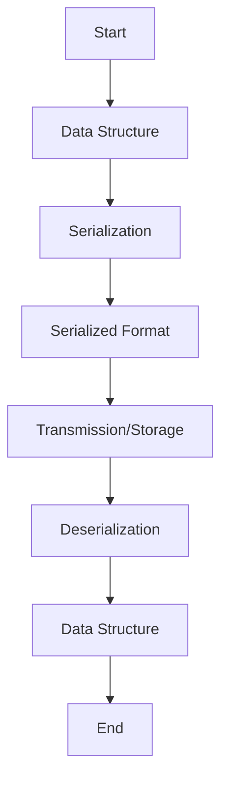

## 14.6 JSON, XML, and Data Serialization

In today's interconnected world, data serialization is a cornerstone of system integration. Whether you're building microservices, interacting with APIs, or storing data, understanding serialization formats like JSON and XML is crucial. In this section, we delve into how Erlang handles these formats, providing you with the tools to efficiently serialize and deserialize data.

### Understanding Data Serialization

Data serialization is the process of converting structured data into a format that can be easily shared or stored. This is essential for:

- **Interoperability**: Different systems and languages can communicate using a common data format.
- **Persistence**: Data can be stored in a serialized format and later retrieved.
- **Network Communication**: Serialized data can be transmitted over networks efficiently.

### JSON in Erlang

JSON (JavaScript Object Notation) is a lightweight data interchange format that's easy for humans to read and write, and easy for machines to parse and generate. Erlang provides robust support for JSON through libraries like `jsx` and `jiffy`.

#### Working with JSON in Erlang

Let's explore how to work with JSON in Erlang using the `jsx` library. First, ensure you have `jsx` installed in your project. You can add it to your `rebar.config`:

```erlang
{deps, [
    {jsx, "2.9.0"}
]}.
```

#### Encoding and Decoding JSON

Here's a simple example of encoding and decoding JSON in Erlang:

```erlang
-module(json_example).
-export([encode_json/1, decode_json/1]).

% Encode a map to JSON
encode_json(Map) ->
    jsx:encode(Map).

% Decode JSON to a map
decode_json(JsonString) ->
    jsx:decode(JsonString, [return_maps]).
```

**Usage:**

```erlang
1> json_example:encode_json(#{name => "Erlang", type => "Language"}).
<<"{\"name\":\"Erlang\",\"type\":\"Language\"}">>

2> json_example:decode_json(<<"{\"name\":\"Erlang\",\"type\":\"Language\"}">>).
#{<<"name">> => <<"Erlang">>, <<"type">> => <<"Language">>}
```

#### Key Considerations

- **Data Types**: Ensure that the data types in Erlang are compatible with JSON types. For example, atoms are not directly supported in JSON.
- **Performance**: Libraries like `jiffy` are optimized for performance and can handle large JSON payloads efficiently.

### XML in Erlang

XML (eXtensible Markup Language) is a markup language that defines a set of rules for encoding documents in a format that is both human-readable and machine-readable. Erlang provides the `xmerl` library for parsing and generating XML.

#### Parsing XML with xmerl

The `xmerl` library is a powerful tool for working with XML in Erlang. Here's how you can parse an XML document:

```erlang
-module(xml_example).
-export([parse_xml/1]).

parse_xml(XmlString) ->
    {Xml, _} = xmerl_scan:string(XmlString),
    Xml.
```

**Usage:**

```erlang
1> xml_example:parse_xml("<root><name>Erlang</name></root>").
{xmlElement,root,root,[],{xmlNamespace,[],[]},
    [],1,[],
    [{xmlElement,name,name,[],{xmlNamespace,[],[]},
        [],1,[],
        [{xmlText,[{name,1}],1,[],"Erlang",text}],
        [],name,undefined,[],[]}],
    [],root,undefined,[],[]}
```

#### Generating XML

You can also generate XML using `xmerl`:

```erlang
-module(xml_example).
-export([generate_xml/0]).

generate_xml() ->
    XmlElement = {xmlElement, root, root, [], {xmlNamespace, [], []}, [], 1, [],
                  [{xmlElement, name, name, [], {xmlNamespace, [], []}, [], 1, [],
                    [{xmlText, [], 1, [], "Erlang", text}], [], name, undefined, [], []}],
                  [], root, undefined, [], []},
    xmerl:export_simple([XmlElement], xmerl_xml).
```

**Usage:**

```erlang
1> xml_example:generate_xml().
"<?xml version=\"1.0\"?>\n<root><name>Erlang</name></root>"
```

#### Considerations for XML

- **Complexity**: XML can represent complex data structures, but it can also be verbose.
- **Validation**: Use XML schemas to validate the structure and content of XML documents.

### Data Validation and Error Handling

When working with serialized data, validation and error handling are crucial to ensure data integrity and application stability.

#### JSON Validation

For JSON, you can use libraries like `jsone` to validate JSON structures against predefined schemas.

#### XML Validation

XML validation can be performed using DTDs (Document Type Definitions) or XML Schema Definitions (XSDs). The `xmerl` library supports DTD validation.

### Best Practices for Secure and Efficient Parsing

- **Input Validation**: Always validate input data to prevent injection attacks.
- **Error Handling**: Implement robust error handling to manage parsing errors gracefully.
- **Performance**: Choose libraries that offer the best performance for your use case, especially when dealing with large datasets.

### Try It Yourself

Experiment with the provided code examples by modifying the JSON and XML structures. Try adding new fields or changing data types to see how the libraries handle these changes.

### Visualizing Data Serialization

Below is a simple flowchart illustrating the process of data serialization and deserialization:



**Description**: This flowchart represents the typical flow of data serialization and deserialization, from a data structure to a serialized format, through transmission or storage, and back to a data structure.

### References and Further Reading

- [Erlang `jsx` Library](https://github.com/talentdeficit/jsx)
- [Erlang `jiffy` Library](https://github.com/davisp/jiffy)
- [Erlang `xmerl` Library](http://erlang.org/doc/apps/xmerl/)
- [JSON Official Website](https://www.json.org/json-en.html)
- [XML Official Website](https://www.w3.org/XML/)

### Knowledge Check

- What are the key differences between JSON and XML?
- How does Erlang handle data serialization differently from other languages?
- What are some common pitfalls when working with serialized data?

### Embrace the Journey

Remember, mastering data serialization is a journey. As you continue to explore and experiment, you'll gain a deeper understanding of how to effectively integrate Erlang with external systems. Keep experimenting, stay curious, and enjoy the journey!

## Quiz: JSON, XML, and Data Serialization



### What is the primary purpose of data serialization?

- [x] To convert structured data into a format that can be easily shared or stored
- [ ] To compress data for storage
- [ ] To encrypt data for security
- [ ] To format data for display

> **Explanation:** Data serialization is primarily used to convert structured data into a format that can be easily shared or stored, enabling interoperability between different systems.

### Which Erlang library is commonly used for parsing JSON?

- [x] jsx
- [ ] xmerl
- [ ] cowboy
- [ ] lager

> **Explanation:** The `jsx` library is commonly used in Erlang for parsing JSON data.

### What is a key advantage of using JSON over XML?

- [x] JSON is more lightweight and easier to read
- [ ] JSON supports complex data structures better
- [ ] JSON is more secure
- [ ] JSON is faster to parse

> **Explanation:** JSON is more lightweight and easier to read compared to XML, making it a popular choice for data interchange.

### How can you validate XML data in Erlang?

- [x] Using DTDs or XML Schema Definitions
- [ ] Using JSON schemas
- [ ] Using regular expressions
- [ ] Using Erlang guards

> **Explanation:** XML data can be validated using DTDs (Document Type Definitions) or XML Schema Definitions (XSDs).

### What is a common use case for data serialization?

- [x] Network communication
- [ ] Data encryption
- [ ] User authentication
- [ ] UI rendering

> **Explanation:** Data serialization is commonly used for network communication, allowing data to be transmitted between systems.

### Which of the following is a best practice for secure parsing?

- [x] Validate input data
- [ ] Use complex data structures
- [ ] Avoid error handling
- [ ] Use deprecated libraries

> **Explanation:** Validating input data is a best practice for secure parsing to prevent injection attacks and ensure data integrity.

### What is the role of the `xmerl` library in Erlang?

- [x] To parse and generate XML
- [ ] To parse and generate JSON
- [ ] To handle HTTP requests
- [ ] To manage Erlang processes

> **Explanation:** The `xmerl` library in Erlang is used to parse and generate XML data.

### Which format is typically more verbose, JSON or XML?

- [x] XML
- [ ] JSON
- [ ] Both are equally verbose
- [ ] Neither is verbose

> **Explanation:** XML is typically more verbose than JSON, as it includes more markup to define data structures.

### True or False: JSON supports comments within its structure.

- [ ] True
- [x] False

> **Explanation:** JSON does not support comments within its structure, which is a common limitation compared to other formats like XML.

### What is the significance of the `return_maps` option in the `jsx:decode` function?

- [x] It returns decoded JSON as Erlang maps
- [ ] It returns decoded JSON as Erlang lists
- [ ] It returns decoded JSON as Erlang tuples
- [ ] It returns decoded JSON as Erlang binaries

> **Explanation:** The `return_maps` option in the `jsx:decode` function specifies that the decoded JSON should be returned as Erlang maps, which are more convenient for handling key-value pairs.


