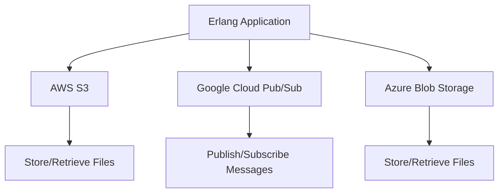

## 14.8 Integrating with Cloud Services (AWS, GCP, Azure)

In the modern era of software development, cloud services have become indispensable for building scalable, resilient, and feature-rich applications. As Erlang developers, integrating with cloud platforms like AWS, GCP, and Azure can significantly enhance the capabilities of our applications. This section will guide you through the process of integrating Erlang applications with these cloud services, focusing on storage, messaging, and computation.

### Overview of Cloud Services for Erlang Developers

Cloud services offer a plethora of tools and APIs that can be leveraged to extend the functionality of Erlang applications. Here are some key services relevant to Erlang developers:

- **Storage Services**: Services like AWS S3, Google Cloud Storage, and Azure Blob Storage provide scalable storage solutions for data and files.
- **Database Services**: Managed databases such as AWS DynamoDB, Google Cloud Firestore, and Azure Cosmos DB offer NoSQL solutions that are highly available and scalable.
- **Messaging Services**: AWS SNS/SQS, Google Cloud Pub/Sub, and Azure Service Bus facilitate asynchronous communication between distributed systems.
- **Compute Services**: AWS Lambda, Google Cloud Functions, and Azure Functions allow for serverless computing, enabling you to run code in response to events without managing servers.

### Libraries for Interfacing with Cloud APIs

To interact with these cloud services, Erlang developers can use various libraries that provide convenient interfaces to cloud APIs. Here are some popular libraries:

- **erlcloud**: A comprehensive library for interfacing with AWS services. It supports a wide range of AWS APIs, including S3, DynamoDB, and more.
  - [erlcloud GitHub Repository](https://github.com/erlcloud/erlcloud)

- **gcloud-erlang**: A library for Google Cloud Platform services. While it may not be as mature as erlcloud, it provides basic functionality for interacting with GCP.
  - [gcloud-erlang GitHub Repository](https://github.com/GoogleCloudPlatform/gcloud-erlang)

- **Azure SDK for Erlang**: While not as widely used, there are community efforts to create Erlang bindings for Azure services.

### Example: Using AWS S3 with Erlang

Let's explore how to use AWS S3 for storing and retrieving files using the `erlcloud` library.

#### Setting Up AWS Credentials

Before interacting with AWS services, you need to configure your AWS credentials. This can be done by setting environment variables or using a configuration file.

```bash
export AWS_ACCESS_KEY_ID="your_access_key_id"
export AWS_SECRET_ACCESS_KEY="your_secret_access_key"
```

#### Uploading a File to S3

Here's an example of uploading a file to an S3 bucket using `erlcloud`.

```erlang
% Import the erlcloud_s3 module
-module(s3_example).
-export([upload_file/2]).

upload_file(Bucket, FilePath) ->
    % Initialize the S3 client
    erlcloud_s3:configure("your_access_key_id", "your_secret_access_key", "us-east-1"),
    
    % Read the file content
    {ok, FileContent} = file:read_file(FilePath),
    
    % Upload the file to the specified bucket
    erlcloud_s3:put_object(Bucket, filename:basename(FilePath), FileContent, []).

% Usage example
% s3_example:upload_file("my-bucket", "/path/to/myfile.txt").
```

#### Downloading a File from S3

To download a file from S3, you can use the following code:

```erlang
download_file(Bucket, FileName) ->
    % Initialize the S3 client
    erlcloud_s3:configure("your_access_key_id", "your_secret_access_key", "us-east-1"),
    
    % Get the object from the specified bucket
    {ok, FileContent} = erlcloud_s3:get_object(Bucket, FileName),
    
    % Save the file locally
    file:write_file("/path/to/downloaded_" ++ FileName, FileContent).

% Usage example
% s3_example:download_file("my-bucket", "myfile.txt").
```

### Example: Using Google Cloud Pub/Sub with Erlang

Google Cloud Pub/Sub is a messaging service that allows you to send and receive messages between independent applications. Here's how you can use it with Erlang.

#### Publishing a Message

```erlang
-module(pubsub_example).
-export([publish_message/2]).

publish_message(ProjectId, TopicId) ->
    % Initialize the Pub/Sub client
    gcloud_pubsub:configure("your_project_id", "your_credentials_file.json"),
    
    % Create a message
    Message = #{data => <<"Hello, World!">>},
    
    % Publish the message to the specified topic
    gcloud_pubsub:publish(ProjectId, TopicId, [Message]).

% Usage example
% pubsub_example:publish_message("my-project", "my-topic").
```

#### Subscribing to a Topic

```erlang
subscribe_to_topic(ProjectId, SubscriptionId) ->
    % Initialize the Pub/Sub client
    gcloud_pubsub:configure("your_project_id", "your_credentials_file.json"),
    
    % Pull messages from the subscription
    {ok, Messages} = gcloud_pubsub:pull(ProjectId, SubscriptionId, 10),
    
    % Process each message
    lists:foreach(fun(Message) ->
        io:format("Received message: ~p~n", [Message])
    end, Messages).

% Usage example
% pubsub_example:subscribe_to_topic("my-project", "my-subscription").
```

### Considerations for Authentication, Security, and Latency

When integrating with cloud services, it's crucial to consider authentication, security, and latency:

- **Authentication**: Use secure methods for storing and accessing credentials. Consider using IAM roles and service accounts for enhanced security.
- **Security**: Ensure data is encrypted both in transit and at rest. Use HTTPS for API calls and enable encryption for storage services.
- **Latency**: Be mindful of network latency when interacting with cloud services. Use regional endpoints and caching strategies to minimize latency.

### Leveraging Cloud Services to Enhance Application Capabilities

Integrating with cloud services allows Erlang applications to scale effortlessly, handle large volumes of data, and provide robust messaging capabilities. By leveraging these services, you can focus on building core application logic while offloading infrastructure management to cloud providers.

### Try It Yourself

Experiment with the provided code examples by modifying parameters such as bucket names, file paths, and message content. Try integrating additional cloud services and explore their APIs to discover new possibilities for your Erlang applications.

### Visualizing Cloud Integration

Below is a diagram illustrating the interaction between an Erlang application and various cloud services:



This diagram shows how an Erlang application can interact with different cloud services for storage and messaging.

### References and Links

- [AWS Documentation](https://docs.aws.amazon.com/)
- [Google Cloud Documentation](https://cloud.google.com/docs)
- [Azure Documentation](https://docs.microsoft.com/en-us/azure/)
- [erlcloud GitHub Repository](https://github.com/erlcloud/erlcloud)
- [gcloud-erlang GitHub Repository](https://github.com/GoogleCloudPlatform/gcloud-erlang)

### Knowledge Check

- What are the key benefits of integrating Erlang applications with cloud services?
- How can you securely manage authentication when accessing cloud APIs?
- What are some strategies to minimize latency when interacting with cloud services?

### Embrace the Journey

Remember, integrating with cloud services is just the beginning. As you explore these powerful tools, you'll uncover new ways to enhance your applications. Keep experimenting, stay curious, and enjoy the journey!

## Quiz: Integrating with Cloud Services (AWS, GCP, Azure)



### What is a key benefit of using cloud services with Erlang applications?

- [x] Scalability and resilience
- [ ] Increased complexity
- [ ] Higher costs
- [ ] Reduced security

> **Explanation:** Cloud services provide scalability and resilience, allowing applications to handle varying loads and recover from failures.

### Which library is commonly used for interfacing with AWS services in Erlang?

- [x] erlcloud
- [ ] gcloud-erlang
- [ ] azure-erlang
- [ ] cloud-erlang

> **Explanation:** `erlcloud` is a popular library for interfacing with AWS services in Erlang.

### What is the purpose of AWS S3?

- [x] Scalable storage solution
- [ ] Messaging service
- [ ] Compute service
- [ ] Database service

> **Explanation:** AWS S3 is a scalable storage solution for storing and retrieving data.

### How can you securely manage AWS credentials in an Erlang application?

- [x] Use environment variables or IAM roles
- [ ] Hardcode credentials in the source code
- [ ] Store credentials in a public repository
- [ ] Share credentials with all team members

> **Explanation:** Using environment variables or IAM roles is a secure way to manage AWS credentials.

### What is a consideration when using cloud services for messaging?

- [x] Network latency
- [ ] Increased storage costs
- [ ] Reduced message throughput
- [ ] Limited scalability

> **Explanation:** Network latency is a consideration when using cloud services for messaging, as it can affect message delivery times.

### Which Google Cloud service is used for messaging?

- [x] Google Cloud Pub/Sub
- [ ] Google Cloud Storage
- [ ] Google Cloud Functions
- [ ] Google Cloud Firestore

> **Explanation:** Google Cloud Pub/Sub is a messaging service that allows for asynchronous communication between applications.

### What is the primary use of Azure Blob Storage?

- [x] Storing and retrieving files
- [ ] Running serverless functions
- [ ] Managing databases
- [ ] Sending messages

> **Explanation:** Azure Blob Storage is used for storing and retrieving files.

### How can you minimize latency when interacting with cloud services?

- [x] Use regional endpoints and caching
- [ ] Increase the number of API calls
- [ ] Use a single global endpoint
- [ ] Disable encryption

> **Explanation:** Using regional endpoints and caching can help minimize latency when interacting with cloud services.

### What is a common security practice when using cloud services?

- [x] Encrypt data in transit and at rest
- [ ] Disable encryption for faster access
- [ ] Share credentials publicly
- [ ] Use HTTP instead of HTTPS

> **Explanation:** Encrypting data in transit and at rest is a common security practice to protect sensitive information.

### True or False: Integrating with cloud services allows Erlang applications to offload infrastructure management to cloud providers.

- [x] True
- [ ] False

> **Explanation:** True. Integrating with cloud services allows Erlang applications to offload infrastructure management to cloud providers, enabling developers to focus on core application logic.


