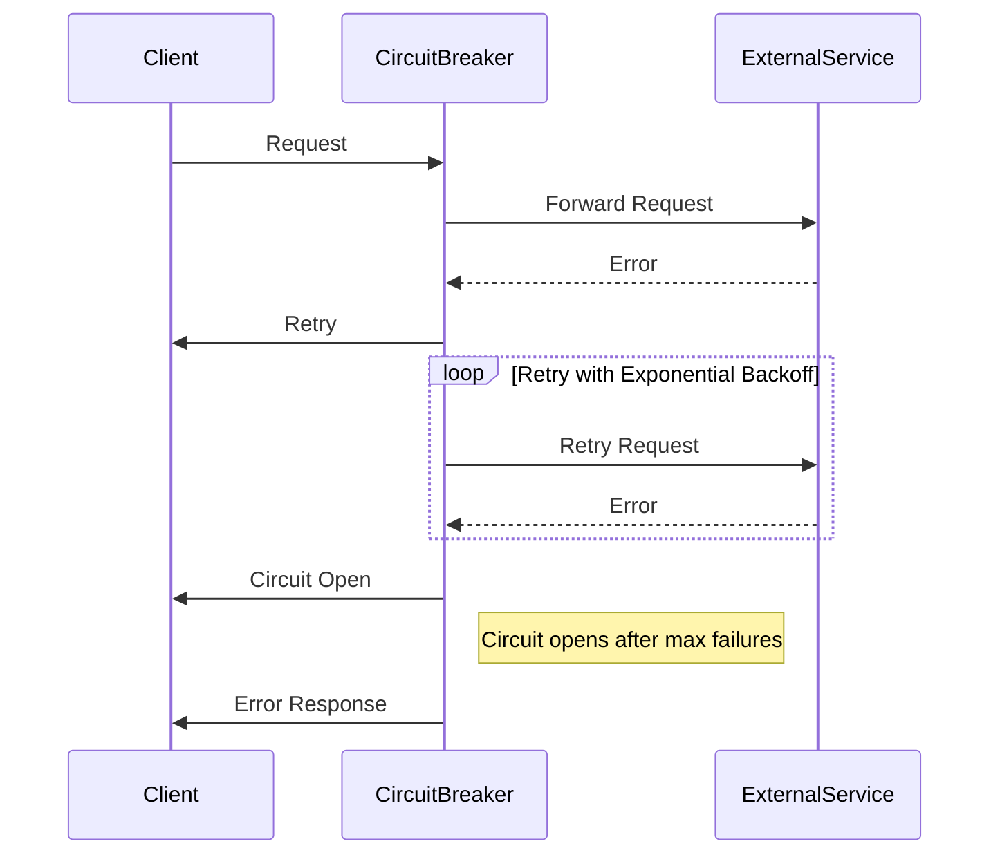

## 14.9 Handling Network Errors and Retries

In the world of distributed systems and external integrations, network errors are inevitable. As Erlang developers, we must design our applications to handle these errors gracefully and ensure that our systems remain resilient. This section will guide you through common network-related issues, implementing retry logic with exponential backoff, using circuit breaker patterns, and best practices for logging and monitoring errors.

### Understanding Network Errors

Network errors can occur due to various reasons, such as:

- **Timeouts**: When a request takes too long to complete, it may time out.
- **Transient Failures**: Temporary issues that resolve themselves, such as a brief network outage.
- **Connection Refusals**: When a server is not accepting connections, possibly due to overload.
- **DNS Failures**: Issues in resolving domain names to IP addresses.

Handling these errors effectively is crucial for maintaining the reliability and availability of your application.

### Implementing Retry Logic

Retry logic is a common strategy to handle transient network errors. By retrying a failed operation, we give the system a chance to recover from temporary issues. However, retries must be implemented carefully to avoid overwhelming the system or causing further issues.

#### Basic Retry Logic

Let's start with a simple retry mechanism in Erlang:

```erlang
-module(retry_example).
-export([fetch_data/1]).

fetch_data(Url) ->
    fetch_data(Url, 3).

fetch_data(Url, 0) ->
    {error, "Max retries reached"};
fetch_data(Url, Retries) ->
    case httpc:request(get, {Url, []}, [], []) of
        {ok, Response} ->
            {ok, Response};
        {error, Reason} ->
            io:format("Request failed: ~p. Retrying...~n", [Reason]),
            fetch_data(Url, Retries - 1)
    end.
```

In this example, we attempt to fetch data from a URL up to three times. If the request fails, we log the error and retry.

#### Exponential Backoff

Exponential backoff is a strategy where the wait time between retries increases exponentially. This approach helps to reduce the load on the system and gives it time to recover.

```erlang
-module(exponential_backoff).
-export([fetch_data/1]).

fetch_data(Url) ->
    fetch_data(Url, 3, 1000).

fetch_data(Url, 0, _) ->
    {error, "Max retries reached"};
fetch_data(Url, Retries, Delay) ->
    case httpc:request(get, {Url, []}, [], []) of
        {ok, Response} ->
            {ok, Response};
        {error, Reason} ->
            io:format("Request failed: ~p. Retrying in ~p ms...~n", [Reason, Delay]),
            timer:sleep(Delay),
            fetch_data(Url, Retries - 1, Delay * 2)
    end.
```

Here, we start with a delay of 1000 milliseconds and double it with each retry. This method allows the system to handle transient failures more gracefully.

### Circuit Breaker Pattern

The circuit breaker pattern is a design pattern used to detect failures and prevent the application from trying to perform an operation that is likely to fail. It acts as a switch that opens when failures reach a certain threshold, preventing further attempts until the system recovers.

#### Implementing a Circuit Breaker

Let's implement a simple circuit breaker in Erlang:

```erlang
-module(circuit_breaker).
-export([request/1, reset/0]).

-define(MAX_FAILURES, 5).
-define(RESET_TIMEOUT, 10000).

-record(state, {failures = 0, open = false}).

start_link() ->
    {ok, spawn(fun() -> loop(#state{}) end)}.

request(Url) ->
    case whereis(circuit_breaker) of
        undefined ->
            {error, "Circuit breaker not started"};
        Pid ->
            Pid ! {request, Url},
            receive
                {response, Response} -> Response
            end
    end.

reset() ->
    case whereis(circuit_breaker) of
        undefined ->
            {error, "Circuit breaker not started"};
        Pid ->
            Pid ! reset
    end.

loop(State) ->
    receive
        {request, Url} when State#state.open ->
            {response, {error, "Circuit is open"}};
        {request, Url} ->
            case httpc:request(get, {Url, []}, [], []) of
                {ok, Response} ->
                    loop(State#state{failures = 0});
                {error, _Reason} ->
                    NewFailures = State#state.failures + 1,
                    NewState = if
                        NewFailures >= ?MAX_FAILURES ->
                            timer:send_after(?RESET_TIMEOUT, self(), reset),
                            State#state{failures = NewFailures, open = true};
                        true ->
                            State#state{failures = NewFailures}
                    end,
                    loop(NewState)
            end;
        reset ->
            loop(State#state{failures = 0, open = false})
    end.
```

In this example, the circuit breaker opens after five consecutive failures and resets after 10 seconds. This pattern helps to prevent cascading failures by stopping requests when the system is likely to fail.

### Best Practices for Logging and Monitoring

Logging and monitoring are essential for diagnosing and resolving network errors. Here are some best practices:

- **Log All Errors**: Ensure that all network errors are logged with sufficient detail to diagnose the issue.
- **Use Structured Logging**: Use structured logging formats (e.g., JSON) to make logs easier to parse and analyze.
- **Monitor Key Metrics**: Monitor metrics such as request success rates, error rates, and retry counts to identify patterns and potential issues.
- **Alert on Anomalies**: Set up alerts for unusual patterns, such as a sudden spike in error rates or retries.

### Emphasizing Resilience

Resilience is the ability of a system to handle failures gracefully and recover quickly. To build resilient systems, consider the following:

- **Design for Failure**: Assume that failures will occur and design your system to handle them.
- **Use Timeouts**: Set appropriate timeouts for network requests to avoid hanging indefinitely.
- **Implement Fallbacks**: Provide alternative solutions or degrade gracefully when a service is unavailable.
- **Test Failure Scenarios**: Regularly test how your system handles failures to ensure it behaves as expected.

### Visualizing Network Error Handling

To better understand the flow of handling network errors and retries, let's visualize the process using a sequence diagram:



This diagram illustrates the interaction between the client, circuit breaker, and external service, highlighting the retry logic and circuit breaker behavior.

### Try It Yourself

Experiment with the provided code examples by modifying the retry count, delay, and circuit breaker settings. Observe how these changes affect the system's behavior and resilience.

### References and Further Reading

- [Erlang HTTP Client Documentation](http://erlang.org/doc/man/httpc.html)
- [Circuit Breaker Pattern](https://martinfowler.com/bliki/CircuitBreaker.html)
- [Exponential Backoff and Jitter](https://aws.amazon.com/blogs/architecture/exponential-backoff-and-jitter/)

### Knowledge Check

- What are common network errors, and how can they be handled?
- How does exponential backoff improve retry logic?
- What is the purpose of a circuit breaker, and how does it prevent cascading failures?

### Summary

In this section, we've explored strategies for handling network errors and implementing retries in Erlang. By understanding common network issues, implementing retry logic with exponential backoff, and using circuit breaker patterns, we can build resilient systems that handle failures gracefully. Remember to log and monitor errors effectively and design your system with resilience in mind.

## Quiz: Handling Network Errors and Retries



### What is a common cause of network errors?

- [x] Timeouts
- [ ] Memory leaks
- [ ] Syntax errors
- [ ] Compilation errors

> **Explanation:** Network errors often occur due to timeouts, where a request takes too long to complete.

### How does exponential backoff help in retry logic?

- [x] It increases the wait time between retries exponentially.
- [ ] It decreases the wait time between retries.
- [ ] It keeps the wait time constant.
- [ ] It retries immediately without delay.

> **Explanation:** Exponential backoff increases the wait time between retries, reducing the load on the system and allowing it to recover.

### What is the purpose of a circuit breaker pattern?

- [x] To prevent cascading failures by stopping requests after a threshold of failures.
- [ ] To increase the speed of requests.
- [ ] To ensure all requests are processed.
- [ ] To log all network errors.

> **Explanation:** The circuit breaker pattern prevents cascading failures by stopping requests after a certain number of failures.

### What should be logged to diagnose network errors effectively?

- [x] All network errors with sufficient detail.
- [ ] Only successful requests.
- [ ] Only failed requests without details.
- [ ] Only the number of retries.

> **Explanation:** Logging all network errors with sufficient detail helps diagnose and resolve issues effectively.

### What is a best practice for monitoring network errors?

- [x] Monitor key metrics like request success rates and error rates.
- [ ] Ignore error rates.
- [ ] Only monitor successful requests.
- [ ] Monitor only the number of retries.

> **Explanation:** Monitoring key metrics like request success rates and error rates helps identify patterns and potential issues.

### What is a fallback in the context of network error handling?

- [x] An alternative solution when a service is unavailable.
- [ ] A retry mechanism.
- [ ] A logging strategy.
- [ ] A monitoring tool.

> **Explanation:** A fallback is an alternative solution or a way to degrade gracefully when a service is unavailable.

### How can you test the resilience of your system?

- [x] Regularly test failure scenarios.
- [ ] Only test successful scenarios.
- [ ] Ignore testing.
- [ ] Test only in production.

> **Explanation:** Regularly testing failure scenarios ensures that the system behaves as expected under failure conditions.

### What is the role of timeouts in network requests?

- [x] To avoid hanging indefinitely by setting a limit on request duration.
- [ ] To increase the speed of requests.
- [ ] To ensure all requests are processed.
- [ ] To log all network errors.

> **Explanation:** Timeouts prevent requests from hanging indefinitely by setting a limit on how long a request can take.

### What does the circuit breaker do when it opens?

- [x] Stops further requests until the system recovers.
- [ ] Increases the speed of requests.
- [ ] Ensures all requests are processed.
- [ ] Logs all network errors.

> **Explanation:** When a circuit breaker opens, it stops further requests until the system recovers, preventing cascading failures.

### True or False: Exponential backoff decreases the wait time between retries.

- [ ] True
- [x] False

> **Explanation:** Exponential backoff increases the wait time between retries, allowing the system to recover from transient failures.



Remember, building resilient systems is an ongoing journey. Keep experimenting, stay curious, and enjoy the process of making your Erlang applications robust and reliable!
