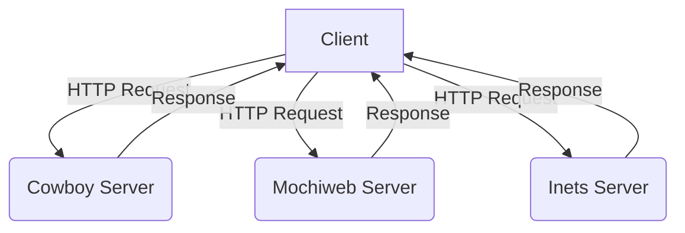

## 15.1 Overview of Erlang Web Servers (`cowboy`, `mochiweb`, `inets`)

Erlang, renowned for its concurrency and fault-tolerance, is a powerful choice for building scalable web applications. At the heart of these applications are web servers that handle HTTP requests, manage connections, and serve dynamic content. In this section, we delve into three prominent Erlang web servers: Cowboy, Mochiweb, and Inets. We will explore their features, compare their capabilities, and provide guidance on selecting the right server for your project.

### Introduction to Erlang Web Servers

Erlang web servers are designed to leverage the language's strengths in handling concurrent connections and ensuring high availability. Each server offers unique features and caters to different use cases. Let's introduce the main players:

#### Cowboy

[Cowboy](https://ninenines.eu/docs/en/cowboy/2.9/guide/intro/) is a small, fast, and modern HTTP server for Erlang/OTP. It is designed to be simple to use and efficient in handling a large number of connections. Cowboy is often praised for its performance and minimalistic design, making it a popular choice for developers looking to build RESTful APIs and real-time applications.

#### Mochiweb

[Mochiweb](https://github.com/mochi/mochiweb) is a lightweight HTTP library and web server for Erlang. It has been around for a long time and is known for its simplicity and ease of integration. Mochiweb is often used in projects where a straightforward HTTP server is needed without the overhead of more complex frameworks.

#### Inets

[Inets](http://erlang.org/doc/man/inets.html) is part of the Erlang/OTP distribution and provides a suite of internet client and server applications, including an HTTP server. Inets is well-integrated with Erlang/OTP and offers a robust solution for building web applications that require tight integration with other Erlang components.

### Comparing Capabilities

When choosing a web server, it's essential to consider various factors such as performance, scalability, ease of use, and community support. Let's compare Cowboy, Mochiweb, and Inets based on these criteria.

#### Performance

- **Cowboy**: Known for its high performance and ability to handle thousands of concurrent connections efficiently. Cowboy's architecture is optimized for speed, making it suitable for high-load scenarios.
  
- **Mochiweb**: Offers good performance for lightweight applications. While not as fast as Cowboy, Mochiweb is sufficient for many use cases where extreme scalability is not a primary concern.
  
- **Inets**: Provides decent performance, especially when integrated with other Erlang/OTP components. However, it may not match Cowboy's performance in high-concurrency environments.

#### Scalability

- **Cowboy**: Designed with scalability in mind, Cowboy can handle a large number of simultaneous connections, making it ideal for building scalable web services.
  
- **Mochiweb**: Suitable for small to medium-sized applications. While it can handle multiple connections, it may not scale as efficiently as Cowboy.
  
- **Inets**: Offers scalability through its integration with Erlang/OTP, but may require additional configuration and tuning to achieve optimal performance in large-scale applications.

#### Ease of Use

- **Cowboy**: Provides a straightforward API and comprehensive documentation, making it easy to get started. Its simplicity is one of its key strengths.
  
- **Mochiweb**: Known for its simplicity and ease of integration. Mochiweb's API is intuitive, making it a good choice for developers new to Erlang web development.
  
- **Inets**: As part of Erlang/OTP, Inets may have a steeper learning curve due to its integration with other components. However, it offers powerful features for those familiar with Erlang/OTP.

#### Community Support

- **Cowboy**: Has a strong community and active development, with regular updates and a wealth of resources available online.
  
- **Mochiweb**: While not as actively developed as Cowboy, Mochiweb has a dedicated user base and a wealth of existing projects and examples to draw from.
  
- **Inets**: Supported by the Erlang/OTP team, Inets benefits from the broader Erlang community and official documentation.

### Choosing the Right Web Server

Selecting the appropriate web server depends on your project's specific requirements. Here are some criteria to consider:

- **Performance Needs**: If your application requires handling a large number of concurrent connections, Cowboy is likely the best choice due to its performance optimizations.
  
- **Simplicity**: For projects that prioritize simplicity and ease of integration, Mochiweb is a strong candidate.
  
- **Integration with Erlang/OTP**: If your application requires tight integration with Erlang/OTP components, Inets may be the most suitable option.
  
- **Community and Support**: Consider the level of community support and available resources. Cowboy's active community can be a valuable asset for troubleshooting and learning.

### Code Examples

Let's explore some basic code examples to illustrate how each web server can be used in an Erlang application.

#### Cowboy Example

```erlang
-module(my_cowboy_app).
-export([start/0]).

start() ->
    {ok, _} = cowboy:start_clear(my_http_listener,
        [{port, 8080}],
        #{env => #{dispatch => cowboy_router:compile([
            {'_', [
                {"/", my_cowboy_handler, []}
            ]}
        ])}}
    ).

-module(my_cowboy_handler).
-export([init/2]).

init(Req, State) ->
    {ok, Req2} = cowboy_req:reply(200, #{<<"content-type">> => <<"text/plain">>}, <<"Hello, Cowboy!">>, Req),
    {ok, Req2, State}.
```

#### Mochiweb Example

```erlang
-module(my_mochiweb_app).
-export([start/0]).

start() ->
    mochiweb_http:start([{port, 8080}, {loop, fun my_mochiweb_handler:loop/1}]).

-module(my_mochiweb_handler).
-export([loop/1]).

loop(Req) ->
    Req:respond({200, [{"Content-Type", "text/plain"}], <<"Hello, Mochiweb!">>}).
```

#### Inets Example

```erlang
-module(my_inets_app).
-export([start/0]).

start() ->
    inets:start(),
    inets:start(httpd, [
        {port, 8080},
        {server_name, "my_inets_server"},
        {server_root, "."},
        {document_root, "."},
        {modules, [mod_alias, mod_auth, mod_esi, mod_actions, mod_cgi]},
        {erl_script_alias, {"/", my_inets_handler, []}}
    ]).

-module(my_inets_handler).
-export([do/1]).

do(Req) ->
    {ok, Req2} = httpd_util:reply(200, [{"Content-Type", "text/plain"}], <<"Hello, Inets!">>, Req),
    {ok, Req2}.
```

### Visualizing Erlang Web Server Architecture

To better understand how these web servers fit into an Erlang application, let's visualize their architecture using a Mermaid.js diagram.



**Diagram Description**: This diagram illustrates how clients send HTTP requests to Cowboy, Mochiweb, and Inets servers, which then process the requests and send responses back to the clients.

### Knowledge Check

- **Question**: Which Erlang web server is known for its high performance and ability to handle a large number of concurrent connections?
  - **Answer**: Cowboy

- **Question**: Which web server is part of the Erlang/OTP distribution and offers integration with other Erlang components?
  - **Answer**: Inets

### Try It Yourself

Experiment with the code examples provided above. Try changing the port numbers, modifying the response messages, or adding new routes. This hands-on practice will help solidify your understanding of each web server's capabilities.

### Conclusion

In this section, we've explored the features and capabilities of Cowboy, Mochiweb, and Inets, three popular Erlang web servers. Each server offers unique strengths and is suited to different use cases. By understanding their differences, you can make an informed decision about which server best fits your project's needs. Remember, this is just the beginning of your journey into Erlang web development. Keep experimenting, stay curious, and enjoy the process!

## Quiz: Overview of Erlang Web Servers (`cowboy`, `mochiweb`, `inets`)



### Which Erlang web server is known for its high performance and ability to handle a large number of concurrent connections?

- [x] Cowboy
- [ ] Mochiweb
- [ ] Inets
- [ ] None of the above

> **Explanation:** Cowboy is designed for high performance and scalability, making it suitable for handling many concurrent connections.

### Which web server is part of the Erlang/OTP distribution?

- [ ] Cowboy
- [ ] Mochiweb
- [x] Inets
- [ ] None of the above

> **Explanation:** Inets is included in the Erlang/OTP distribution and provides a suite of internet client and server applications.

### Which web server is known for its simplicity and ease of integration?

- [ ] Cowboy
- [x] Mochiweb
- [ ] Inets
- [ ] None of the above

> **Explanation:** Mochiweb is praised for its simplicity and ease of integration, making it a good choice for straightforward applications.

### Which web server offers tight integration with other Erlang components?

- [ ] Cowboy
- [ ] Mochiweb
- [x] Inets
- [ ] None of the above

> **Explanation:** Inets is well-integrated with Erlang/OTP, allowing for seamless interaction with other Erlang components.

### Which web server has a strong community and active development?

- [x] Cowboy
- [ ] Mochiweb
- [ ] Inets
- [ ] None of the above

> **Explanation:** Cowboy has a strong community and is actively developed, providing a wealth of resources and support.

### Which web server is suitable for building RESTful APIs and real-time applications?

- [x] Cowboy
- [ ] Mochiweb
- [ ] Inets
- [ ] None of the above

> **Explanation:** Cowboy's performance and design make it ideal for building RESTful APIs and real-time applications.

### Which web server is often used in projects where a straightforward HTTP server is needed?

- [ ] Cowboy
- [x] Mochiweb
- [ ] Inets
- [ ] None of the above

> **Explanation:** Mochiweb is often chosen for projects that require a simple and straightforward HTTP server.

### Which web server may require additional configuration and tuning for large-scale applications?

- [ ] Cowboy
- [ ] Mochiweb
- [x] Inets
- [ ] None of the above

> **Explanation:** Inets may need additional configuration and tuning to achieve optimal performance in large-scale applications.

### Which web server provides a suite of internet client and server applications?

- [ ] Cowboy
- [ ] Mochiweb
- [x] Inets
- [ ] None of the above

> **Explanation:** Inets offers a suite of internet client and server applications as part of the Erlang/OTP distribution.

### True or False: Mochiweb is known for its high performance and ability to handle a large number of concurrent connections.

- [ ] True
- [x] False

> **Explanation:** While Mochiweb offers good performance, it is not specifically known for handling a large number of concurrent connections like Cowboy.


