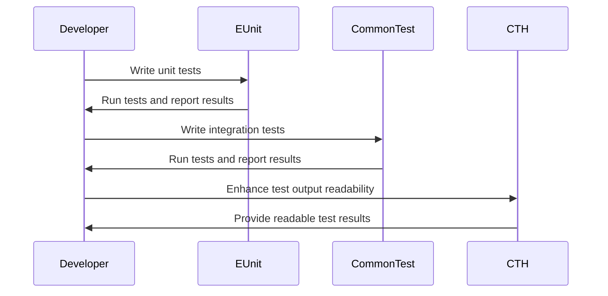

## 15.10 Testing Web Applications

In the realm of web development, testing is a cornerstone of ensuring that applications function correctly and reliably. This section delves into the testing strategies for web applications built with Erlang frameworks, focusing on tools like EUnit, Common Test, and CTH for HTTP testing. We will explore unit tests for handlers, integration tests for endpoints, and automated testing for APIs and UI components. Additionally, we will discuss the importance of test coverage and continuous integration, encouraging the practice of writing tests early and updating them regularly.

### Introduction to Testing in Erlang

Testing in Erlang is a critical aspect of the development process, ensuring that applications are robust, scalable, and maintainable. Erlang's concurrency model and functional programming paradigm provide unique opportunities and challenges in testing web applications. Let's explore the tools and techniques available for testing in Erlang.

### Testing Tools in Erlang

#### EUnit

EUnit is a lightweight unit testing framework for Erlang, designed to test individual functions and modules. It is integrated into the Erlang/OTP distribution, making it a convenient choice for developers.

- **Key Features**:
  - Simple syntax for writing tests.
  - Support for test fixtures and setup/teardown functions.
  - Integration with the Erlang shell for interactive testing.

#### Common Test

Common Test is a more comprehensive testing framework, suitable for integration and system testing. It is part of the Erlang/OTP distribution and provides extensive support for writing and running tests.

- **Key Features**:
  - Support for test suites and test cases.
  - Built-in support for distributed testing.
  - Detailed test reports and logging.

#### CTH (Common Test Hooks)

CTH is an extension for Common Test that provides readable test output, making it easier to understand test results.

- **Key Features**:
  - Enhanced readability of test results.
  - Customizable output formats.
  - Integration with Common Test for seamless usage.

### Writing Unit Tests with EUnit

Unit tests focus on testing individual functions or modules in isolation. Let's explore how to write unit tests for a simple web handler using EUnit.

```erlang
-module(my_handler).
-export([handle_request/1]).

handle_request({get, "/hello"}) ->
    {200, "Hello, World!"};
handle_request(_) ->
    {404, "Not Found"}.

%%% EUnit Tests
-module(my_handler_tests).
-include_lib("eunit/include/eunit.hrl").

handle_request_test() ->
    ?assertEqual({200, "Hello, World!"}, my_handler:handle_request({get, "/hello"})),
    ?assertEqual({404, "Not Found"}, my_handler:handle_request({get, "/unknown"})).
```

- **Explanation**:
  - The `handle_request/1` function handles HTTP GET requests.
  - The EUnit test `handle_request_test/0` verifies the function's behavior for known and unknown paths.

### Integration Testing with Common Test

Integration tests focus on testing the interaction between different components of the application. Let's write an integration test for a web endpoint using Common Test.

```erlang
-module(my_integration_tests).
-include_lib("common_test/include/ct.hrl").

init_per_suite(Config) ->
    {ok, Config}.

end_per_suite(_Config) ->
    ok.

init_per_testcase(_TestCase, Config) ->
    {ok, Config}.

end_per_testcase(_TestCase, _Config) ->
    ok.

test_hello_endpoint(Config) ->
    {ok, Response} = httpc:request(get, {"http://localhost:8080/hello", []}, [], []),
    ?assertEqual({200, "Hello, World!"}, Response).
```

- **Explanation**:
  - The `test_hello_endpoint/1` function sends an HTTP GET request to the `/hello` endpoint and verifies the response.
  - Common Test provides setup and teardown functions for test suites and test cases.

### Automated Testing for APIs and UI Components

Automated testing is crucial for ensuring the reliability of APIs and UI components. It involves running tests automatically as part of the development process, often integrated with continuous integration (CI) pipelines.

#### Testing APIs

Automated API testing involves verifying the functionality, performance, and security of API endpoints. Tools like `httpc` and `hackney` can be used to send HTTP requests and validate responses.

```erlang
-module(api_tests).
-include_lib("eunit/include/eunit.hrl").

api_test() ->
    {ok, Response} = httpc:request(get, {"http://localhost:8080/api/resource", []}, [], []),
    ?assertEqual(200, Response#http_response.status_code),
    ?assertMatch("application/json", proplists:get_value("content-type", Response#http_response.headers)).
```

- **Explanation**:
  - The `api_test/0` function sends an HTTP GET request to an API endpoint and verifies the status code and content type.

#### Testing UI Components

Testing UI components involves verifying the user interface's functionality and appearance. While Erlang is not typically used for UI testing, it can be integrated with tools like Selenium or Cypress for end-to-end testing.

### Importance of Test Coverage and Continuous Integration

Test coverage measures the extent to which the codebase is tested by automated tests. High test coverage ensures that most of the code is exercised during testing, reducing the likelihood of bugs.

- **Continuous Integration (CI)**:
  - CI involves automatically running tests whenever code changes are made, ensuring that new changes do not break existing functionality.
  - Tools like Jenkins, Travis CI, and GitHub Actions can be used to set up CI pipelines for Erlang projects.

### Best Practices for Testing Web Applications

- **Write Tests Early**: Begin writing tests as soon as development starts to catch issues early.
- **Update Tests Regularly**: Keep tests up-to-date with code changes to ensure they remain relevant.
- **Focus on Edge Cases**: Test edge cases and error conditions to ensure robustness.
- **Use Mocks and Stubs**: Isolate components during testing by using mocks and stubs to simulate dependencies.
- **Measure Test Coverage**: Use tools like Cover to measure test coverage and identify untested code paths.

### Try It Yourself

Experiment with the provided code examples by modifying the request paths or response content. Try adding new test cases to cover additional scenarios, such as different HTTP methods or error conditions.

### Visualizing the Testing Process

Below is a sequence diagram illustrating the testing process for a web application using Erlang frameworks.



- **Description**: This diagram shows the interaction between the developer and testing tools during the testing process.

### References and Links

- [EUnit Documentation](https://erlang.org/doc/apps/eunit/chapter.html)
- [Common Test User's Guide](https://erlang.org/doc/apps/common_test/users_guide.html)
- [CTH Readable GitHub Repository](https://github.com/extend/cth_readable)

### Knowledge Check

- **Question**: What is the primary purpose of unit tests in web applications?
- **Exercise**: Write a unit test for a new handler function that processes POST requests.

### Embrace the Journey

Testing is an integral part of the development process, ensuring that web applications are reliable and maintainable. Remember, this is just the beginning. As you progress, you'll build more complex and interactive applications. Keep experimenting, stay curious, and enjoy the journey!

### Summary of Key Takeaways

- **EUnit** is ideal for unit testing individual functions and modules.
- **Common Test** is suitable for integration and system testing.
- **CTH** enhances the readability of test results.
- Automated testing is crucial for APIs and UI components.
- High test coverage and continuous integration are essential for reliable applications.

## Quiz: Testing Web Applications



### What is the primary purpose of EUnit in Erlang?

- [x] To perform unit testing on individual functions and modules
- [ ] To perform integration testing on entire applications
- [ ] To enhance test output readability
- [ ] To automate UI testing

> **Explanation:** EUnit is specifically designed for unit testing individual functions and modules in Erlang.

### Which tool is best suited for integration testing in Erlang?

- [ ] EUnit
- [x] Common Test
- [ ] CTH
- [ ] Selenium

> **Explanation:** Common Test is a comprehensive testing framework suitable for integration and system testing in Erlang.

### What does CTH provide for Common Test?

- [ ] Unit testing capabilities
- [x] Enhanced readability of test results
- [ ] API testing tools
- [ ] UI testing integration

> **Explanation:** CTH enhances the readability of test results when using Common Test.

### Why is high test coverage important?

- [x] It ensures most of the code is exercised during testing
- [ ] It reduces the number of tests needed
- [ ] It speeds up the testing process
- [ ] It eliminates the need for manual testing

> **Explanation:** High test coverage ensures that most of the code is exercised during testing, reducing the likelihood of bugs.

### What is the role of continuous integration in testing?

- [x] To automatically run tests whenever code changes are made
- [ ] To manually run tests at the end of development
- [ ] To enhance test output readability
- [ ] To perform UI testing

> **Explanation:** Continuous integration involves automatically running tests whenever code changes are made, ensuring new changes do not break existing functionality.

### Which tool can be used for measuring test coverage in Erlang?

- [ ] EUnit
- [ ] Common Test
- [x] Cover
- [ ] CTH

> **Explanation:** Cover is a tool used for measuring test coverage in Erlang.

### What is a common practice when writing tests?

- [x] Write tests early in the development process
- [ ] Write tests only after development is complete
- [ ] Avoid testing edge cases
- [ ] Use real dependencies instead of mocks

> **Explanation:** Writing tests early in the development process helps catch issues early and ensures robust code.

### How can you isolate components during testing?

- [x] Use mocks and stubs
- [ ] Use real dependencies
- [ ] Avoid testing
- [ ] Use only unit tests

> **Explanation:** Using mocks and stubs helps isolate components during testing by simulating dependencies.

### What is the benefit of using CTH with Common Test?

- [x] It provides readable test results
- [ ] It automates UI testing
- [ ] It performs load testing
- [ ] It measures test coverage

> **Explanation:** CTH provides readable test results, making it easier to understand test outcomes.

### True or False: Automated testing is not necessary for APIs.

- [ ] True
- [x] False

> **Explanation:** Automated testing is crucial for APIs to ensure their functionality, performance, and security.




