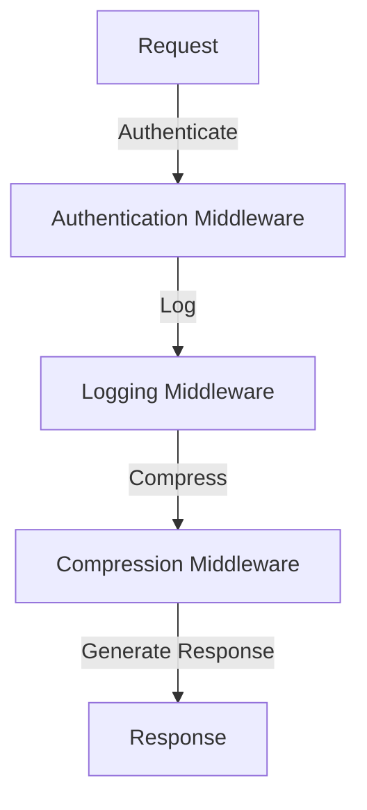

## 15.11 Middleware and Filter Chains

In the realm of web development, middleware and filter chains are crucial components that facilitate the processing of requests and responses. They act as intermediaries that can modify, enhance, or even terminate the flow of data between a client and a server. In this section, we will delve into the concept of middleware, explore how to implement it in Erlang web frameworks, and discuss best practices for creating modular and reusable middleware components.

### Understanding Middleware

**Middleware** is a layer of software that sits between the client and the server, intercepting requests and responses. It can perform a variety of tasks such as authentication, logging, data compression, and more. Middleware is typically organized in a pipeline, where each piece of middleware processes the request or response in sequence.

#### Key Characteristics of Middleware

- **Interception**: Middleware can intercept requests and responses, allowing for pre-processing or post-processing.
- **Modularity**: Middleware components are often modular, enabling developers to add, remove, or reorder them as needed.
- **Reusability**: Middleware can be reused across different applications or parts of an application.
- **Composability**: Middleware can be composed into pipelines, where the output of one middleware serves as the input for the next.

### Implementing Middleware in Erlang

Erlang, with its concurrent and functional nature, provides a robust platform for implementing middleware. Let's explore how to create middleware for common tasks such as authentication, logging, and compression.

#### Example: Authentication Middleware

Authentication middleware is responsible for verifying the identity of a user before allowing access to certain resources. Here's a simple example of how you might implement authentication middleware in Erlang:

```erlang
-module(auth_middleware).
-export([authenticate/2]).

% Authenticate a request
authenticate(Request, Next) ->
    case get_user_from_request(Request) of
        {ok, User} ->
            % User is authenticated, proceed to the next middleware
            Next(Request);
        {error, Reason} ->
            % Authentication failed, return an error response
            {error, {unauthorized, Reason}}
    end.

% Helper function to extract user information from the request
get_user_from_request(Request) ->
    % Assume we have a function that checks the request headers for a token
    case check_auth_token(Request) of
        {ok, User} -> {ok, User};
        error -> {error, "Invalid token"}
    end.
```

In this example, the `authenticate/2` function checks the request for a valid user token. If the token is valid, it calls the next middleware in the chain. Otherwise, it returns an error response.

#### Example: Logging Middleware

Logging middleware records information about each request and response, which can be invaluable for debugging and monitoring. Here's how you might implement logging middleware:

```erlang
-module(logging_middleware).
-export([log_request/2]).

% Log the request and pass it to the next middleware
log_request(Request, Next) ->
    io:format("Received request: ~p~n", [Request]),
    Response = Next(Request),
    io:format("Sending response: ~p~n", [Response]),
    Response.
```

This middleware logs the incoming request and the outgoing response, providing a simple way to track the flow of data through the application.

#### Example: Compression Middleware

Compression middleware reduces the size of responses, improving the efficiency of data transfer. Here's a basic implementation:

```erlang
-module(compression_middleware).
-export([compress_response/2]).

% Compress the response before sending it
compress_response(Request, Next) ->
    Response = Next(Request),
    CompressedResponse = compress(Response),
    CompressedResponse.

% Helper function to compress the response
compress(Response) ->
    % Assume we have a function that compresses the response data
    zlib:compress(Response).
```

In this example, the `compress_response/2` function compresses the response data before sending it back to the client.

### Composing Middleware in a Pipeline

Middleware is most effective when composed into a pipeline, where each middleware component processes the request or response in sequence. This allows for a clean separation of concerns and makes it easy to add or remove functionality.

#### Example: Composing a Middleware Pipeline

Let's see how we can compose the authentication, logging, and compression middleware into a pipeline:

```erlang
-module(middleware_pipeline).
-export([handle_request/1]).

% Define the middleware pipeline
handle_request(Request) ->
    Pipeline = [
        fun auth_middleware:authenticate/2,
        fun logging_middleware:log_request/2,
        fun compression_middleware:compress_response/2
    ],
    execute_pipeline(Pipeline, Request).

% Execute the middleware pipeline
execute_pipeline([], Request) ->
    % Final response generation
    {ok, generate_response(Request)};
execute_pipeline([Middleware | Rest], Request) ->
    case Middleware(Request, fun(Req) -> execute_pipeline(Rest, Req) end) of
        {ok, Response} -> Response;
        {error, Reason} -> {error, Reason}
    end.

% Helper function to generate a response
generate_response(Request) ->
    % Generate a response based on the request
    {ok, "Response for " ++ Request}.
```

In this example, the `handle_request/1` function defines a pipeline of middleware functions. The `execute_pipeline/2` function iterates over the pipeline, executing each middleware in turn.

### Best Practices for Middleware

To ensure that your middleware is modular, reusable, and maintainable, consider the following best practices:

- **Keep Middleware Focused**: Each middleware should have a single responsibility, making it easier to understand and maintain.
- **Use Functional Composition**: Leverage Erlang's functional programming capabilities to compose middleware in a clean and efficient manner.
- **Handle Errors Gracefully**: Ensure that middleware can handle errors without disrupting the entire pipeline.
- **Document Middleware**: Provide clear documentation for each middleware component, including its purpose and usage.

### Impact on Maintainability and Extensibility

Middleware and filter chains can significantly enhance the maintainability and extensibility of your web applications. By encapsulating functionality in modular components, you can easily add, remove, or modify features without affecting the rest of the application. This modularity also makes it easier to test and debug individual components.

### Visualizing Middleware Pipelines

To better understand how middleware pipelines work, let's visualize the flow of data through a simple pipeline:



In this diagram, each middleware component processes the request in sequence, ultimately generating a response.

### Try It Yourself

Now that we've explored middleware and filter chains, try implementing your own middleware components. Consider adding middleware for tasks such as rate limiting, caching, or data validation. Experiment with different compositions and see how they affect the behavior of your application.

### References and Links

- [Erlang Documentation](https://www.erlang.org/docs)
- [Cowboy Web Server](https://ninenines.eu/docs/en/cowboy/2.9/guide/)
- [Zlib Compression in Erlang](http://erlang.org/doc/man/zlib.html)

### Knowledge Check

- What is the primary purpose of middleware in web frameworks?
- How can you compose middleware into a pipeline in Erlang?
- What are some best practices for creating modular and reusable middleware?

### Embrace the Journey

Remember, middleware and filter chains are powerful tools for enhancing the functionality of your web applications. As you continue to explore Erlang and its capabilities, keep experimenting with different middleware compositions and discover new ways to improve your applications. Stay curious, and enjoy the journey!

## Quiz: Middleware and Filter Chains



### What is the primary purpose of middleware in web frameworks?

- [x] To intercept and process requests and responses
- [ ] To directly handle database operations
- [ ] To manage user interfaces
- [ ] To compile Erlang code

> **Explanation:** Middleware acts as an intermediary to process requests and responses, adding functionality such as authentication and logging.

### How can middleware be composed in Erlang?

- [x] By creating a pipeline of functions
- [ ] By using object-oriented inheritance
- [ ] By directly modifying the Erlang VM
- [ ] By using global variables

> **Explanation:** Middleware is composed in a pipeline, where each function processes the request or response in sequence.

### What is a key characteristic of middleware?

- [x] Modularity
- [ ] Complexity
- [ ] Inflexibility
- [ ] Monolithic design

> **Explanation:** Middleware is modular, allowing for easy addition, removal, or reordering of components.

### Which of the following is an example of middleware functionality?

- [x] Logging requests
- [ ] Rendering HTML
- [ ] Compiling code
- [ ] Managing memory

> **Explanation:** Middleware can log requests, among other tasks like authentication and compression.

### What is a best practice for middleware?

- [x] Keeping middleware focused on a single responsibility
- [ ] Combining multiple responsibilities in one middleware
- [ ] Avoiding documentation
- [ ] Using global state

> **Explanation:** Middleware should focus on a single responsibility to maintain clarity and ease of maintenance.

### What is the benefit of using middleware pipelines?

- [x] Improved maintainability and extensibility
- [ ] Increased complexity
- [ ] Slower performance
- [ ] Reduced modularity

> **Explanation:** Middleware pipelines enhance maintainability and extensibility by allowing modular components to be easily managed.

### How does middleware affect the flow of data?

- [x] It intercepts and processes data between the client and server
- [ ] It directly modifies the database schema
- [ ] It compiles the Erlang code
- [ ] It manages user interfaces

> **Explanation:** Middleware intercepts and processes data, adding functionality like authentication and logging.

### What is a common use case for middleware?

- [x] Authentication
- [ ] Rendering graphics
- [ ] Compiling code
- [ ] Managing memory

> **Explanation:** Middleware is commonly used for tasks like authentication, logging, and compression.

### What should be considered when designing middleware?

- [x] Error handling and modularity
- [ ] Global state and complexity
- [ ] Monolithic design and inflexibility
- [ ] Lack of documentation

> **Explanation:** Middleware should handle errors gracefully and be modular for easy management.

### True or False: Middleware can only be used for authentication.

- [ ] True
- [x] False

> **Explanation:** Middleware can be used for a variety of tasks, including logging, compression, and more.




