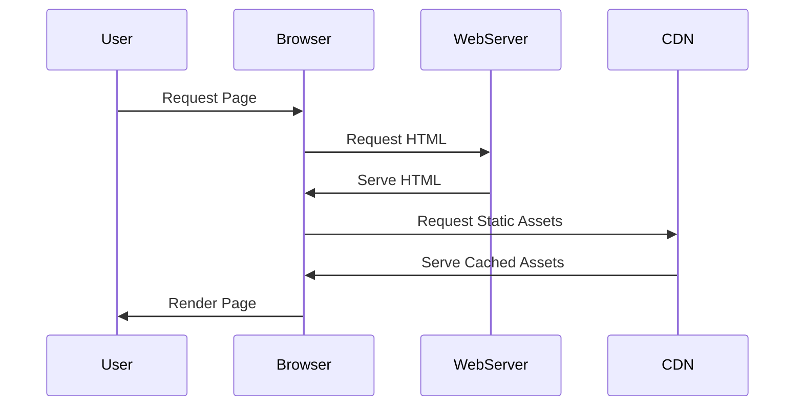

## 15.12 Content Delivery and Asset Management

In the realm of web development, delivering content efficiently and managing assets effectively is crucial for enhancing user experience and optimizing performance. This section delves into the strategies and techniques for content delivery and asset management in Erlang web applications, focusing on serving static files, using Content Delivery Networks (CDNs), handling caching, compression, and implementing asset pipelines.

### Serving Static Files

One of the fundamental aspects of web development is serving static files, such as images, CSS, and JavaScript. In Erlang, this can be achieved directly from the web server or by leveraging a CDN for improved performance.

#### Direct Serving from Web Server

Erlang web servers like `cowboy` and `mochiweb` can serve static files directly. This approach is straightforward and suitable for small-scale applications or development environments.

```erlang
% cowboy_static_handler.erl
-module(cowboy_static_handler).
-export([init/2]).

init(Req, _Opts) ->
    {ok, Req, #{
        path => "priv/static",
        mimetypes => cow_mimetypes:all()
    }}.
```

In this example, we configure a Cowboy handler to serve static files from the `priv/static` directory. The `cow_mimetypes:all()` function is used to determine the MIME type of the files being served.

#### Using a CDN

For larger applications or those with a global audience, using a CDN can significantly reduce latency and improve load times. A CDN caches static assets at various locations worldwide, ensuring that users receive content from the nearest server.

**Steps to Integrate a CDN:**

1. **Upload Assets**: Upload your static files to the CDN provider.
2. **Configure URLs**: Update your application to serve static files from the CDN URLs.
3. **Set Caching Policies**: Define caching headers to control how long assets are cached.

### Caching Headers and Content Compression

Caching and compression are vital for reducing load times and bandwidth usage. Properly configured caching headers ensure that browsers cache assets efficiently, while compression reduces the size of files transferred over the network.

#### Caching Headers

Caching headers like `Cache-Control` and `ETag` help manage how browsers cache resources.

```erlang
% Set Cache-Control header
set_cache_control(Req) ->
    cowboy_req:set_resp_header(<<"cache-control">>, <<"public, max-age=31536000">>, Req).
```

In this example, we set a `Cache-Control` header to cache assets for one year (`max-age=31536000` seconds).

#### Content Compression

Compressing assets before sending them to the client can significantly reduce load times. Common compression algorithms include Gzip and Brotli.

```erlang
% Enable Gzip compression
compress_response(Req, Resp) ->
    case cowboy_req:parse_header(<<"accept-encoding">>, Req) of
        {ok, Encodings} when lists:member(<<"gzip">>, Encodings) ->
            {ok, cowboy_req:compress(Resp, Req)};
        _ ->
            {ok, Resp}
    end.
```

This code snippet checks if the client supports Gzip compression and compresses the response accordingly.

### Asset Pipelines, Bundling, and Minification

Asset pipelines automate the process of compiling, bundling, and minifying assets, which is essential for optimizing web applications.

#### Asset Pipelines

An asset pipeline processes assets through various stages, such as compilation (e.g., from Sass to CSS), bundling, and minification.

**Example Workflow:**

1. **Compile**: Convert Sass to CSS or TypeScript to JavaScript.
2. **Bundle**: Combine multiple files into a single file to reduce HTTP requests.
3. **Minify**: Remove whitespace and comments to reduce file size.

#### Bundling and Minification

Bundling and minification reduce the number of HTTP requests and the size of assets, respectively, improving load times.

```shell
# Example using a build tool like Webpack
webpack --mode production
```

This command bundles and minifies assets for production using Webpack.

### Versioning Assets and Cache Busting

Versioning assets and implementing cache busting ensure that users receive the latest versions of assets without stale cache issues.

#### Versioning Assets

Versioning involves appending a version identifier to asset filenames, which changes whenever the asset is updated.

```html
<link rel="stylesheet" href="/css/styles.css?v=1.0.0">
```

In this example, the version `1.0.0` is appended to the CSS file URL.

#### Cache Busting

Cache busting forces browsers to fetch the latest version of an asset by changing its URL whenever it is updated.

**Techniques for Cache Busting:**

- **Query Strings**: Append a version or hash to the asset URL.
- **Filename Hashing**: Include a hash of the file content in the filename.

### Enhancing Load Times and User Experience

Improving load times and user experience involves a combination of strategies, including optimizing images, leveraging browser caching, and using asynchronous loading for non-critical resources.

#### Image Optimization

Optimizing images by compressing them and using modern formats like WebP can significantly reduce load times.

#### Asynchronous Loading

Load non-critical resources asynchronously to prevent blocking the rendering of the page.

```html
<script async src="/js/analytics.js"></script>
```

Using the `async` attribute allows the script to load in parallel with other resources.

### Visualizing Content Delivery and Asset Management

To better understand the flow of content delivery and asset management, let's visualize the process using a sequence diagram.



**Diagram Description:** This sequence diagram illustrates the interaction between the user, browser, web server, and CDN during content delivery. The browser requests the HTML from the web server and static assets from the CDN, which are then rendered to the user.

### References and Links

- [MDN Web Docs: Caching](https://developer.mozilla.org/en-US/docs/Web/HTTP/Caching)
- [MDN Web Docs: Content Compression](https://developer.mozilla.org/en-US/docs/Web/HTTP/Compression)
- [Webpack Documentation](https://webpack.js.org/concepts/)

### Knowledge Check

- What are the benefits of using a CDN for static assets?
- How do caching headers improve web performance?
- What is the purpose of asset pipelines in web development?
- How does versioning assets help with cache busting?

### Embrace the Journey

Remember, mastering content delivery and asset management is a journey. As you implement these strategies, you'll enhance the performance and user experience of your Erlang web applications. Keep experimenting, stay curious, and enjoy the process!

### Quiz: Content Delivery and Asset Management



### What is the primary benefit of using a CDN for static assets?

- [x] Reduced latency and improved load times
- [ ] Increased server load
- [ ] Higher bandwidth usage
- [ ] More complex configuration

> **Explanation:** A CDN reduces latency and improves load times by caching assets at various locations worldwide.

### Which header is used to control caching behavior in browsers?

- [x] Cache-Control
- [ ] Content-Type
- [ ] Accept-Encoding
- [ ] User-Agent

> **Explanation:** The `Cache-Control` header is used to specify caching policies for browsers.

### What is the purpose of asset pipelines?

- [x] Automate the process of compiling, bundling, and minifying assets
- [ ] Increase the number of HTTP requests
- [ ] Decrease code readability
- [ ] Slow down the build process

> **Explanation:** Asset pipelines automate tasks like compiling, bundling, and minifying to optimize web applications.

### How does versioning assets help with cache busting?

- [x] By changing the asset URL whenever it is updated
- [ ] By keeping the asset URL constant
- [ ] By increasing the file size
- [ ] By reducing the number of assets

> **Explanation:** Versioning changes the asset URL, forcing browsers to fetch the latest version.

### What is a common method for compressing web content?

- [x] Gzip
- [ ] Base64
- [ ] MD5
- [ ] SHA-256

> **Explanation:** Gzip is a widely used method for compressing web content to reduce file size.

### Which attribute allows a script to load asynchronously?

- [x] async
- [ ] defer
- [ ] preload
- [ ] sync

> **Explanation:** The `async` attribute allows a script to load in parallel with other resources.

### What is the benefit of minifying assets?

- [x] Reduces file size and improves load times
- [ ] Increases file size
- [ ] Decreases code readability
- [ ] Slows down the build process

> **Explanation:** Minifying assets removes unnecessary characters, reducing file size and improving load times.

### How can you force browsers to fetch the latest version of an asset?

- [x] Change the asset URL
- [ ] Keep the asset URL constant
- [ ] Increase the file size
- [ ] Reduce the number of assets

> **Explanation:** Changing the asset URL forces browsers to fetch the latest version.

### What is a common format for optimized images?

- [x] WebP
- [ ] BMP
- [ ] TIFF
- [ ] RAW

> **Explanation:** WebP is a modern image format that provides superior compression for optimized images.

### True or False: Using a CDN can increase server load.

- [ ] True
- [x] False

> **Explanation:** Using a CDN reduces server load by offloading the delivery of static assets to the CDN's servers.



By understanding and implementing these strategies, you'll be well-equipped to manage content delivery and assets in your Erlang web applications, ensuring a seamless and efficient user experience.
