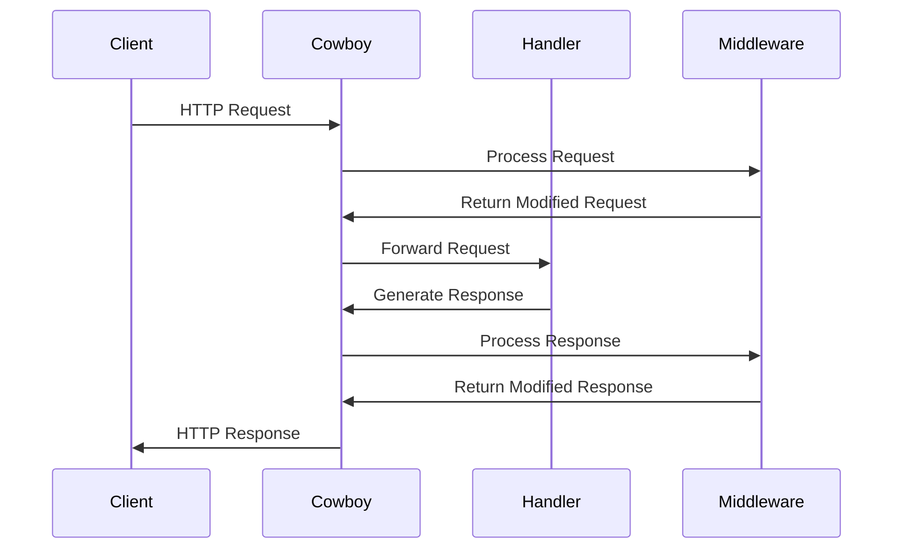

## 15.2 Building Web Applications with Cowboy

Cowboy is a small, fast, and modern HTTP server for Erlang/OTP. It is designed to handle HTTP requests efficiently and is often used in building web applications and APIs. In this section, we will explore how to build web applications using Cowboy, covering everything from setting up a basic web server to defining routes, handlers, and middleware.

### Introduction to Cowboy

Cowboy is known for its simplicity and performance. It is a lightweight HTTP server that can handle thousands of connections simultaneously, making it ideal for high-performance web applications. Cowboy is built on top of the Erlang/OTP platform, leveraging Erlang's strengths in concurrency and fault tolerance.

#### Cowboy Architecture

Cowboy's architecture is based on a few key components:

- **Listeners**: These are responsible for accepting incoming connections on a specified port.
- **Handlers**: These process incoming HTTP requests and generate responses.
- **Routes**: These define how requests are mapped to handlers.
- **Middleware**: These are optional components that can process requests and responses before they reach the handler or after they leave it.

Cowboy's design is modular, allowing developers to extend its functionality through plugins and custom modules.

### Setting Up a Basic Cowboy Web Server

Let's start by setting up a basic Cowboy web server. We'll create a simple application that listens for HTTP requests and responds with a "Hello, World!" message.

#### Step 1: Create a New Erlang Project

First, create a new Erlang project using Rebar3, the standard build tool for Erlang:

```bash
$ rebar3 new app my_cowboy_app
```

This command creates a new Erlang application named `my_cowboy_app` with the necessary directory structure.

#### Step 2: Add Cowboy as a Dependency

Next, add Cowboy as a dependency in your `rebar.config` file:

```erlang
{deps, [
    {cowboy, "2.9.0"}
]}.
```

Run the following command to fetch the dependencies:

```bash
$ rebar3 get-deps
```

#### Step 3: Create a Basic HTTP Handler

Create a new module for your HTTP handler. This module will define how requests are processed and responses are generated.

```erlang
-module(hello_handler).
-export([init/2]).

init(Req, State) ->
    {ok, Req2} = cowboy_req:reply(200, #{<<"content-type">> => <<"text/plain">>}, <<"Hello, World!">>, Req),
    {ok, Req2, State}.
```

This handler responds to every request with a "Hello, World!" message.

#### Step 4: Define Routes

Define the routes for your application in a new module. Routes map incoming requests to handlers.

```erlang
-module(my_cowboy_app).
-export([start/0]).

start() ->
    Dispatch = cowboy_router:compile([
        {'_', [
            {"/", hello_handler, []}
        ]}
    ]),
    {ok, _} = cowboy:start_clear(http_listener, 100,
        #{port => 8080},
        #{env => #{dispatch => Dispatch}}
    ).
```

This code sets up a route that maps the root URL (`/`) to the `hello_handler`.

#### Step 5: Start the Cowboy Server

Finally, start the Cowboy server by calling the `start/0` function in your application module:

```erlang
1> my_cowboy_app:start().
```

You can now access your web server by navigating to `http://localhost:8080` in your web browser. You should see the "Hello, World!" message.

### Defining Routes, Handlers, and Middleware

Cowboy's routing system is flexible and allows you to define complex routing logic. Let's explore how to define routes, handlers, and middleware in more detail.

#### Defining Routes

Routes in Cowboy are defined using the `cowboy_router` module. A route consists of a path pattern and a handler module. You can use wildcards and variables in path patterns to capture dynamic segments.

```erlang
Dispatch = cowboy_router:compile([
    {'_', [
        {"/", hello_handler, []},
        {"/hello/:name", name_handler, []}
    ]}
]),
```

In this example, the route `/hello/:name` captures the `name` segment and passes it to the `name_handler`.

#### Creating Handlers

Handlers are modules that implement the `init/2` function. This function receives the request and the initial state and returns a tuple containing the modified request and the new state.

```erlang
-module(name_handler).
-export([init/2]).

init(Req, State) ->
    {ok, Name} = cowboy_req:binding(name, Req),
    Body = <<"Hello, ", Name/binary, "!">>,
    {ok, Req2} = cowboy_req:reply(200, #{<<"content-type">> => <<"text/plain">>}, Body, Req),
    {ok, Req2, State}.
```

This handler extracts the `name` variable from the request and includes it in the response.

#### Implementing Middleware

Middleware in Cowboy can be used to process requests and responses before they reach the handler or after they leave it. Middleware can be used for tasks such as authentication, logging, and request modification.

To implement middleware, create a module that exports the `execute/2` function:

```erlang
-module(logging_middleware).
-export([execute/2]).

execute(Req, State) ->
    io:format("Received request: ~p~n", [Req]),
    {ok, Req, State}.
```

Add the middleware to your Cowboy configuration:

```erlang
Dispatch = cowboy_router:compile([
    {'_', [
        {"/", hello_handler, []}
    ]}
]),
{ok, _} = cowboy:start_clear(http_listener, 100,
    #{port => 8080},
    #{env => #{dispatch => Dispatch, middlewares => [logging_middleware]}}
).
```

### Handling HTTP Requests and Responses

Cowboy provides a comprehensive API for handling HTTP requests and responses. Let's explore some common tasks.

#### Parsing Query Parameters

You can parse query parameters using the `cowboy_req:parse_qs/1` function:

```erlang
{ok, Params} = cowboy_req:parse_qs(Req),
Name = proplists:get_value(<<"name">>, Params, <<"Guest">>),
```

This code retrieves the `name` query parameter and defaults to "Guest" if it is not provided.

#### Handling JSON Requests and Responses

Cowboy does not include a JSON library, but you can use a third-party library such as `jsx` or `jiffy` to handle JSON data.

First, add the JSON library to your `rebar.config`:

```erlang
{deps, [
    {cowboy, "2.9.0"},
    {jiffy, "1.0.0"}
]}.
```

Then, use the library to parse and generate JSON:

```erlang
{ok, Body, Req2} = cowboy_req:read_body(Req),
{ok, Json} = jiffy:decode(Body),
Response = jiffy:encode(#{message => <<"Hello, JSON!">>}),
{ok, Req3} = cowboy_req:reply(200, #{<<"content-type">> => <<"application/json">>}, Response, Req2),
```

### Serving Static Content

Cowboy can serve static content such as HTML, CSS, and JavaScript files. To serve static files, use the `cowboy_static` module.

```erlang
Dispatch = cowboy_router:compile([
    {'_', [
        {"/static/[...]", cowboy_static, #{directory => "priv/static"}}
    ]}
]),
```

This route serves files from the `priv/static` directory under the `/static` URL path.

### Implementing APIs with Cowboy

Cowboy is well-suited for building APIs. Let's create a simple RESTful API that manages a list of items.

#### Define the API Routes

Define routes for the API endpoints:

```erlang
Dispatch = cowboy_router:compile([
    {'_', [
        {"/api/items", items_handler, []},
        {"/api/items/:id", item_handler, []}
    ]}
]),
```

#### Create the Handlers

Create handlers for the API endpoints. These handlers will implement CRUD operations.

```erlang
-module(items_handler).
-export([init/2]).

init(Req, State) ->
    {ok, Items} = get_items(),
    Response = jiffy:encode(Items),
    {ok, Req2} = cowboy_req:reply(200, #{<<"content-type">> => <<"application/json">>}, Response, Req),
    {ok, Req2, State}.

get_items() ->
    {ok, [{id, 1}, {name, <<"Item 1">>}, {id, 2}, {name, <<"Item 2">>}]}. % Example data
```

```erlang
-module(item_handler).
-export([init/2]).

init(Req, State) ->
    {ok, Id} = cowboy_req:binding(id, Req),
    {ok, Item} = get_item(Id),
    Response = jiffy:encode(Item),
    {ok, Req2} = cowboy_req:reply(200, #{<<"content-type">> => <<"application/json">>}, Response, Req),
    {ok, Req2, State}.

get_item(Id) ->
    {ok, {id, Id}, {name, <<"Item ", Id/binary>>}}. % Example data
```

### Visualizing Cowboy's Request Handling

To better understand how Cowboy handles requests, let's visualize the flow of a request through the server.



**Figure 1**: The flow of an HTTP request through Cowboy, including middleware processing.

### Try It Yourself

Now that we've covered the basics, try modifying the code examples to add new features or change the behavior. For example:

- Add a new route that returns the current server time.
- Implement a middleware that logs the response status code.
- Create a new handler that processes form data.

### Knowledge Check

- What is the role of a handler in Cowboy?
- How can you serve static files using Cowboy?
- What are some common uses for middleware in a Cowboy application?

### Summary

In this section, we explored how to build web applications using Cowboy, a fast and modern Erlang HTTP server. We covered setting up a basic server, defining routes and handlers, implementing middleware, handling HTTP requests and responses, serving static content, and building APIs. Cowboy's modular architecture and performance make it an excellent choice for web development in Erlang.

Remember, this is just the beginning. As you progress, you'll build more complex and interactive web applications. Keep experimenting, stay curious, and enjoy the journey!

## Quiz: Building Web Applications with Cowboy



### What is Cowboy in the context of Erlang?

- [x] A small, fast, and modern HTTP server
- [ ] A database management system
- [ ] A web framework
- [ ] An IDE for Erlang

> **Explanation:** Cowboy is a small, fast, and modern HTTP server for Erlang/OTP.

### Which module is used to define routes in Cowboy?

- [x] cowboy_router
- [ ] cowboy_static
- [ ] cowboy_req
- [ ] cowboy_middleware

> **Explanation:** The `cowboy_router` module is used to define routes in Cowboy.

### What is the purpose of middleware in Cowboy?

- [x] To process requests and responses before they reach the handler or after they leave it
- [ ] To store static files
- [ ] To manage database connections
- [ ] To compile Erlang code

> **Explanation:** Middleware in Cowboy is used to process requests and responses before they reach the handler or after they leave it.

### How do you serve static files in Cowboy?

- [x] Using the cowboy_static module
- [ ] Using the cowboy_router module
- [ ] Using the cowboy_req module
- [ ] Using the cowboy_handler module

> **Explanation:** The `cowboy_static` module is used to serve static files in Cowboy.

### What function is typically implemented in a Cowboy handler module?

- [x] init/2
- [ ] start/0
- [ ] main/1
- [ ] handle/3

> **Explanation:** The `init/2` function is typically implemented in a Cowboy handler module.

### How can you parse query parameters in a Cowboy request?

- [x] Using cowboy_req:parse_qs/1
- [ ] Using cowboy_router:compile/1
- [ ] Using cowboy_static:serve/2
- [ ] Using cowboy_middleware:execute/2

> **Explanation:** The `cowboy_req:parse_qs/1` function is used to parse query parameters in a Cowboy request.

### What is the default port used in the example to start the Cowboy server?

- [x] 8080
- [ ] 80
- [ ] 443
- [ ] 3000

> **Explanation:** The default port used in the example to start the Cowboy server is 8080.

### Which library is recommended for handling JSON in Cowboy?

- [x] jiffy
- [ ] cowboy_static
- [ ] cowboy_router
- [ ] cowboy_middleware

> **Explanation:** The `jiffy` library is recommended for handling JSON in Cowboy.

### What is the role of the cowboy_req module?

- [x] To handle HTTP requests and responses
- [ ] To define routes
- [ ] To serve static files
- [ ] To implement middleware

> **Explanation:** The `cowboy_req` module is used to handle HTTP requests and responses.

### True or False: Cowboy can handle thousands of connections simultaneously.

- [x] True
- [ ] False

> **Explanation:** Cowboy is designed to handle thousands of connections simultaneously, leveraging Erlang's concurrency model.


