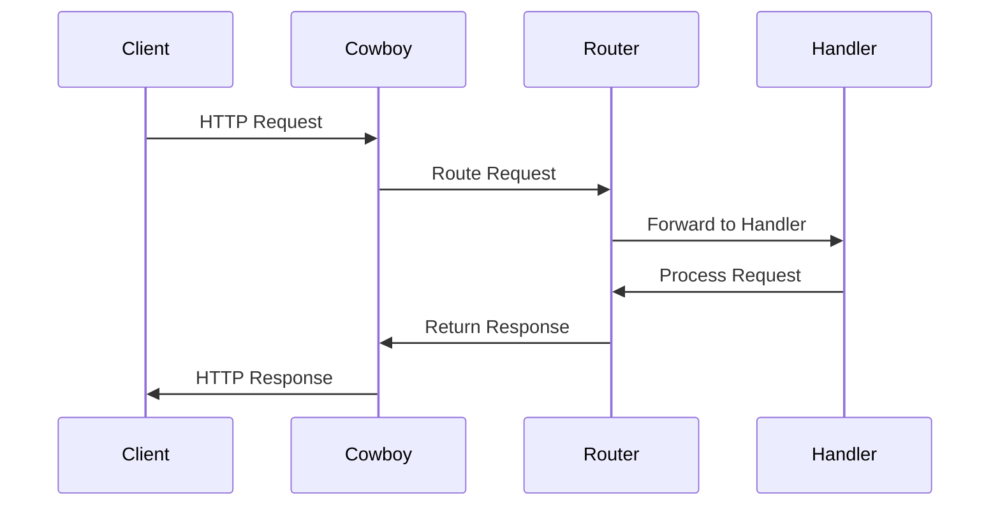

## 15.3 Routing and Request Handling

In the realm of web development, routing and request handling are pivotal components that dictate how incoming requests are processed and responded to. In Erlang, frameworks like Cowboy provide robust mechanisms for managing these tasks. This section delves into the intricacies of routing and request handling in Erlang web frameworks, focusing on Cowboy, while also touching upon other frameworks. We will explore dynamic routing, parameter extraction, best practices for organizing routes, handling methods, and implementing middleware. Additionally, we will emphasize the importance of efficient and secure request handling.

### Understanding Routing in Erlang Web Frameworks

Routing is the process of directing incoming HTTP requests to the appropriate handler based on the request's URL and method. In Erlang, routing is typically managed by web frameworks like Cowboy, which is known for its simplicity and performance.

#### Cowboy: A High-Performance Erlang Web Server

Cowboy is a small, fast, and modern HTTP server for Erlang/OTP. It is designed to handle large numbers of simultaneous connections efficiently. Cowboy's routing mechanism is both powerful and flexible, allowing developers to define routes using pattern matching, which is a core feature of Erlang.

##### Basic Routing in Cowboy

In Cowboy, routes are defined using a list of tuples, where each tuple specifies a pattern to match against incoming requests. Here's a simple example:

```erlang
-module(my_router).
-export([start/0]).

start() ->
    Dispatch = cowboy_router:compile([
        {'_', [
            {"/", my_handler, []},
            {"/hello", hello_handler, []}
        ]}
    ]),
    {ok, _} = cowboy:start_clear(my_http_listener, 100,
        [{port, 8080}],
        #{env => #{dispatch => Dispatch}}
    ).
```

In this example, we define two routes: one for the root path `/` and another for `/hello`. Each route is associated with a handler module (`my_handler` and `hello_handler`, respectively).

##### Dynamic Routing and Parameter Extraction

Dynamic routing allows you to capture parts of the URL as parameters, which can then be used within your handler. Cowboy supports dynamic routing through the use of placeholders in the route patterns.

```erlang
Dispatch = cowboy_router:compile([
    {'_', [
        {"/user/:id", user_handler, []}
    ]}
]),
```

In this route, `:id` is a placeholder for a dynamic segment of the URL. When a request matches this route, the value of `:id` is extracted and passed to the handler.

###### Extracting Parameters in Handlers

To access the extracted parameters in your handler, you can use the `cowboy_req` module:

```erlang
-module(user_handler).
-export([init/2]).

init(Req, State) ->
    {ok, Id} = cowboy_req:binding(id, Req),
    %% Use Id to fetch user data or perform other operations
    {ok, Req, State}.
```

In this handler, we use `cowboy_req:binding/2` to extract the `id` parameter from the request.

### Best Practices for Organizing Routes

Efficient route organization is crucial for maintaining a scalable and manageable codebase. Here are some best practices to consider:

1. **Group Related Routes**: Organize routes by functionality or resource type. For example, group all user-related routes together.

2. **Use Modules for Handlers**: Define handlers in separate modules to keep your code modular and maintainable.

3. **Leverage Pattern Matching**: Use Erlang's pattern matching capabilities to simplify route definitions and handler logic.

4. **Document Routes**: Clearly document each route, including its purpose and any parameters it accepts.

### Handling HTTP Methods

HTTP methods (GET, POST, PUT, DELETE, etc.) define the action to be performed on the resource. Cowboy allows you to handle different methods within the same route by inspecting the request method in your handler.

```erlang
-module(my_handler).
-export([init/2]).

init(Req, State) ->
    Method = cowboy_req:method(Req),
    case Method of
        <<"GET">> -> handle_get(Req, State);
        <<"POST">> -> handle_post(Req, State);
        _ -> {ok, Req, State}
    end.

handle_get(Req, State) ->
    %% Handle GET request
    {ok, Req, State}.

handle_post(Req, State) ->
    %% Handle POST request
    {ok, Req, State}.
```

In this example, we use `cowboy_req:method/1` to determine the HTTP method and route the request to the appropriate handler function.

### Middleware Implementation

Middleware functions are used to process requests and responses, often for tasks like authentication, logging, or modifying request/response data. In Cowboy, middleware can be implemented by chaining handlers.

#### Creating Middleware in Cowboy

To create middleware, define a handler that processes the request and then passes it to the next handler in the chain.

```erlang
-module(logging_middleware).
-export([init/2]).

init(Req, State) ->
    io:format("Request received: ~p~n", [Req]),
    {ok, Req, State}.
```

You can then include this middleware in your route definitions:

```erlang
Dispatch = cowboy_router:compile([
    {'_', [
        {"/", logging_middleware, []},
        {"/hello", hello_handler, []}
    ]}
]),
```

### Efficient and Secure Request Handling

Efficient and secure request handling is paramount in web applications. Here are some strategies to achieve this:

1. **Validate Input**: Always validate and sanitize user input to prevent security vulnerabilities like SQL injection or XSS.

2. **Use Proper Error Handling**: Implement robust error handling to gracefully manage unexpected situations and provide meaningful feedback to users.

3. **Optimize Performance**: Use caching strategies, such as ETS tables, to reduce database load and improve response times.

4. **Secure Data Transmission**: Use HTTPS to encrypt data in transit and protect sensitive information.

5. **Limit Resource Usage**: Implement rate limiting and resource quotas to prevent abuse and ensure fair usage.

### Visualizing Routing and Request Handling

To better understand the flow of routing and request handling in Cowboy, let's visualize the process using a sequence diagram.



This diagram illustrates the sequence of interactions between the client, Cowboy server, router, and handler during the request handling process.

### Try It Yourself

To solidify your understanding, try modifying the code examples provided:

- Add a new route that handles a different HTTP method, such as PUT or DELETE.
- Implement a middleware function that checks for a specific header in the request.
- Experiment with dynamic routing by adding more parameters to the URL.

### References and Further Reading

- [Cowboy Documentation](https://ninenines.eu/docs/en/cowboy/2.9/guide/)
- [Erlang/OTP Documentation](https://www.erlang.org/docs)
- [MDN Web Docs on HTTP](https://developer.mozilla.org/en-US/docs/Web/HTTP)

### Knowledge Check

- What is the purpose of routing in a web framework?
- How does Cowboy handle dynamic routing and parameter extraction?
- What are some best practices for organizing routes in an Erlang application?
- How can middleware be implemented in Cowboy?
- Why is efficient and secure request handling important?

### Embrace the Journey

Remember, mastering routing and request handling is just one step in your journey to becoming an expert in Erlang web development. Keep experimenting, stay curious, and enjoy the process of learning and building robust web applications.

## Quiz: Routing and Request Handling



### What is the primary role of routing in a web framework?

- [x] Direct incoming requests to the appropriate handler
- [ ] Encrypt data in transit
- [ ] Manage database connections
- [ ] Handle user authentication

> **Explanation:** Routing directs incoming requests to the appropriate handler based on the URL and method.

### How does Cowboy handle dynamic routing?

- [x] Using placeholders in route patterns
- [ ] Through a separate configuration file
- [ ] By hardcoding routes in the handler
- [ ] Using a database lookup

> **Explanation:** Cowboy uses placeholders in route patterns to handle dynamic routing and extract parameters.

### What is a best practice for organizing routes?

- [x] Group related routes by functionality
- [ ] Define all routes in a single module
- [ ] Use random naming conventions for routes
- [ ] Avoid documenting routes

> **Explanation:** Grouping related routes by functionality helps maintain a scalable and manageable codebase.

### How can middleware be implemented in Cowboy?

- [x] By chaining handlers
- [ ] By modifying the Cowboy source code
- [ ] Through a third-party library
- [ ] Using a separate middleware server

> **Explanation:** Middleware can be implemented in Cowboy by chaining handlers to process requests and responses.

### Why is input validation important in request handling?

- [x] To prevent security vulnerabilities
- [ ] To increase server load
- [ ] To slow down request processing
- [ ] To make code more complex

> **Explanation:** Input validation is crucial to prevent security vulnerabilities like SQL injection or XSS.

### What is a common technique for optimizing performance in request handling?

- [x] Using caching strategies
- [ ] Increasing server downtime
- [ ] Reducing code readability
- [ ] Ignoring error handling

> **Explanation:** Caching strategies, such as using ETS tables, can reduce database load and improve response times.

### How can secure data transmission be ensured?

- [x] By using HTTPS
- [ ] By using HTTP
- [ ] By disabling encryption
- [ ] By storing data in plain text

> **Explanation:** HTTPS encrypts data in transit, protecting sensitive information from interception.

### What is the purpose of rate limiting in request handling?

- [x] To prevent abuse and ensure fair usage
- [ ] To increase server load
- [ ] To allow unlimited requests
- [ ] To slow down response times

> **Explanation:** Rate limiting prevents abuse by limiting the number of requests a client can make in a given time period.

### What is the role of the `cowboy_req` module?

- [x] To access request data and parameters
- [ ] To manage database connections
- [ ] To encrypt data
- [ ] To handle user authentication

> **Explanation:** The `cowboy_req` module provides functions to access request data and parameters.

### True or False: Middleware in Cowboy can only be used for logging purposes.

- [ ] True
- [x] False

> **Explanation:** Middleware in Cowboy can be used for various purposes, including authentication, logging, and modifying request/response data.


