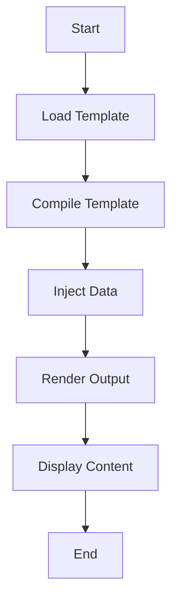

## 15.4 Templating Engines and Dynamic Content

In the world of web development, generating dynamic content is a fundamental requirement. Erlang, known for its concurrency and fault-tolerance, also provides robust solutions for web development. This section delves into the use of templating engines in Erlang to create dynamic web content, focusing on popular libraries such as [erlydtl](https://github.com/erlydtl/erlydtl) and [mustache.erl](https://github.com/mojombo/mustache.erl). We will explore how these tools can be leveraged to render templates with data, manage layouts, and ensure secure content generation through input sanitization and escaping.

### Introduction to Templating Engines

Templating engines are tools that allow developers to separate the presentation layer from the business logic of an application. By using templates, you can define the structure of your HTML documents and dynamically inject data into them. This separation of concerns not only makes your codebase cleaner but also enhances maintainability and scalability.

#### Key Benefits of Templating Engines

- **Separation of Concerns**: Keep HTML structure separate from business logic.
- **Reusability**: Use templates across different parts of the application.
- **Maintainability**: Easier to update and manage code.
- **Security**: Built-in mechanisms for escaping and sanitizing data.

### Erlang Templating Libraries

Erlang offers several templating libraries that facilitate the generation of dynamic content. Two of the most popular libraries are `erlydtl` and `mustache.erl`.

#### ErlyDTL

`erlydtl` is an Erlang implementation of the Django Template Language. It provides a powerful and flexible way to create dynamic web pages.

- **Features**:
  - Template inheritance
  - Filters and tags
  - Automatic escaping of variables
  - Support for custom tags and filters

#### Mustache.erl

`mustache.erl` is an Erlang implementation of the Mustache templating language, known for its simplicity and logic-less templates.

- **Features**:
  - Logic-less templates
  - Support for partials
  - Simple syntax
  - Language agnostic

### Rendering Templates with Data

Let's explore how to render templates using `erlydtl` and `mustache.erl`.

#### Using ErlyDTL

To render a template with `erlydtl`, you first need to compile the template and then render it with the desired data.

```erlang
% Compile the template
{ok, Template} = erlydtl:compile_file("path/to/template.html", []).

% Define the data to be injected
Data = #{name => "Erlang", version => "23.0"}.

% Render the template
{ok, Output} = Template:render(Data).

io:format("~s", [Output]).
```

#### Using Mustache.erl

Rendering with `mustache.erl` involves loading the template and applying it to the data.

```erlang
% Load the template
{ok, Template} = file:read_file("path/to/template.mustache").

% Define the data
Data = #{name => "Erlang", version => "23.0"}.

% Render the template
Output = mustache:render(Template, Data).

io:format("~s", [Output]).
```

### Handling Layouts, Partials, and Template Inheritance

Layouts and partials are essential for creating modular and maintainable templates.

#### Layouts and Partials in ErlyDTL

ErlyDTL supports template inheritance, allowing you to define a base template and extend it in child templates.

- **Base Template** (`base.html`):

```html
<!DOCTYPE html>
<html>
<head>
    <title>Default Title</title>
</head>
<body>
    <header>
        <h1>Welcome to My Website</h1>
    </header>
    <main>
        
    </main>
    <footer>
        <p>Footer content here</p>
    </footer>
</body>
</html>
```

- **Child Template** (`child.html`):

```html


Home Page


    <p>This is the home page content.</p>

```

#### Partials in Mustache.erl

Mustache supports partials, allowing you to include reusable template snippets.

- **Main Template** (`main.mustache`):

```mustache
<h1>{{title}}</h1>
{{> user}}
```

- **Partial Template** (`user.mustache`):

```mustache
<p>User: {{name}}</p>
```

- **Rendering with Partials**:

```erlang
% Load templates
{ok, MainTemplate} = file:read_file("path/to/main.mustache").
{ok, UserPartial} = file:read_file("path/to/user.mustache").

% Define data
Data = #{title => "Welcome", name => "Erlang"}.

% Render with partials
Output = mustache:render(MainTemplate, Data, #{user => UserPartial}).

io:format("~s", [Output]).
```

### Importance of Escaping and Input Sanitization

When generating dynamic content, it's crucial to ensure that the data being injected into templates is properly escaped and sanitized to prevent security vulnerabilities such as Cross-Site Scripting (XSS).

#### Escaping in ErlyDTL

ErlyDTL automatically escapes variables by default. However, you can use filters to control the escaping behavior.

```html
<p>{{ user_input|escape }}</p>
```

#### Escaping in Mustache.erl

Mustache.erl also escapes HTML by default. To include unescaped content, use triple braces.

```mustache
<p>{{{ unescaped_content }}}</p>
```

### Encouraging Separation of Concerns

Using templates effectively encourages a clear separation of concerns in your web application. By keeping the presentation logic separate from the business logic, you can create more maintainable and scalable applications.

### Try It Yourself

Experiment with the provided code examples by modifying the templates and data. Try creating new templates with different structures and see how the rendering changes. This hands-on approach will deepen your understanding of templating engines in Erlang.

### Visualizing Template Rendering

Below is a simple flowchart illustrating the process of rendering a template with data using a templating engine.



**Diagram Description**: This flowchart represents the steps involved in rendering a template with data. It starts with loading the template, compiling it, injecting data, rendering the output, and finally displaying the content.

### References and Further Reading

- [ErlyDTL GitHub Repository](https://github.com/erlydtl/erlydtl)
- [Mustache.erl GitHub Repository](https://github.com/mojombo/mustache.erl)
- [MDN Web Docs on Templating](https://developer.mozilla.org/en-US/docs/Web/HTML/Element/template)

### Knowledge Check

- What are the benefits of using templating engines in web development?
- How does `erlydtl` differ from `mustache.erl` in terms of features?
- Why is input sanitization important when rendering templates?
- How can you use template inheritance in `erlydtl`?
- What is the purpose of partials in `mustache.erl`?

### Embrace the Journey

Remember, mastering templating engines is just one step in your journey to becoming an expert in Erlang web development. Keep experimenting, stay curious, and enjoy the process of building dynamic and robust web applications.

## Quiz: Templating Engines and Dynamic Content



### What is a key benefit of using templating engines in web development?

- [x] Separation of concerns
- [ ] Increased code complexity
- [ ] Reduced code readability
- [ ] Slower development process

> **Explanation:** Templating engines help separate the presentation layer from the business logic, enhancing maintainability and scalability.

### Which Erlang templating library is based on the Django Template Language?

- [x] erlydtl
- [ ] mustache.erl
- [ ] eex
- [ ] handlebars.erl

> **Explanation:** ErlyDTL is an Erlang implementation of the Django Template Language.

### How does Mustache.erl handle HTML escaping by default?

- [x] Escapes HTML by default
- [ ] Does not escape HTML
- [ ] Requires manual escaping
- [ ] Uses a custom escape function

> **Explanation:** Mustache.erl escapes HTML by default to prevent XSS vulnerabilities.

### What feature does ErlyDTL provide that allows for template reuse?

- [x] Template inheritance
- [ ] Logic-less templates
- [ ] Partial templates
- [ ] Custom filters

> **Explanation:** ErlyDTL supports template inheritance, allowing you to define a base template and extend it in child templates.

### What is the purpose of partials in Mustache.erl?

- [x] To include reusable template snippets
- [ ] To define base templates
- [ ] To handle data injection
- [ ] To manage template inheritance

> **Explanation:** Partials in Mustache.erl allow you to include reusable template snippets, promoting code reuse.

### Why is input sanitization important in templating?

- [x] To prevent security vulnerabilities like XSS
- [ ] To increase template rendering speed
- [ ] To simplify template syntax
- [ ] To enhance template inheritance

> **Explanation:** Input sanitization is crucial to prevent security vulnerabilities such as Cross-Site Scripting (XSS).

### How can you include unescaped content in Mustache.erl?

- [x] Use triple braces {{{ }}} 
- [ ] Use double braces {{ }}
- [ ] Use a custom escape function
- [ ] Use a special tag

> **Explanation:** Triple braces {{{ }}} in Mustache.erl allow you to include unescaped content.

### What is a common use case for template inheritance in ErlyDTL?

- [x] Defining a common layout for multiple pages
- [ ] Handling data injection
- [ ] Managing partials
- [ ] Simplifying template syntax

> **Explanation:** Template inheritance in ErlyDTL is commonly used to define a common layout for multiple pages, promoting code reuse.

### Which of the following is NOT a feature of Mustache.erl?

- [x] Template inheritance
- [ ] Logic-less templates
- [ ] Support for partials
- [ ] Simple syntax

> **Explanation:** Mustache.erl does not support template inheritance; it focuses on logic-less templates and partials.

### True or False: ErlyDTL automatically escapes variables by default.

- [x] True
- [ ] False

> **Explanation:** ErlyDTL automatically escapes variables by default to ensure security.




