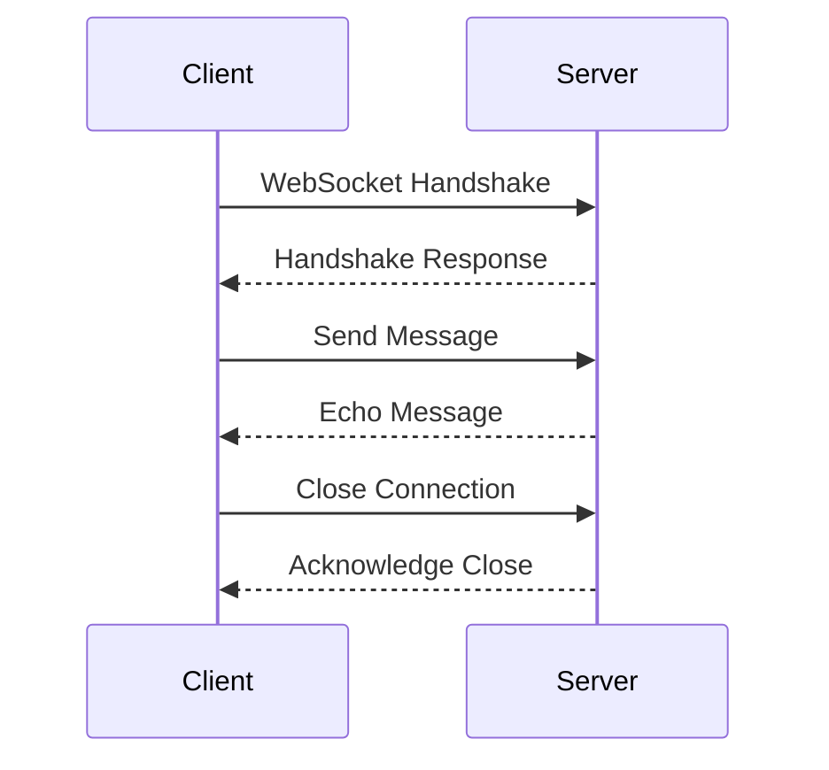

## 15.5 Real-Time Communication with WebSockets and SSE

Real-time communication is an essential feature in modern web applications, enabling instant data exchange between clients and servers. This section delves into implementing real-time communication using WebSockets and Server-Sent Events (SSE) in Erlang, focusing on practical examples and best practices.

### Understanding WebSockets and SSE

Before diving into implementation, it's crucial to understand the fundamental differences between WebSockets and SSE.

#### WebSockets

WebSockets provide a full-duplex communication channel over a single, long-lived connection. This means both the client and server can send messages to each other independently. WebSockets are ideal for applications requiring bidirectional communication, such as chat applications, online gaming, and collaborative tools.

**Key Features of WebSockets:**

- **Bidirectional Communication**: Both client and server can send messages independently.
- **Low Latency**: Reduced overhead compared to HTTP polling.
- **Persistent Connection**: A single connection is maintained for continuous data exchange.

#### Server-Sent Events (SSE)

SSE is a server push technology that allows servers to send automatic updates to clients over a single HTTP connection. Unlike WebSockets, SSE is unidirectional, meaning data flows from the server to the client. SSE is suitable for applications like live news feeds, stock tickers, and notifications.

**Key Features of SSE:**

- **Unidirectional Communication**: Data flows from server to client.
- **Automatic Reconnection**: Built-in support for reconnecting if the connection drops.
- **Text-Based Protocol**: SSE uses UTF-8 encoded text streams.

### Setting Up WebSocket Connections with Cowboy

Cowboy is a small, fast, and modern HTTP server for Erlang/OTP. It is widely used for building web applications and services in Erlang, including those requiring WebSocket support.

#### Installing Cowboy

First, ensure you have Cowboy installed in your Erlang project. You can add it to your `rebar.config` file:

```erlang
{deps, [
    {cowboy, "2.9.0"}
]}.
```

Run `rebar3 get-deps` to fetch the dependencies.

#### Creating a WebSocket Handler

To handle WebSocket connections, you need to define a WebSocket handler module. Here's a simple example:

```erlang
-module(my_websocket_handler).
-behaviour(cowboy_websocket).

-export([init/2, websocket_init/1, websocket_handle/2, websocket_info/2, terminate/3]).

init(Req, State) ->
    {cowboy_websocket, Req, State}.

websocket_init(State) ->
    {ok, State}.

websocket_handle({text, Msg}, State) ->
    %% Echo the message back to the client
    {reply, {text, Msg}, State};
websocket_handle(_Other, State) ->
    {ok, State}.

websocket_info(_Info, State) ->
    {ok, State}.

terminate(_Reason, _Req, _State) ->
    ok.
```

**Explanation:**

- **`init/2`**: Initializes the WebSocket connection.
- **`websocket_init/1`**: Called when the WebSocket connection is established.
- **`websocket_handle/2`**: Handles incoming WebSocket messages. In this example, it echoes the message back to the client.
- **`websocket_info/2`**: Handles Erlang messages sent to the WebSocket process.
- **`terminate/3`**: Cleans up when the connection is closed.

#### Starting the Cowboy Server

Next, configure and start the Cowboy server to use your WebSocket handler:

```erlang
-module(my_app).

-export([start/0, stop/0]).

start() ->
    Dispatch = cowboy_router:compile([
        {'_', [
            {"/websocket", my_websocket_handler, []}
        ]}
    ]),
    {ok, _} = cowboy:start_clear(my_http_listener, 100,
        #{port => 8080},
        #{env => #{dispatch => Dispatch}}
    ).

stop() ->
    ok = cowboy:stop_listener(my_http_listener).
```

**Explanation:**

- **`cowboy_router:compile/1`**: Compiles the routing rules, mapping the `/websocket` path to `my_websocket_handler`.
- **`cowboy:start_clear/3`**: Starts the Cowboy server on port 8080.

### Handling Bidirectional Communication

WebSockets shine in scenarios requiring bidirectional communication. Let's enhance our handler to support a simple chat application.

#### Enhancing the WebSocket Handler

Modify the `websocket_handle/2` function to broadcast messages to all connected clients:

```erlang
websocket_handle({text, Msg}, State) ->
    %% Broadcast the message to all connected clients
    broadcast(Msg),
    {ok, State}.

broadcast(Msg) ->
    %% Send the message to all connected WebSocket processes
    [Pid ! {broadcast, Msg} || Pid <- connected_clients()].

connected_clients() ->
    %% Return a list of PIDs for all connected clients
    %% This is a placeholder; implement your own logic to track clients
    [].
```

**Explanation:**

- **`broadcast/1`**: Sends the message to all connected clients.
- **`connected_clients/0`**: Returns a list of PIDs for all connected clients. Implement your logic to track connected clients.

### Use Cases for WebSockets and SSE

Real-time communication is crucial in various applications. Here are some common use cases:

#### Chat Applications

WebSockets are ideal for chat applications, enabling instant message exchange between users. The bidirectional nature allows for real-time conversations.

#### Live Updates

SSE is suitable for applications requiring live updates, such as news feeds or stock tickers. The server can push updates to clients as they occur.

#### Collaborative Tools

WebSockets facilitate real-time collaboration, allowing multiple users to interact with shared documents or whiteboards simultaneously.

### Considerations for Scalability and Security

When implementing real-time communication, consider the following:

#### Scalability

- **Load Balancing**: Distribute connections across multiple servers to handle high traffic.
- **State Management**: Use distributed state management solutions like ETS or Mnesia for scalability.

#### Security

- **Authentication**: Ensure only authorized users can establish WebSocket connections.
- **Data Encryption**: Use TLS to encrypt data exchanged over WebSockets.
- **Rate Limiting**: Implement rate limiting to prevent abuse and denial-of-service attacks.

### Try It Yourself

Experiment with the WebSocket handler by modifying the `broadcast/1` function to include a timestamp with each message. This will help you understand how to enhance message handling in real-time applications.

### Visualizing WebSocket Communication

Below is a sequence diagram illustrating the WebSocket communication process between a client and server:



**Diagram Explanation:**

- The client initiates a WebSocket handshake with the server.
- Upon successful handshake, the client and server can exchange messages.
- The client closes the connection, and the server acknowledges.

### References and Links

- [MDN Web Docs: WebSockets](https://developer.mozilla.org/en-US/docs/Web/API/WebSockets_API)
- [MDN Web Docs: Server-Sent Events](https://developer.mozilla.org/en-US/docs/Web/API/Server-sent_events)
- [Cowboy WebSocket Guide](https://ninenines.eu/docs/en/cowboy/2.9/guide/ws_handlers/)

### Knowledge Check

- What are the key differences between WebSockets and SSE?
- How can you implement a simple WebSocket handler using Cowboy?
- What are some common use cases for real-time communication?
- How can you ensure scalability and security in WebSocket applications?

### Embrace the Journey

Real-time communication opens up a world of possibilities for interactive and engaging web applications. As you explore WebSockets and SSE, remember to experiment, iterate, and innovate. The journey to mastering real-time communication is filled with learning opportunities and exciting challenges.

## Quiz: Real-Time Communication with WebSockets and SSE



### What is a key feature of WebSockets?

- [x] Bidirectional communication
- [ ] Unidirectional communication
- [ ] High latency
- [ ] Stateless connection

> **Explanation:** WebSockets provide bidirectional communication, allowing both client and server to send messages independently.

### Which protocol is used by SSE?

- [ ] WebSocket
- [x] HTTP
- [ ] FTP
- [ ] SMTP

> **Explanation:** SSE uses HTTP to establish a unidirectional communication channel from server to client.

### What is the primary use case for SSE?

- [ ] Chat applications
- [x] Live updates
- [ ] Online gaming
- [ ] File transfer

> **Explanation:** SSE is ideal for live updates, such as news feeds or stock tickers, where the server pushes updates to clients.

### How can you enhance security in WebSocket applications?

- [x] Use TLS for encryption
- [ ] Disable authentication
- [ ] Allow all connections
- [ ] Use plain text communication

> **Explanation:** Using TLS encrypts data exchanged over WebSockets, enhancing security.

### What is a common scalability consideration for WebSockets?

- [x] Load balancing
- [ ] Single server deployment
- [ ] Ignoring state management
- [ ] Disabling rate limiting

> **Explanation:** Load balancing helps distribute connections across multiple servers, improving scalability.

### What does the `websocket_handle/2` function do?

- [x] Handles incoming WebSocket messages
- [ ] Initializes the WebSocket connection
- [ ] Terminates the WebSocket connection
- [ ] Compiles routing rules

> **Explanation:** The `websocket_handle/2` function processes incoming WebSocket messages.

### What is the role of the `terminate/3` function in a WebSocket handler?

- [ ] Handles incoming messages
- [ ] Initializes the connection
- [x] Cleans up when the connection is closed
- [ ] Compiles routing rules

> **Explanation:** The `terminate/3` function is responsible for cleanup when the WebSocket connection is closed.

### Which Erlang module is commonly used for WebSocket support?

- [ ] gen_server
- [x] cowboy
- [ ] mnesia
- [ ] ets

> **Explanation:** Cowboy is a popular HTTP server in Erlang that supports WebSocket connections.

### What is a benefit of using WebSockets over HTTP polling?

- [x] Reduced overhead
- [ ] Increased latency
- [ ] Stateless communication
- [ ] Unidirectional data flow

> **Explanation:** WebSockets reduce overhead by maintaining a persistent connection, unlike HTTP polling.

### True or False: SSE supports bidirectional communication.

- [ ] True
- [x] False

> **Explanation:** SSE supports unidirectional communication, where data flows from server to client.



By understanding and implementing WebSockets and SSE, you can create dynamic, real-time web applications that enhance user engagement and interactivity. Keep exploring and experimenting with these technologies to unlock their full potential.
