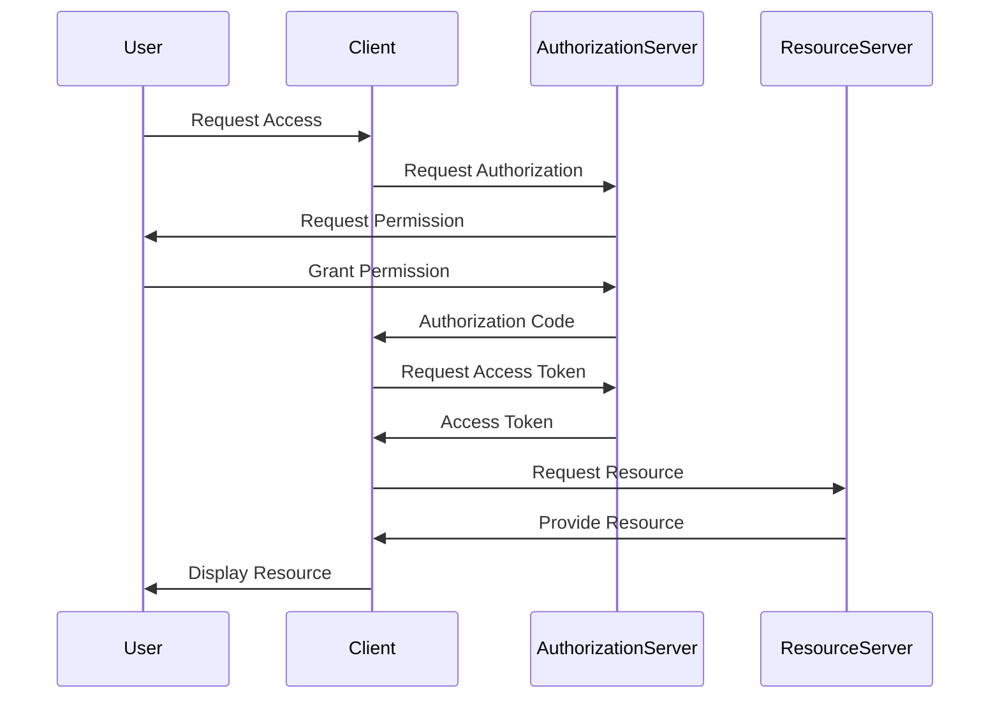
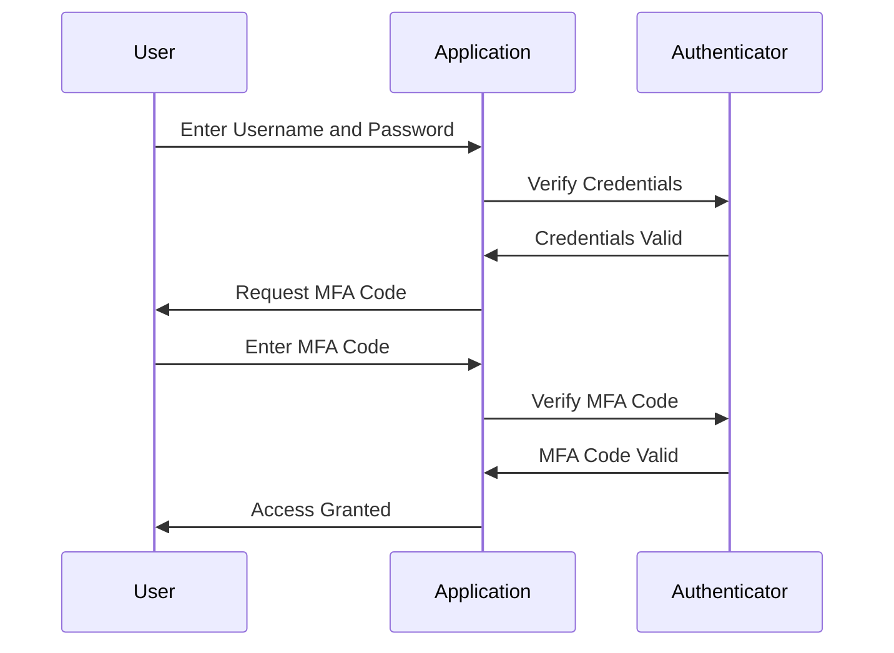

## 15.6 Authentication and Session Management

In the realm of web development, authentication and session management are critical components that ensure secure and personalized user experiences. In this section, we will delve into various strategies for implementing authentication and managing user sessions in Erlang web applications. We will explore the use of cookies, tokens (such as JSON Web Tokens, JWT), and OAuth for authentication, and discuss best practices for password security and encryption. Additionally, we will highlight considerations for protecting against common attacks like session hijacking and encourage the implementation of multi-factor authentication when appropriate.

### Understanding Authentication and Session Management

Authentication is the process of verifying the identity of a user or system. It is a crucial step in ensuring that only authorized users can access certain resources or perform specific actions. Session management, on the other hand, involves maintaining the state of a user's interaction with a web application across multiple requests. This is essential for providing a seamless user experience.

### Strategies for Authentication

#### 1. Cookies

Cookies are small pieces of data stored on the client's browser. They are commonly used for session management and can also be used for authentication purposes. When a user logs in, the server can generate a session ID and store it in a cookie on the client's browser. This session ID is then sent with each subsequent request to authenticate the user.

**Example: Setting a Cookie in Erlang**

```erlang
set_cookie(Response, SessionId) ->
    Cookie = "session_id=" ++ SessionId ++ "; Path=/; HttpOnly",
    Response#http_response{headers = [{"Set-Cookie", Cookie}]}.
```

**Key Considerations:**
- **Security:** Ensure cookies are marked as `HttpOnly` and `Secure` to prevent access via JavaScript and to ensure they are only sent over HTTPS.
- **Expiration:** Set an appropriate expiration time for cookies to balance security and user convenience.

#### 2. Tokens (JWT)

JSON Web Tokens (JWT) are a compact, URL-safe means of representing claims to be transferred between two parties. They are often used for authentication in stateless applications. A JWT consists of three parts: a header, a payload, and a signature. The payload contains claims about the user, such as their identity and roles.

**Example: Generating a JWT in Erlang**

```erlang
generate_jwt(UserId, Secret) ->
    Header = #{alg => "HS256", typ => "JWT"},
    Payload = #{sub => UserId, exp => os:system_time(seconds) + 3600},
    Base64Header = base64:encode_to_string(term_to_binary(Header)),
    Base64Payload = base64:encode_to_string(term_to_binary(Payload)),
    Signature = crypto:hmac(sha256, Secret, Base64Header ++ "." ++ Base64Payload),
    Base64Header ++ "." ++ Base64Payload ++ "." ++ base64:encode_to_string(Signature).
```

**Key Considerations:**
- **Statelessness:** JWTs are self-contained, meaning they do not require server-side storage.
- **Security:** Ensure the secret used for signing JWTs is kept secure and rotate it periodically.

#### 3. OAuth

OAuth is an open standard for access delegation, commonly used for token-based authentication. It allows third-party services to exchange information without exposing user credentials. OAuth is particularly useful for integrating with external services like Google or Facebook.

**Example: OAuth Flow Diagram**



**Key Considerations:**
- **Security:** Use HTTPS for all OAuth communications to protect tokens.
- **Scope:** Define the scope of access to limit what third-party applications can do on behalf of the user.

### Session Management Techniques

#### 1. Server-Side Sessions

In server-side session management, session data is stored on the server, and a session ID is sent to the client via a cookie. This approach is secure because sensitive data is not exposed to the client.

**Example: Storing Session Data in ETS**

```erlang
store_session(SessionId, UserData) ->
    ets:insert(session_table, {SessionId, UserData}).

get_session(SessionId) ->
    case ets:lookup(session_table, SessionId) of
        [{_, UserData}] -> {ok, UserData};
        [] -> {error, not_found}
    end.
```

**Key Considerations:**
- **Scalability:** Ensure the session storage mechanism can handle the expected load.
- **Persistence:** Consider using a database for persistent session storage if needed.

#### 2. Client-Side Sessions

Client-side sessions involve storing session data on the client, typically in cookies. This approach reduces server load but requires careful handling to ensure security.

**Key Considerations:**
- **Data Integrity:** Use cryptographic techniques to ensure the integrity and authenticity of session data.
- **Size Limitations:** Be mindful of the size limitations of cookies.

### Best Practices for Password Security

1. **Hashing and Salting:** Always hash passwords before storing them in a database. Use a strong hashing algorithm like bcrypt, which includes salting by default.

2. **Password Policies:** Implement strong password policies, including minimum length, complexity requirements, and regular expiration.

3. **Multi-Factor Authentication (MFA):** Encourage the use of MFA to add an extra layer of security. This can include SMS-based codes, authenticator apps, or hardware tokens.

### Protecting Against Common Attacks

1. **Session Hijacking:** Use secure cookies and HTTPS to prevent attackers from intercepting session IDs. Implement session timeout and regeneration mechanisms.

2. **Cross-Site Scripting (XSS):** Sanitize user input to prevent the injection of malicious scripts that can steal session data.

3. **Cross-Site Request Forgery (CSRF):** Use anti-CSRF tokens to ensure that requests are genuine and not forged by malicious sites.

### Implementing Multi-Factor Authentication

Multi-factor authentication (MFA) enhances security by requiring users to provide two or more verification factors. This can include something the user knows (password), something the user has (a mobile device), or something the user is (biometric data).

**Example: MFA Flow Diagram**



**Key Considerations:**
- **Usability:** Ensure the MFA process is user-friendly to avoid frustration.
- **Backup Options:** Provide backup options in case the primary MFA method is unavailable.

### Try It Yourself

Experiment with the code examples provided in this section. Try modifying the JWT generation code to include additional claims or change the hashing algorithm. Implement a simple server-side session management system using ETS and test its scalability. Consider adding multi-factor authentication to your existing applications to enhance security.

### Summary

In this section, we explored various strategies for implementing authentication and managing user sessions in Erlang web applications. We discussed the use of cookies, tokens, and OAuth for authentication, and examined server-side and client-side session management techniques. We also highlighted best practices for password security and encryption, and provided guidance on protecting against common attacks. Finally, we encouraged the implementation of multi-factor authentication to enhance security.

Remember, this is just the beginning. As you progress, you'll build more secure and robust web applications. Keep experimenting, stay curious, and enjoy the journey!

## Quiz: Authentication and Session Management



### What is the primary purpose of authentication in web applications?

- [x] To verify the identity of users
- [ ] To store user data
- [ ] To manage server resources
- [ ] To encrypt data

> **Explanation:** Authentication is used to verify the identity of users to ensure that only authorized individuals can access certain resources or perform specific actions.


### Which of the following is a common method for managing sessions on the client side?

- [ ] Using ETS
- [x] Using cookies
- [ ] Using a database
- [ ] Using a file system

> **Explanation:** Cookies are commonly used for managing sessions on the client side by storing session IDs or data.


### What is a key advantage of using JSON Web Tokens (JWT) for authentication?

- [x] They are stateless and self-contained
- [ ] They require server-side storage
- [ ] They are encrypted by default
- [ ] They are only used for OAuth

> **Explanation:** JWTs are stateless and self-contained, meaning they do not require server-side storage and can carry all necessary information within the token itself.


### What is the purpose of salting passwords before hashing?

- [x] To add randomness and prevent rainbow table attacks
- [ ] To make passwords longer
- [ ] To encrypt passwords
- [ ] To store passwords securely

> **Explanation:** Salting adds randomness to passwords before hashing, making it more difficult for attackers to use precomputed tables (rainbow tables) to crack them.


### Which of the following is a recommended practice for protecting against session hijacking?

- [x] Using secure cookies and HTTPS
- [ ] Storing session data in cookies
- [ ] Using plain text passwords
- [ ] Disabling session timeouts

> **Explanation:** Using secure cookies and HTTPS helps protect against session hijacking by ensuring that session data is transmitted securely and cannot be easily intercepted.


### What is a common use case for OAuth in web applications?

- [x] Allowing third-party services to access user data without exposing credentials
- [ ] Encrypting user data
- [ ] Managing server resources
- [ ] Storing user passwords

> **Explanation:** OAuth is commonly used to allow third-party services to access user data without exposing user credentials, providing a secure way to delegate access.


### What is a key benefit of implementing multi-factor authentication (MFA)?

- [x] It adds an extra layer of security by requiring multiple verification factors
- [ ] It simplifies the login process
- [ ] It eliminates the need for passwords
- [ ] It reduces server load

> **Explanation:** MFA adds an extra layer of security by requiring users to provide multiple verification factors, making it more difficult for attackers to gain unauthorized access.


### Which of the following is a common attack that can be mitigated by using anti-CSRF tokens?

- [x] Cross-Site Request Forgery (CSRF)
- [ ] SQL Injection
- [ ] Cross-Site Scripting (XSS)
- [ ] Man-in-the-Middle (MITM)

> **Explanation:** Anti-CSRF tokens help mitigate Cross-Site Request Forgery (CSRF) attacks by ensuring that requests are genuine and not forged by malicious sites.


### What is a key consideration when using client-side sessions?

- [x] Ensuring data integrity and authenticity
- [ ] Storing large amounts of data
- [ ] Using plain text storage
- [ ] Disabling encryption

> **Explanation:** When using client-side sessions, it is important to ensure data integrity and authenticity to prevent tampering and unauthorized access.


### True or False: JWTs are encrypted by default.

- [ ] True
- [x] False

> **Explanation:** False. JWTs are not encrypted by default; they are encoded. While the contents are not easily readable, they are not inherently secure unless additional encryption is applied.


