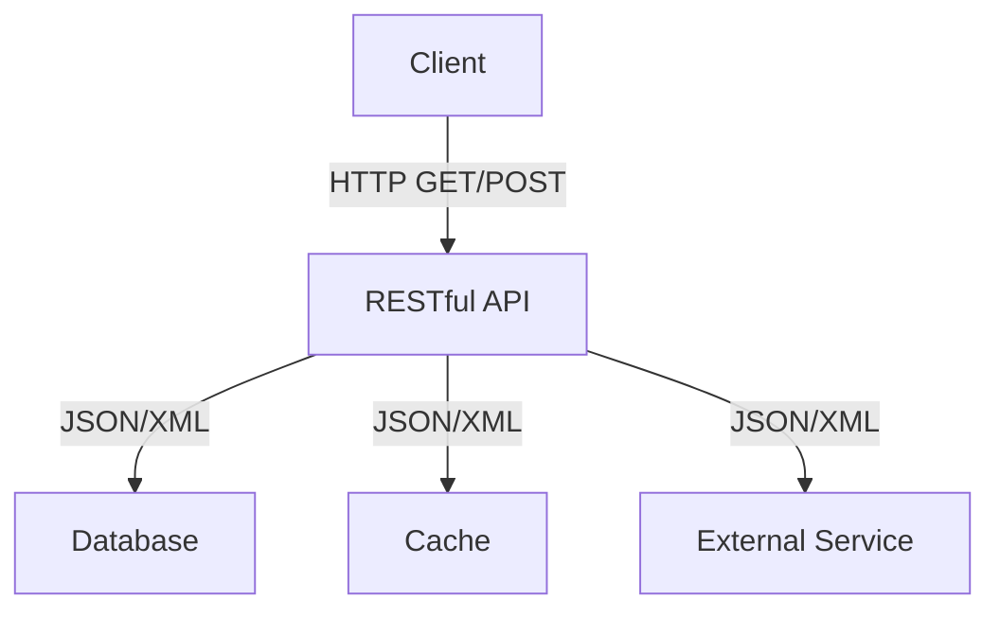
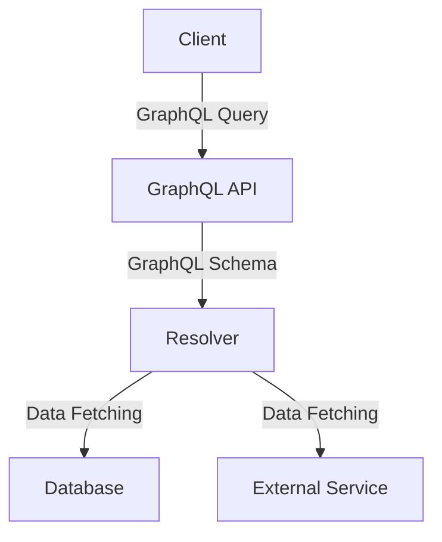

## 15.7 Building APIs with REST and GraphQL

In this section, we will delve into the world of building APIs using RESTful principles and GraphQL in Erlang. We'll explore the fundamental concepts, provide practical examples, and discuss the unique features of Erlang that make it suitable for API development. By the end of this section, you'll have a solid understanding of how to create robust and scalable APIs in Erlang.

### Understanding RESTful APIs

REST (Representational State Transfer) is an architectural style for designing networked applications. It relies on stateless, client-server communication, typically over HTTP. RESTful APIs are designed around resources, which are identified by URLs, and they use standard HTTP methods like GET, POST, PUT, DELETE to perform operations on these resources.

#### Key Principles of RESTful APIs

1. **Statelessness**: Each request from a client contains all the information needed to process the request. The server does not store any session information about the client.

2. **Resource-Based**: Everything is considered a resource, and each resource is identified by a unique URL.

3. **HTTP Methods**: Use standard HTTP methods to perform operations on resources:
   - **GET**: Retrieve a resource.
   - **POST**: Create a new resource.
   - **PUT**: Update an existing resource.
   - **DELETE**: Remove a resource.

4. **Representations**: Resources can have multiple representations, such as JSON, XML, or HTML.

5. **Stateless Communication**: Each request from a client to a server must contain all the information the server needs to fulfill that request.

6. **Cacheability**: Responses must define themselves as cacheable or not to prevent clients from reusing stale or inappropriate data.

#### Creating RESTful Endpoints with Cowboy

Cowboy is a small, fast, and modern HTTP server for Erlang/OTP. It is a great choice for building RESTful APIs due to its simplicity and performance.

Let's create a simple RESTful API using Cowboy. We'll build an API for managing a collection of books.

**Step 1: Setting Up Cowboy**

First, ensure you have Cowboy installed. You can add it to your `rebar.config`:

```erlang
{deps, [
    {cowboy, "2.9.0"}
]}.
```

**Step 2: Defining the Router**

Create a router module to define the routes for your API:

```erlang
-module(book_router).
-export([init/2]).

init(_Transport, Req) ->
    Dispatch = cowboy_router:compile([
        {'_', [
            {"/books", book_handler, []},
            {"/books/:id", book_handler, []}
        ]}
    ]),
    {ok, Req, cowboy_router:dispatch(Dispatch)}.
```

**Step 3: Implementing the Handler**

Create a handler module to process the requests:

```erlang
-module(book_handler).
-export([init/2, handle/2, terminate/3]).

init(Req, State) ->
    {cowboy_rest, Req, State}.

handle(Req, State) ->
    Method = cowboy_req:method(Req),
    case Method of
        <<"GET">> -> handle_get(Req, State);
        <<"POST">> -> handle_post(Req, State);
        <<"PUT">> -> handle_put(Req, State);
        <<"DELETE">> -> handle_delete(Req, State);
        _ -> {ok, Req, State}
    end.

terminate(_Reason, _Req, _State) ->
    ok.

handle_get(Req, State) ->
    % Retrieve book(s) logic here
    {ok, Req, State}.

handle_post(Req, State) ->
    % Create book logic here
    {ok, Req, State}.

handle_put(Req, State) ->
    % Update book logic here
    {ok, Req, State}.

handle_delete(Req, State) ->
    % Delete book logic here
    {ok, Req, State}.
```

**Step 4: Starting the Cowboy Server**

Finally, start the Cowboy server:

```erlang
-module(book_app).
-export([start/0]).

start() ->
    {ok, _} = cowboy:start_clear(http_listener, 100,
        [{port, 8080}],
        #{env => #{dispatch => book_router:init()}}
    ).
```

### Introducing GraphQL

GraphQL is a query language for APIs and a runtime for executing those queries by using a type system you define for your data. It allows clients to request exactly the data they need, making it more efficient than REST in some scenarios.

#### Benefits of GraphQL

1. **Efficient Data Retrieval**: Clients can request only the data they need, reducing over-fetching and under-fetching.

2. **Strongly Typed Schema**: GraphQL APIs are defined by a schema that specifies the types and relationships of the data.

3. **Single Endpoint**: Unlike REST, which often requires multiple endpoints for different resources, GraphQL uses a single endpoint for all queries.

4. **Introspection**: GraphQL APIs are self-documenting, allowing clients to query the schema for available operations.

#### Using GraphQL in Erlang

To use GraphQL in Erlang, we can leverage the [graphql-erlang](https://github.com/Shopify/graphql-erlang) library. This library provides tools for defining GraphQL schemas and executing queries.

**Step 1: Defining the Schema**

Define a schema for your API. For our book example, the schema might look like this:

```erlang
-module(book_schema).
-export([schema/0]).

schema() ->
    #{
        query => #{
            fields => #{
                books => #{type => list_of(book_type())},
                book => #{type => book_type(), args => #{id => non_null(id_type())}}
            }
        }
    }.

book_type() ->
    #{
        name => <<"Book">>,
        fields => #{
            id => #{type => id_type()},
            title => #{type => string_type()},
            author => #{type => string_type()}
        }
    }.

id_type() -> #{name => <<"ID">>, kind => scalar}.
string_type() -> #{name => <<"String">>, kind => scalar}.
```

**Step 2: Executing Queries**

Implement a resolver to handle queries:

```erlang
-module(book_resolver).
-export([resolve/3]).

resolve(<<"books">>, _Args, _Context) ->
    % Fetch list of books
    {ok, Books};

resolve(<<"book">>, #{<<"id">> := Id}, _Context) ->
    % Fetch a single book by ID
    {ok, Book}.
```

**Step 3: Integrating with Cowboy**

Integrate the GraphQL schema and resolvers with Cowboy:

```erlang
-module(graphql_handler).
-export([init/2, handle/2, terminate/3]).

init(Req, State) ->
    {cowboy_rest, Req, State}.

handle(Req, State) ->
    {ok, Body, Req2} = cowboy_req:read_body(Req),
    Query = jsx:decode(Body),
    {ok, Result} = graphql:execute(book_schema:schema(), Query, book_resolver:resolve/3, #{}),
    {ok, Req3} = cowboy_req:reply(200, #{<<"content-type">> => <<"application/json">>}, jsx:encode(Result), Req2),
    {ok, Req3, State}.

terminate(_Reason, _Req, _State) ->
    ok.
```

### Considerations for API Versioning and Documentation

When building APIs, it's crucial to consider versioning and documentation to ensure maintainability and usability.

#### API Versioning

- **URI Versioning**: Include the version number in the URI (e.g., `/v1/books`).
- **Header Versioning**: Use custom headers to specify the API version.
- **Parameter Versioning**: Include the version as a query parameter.

#### API Documentation

- **Swagger/OpenAPI**: Use tools like Swagger to generate interactive API documentation.
- **GraphQL Introspection**: Leverage GraphQL's introspection capabilities to provide self-documenting APIs.

### Visualizing API Architecture

Let's visualize the architecture of a RESTful API and a GraphQL API using Mermaid.js diagrams.

#### RESTful API Architecture



**Description**: This diagram represents a typical RESTful API architecture, where the client communicates with the API using HTTP methods. The API interacts with a database, cache, and external services.

#### GraphQL API Architecture



**Description**: This diagram illustrates a GraphQL API architecture. The client sends a query to the GraphQL API, which uses a schema and resolver to fetch data from a database or external service.

### Try It Yourself

Now that we've covered the basics, try modifying the code examples to add new features or handle different types of data. Experiment with creating new endpoints or queries, and see how the API responds.

### Knowledge Check

- What are the key principles of RESTful APIs?
- How does GraphQL differ from REST in terms of data retrieval?
- What are some benefits of using Cowboy for building APIs in Erlang?
- How can you implement API versioning in a RESTful API?
- What tools can you use to document a GraphQL API?

### Embrace the Journey

Building APIs with REST and GraphQL in Erlang can be a rewarding experience. Remember, this is just the beginning. As you progress, you'll build more complex and interactive APIs. Keep experimenting, stay curious, and enjoy the journey!

## Quiz: Building APIs with REST and GraphQL



### What is a key principle of RESTful APIs?

- [x] Statelessness
- [ ] Stateful communication
- [ ] Single endpoint
- [ ] Over-fetching

> **Explanation:** RESTful APIs are stateless, meaning each request contains all the information needed to process it.

### Which HTTP method is used to update a resource in a RESTful API?

- [ ] GET
- [ ] POST
- [x] PUT
- [ ] DELETE

> **Explanation:** The PUT method is used to update an existing resource in a RESTful API.

### What is a benefit of using GraphQL over REST?

- [x] Efficient data retrieval
- [ ] Multiple endpoints
- [ ] Stateless communication
- [ ] Cacheability

> **Explanation:** GraphQL allows clients to request only the data they need, making it more efficient than REST.

### Which Erlang library can be used for GraphQL?

- [ ] Cowboy
- [x] graphql-erlang
- [ ] EDoc
- [ ] Dialyzer

> **Explanation:** The graphql-erlang library provides tools for defining GraphQL schemas and executing queries in Erlang.

### How can you implement API versioning in a RESTful API?

- [x] URI Versioning
- [x] Header Versioning
- [ ] Single Endpoint
- [ ] Over-fetching

> **Explanation:** API versioning can be implemented using URI versioning or header versioning.

### What tool can be used to generate interactive API documentation?

- [x] Swagger/OpenAPI
- [ ] Cowboy
- [ ] graphql-erlang
- [ ] Dialyzer

> **Explanation:** Swagger/OpenAPI can be used to generate interactive API documentation.

### What is a key feature of GraphQL APIs?

- [x] Strongly typed schema
- [ ] Stateless communication
- [ ] Multiple endpoints
- [ ] Cacheability

> **Explanation:** GraphQL APIs are defined by a strongly typed schema that specifies the types and relationships of the data.

### What is the role of a resolver in a GraphQL API?

- [x] Handle queries
- [ ] Define the schema
- [ ] Generate documentation
- [ ] Implement caching

> **Explanation:** A resolver handles queries and fetches the necessary data in a GraphQL API.

### What is a common method for documenting RESTful APIs?

- [x] Swagger/OpenAPI
- [ ] GraphQL Introspection
- [ ] Cowboy
- [ ] Dialyzer

> **Explanation:** Swagger/OpenAPI is commonly used for documenting RESTful APIs.

### True or False: GraphQL uses multiple endpoints for different resources.

- [ ] True
- [x] False

> **Explanation:** GraphQL uses a single endpoint for all queries, unlike REST which often requires multiple endpoints.


