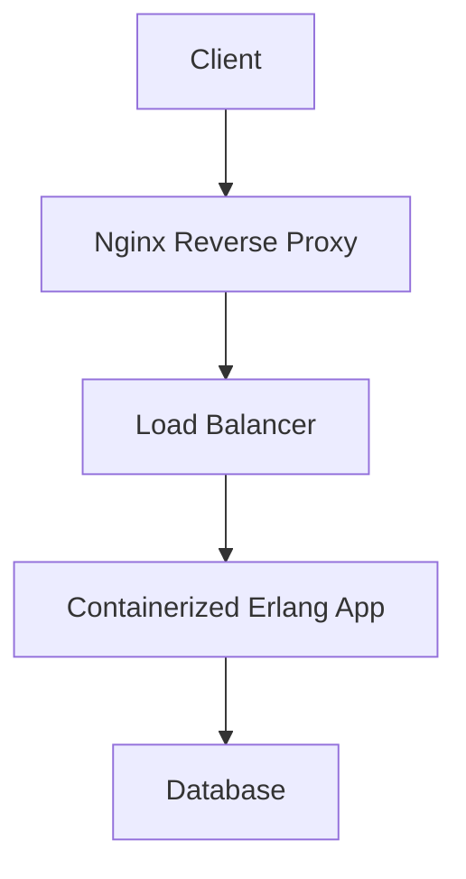

## 15.9 Deployment Strategies

Deploying Erlang web applications effectively is crucial for ensuring performance, reliability, and scalability. In this section, we will explore various deployment strategies, including on-premises servers, cloud platforms, and containerization. We will also delve into building releases with Rebar3 and `relx`, configuring reverse proxies like Nginx, and implementing zero-downtime deployments and rolling updates. Additionally, we will emphasize the importance of security hardening and compliance.

### Deployment Options

#### On-Premises Servers

Deploying on-premises involves hosting your Erlang applications on physical servers within your organization's infrastructure. This approach offers complete control over the hardware and network environment but requires significant investment in hardware, maintenance, and security.

**Advantages:**
- Full control over the environment.
- Customizable hardware and network configurations.
- Enhanced data privacy and security.

**Disadvantages:**
- High upfront costs for hardware and maintenance.
- Requires dedicated IT staff for management.
- Limited scalability compared to cloud solutions.

**Considerations:**
- Ensure robust security measures, including firewalls and intrusion detection systems.
- Plan for redundancy and failover to minimize downtime.
- Regularly update and patch systems to protect against vulnerabilities.

#### Cloud Platforms

Cloud platforms like AWS, Google Cloud, and Azure offer scalable and flexible deployment options for Erlang applications. These platforms provide Infrastructure as a Service (IaaS) and Platform as a Service (PaaS) solutions, allowing you to focus on application development rather than infrastructure management.

**Advantages:**
- Scalability and flexibility to handle varying workloads.
- Reduced infrastructure management overhead.
- Pay-as-you-go pricing models.

**Disadvantages:**
- Potential data privacy concerns.
- Dependency on third-party providers.
- Variable costs based on usage.

**Considerations:**
- Choose a cloud provider that aligns with your compliance and security requirements.
- Implement monitoring and logging to track application performance and usage.
- Use auto-scaling features to optimize resource utilization and cost.

#### Containerization

Containerization, using tools like Docker, allows you to package your Erlang applications and their dependencies into lightweight, portable containers. This approach simplifies deployment and ensures consistency across different environments.

**Advantages:**
- Consistent and reproducible deployments.
- Simplified dependency management.
- Easy integration with CI/CD pipelines.

**Disadvantages:**
- Requires knowledge of container orchestration tools like Kubernetes.
- Potential performance overhead compared to bare-metal deployments.

**Considerations:**
- Use orchestration tools like Kubernetes to manage containerized applications at scale.
- Implement security best practices for container images and runtime environments.
- Monitor container performance and resource usage.

### Building Releases with Rebar3 and `relx`

Rebar3 and `relx` are essential tools for building and packaging Erlang applications for deployment. They automate the process of compiling, testing, and creating releases, ensuring that your application is ready for production.

#### Using Rebar3

Rebar3 is a build tool for Erlang that simplifies dependency management, compilation, and testing. It integrates seamlessly with `relx` to create releases.

**Steps to Build a Release with Rebar3:**

1. **Initialize a Rebar3 Project:**
   ```bash
   rebar3 new release my_app
   ```

2. **Define Dependencies:**
   Add dependencies to the `rebar.config` file.

3. **Compile the Application:**
   ```bash
   rebar3 compile
   ```

4. **Run Tests:**
   ```bash
   rebar3 eunit
   ```

5. **Create a Release:**
   ```bash
   rebar3 release
   ```

#### Using `relx`

`relx` is a release assembler for Erlang that works with Rebar3 to package applications for deployment. It generates a self-contained directory with all necessary files to run the application.

**Sample `relx` Configuration:**

```erlang
{release, {my_app, "1.0.0"},
 [{my_app, load},
  {sasl, load}]}.

{extended_start_script, true}.
```

**Building a Release with `relx`:**

1. **Configure `relx` in `rebar.config`:**
   ```erlang
   {relx, [
     {release, {my_app, "1.0.0"}, [my_app]},
     {dev_mode, false},
     {include_erts, true},
     {extended_start_script, true}
   ]}.
   ```

2. **Build the Release:**
   ```bash
   rebar3 release
   ```

3. **Start the Release:**
   ```bash
   _build/default/rel/my_app/bin/my_app start
   ```

### Configuring Reverse Proxies

Reverse proxies like Nginx are used to route incoming traffic to your Erlang application, providing load balancing, SSL termination, and security features.

#### Setting Up Nginx as a Reverse Proxy

1. **Install Nginx:**
   ```bash
   sudo apt-get install nginx
   ```

2. **Configure Nginx:**
   Create a configuration file for your application in `/etc/nginx/sites-available/my_app`.

   ```nginx
   server {
       listen 80;
       server_name myapp.example.com;

       location / {
           proxy_pass http://localhost:8080;
           proxy_set_header Host $host;
           proxy_set_header X-Real-IP $remote_addr;
           proxy_set_header X-Forwarded-For $proxy_add_x_forwarded_for;
           proxy_set_header X-Forwarded-Proto $scheme;
       }
   }
   ```

3. **Enable the Configuration:**
   ```bash
   sudo ln -s /etc/nginx/sites-available/my_app /etc/nginx/sites-enabled/
   ```

4. **Restart Nginx:**
   ```bash
   sudo systemctl restart nginx
   ```

### Zero-Downtime Deployments and Rolling Updates

Zero-downtime deployments ensure that your application remains available during updates. Rolling updates gradually replace old instances with new ones, minimizing disruption.

#### Implementing Zero-Downtime Deployments

1. **Use Blue-Green Deployment:**
   Maintain two identical environments (blue and green). Deploy updates to the inactive environment and switch traffic once verified.

2. **Leverage Load Balancers:**
   Use load balancers to route traffic to healthy instances during updates.

3. **Implement Health Checks:**
   Ensure new instances pass health checks before receiving traffic.

#### Rolling Updates with Kubernetes

1. **Define a Deployment:**
   Create a Kubernetes deployment configuration for your application.

   ```yaml
   apiVersion: apps/v1
   kind: Deployment
   metadata:
     name: my-app
   spec:
     replicas: 3
     selector:
       matchLabels:
         app: my-app
     template:
       metadata:
         labels:
           app: my-app
       spec:
         containers:
         - name: my-app
           image: myapp:latest
           ports:
           - containerPort: 8080
   ```

2. **Apply the Deployment:**
   ```bash
   kubectl apply -f my-app-deployment.yaml
   ```

3. **Update the Deployment:**
   Modify the image version and apply the changes to initiate a rolling update.

### Security Hardening and Compliance

Ensuring the security and compliance of your Erlang applications is critical, especially in production environments.

#### Security Best Practices

- **Use Secure Protocols:** Implement SSL/TLS for encrypted communication.
- **Regularly Update Dependencies:** Keep your Erlang and third-party libraries up to date.
- **Implement Access Controls:** Restrict access to sensitive resources and data.
- **Monitor and Log Activity:** Track application activity for anomalies and potential threats.

#### Compliance Considerations

- **Data Protection:** Ensure data is stored and transmitted securely.
- **Audit Logging:** Maintain logs for compliance audits and investigations.
- **Privacy Regulations:** Adhere to regulations like GDPR and HIPAA.

### Try It Yourself

Experiment with the deployment strategies discussed in this section. Modify the Nginx configuration to add SSL support, or try deploying your Erlang application on a different cloud platform. Explore container orchestration with Kubernetes to manage your deployments at scale.

### Visualizing Deployment Strategies

Below is a diagram illustrating the flow of a typical deployment strategy using a reverse proxy and containerization.



This diagram shows how client requests are routed through an Nginx reverse proxy, balanced across multiple instances of a containerized Erlang application, and finally interacting with a database.

### Knowledge Check

- What are the advantages and disadvantages of deploying on-premises versus cloud platforms?
- How does containerization benefit Erlang application deployments?
- What are the key steps in building a release with Rebar3 and `relx`?
- How can Nginx be configured to act as a reverse proxy for an Erlang application?
- What strategies can be used to achieve zero-downtime deployments?

### Embrace the Journey

Remember, deploying Erlang applications is an ongoing process of learning and adaptation. As you explore different deployment strategies, you'll gain insights into what works best for your specific needs. Keep experimenting, stay curious, and enjoy the journey!

---

## Quiz: Deployment Strategies



### What is a key advantage of deploying Erlang applications on cloud platforms?

- [x] Scalability and flexibility
- [ ] Complete control over hardware
- [ ] High upfront costs
- [ ] Dependency on third-party providers

> **Explanation:** Cloud platforms offer scalability and flexibility, allowing applications to handle varying workloads efficiently.

### Which tool is used to build and package Erlang applications for deployment?

- [x] Rebar3
- [ ] Docker
- [ ] Kubernetes
- [ ] Nginx

> **Explanation:** Rebar3 is a build tool for Erlang that simplifies the process of compiling, testing, and creating releases.

### What is the purpose of a reverse proxy like Nginx in an Erlang deployment?

- [x] To route incoming traffic and provide load balancing
- [ ] To compile Erlang code
- [ ] To manage container orchestration
- [ ] To store application data

> **Explanation:** Nginx acts as a reverse proxy to route incoming traffic to the appropriate application instances and provide load balancing.

### How can zero-downtime deployments be achieved?

- [x] By using blue-green deployment strategies
- [ ] By stopping all instances during updates
- [ ] By ignoring health checks
- [ ] By deploying on-premises only

> **Explanation:** Blue-green deployment strategies allow updates to be deployed to an inactive environment, ensuring zero downtime.

### What is a disadvantage of containerization?

- [x] Requires knowledge of container orchestration tools
- [ ] Consistent and reproducible deployments
- [ ] Simplified dependency management
- [ ] Easy integration with CI/CD pipelines

> **Explanation:** Containerization requires understanding of orchestration tools like Kubernetes, which can be complex to manage.

### Which of the following is a security best practice for Erlang deployments?

- [x] Implement SSL/TLS for encrypted communication
- [ ] Use outdated dependencies
- [ ] Allow unrestricted access to resources
- [ ] Disable logging

> **Explanation:** Implementing SSL/TLS ensures that communication is encrypted, enhancing security.

### What is a key consideration when deploying on-premises?

- [x] High upfront costs for hardware and maintenance
- [ ] Reduced infrastructure management overhead
- [ ] Pay-as-you-go pricing models
- [ ] Dependency on third-party providers

> **Explanation:** Deploying on-premises involves high upfront costs for purchasing and maintaining hardware.

### How can rolling updates be implemented in Kubernetes?

- [x] By modifying the image version in the deployment configuration
- [ ] By stopping all instances before updating
- [ ] By using a single instance for deployment
- [ ] By ignoring health checks

> **Explanation:** Rolling updates in Kubernetes are achieved by updating the image version in the deployment configuration, allowing gradual replacement of instances.

### What is the role of `relx` in Erlang deployments?

- [x] To assemble releases for deployment
- [ ] To manage container orchestration
- [ ] To act as a reverse proxy
- [ ] To store application data

> **Explanation:** `relx` is a release assembler that packages Erlang applications for deployment.

### True or False: Cloud platforms offer complete control over hardware and network configurations.

- [ ] True
- [x] False

> **Explanation:** Cloud platforms do not offer complete control over hardware and network configurations, as they are managed by third-party providers.


