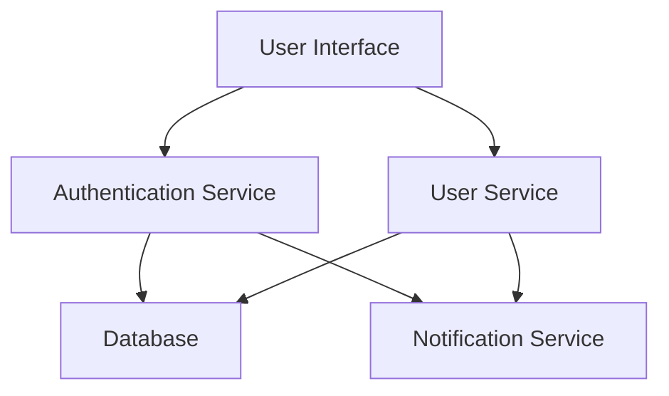

## 16.1 Introduction to Microservices Architecture

In the ever-evolving landscape of software development, microservices architecture has emerged as a pivotal approach for building robust, scalable, and maintainable applications. This section delves into the core principles of microservices architecture, its advantages, and how Erlang's unique features make it a compelling choice for developing microservices-based systems.

### Understanding Microservices Architecture

Microservices architecture is a design paradigm that structures an application as a collection of loosely coupled services. Each service is a small, independent unit that focuses on a specific business capability. This architectural style contrasts with traditional monolithic architectures, where all components are tightly integrated into a single application.

#### Core Principles of Microservices

1. **Single Responsibility**: Each microservice is designed to perform a specific function or business capability, adhering to the Single Responsibility Principle. This makes services easier to understand, develop, and maintain.

2. **Loose Coupling**: Services are loosely coupled, meaning changes in one service do not necessitate changes in others. This is achieved through well-defined interfaces and communication protocols.

3. **Independent Deployability**: Microservices can be deployed independently, allowing for more frequent updates and reducing the risk of system-wide failures during deployments.

4. **Decentralized Data Management**: Each service manages its own data, often using different databases or storage technologies. This decentralization enhances scalability and resilience.

5. **Polyglot Programming**: Microservices architecture allows for the use of different programming languages and technologies for different services, enabling teams to choose the best tools for each task.

### Advantages of Microservices Architecture

Microservices offer several benefits that address the limitations of monolithic architectures:

- **Scalability**: Services can be scaled independently based on demand, optimizing resource usage and improving performance.

- **Flexibility**: Teams can develop, deploy, and scale services independently, fostering innovation and reducing time-to-market.

- **Resilience**: The failure of one service does not necessarily impact others, enhancing the overall system's fault tolerance.

- **Technology Diversity**: Teams can leverage different technologies and frameworks for different services, allowing for greater innovation and flexibility.

- **Improved Maintainability**: Smaller, focused services are easier to understand, test, and maintain, leading to higher code quality and reduced technical debt.

### Erlang's Alignment with Microservices

Erlang, with its roots in telecommunications, is inherently designed for building concurrent, distributed, and fault-tolerant systems. These characteristics align seamlessly with the principles of microservices architecture:

#### Concurrency

Erlang's lightweight process model allows for massive concurrency, enabling the development of highly scalable microservices. Each Erlang process is isolated, with its own memory space, facilitating the creation of independent services that can run concurrently without interference.

#### Fault Tolerance

Erlang's "let it crash" philosophy and robust error-handling mechanisms make it ideal for building resilient microservices. Supervisors and process monitoring ensure that services can recover from failures gracefully, maintaining system stability.

#### Distributed Computing

Erlang's distributed computing capabilities allow for seamless communication between services across different nodes. This is crucial for microservices, which often need to interact with each other over a network.

### Scenarios Where Microservices Shine

Microservices architecture is particularly beneficial in the following scenarios:

- **Complex Systems**: Large applications with multiple business domains can be decomposed into smaller, manageable services, simplifying development and maintenance.

- **Frequent Updates**: Applications that require frequent updates and deployments benefit from the independent deployability of microservices.

- **Scalable Applications**: Systems with varying load patterns can scale individual services based on demand, optimizing resource usage.

- **Diverse Technology Stacks**: Organizations that wish to leverage different technologies for different components can do so with microservices.

### Encouragement for Erlang in Microservices Development

Given Erlang's strengths in concurrency, fault tolerance, and distributed computing, it is a natural fit for microservices architecture. Developers are encouraged to explore Erlang for building microservices-based systems, leveraging its unique features to create scalable, resilient, and maintainable applications.

### Code Example: A Simple Microservice in Erlang

Let's explore a basic example of a microservice in Erlang. We'll create a simple service that handles user registration.

```erlang
-module(user_service).
-export([start/0, register_user/2]).

% Start the user service
start() ->
    spawn(fun() -> loop([]) end).

% Main loop to handle user registration
loop(Users) ->
    receive
        {register, User, From} ->
            NewUsers = [User | Users],
            From ! {ok, User},
            loop(NewUsers);
        {get_users, From} ->
            From ! {ok, Users},
            loop(Users)
    end.

% Register a new user
register_user(User, ServicePid) ->
    ServicePid ! {register, User, self()},
    receive
        {ok, User} ->
            io:format("User ~p registered successfully.~n", [User])
    end.
```

In this example, we define a simple user service that can register users and retrieve the list of registered users. The service runs in its own process, demonstrating Erlang's concurrency model.

### Try It Yourself

Experiment with the code by adding new features, such as user validation or error handling. Consider how you might scale this service or integrate it with other services in a microservices architecture.

### Visualizing Microservices Architecture

Below is a simple diagram illustrating the interaction between microservices in a typical architecture.



**Diagram Description**: This diagram represents a basic microservices architecture where the User Interface interacts with the Authentication and User Services. Both services communicate with a Database, and notifications are handled by a separate Notification Service.

### References and Further Reading

- [Martin Fowler's Microservices](https://martinfowler.com/articles/microservices.html)
- [Erlang's Concurrency Model](https://erlang.org/doc/reference_manual/processes.html)
- [The Reactive Manifesto](https://www.reactivemanifesto.org/)

### Knowledge Check

- What are the core principles of microservices architecture?
- How does Erlang's concurrency model benefit microservices?
- In what scenarios are microservices particularly advantageous?

### Embrace the Journey

Remember, this is just the beginning. As you delve deeper into microservices architecture with Erlang, you'll discover new patterns and practices that enhance your applications. Keep experimenting, stay curious, and enjoy the journey!

## Quiz: Introduction to Microservices Architecture



### What is a key principle of microservices architecture?

- [x] Single Responsibility
- [ ] Tight Coupling
- [ ] Monolithic Design
- [ ] Centralized Data Management

> **Explanation:** Microservices architecture emphasizes the Single Responsibility Principle, where each service focuses on a specific business capability.

### How does Erlang's concurrency model benefit microservices?

- [x] Enables massive concurrency
- [ ] Increases memory usage
- [ ] Reduces fault tolerance
- [ ] Limits scalability

> **Explanation:** Erlang's lightweight process model allows for massive concurrency, making it ideal for scalable microservices.

### What is an advantage of microservices architecture?

- [x] Independent Deployability
- [ ] Increased Complexity
- [ ] Tight Coupling
- [ ] Centralized Data Management

> **Explanation:** Microservices can be deployed independently, allowing for more frequent updates and reducing system-wide risks.

### Which Erlang feature aligns with microservices' fault tolerance?

- [x] "Let it crash" philosophy
- [ ] Centralized error handling
- [ ] Tight coupling
- [ ] Monolithic design

> **Explanation:** Erlang's "let it crash" philosophy and robust error-handling mechanisms enhance microservices' fault tolerance.

### In what scenario are microservices particularly beneficial?

- [x] Complex Systems
- [ ] Small, simple applications
- [ ] Single-threaded programs
- [ ] Centralized data management

> **Explanation:** Microservices are beneficial for complex systems with multiple business domains, simplifying development and maintenance.

### What is a common communication protocol in microservices?

- [x] HTTP/REST
- [ ] FTP
- [ ] SMTP
- [ ] POP3

> **Explanation:** HTTP/REST is commonly used for communication between microservices due to its simplicity and ubiquity.

### How does Erlang handle distributed computing?

- [x] Seamless communication between nodes
- [ ] Centralized processing
- [ ] Single-threaded execution
- [ ] Tight coupling

> **Explanation:** Erlang's distributed computing capabilities allow for seamless communication between services across different nodes.

### What is a benefit of decentralized data management in microservices?

- [x] Enhanced scalability
- [ ] Increased complexity
- [ ] Centralized control
- [ ] Tight coupling

> **Explanation:** Decentralized data management enhances scalability and resilience in microservices architecture.

### What is a challenge of microservices architecture?

- [x] Increased complexity
- [ ] Reduced flexibility
- [ ] Tight coupling
- [ ] Centralized data management

> **Explanation:** While microservices offer many benefits, they can also introduce increased complexity in managing multiple services.

### True or False: Erlang is not suitable for microservices architecture.

- [ ] True
- [x] False

> **Explanation:** Erlang's features, such as concurrency, fault tolerance, and distributed computing, make it well-suited for microservices architecture.


