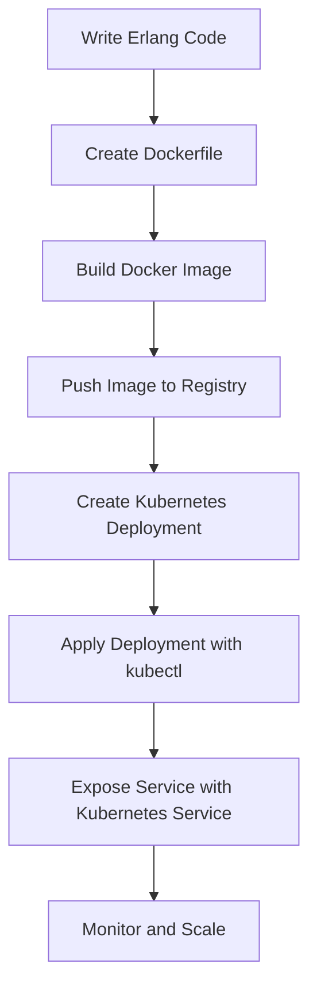

## 16.10 Deploying Erlang Microservices

Deploying Erlang microservices involves a series of strategic decisions and technical implementations that ensure your applications are scalable, resilient, and maintainable. In this section, we will explore the deployment options available for Erlang microservices, focusing on containerization with Docker and orchestration with Kubernetes. We will also discuss service discovery, scaling, networking, and best practices for continuous deployment pipelines.

### Understanding Microservices Deployment

Microservices architecture involves deploying small, independent services that work together to form a complete application. Each service can be developed, deployed, and scaled independently, allowing for greater flexibility and resilience. Deploying microservices requires careful consideration of several factors, including:

- **Isolation**: Ensuring each service runs in its own environment.
- **Scalability**: Allowing services to scale independently based on demand.
- **Networking**: Facilitating communication between services.
- **Service Discovery**: Enabling services to find each other dynamically.
- **Monitoring and Logging**: Tracking the health and performance of services.

### Containerization with Docker

Docker is a popular tool for containerizing applications, providing a consistent environment for development, testing, and production. Containerization allows you to package your Erlang microservices with all their dependencies, ensuring they run consistently across different environments.

#### Creating Docker Images for Erlang Applications

To deploy Erlang microservices using Docker, you need to create Docker images. A Docker image is a lightweight, standalone, executable package that includes everything needed to run a piece of software, including the code, runtime, libraries, and environment variables.

**Step-by-Step Guide to Creating a Docker Image:**

1. **Install Docker**: Ensure Docker is installed on your machine. You can download it from the [Docker website](https://www.docker.com/products/docker-desktop).

2. **Create a Dockerfile**: A Dockerfile is a text document that contains all the commands to assemble an image. Here's a basic example for an Erlang application:

    ```dockerfile
    # Use the official Erlang image as a base
    FROM erlang:23

    # Set the working directory
    WORKDIR /app

    # Copy the current directory contents into the container at /app
    COPY . /app

    # Install any needed packages specified in rebar.config
    RUN rebar3 compile

    # Make port 8080 available to the world outside this container
    EXPOSE 8080

    # Run the application
    CMD ["erl", "-pa", "_build/default/lib/*/ebin", "-s", "my_app"]
    ```

3. **Build the Docker Image**: Use the `docker build` command to create an image from your Dockerfile.

    ```bash
    docker build -t my_erlang_app .
    ```

4. **Run the Docker Container**: Use the `docker run` command to start a container from your image.

    ```bash
    docker run -p 8080:8080 my_erlang_app
    ```

#### Key Considerations

- **Environment Variables**: Use environment variables to configure your application dynamically.
- **Volumes**: Use Docker volumes to persist data outside of the container.
- **Networking**: Ensure your containers can communicate with each other using Docker networks.

### Orchestration with Kubernetes

Kubernetes is a powerful orchestration tool that automates the deployment, scaling, and management of containerized applications. It provides a robust platform for running Erlang microservices in production.

#### Deploying Erlang Services with Kubernetes

To deploy Erlang microservices with Kubernetes, you need to define your application's desired state using YAML configuration files. These files describe how your application should be deployed, including the number of replicas, networking, and storage.

**Basic Kubernetes Deployment Example:**

1. **Create a Deployment YAML File**: Define a deployment for your Erlang application.

    ```yaml
    apiVersion: apps/v1
    kind: Deployment
    metadata:
      name: erlang-app
    spec:
      replicas: 3
      selector:
        matchLabels:
          app: erlang-app
      template:
        metadata:
          labels:
            app: erlang-app
        spec:
          containers:
          - name: erlang-app
            image: my_erlang_app:latest
            ports:
            - containerPort: 8080
    ```

2. **Apply the Deployment**: Use `kubectl` to apply the deployment.

    ```bash
    kubectl apply -f deployment.yaml
    ```

3. **Expose the Deployment**: Create a service to expose your application to the outside world.

    ```yaml
    apiVersion: v1
    kind: Service
    metadata:
      name: erlang-service
    spec:
      type: LoadBalancer
      ports:
      - port: 80
        targetPort: 8080
      selector:
        app: erlang-app
    ```

4. **Apply the Service**: Use `kubectl` to apply the service.

    ```bash
    kubectl apply -f service.yaml
    ```

#### Key Considerations

- **Service Discovery**: Use Kubernetes' built-in service discovery to enable communication between services.
- **Scaling**: Easily scale your services up or down using Kubernetes' scaling features.
- **Networking**: Leverage Kubernetes' networking capabilities to manage communication between services.

### Service Discovery, Scaling, and Networking

Service discovery, scaling, and networking are critical components of deploying microservices. Let's explore each of these in the context of Erlang microservices.

#### Service Discovery

Service discovery allows services to find each other dynamically. In Kubernetes, this is achieved using DNS and environment variables. Each service is assigned a DNS name, allowing other services to communicate with it using standard DNS queries.

#### Scaling

Scaling involves adjusting the number of replicas of a service based on demand. Kubernetes provides horizontal pod autoscaling, which automatically adjusts the number of replicas based on CPU utilization or other metrics.

#### Networking

Networking in a microservices architecture involves managing communication between services. Kubernetes provides several networking features, including:

- **Pod-to-Pod Communication**: Allows pods to communicate with each other within a cluster.
- **Service-to-Service Communication**: Enables services to communicate using DNS names.
- **Ingress**: Manages external access to services, typically HTTP.

### Best Practices for Continuous Deployment Pipelines

Continuous deployment (CD) is a practice where code changes are automatically deployed to production after passing automated tests. Implementing CD for Erlang microservices involves setting up a pipeline that automates the build, test, and deployment processes.

#### Key Components of a CD Pipeline

1. **Source Control**: Use a version control system like Git to manage your codebase.
2. **Automated Testing**: Implement automated tests to ensure code quality.
3. **Build Automation**: Use tools like Jenkins or GitLab CI to automate the build process.
4. **Deployment Automation**: Use Kubernetes or other tools to automate the deployment process.

#### Best Practices

- **Use Infrastructure as Code**: Define your infrastructure using code to ensure consistency across environments.
- **Implement Rollbacks**: Ensure you can quickly roll back to a previous version in case of issues.
- **Monitor and Log**: Continuously monitor your services and log important events for troubleshooting.

### Visualizing the Deployment Process

To better understand the deployment process, let's visualize the flow of deploying Erlang microservices using Docker and Kubernetes.



**Diagram Description**: This flowchart illustrates the process of deploying Erlang microservices. It starts with writing Erlang code, creating a Dockerfile, building a Docker image, pushing the image to a registry, creating a Kubernetes deployment, applying the deployment, exposing the service, and finally monitoring and scaling.

### Try It Yourself

Now that we've covered the basics of deploying Erlang microservices, it's time to try it yourself. Here are some suggestions for experimentation:

- **Modify the Dockerfile**: Try adding additional dependencies or changing the base image.
- **Scale the Deployment**: Use `kubectl scale` to change the number of replicas and observe the effects.
- **Implement a New Service**: Create a new microservice and deploy it alongside the existing one.

### Summary

Deploying Erlang microservices involves a combination of containerization, orchestration, and automation. By leveraging tools like Docker and Kubernetes, you can create scalable, resilient, and maintainable applications. Remember to focus on service discovery, scaling, networking, and continuous deployment to ensure your microservices architecture is robust and efficient.

## Quiz: Deploying Erlang Microservices



### What is the primary benefit of using Docker for deploying Erlang microservices?

- [x] Consistent environment across different stages
- [ ] Increased application speed
- [ ] Reduced code complexity
- [ ] Enhanced security

> **Explanation:** Docker provides a consistent environment across development, testing, and production, ensuring that applications run the same way in all stages.

### Which tool is commonly used for orchestrating containerized applications?

- [ ] Docker Compose
- [x] Kubernetes
- [ ] Vagrant
- [ ] Ansible

> **Explanation:** Kubernetes is a powerful orchestration tool used for automating the deployment, scaling, and management of containerized applications.

### What is the purpose of a Dockerfile?

- [x] To define the steps to create a Docker image
- [ ] To configure network settings for containers
- [ ] To manage container logs
- [ ] To automate deployment processes

> **Explanation:** A Dockerfile is a text document that contains all the commands to assemble a Docker image.

### How does Kubernetes enable service discovery?

- [x] Using DNS and environment variables
- [ ] Through manual configuration
- [ ] By using IP addresses directly
- [ ] Via external load balancers

> **Explanation:** Kubernetes uses DNS and environment variables to enable service discovery, allowing services to find each other dynamically.

### What is a key feature of Kubernetes for managing application load?

- [ ] Vertical scaling
- [x] Horizontal pod autoscaling
- [ ] Manual scaling
- [ ] Load balancing

> **Explanation:** Kubernetes provides horizontal pod autoscaling, which automatically adjusts the number of replicas based on demand.

### What is the role of a Kubernetes Service?

- [x] To expose applications to external traffic
- [ ] To manage container logs
- [ ] To build Docker images
- [ ] To automate testing

> **Explanation:** A Kubernetes Service exposes applications to external traffic, allowing them to be accessed from outside the cluster.

### Which command is used to apply a Kubernetes deployment?

- [ ] docker run
- [x] kubectl apply
- [ ] kubernetes deploy
- [ ] helm install

> **Explanation:** The `kubectl apply` command is used to apply a Kubernetes deployment, creating or updating resources in the cluster.

### What is a best practice for continuous deployment pipelines?

- [x] Implement rollbacks
- [ ] Use manual testing
- [ ] Avoid monitoring
- [ ] Deploy directly to production

> **Explanation:** Implementing rollbacks is a best practice for continuous deployment pipelines, allowing you to quickly revert to a previous version if needed.

### Which of the following is NOT a benefit of containerization?

- [ ] Isolation
- [ ] Portability
- [ ] Consistency
- [x] Increased code complexity

> **Explanation:** Containerization reduces complexity by isolating applications and their dependencies, making them portable and consistent across environments.

### True or False: Kubernetes can only be used with Docker containers.

- [ ] True
- [x] False

> **Explanation:** False. Kubernetes can be used with various container runtimes, not just Docker.



Remember, deploying Erlang microservices is an iterative process. As you gain experience, you'll discover new ways to optimize and improve your deployment strategies. Keep experimenting, stay curious, and enjoy the journey!
