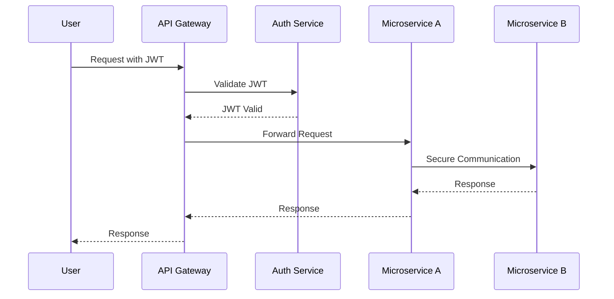

## 16.11 Security Considerations in Microservices

In the realm of microservices, security is paramount. As we decompose monolithic applications into smaller, independent services, the attack surface increases, necessitating robust security measures. This section delves into the essential security considerations for microservices, particularly in Erlang applications, and provides strategies to mitigate potential risks.

### Understanding Security in Microservices

Microservices architecture involves multiple services communicating over a network, often using HTTP/HTTPS protocols. Each service may have its own database and may be deployed independently. This architecture offers scalability and flexibility but also introduces security challenges. Let's explore how to address these challenges effectively.

### Authentication and Authorization

Authentication and authorization are critical components of microservices security. They ensure that only legitimate users and services can access resources.

#### OAuth2 and JWT

OAuth2 is a widely adopted framework for authorization, allowing third-party applications to access user data without exposing credentials. JSON Web Tokens (JWT) are often used in conjunction with OAuth2 to securely transmit information between parties.

- **OAuth2**: OAuth2 provides a secure way to authorize access to resources. It involves several flows, such as the Authorization Code Flow, which is suitable for server-side applications.

- **JWT**: JWTs are compact, URL-safe tokens that contain claims about the user. They are signed to ensure integrity and can be verified by any service that has the signing key.

**Example: Implementing JWT in Erlang**

```erlang
% Generate a JWT
generate_jwt(UserId, Secret) ->
    Header = #{alg => <<"HS256">>, typ => <<"JWT">>},
    Payload = #{sub => UserId, iat => erlang:system_time(seconds)},
    Token = jwt:encode({Header, Payload}, Secret),
    Token.

% Verify a JWT
verify_jwt(Token, Secret) ->
    case jwt:decode(Token, Secret) of
        {ok, {Header, Payload}} ->
            {ok, Payload};
        {error, Reason} ->
            {error, Reason}
    end.
```

**Try It Yourself**: Modify the `generate_jwt` function to include additional claims, such as expiration (`exp`) and roles (`roles`).

#### Securing Service-to-Service Communication

Securing communication between microservices is crucial to prevent unauthorized access and data breaches. SSL/TLS is the standard protocol for securing data in transit.

- **SSL/TLS**: Secure Sockets Layer (SSL) and Transport Layer Security (TLS) encrypt data between services, ensuring confidentiality and integrity. Erlang's `ssl` module provides functions to establish secure connections.

**Example: Establishing a Secure Connection**

```erlang
% Start SSL application
ok = application:start(ssl).

% Configure SSL options
SslOptions = [
    {certfile, "path/to/cert.pem"},
    {keyfile, "path/to/key.pem"},
    {cacertfile, "path/to/ca.pem"}
].

% Establish a secure connection
{ok, Socket} = ssl:connect("example.com", 443, SslOptions).
```

**Try It Yourself**: Experiment with different SSL options, such as enabling client authentication or using different cipher suites.

### Enforcing Security Policies in Erlang Applications

Security policies define the rules and practices for protecting data and resources. In Erlang, these policies can be enforced through various mechanisms.

#### Role-Based Access Control (RBAC)

RBAC restricts access based on the roles assigned to users. Each role has specific permissions, allowing for fine-grained access control.

**Example: Implementing RBAC**

```erlang
% Define roles and permissions
Roles = #{admin => [read, write, delete], user => [read, write]}.

% Check if a user has permission
has_permission(UserRole, Action) ->
    case maps:get(UserRole, Roles, []) of
        Permissions when Action in Permissions ->
            true;
        _ ->
            false
    end.
```

**Try It Yourself**: Extend the `Roles` map to include additional roles and permissions, and test the `has_permission` function with different scenarios.

### Input Validation and Sanitization

Input validation and sanitization are essential to prevent injection attacks and ensure data integrity. Always validate and sanitize inputs from untrusted sources.

#### Validating Inputs

Validation involves checking that inputs meet specific criteria, such as length, format, and type.

**Example: Validating User Input**

```erlang
% Validate email format
validate_email(Email) ->
    case re:run(Email, "^[A-Za-z0-9._%+-]+@[A-Za-z0-9.-]+\.[A-Za-z]{2,}$") of
        {match, _} -> true;
        nomatch -> false
    end.
```

**Try It Yourself**: Create additional validation functions for other input types, such as phone numbers or URLs.

#### Sanitizing Inputs

Sanitization involves cleaning inputs to remove harmful content, such as SQL injection or cross-site scripting (XSS) payloads.

**Example: Sanitizing User Input**

```erlang
% Sanitize input by escaping special characters
sanitize_input(Input) ->
    re:replace(Input, "[<>]", "", [global, {return, list}]).
```

**Try It Yourself**: Enhance the `sanitize_input` function to handle other potentially harmful characters or patterns.

### Regular Security Assessments and Best Practices

Regular security assessments help identify vulnerabilities and ensure compliance with security standards. Adhering to best practices is crucial for maintaining a secure microservices architecture.

#### Conducting Security Assessments

Security assessments involve testing the application for vulnerabilities, such as penetration testing and code reviews.

- **Penetration Testing**: Simulate attacks to identify weaknesses in the system.
- **Code Reviews**: Regularly review code for security issues and adherence to best practices.

#### Best Practices for Microservices Security

- **Least Privilege**: Grant the minimum permissions necessary for each service and user.
- **Defense in Depth**: Implement multiple layers of security controls to protect against different types of attacks.
- **Regular Updates**: Keep dependencies and libraries up to date to mitigate known vulnerabilities.
- **Logging and Monitoring**: Implement logging and monitoring to detect and respond to security incidents promptly.

### Visualizing Security in Microservices

To better understand the flow of security in microservices, let's visualize the architecture using a sequence diagram.



**Diagram Description**: This sequence diagram illustrates the flow of a request in a microservices architecture. The user sends a request with a JWT to the API Gateway, which validates the token with the Auth Service. Upon successful validation, the request is forwarded to Microservice A, which communicates securely with Microservice B.

### Conclusion

Securing microservices requires a comprehensive approach that encompasses authentication, authorization, communication security, input validation, and regular assessments. By implementing these strategies in Erlang applications, we can build robust and secure microservices architectures.

Remember, security is an ongoing process. Stay vigilant, keep learning, and continuously improve your security practices.

## Quiz: Security Considerations in Microservices



### What is the primary purpose of OAuth2 in microservices?

- [x] To provide a secure way to authorize access to resources
- [ ] To encrypt data in transit
- [ ] To validate input data
- [ ] To manage service-to-service communication

> **Explanation:** OAuth2 is a framework for authorization, allowing secure access to resources.

### Which protocol is commonly used to secure service-to-service communication?

- [ ] HTTP
- [x] SSL/TLS
- [ ] FTP
- [ ] SMTP

> **Explanation:** SSL/TLS is used to encrypt data between services, ensuring secure communication.

### What is the role of JWT in microservices security?

- [x] To securely transmit information between parties
- [ ] To validate input data
- [ ] To encrypt data at rest
- [ ] To manage service dependencies

> **Explanation:** JWTs are used to securely transmit claims about the user between parties.

### What is the purpose of input validation?

- [x] To ensure inputs meet specific criteria
- [ ] To encrypt data in transit
- [ ] To authorize access to resources
- [ ] To manage service dependencies

> **Explanation:** Input validation checks that inputs meet specific criteria, such as format and type.

### Which of the following is a best practice for microservices security?

- [x] Least Privilege
- [ ] Granting all permissions
- [x] Defense in Depth
- [ ] Ignoring security updates

> **Explanation:** Least Privilege and Defense in Depth are best practices for securing microservices.

### What is the purpose of sanitizing inputs?

- [x] To remove harmful content from inputs
- [ ] To authorize access to resources
- [ ] To encrypt data in transit
- [ ] To manage service dependencies

> **Explanation:** Sanitization involves cleaning inputs to remove harmful content.

### What is the benefit of regular security assessments?

- [x] To identify vulnerabilities and ensure compliance
- [ ] To encrypt data at rest
- [x] To test the application for vulnerabilities
- [ ] To manage service dependencies

> **Explanation:** Regular security assessments help identify vulnerabilities and ensure compliance.

### What is the role of logging and monitoring in microservices security?

- [x] To detect and respond to security incidents
- [ ] To encrypt data in transit
- [ ] To authorize access to resources
- [ ] To manage service dependencies

> **Explanation:** Logging and monitoring help detect and respond to security incidents promptly.

### What is the purpose of the "Defense in Depth" strategy?

- [x] To implement multiple layers of security controls
- [ ] To encrypt data at rest
- [ ] To authorize access to resources
- [ ] To manage service dependencies

> **Explanation:** Defense in Depth involves implementing multiple layers of security controls.

### True or False: JWTs are used to encrypt data at rest.

- [ ] True
- [x] False

> **Explanation:** JWTs are used to securely transmit information between parties, not to encrypt data at rest.


