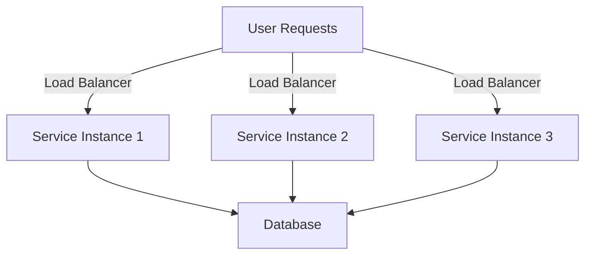

## 16.12 Scaling Microservices

In the dynamic world of software development, scaling microservices effectively is crucial to handle increasing loads and ensure seamless performance. Erlang, with its robust concurrency model and fault-tolerant capabilities, provides a solid foundation for building scalable microservices. In this section, we will explore various strategies for scaling Erlang microservices, focusing on horizontal scaling, load balancing techniques, auto-scaling policies, and the role of statelessness and stateful services in scaling decisions.

### Understanding Horizontal Scaling

Horizontal scaling, also known as scaling out, involves adding more instances of a service to distribute the load. This approach contrasts with vertical scaling, which involves increasing the resources (CPU, memory) of a single instance. Horizontal scaling is particularly well-suited for microservices due to their modular nature, allowing individual services to scale independently.

#### Key Benefits of Horizontal Scaling

- **Resilience**: By distributing the load across multiple instances, the failure of a single instance has minimal impact on the overall system.
- **Flexibility**: Services can be scaled independently based on demand, optimizing resource utilization.
- **Cost-Effectiveness**: Horizontal scaling often leverages commodity hardware, reducing costs compared to high-end servers required for vertical scaling.

### Load Balancing Techniques

Load balancing is essential for distributing incoming requests across multiple service instances, ensuring efficient resource utilization and preventing any single instance from becoming a bottleneck.

#### Common Load Balancing Algorithms

1. **Round Robin**: Distributes requests sequentially across instances. Simple but may not account for varying instance loads.
2. **Least Connections**: Directs requests to the instance with the fewest active connections, balancing load more effectively.
3. **IP Hash**: Uses a hash of the client's IP address to determine the instance, providing session persistence.

#### Implementing Load Balancing in Erlang

Erlang's lightweight processes and message-passing capabilities make it well-suited for implementing custom load balancers. Here's a basic example of a round-robin load balancer in Erlang:

```erlang
-module(load_balancer).
-export([start/1, handle_request/2]).

start(Instances) ->
    spawn(fun() -> loop(Instances, 0) end).

loop(Instances, Index) ->
    receive
        {request, ClientPid, Request} ->
            % Determine the next instance to handle the request
            NextIndex = (Index + 1) rem length(Instances),
            Instance = lists:nth(NextIndex + 1, Instances),
            Instance ! {handle, ClientPid, Request},
            loop(Instances, NextIndex)
    end.

handle_request(Instance, Request) ->
    Instance ! {request, self(), Request},
    receive
        {response, Response} ->
            Response
    end.
```

### Auto-Scaling Policies

Auto-scaling involves dynamically adjusting the number of service instances based on current demand. This ensures optimal resource utilization and cost efficiency.

#### Key Considerations for Auto-Scaling

- **Metrics**: Monitor CPU usage, memory consumption, request latency, and error rates to inform scaling decisions.
- **Thresholds**: Define upper and lower thresholds for scaling actions to prevent oscillations.
- **Cooldown Periods**: Implement cooldown periods to avoid rapid scaling actions in response to transient spikes.

#### Auto-Scaling in Cloud Environments

Cloud platforms like AWS, Azure, and Google Cloud provide built-in auto-scaling capabilities. For Erlang applications, ensure that your services are stateless or can handle state synchronization effectively to leverage these features.

### Statelessness and Stateful Services

The decision to design services as stateless or stateful significantly impacts scaling strategies.

#### Stateless Services

- **Easier to Scale**: Stateless services can be replicated easily, as they do not maintain session information.
- **Simplified Load Balancing**: Any instance can handle any request, simplifying load balancing.

#### Stateful Services

- **State Management**: Requires strategies for state replication and synchronization across instances.
- **Session Persistence**: May necessitate sticky sessions or external state storage solutions like databases or distributed caches.

### Monitoring Performance Metrics

Effective scaling relies on continuous monitoring of performance metrics to make informed decisions.

#### Essential Metrics to Monitor

- **Request Latency**: High latency may indicate the need for additional instances.
- **Error Rates**: Increased error rates can signal overloaded instances or other issues.
- **Resource Utilization**: Monitor CPU, memory, and network usage to identify bottlenecks.

#### Tools for Monitoring Erlang Applications

- **Observer**: Provides a graphical interface for monitoring Erlang systems.
- **Prometheus**: A popular open-source monitoring solution that can be integrated with Erlang applications.
- **Grafana**: Works with Prometheus to visualize metrics and create dashboards.

### Scaling Erlang Applications in Cloud Environments

Cloud environments offer flexible and scalable infrastructure for deploying Erlang microservices. Here are some strategies to consider:

#### Using Containers

Containers, such as Docker, provide a lightweight and portable way to package and deploy Erlang applications. They facilitate scaling by allowing multiple instances to run on a single host.

#### Kubernetes for Orchestration

Kubernetes automates the deployment, scaling, and management of containerized applications. It provides features like load balancing, auto-scaling, and self-healing, making it an excellent choice for managing Erlang microservices.

#### Example: Deploying an Erlang Microservice with Kubernetes

```yaml
apiVersion: apps/v1
kind: Deployment
metadata:
  name: erlang-microservice
spec:
  replicas: 3
  selector:
    matchLabels:
      app: erlang-microservice
  template:
    metadata:
      labels:
        app: erlang-microservice
    spec:
      containers:
      - name: erlang-container
        image: erlang:latest
        ports:
        - containerPort: 8080
```

### Try It Yourself

Experiment with the provided Erlang load balancer code by modifying the load balancing algorithm. For example, implement a least connections algorithm and observe how it affects request distribution.

### Visualizing Microservices Scaling

Below is a diagram illustrating the scaling process for microservices in a cloud environment:



**Diagram Description**: This diagram shows user requests being distributed by a load balancer to multiple service instances, which then interact with a shared database.

### Knowledge Check

- What are the key benefits of horizontal scaling?
- How does load balancing improve the performance of microservices?
- What metrics are essential for auto-scaling decisions?
- Why is statelessness important for scaling microservices?

### Conclusion

Scaling microservices effectively is crucial for maintaining performance and reliability in modern applications. By leveraging Erlang's strengths in concurrency and fault tolerance, along with cloud-based tools and strategies, you can build scalable and resilient microservices architectures. Remember, this is just the beginning. As you progress, you'll discover more advanced techniques and tools to enhance your scaling strategies. Keep experimenting, stay curious, and enjoy the journey!

## Quiz: Scaling Microservices



### What is horizontal scaling?

- [x] Adding more instances of a service to distribute the load
- [ ] Increasing the resources of a single instance
- [ ] Reducing the number of service instances
- [ ] Using a single instance for all requests

> **Explanation:** Horizontal scaling involves adding more instances of a service to handle increased load, as opposed to vertical scaling, which increases resources of a single instance.

### Which load balancing algorithm distributes requests sequentially?

- [x] Round Robin
- [ ] Least Connections
- [ ] IP Hash
- [ ] Random

> **Explanation:** Round Robin distributes requests sequentially across instances, without considering the load on each instance.

### What is a key benefit of stateless services?

- [x] Easier to scale
- [ ] Requires sticky sessions
- [ ] Maintains session information
- [ ] Complex state management

> **Explanation:** Stateless services are easier to scale because they do not maintain session information, allowing any instance to handle any request.

### Which metric is essential for auto-scaling decisions?

- [x] CPU usage
- [ ] Disk space
- [ ] Number of users
- [ ] Application version

> **Explanation:** CPU usage is a critical metric for auto-scaling decisions, as it indicates the load on the system.

### What is the role of a load balancer in microservices?

- [x] Distributes incoming requests across multiple instances
- [ ] Increases the resources of a single instance
- [ ] Reduces the number of service instances
- [ ] Handles database queries

> **Explanation:** A load balancer distributes incoming requests across multiple instances to ensure efficient resource utilization.

### Which tool provides a graphical interface for monitoring Erlang systems?

- [x] Observer
- [ ] Prometheus
- [ ] Grafana
- [ ] Kubernetes

> **Explanation:** Observer is a tool that provides a graphical interface for monitoring Erlang systems.

### What is a common auto-scaling policy?

- [x] Adjusting the number of instances based on demand
- [ ] Increasing the resources of a single instance
- [ ] Reducing the number of service instances
- [ ] Using a single instance for all requests

> **Explanation:** Auto-scaling policies involve adjusting the number of instances based on current demand to optimize resource utilization.

### Which cloud platform provides built-in auto-scaling capabilities?

- [x] AWS
- [ ] Docker
- [ ] Kubernetes
- [ ] Observer

> **Explanation:** AWS, along with other cloud platforms like Azure and Google Cloud, provides built-in auto-scaling capabilities.

### What is a key consideration for stateful services?

- [x] State replication and synchronization
- [ ] Statelessness
- [ ] Simplified load balancing
- [ ] Session independence

> **Explanation:** Stateful services require strategies for state replication and synchronization across instances.

### True or False: Stateless services require sticky sessions.

- [ ] True
- [x] False

> **Explanation:** Stateless services do not require sticky sessions because they do not maintain session information, allowing any instance to handle any request.


