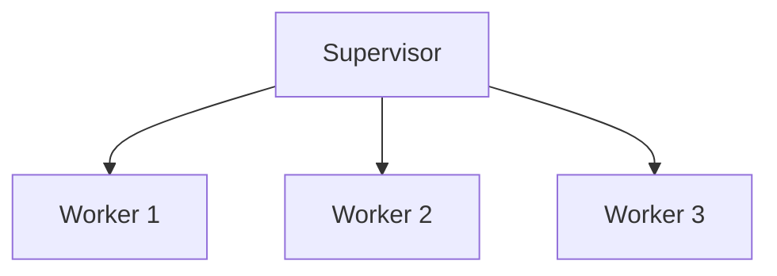

## 16.13 Fault Tolerance and Resilience

In the world of microservices, building systems that can withstand failures and continue to operate smoothly is crucial. Erlang, with its robust concurrency model and fault-tolerant design principles, provides a powerful platform for developing resilient microservices. In this section, we will explore how to leverage Erlang's capabilities to design services that handle failures gracefully, using supervisors, process monitoring, retry mechanisms, and more.

### Designing Services to Handle Failures Gracefully

Fault tolerance is the ability of a system to continue operating properly in the event of a failure of some of its components. In Erlang, this is achieved through a combination of design principles and language features that promote resilience.

#### The "Let It Crash" Philosophy

Erlang's "let it crash" philosophy encourages developers to design systems that can recover from failures automatically. Instead of writing defensive code to handle every possible error, Erlang developers focus on creating robust supervision trees that can restart failed processes.

```erlang
-module(my_service).
-behaviour(gen_server).

%% API
-export([start_link/0, stop/0]).

%% gen_server callbacks
-export([init/1, handle_call/3, handle_cast/2, handle_info/2, terminate/2, code_change/3]).

start_link() ->
    gen_server:start_link({local, ?MODULE}, ?MODULE, [], []).

stop() ->
    gen_server:call(?MODULE, stop).

init([]) ->
    {ok, #state{}}.

handle_call(stop, _From, State) ->
    {stop, normal, ok, State};
handle_call(_Request, _From, State) ->
    {reply, ok, State}.

handle_cast(_Msg, State) ->
    {noreply, State}.

handle_info(_Info, State) ->
    {noreply, State}.

terminate(_Reason, _State) ->
    ok.

code_change(_OldVsn, State, _Extra) ->
    {ok, State}.
```

In this example, we define a simple `gen_server` module that can be supervised. If this process crashes, the supervisor will automatically restart it, ensuring the service remains available.

### Supervisors and Process Monitoring

Supervisors are a cornerstone of Erlang's fault-tolerant design. They monitor worker processes and apply a predefined strategy to handle failures. This might involve restarting a single process, a group of processes, or even escalating the failure to a higher-level supervisor.

#### Supervisor Strategies

Erlang provides several strategies for supervising processes:

- **One for One**: If a child process terminates, only that process is restarted.
- **One for All**: If a child process terminates, all other child processes are terminated and then all are restarted.
- **Rest for One**: If a child process terminates, the terminated process and any process started after it are terminated and restarted.

```erlang
-module(my_supervisor).
-behaviour(supervisor).

-export([start_link/0]).
-export([init/1]).

start_link() ->
    supervisor:start_link({local, ?MODULE}, ?MODULE, []).

init([]) ->
    {ok, {{one_for_one, 5, 10},
          [{my_service, {my_service, start_link, []},
            permanent, brutal_kill, worker, [my_service]}]}}.
```

In this supervisor example, we use the `one_for_one` strategy, which restarts only the failed child process. This strategy is useful when processes are independent and do not affect each other.

### Retry Mechanisms and Fallbacks

In addition to supervisors, implementing retry mechanisms and fallbacks can enhance the resilience of your services. These techniques ensure that transient errors do not cause permanent failures.

#### Implementing Retries

Retries can be implemented using a simple loop or by leveraging existing libraries that provide retry logic. The key is to balance between retry attempts and the delay between them to avoid overwhelming the system.

```erlang
retry_operation(Fun, Attempts) when Attempts > 0 ->
    case catch Fun() of
        {ok, Result} ->
            {ok, Result};
        _Error ->
            timer:sleep(1000),
            retry_operation(Fun, Attempts - 1)
    end;
retry_operation(_Fun, 0) ->
    {error, max_attempts_reached}.
```

This function attempts to execute a given function `Fun` a specified number of times (`Attempts`). If the function fails, it waits for a second before retrying.

#### Fallback Strategies

Fallbacks provide alternative actions when a primary operation fails. This might involve using a cached response, switching to a backup service, or degrading functionality gracefully.

### Isolation and Containment of Faults

Isolation is a critical aspect of fault tolerance. By isolating processes, we ensure that a failure in one part of the system does not cascade and affect other components.

#### Process Isolation

Erlang's lightweight processes are isolated from each other, meaning that a crash in one process does not directly affect others. This isolation is a key factor in Erlang's ability to handle failures gracefully.

#### Containment Strategies

Containment involves designing systems to limit the impact of failures. This might include using separate nodes for critical services, implementing circuit breakers to prevent repeated failures, and using bulkheads to isolate different parts of the system.

### Proactive Planning for Failure Scenarios

Proactive planning involves anticipating potential failures and designing systems to handle them gracefully. This includes:

- **Redundancy**: Deploying multiple instances of services to ensure availability.
- **Load Balancing**: Distributing requests across multiple instances to prevent overload.
- **Monitoring and Alerts**: Setting up monitoring to detect failures and alert operators.
- **Chaos Engineering**: Intentionally introducing failures to test the system's resilience.

### Visualizing Fault Tolerance in Erlang

To better understand how these concepts fit together, let's visualize a simple supervision tree using Mermaid.js:



In this diagram, the supervisor oversees three worker processes. If any worker fails, the supervisor can restart it according to the chosen strategy.

### Conclusion

Building fault-tolerant and resilient microservices in Erlang involves leveraging its unique features, such as supervisors, process isolation, and the "let it crash" philosophy. By designing systems that anticipate and gracefully handle failures, we can create robust applications that continue to operate smoothly even in the face of adversity.

Remember, this is just the beginning. As you progress, you'll build more complex and resilient systems. Keep experimenting, stay curious, and enjoy the journey!

## Quiz: Fault Tolerance and Resilience



### What is the "let it crash" philosophy in Erlang?

- [x] Encouraging systems to recover from failures automatically
- [ ] Writing defensive code to handle every possible error
- [ ] Avoiding the use of supervisors
- [ ] Using only synchronous messaging

> **Explanation:** The "let it crash" philosophy encourages designing systems that can recover from failures automatically, rather than writing defensive code for every error.

### Which supervisor strategy restarts only the failed child process?

- [x] One for One
- [ ] One for All
- [ ] Rest for One
- [ ] All for One

> **Explanation:** The "One for One" strategy restarts only the failed child process, making it suitable for independent processes.

### What is a key benefit of process isolation in Erlang?

- [x] A crash in one process does not affect others
- [ ] Processes can share state easily
- [ ] It reduces memory usage
- [ ] It simplifies debugging

> **Explanation:** Process isolation ensures that a crash in one process does not directly affect others, enhancing fault tolerance.

### What is a fallback strategy?

- [x] An alternative action when a primary operation fails
- [ ] A method to increase retry attempts
- [ ] A way to reduce system load
- [ ] A technique to improve performance

> **Explanation:** A fallback strategy provides an alternative action when a primary operation fails, such as using a cached response or switching to a backup service.

### What is the purpose of chaos engineering?

- [x] Intentionally introducing failures to test system resilience
- [ ] Reducing system complexity
- [ ] Improving code readability
- [ ] Enhancing user experience

> **Explanation:** Chaos engineering involves intentionally introducing failures to test the system's resilience and improve its fault tolerance.

### How can retries be implemented in Erlang?

- [x] Using a loop with a delay between attempts
- [ ] By increasing the number of processes
- [ ] Through synchronous messaging
- [ ] By reducing the number of supervisors

> **Explanation:** Retries can be implemented using a loop with a delay between attempts to balance retry attempts and system load.

### What is the role of a supervisor in Erlang?

- [x] Monitoring and restarting child processes
- [ ] Executing business logic
- [ ] Handling user requests
- [ ] Managing database connections

> **Explanation:** A supervisor monitors and restarts child processes according to a predefined strategy, ensuring system resilience.

### What is a containment strategy?

- [x] Limiting the impact of failures
- [ ] Increasing system complexity
- [ ] Reducing process isolation
- [ ] Enhancing code readability

> **Explanation:** A containment strategy involves designing systems to limit the impact of failures, such as using circuit breakers and bulkheads.

### What is the benefit of using multiple instances of services?

- [x] Ensuring availability through redundancy
- [ ] Reducing system complexity
- [ ] Simplifying code maintenance
- [ ] Improving user interface design

> **Explanation:** Deploying multiple instances of services ensures availability through redundancy, enhancing fault tolerance.

### True or False: Erlang's lightweight processes are isolated from each other.

- [x] True
- [ ] False

> **Explanation:** True. Erlang's lightweight processes are isolated from each other, which is a key factor in its fault-tolerant design.


