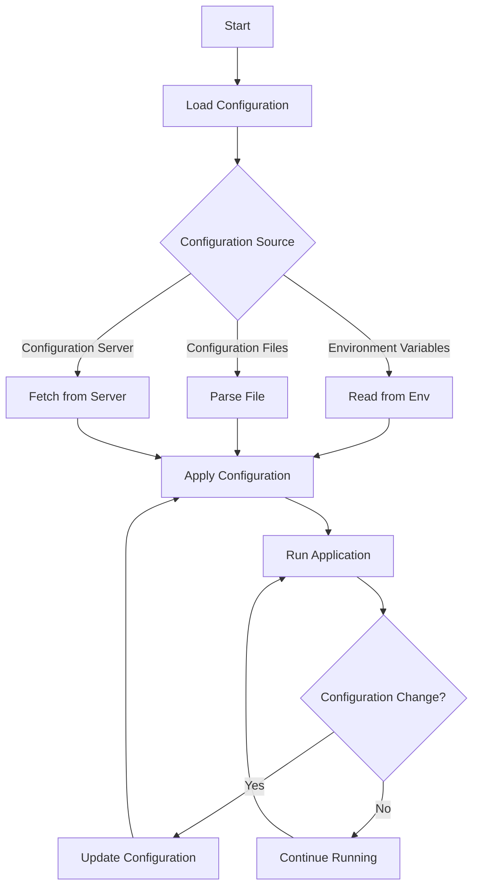

## 16.14 Configuration Management

In the realm of microservices architecture, configuration management plays a pivotal role in ensuring that services remain flexible, consistent, and secure across different environments. This section delves into the strategies, tools, and best practices for managing configuration data in Erlang-based microservices.

### Introduction to Configuration Management

Configuration management involves handling the settings and parameters that dictate how software operates in different environments. In microservices, where services are often deployed across various environments (development, testing, production), managing configurations becomes crucial. Proper configuration management ensures that services can adapt to different environments without code changes, enhancing flexibility and reducing deployment risks.

### Strategies for Externalizing Configuration

Externalizing configuration refers to the practice of separating configuration data from the application code. This approach allows for more flexible and dynamic management of configurations, enabling changes without redeploying the application.

#### Environment Variables

One of the simplest and most effective ways to externalize configuration is through environment variables. Environment variables provide a straightforward mechanism to pass configuration data to applications at runtime.

```erlang
% Example of accessing environment variables in Erlang
get_env_variable(VarName) ->
    case os:getenv(VarName) of
        false -> {error, "Variable not found"};
        Value -> {ok, Value}
    end.
```

**Key Points:**
- Use environment variables for sensitive data like API keys and database credentials.
- Ensure environment variables are documented and version-controlled.

#### Configuration Files

Configuration files, such as JSON, YAML, or INI files, offer another method for managing configurations. They provide a structured way to define settings and can be easily version-controlled.

```erlang
% Example of reading a JSON configuration file in Erlang
read_config(File) ->
    {ok, Binary} = file:read_file(File),
    {ok, Config} = jsx:decode(Binary),
    Config.
```

**Best Practices:**
- Keep configuration files simple and human-readable.
- Use a consistent format across all services.

#### Configuration Servers

For more complex setups, especially in distributed systems, configuration servers can be used. These servers centralize configuration management, allowing dynamic updates and reducing configuration drift.

**Benefits:**
- Centralized management of configurations.
- Real-time updates to configurations without redeploying services.

### Tools and Libraries for Managing Configurations in Erlang

Erlang offers several tools and libraries to facilitate configuration management. These tools help in loading, parsing, and managing configurations efficiently.

#### `config` Module

The `config` module in Erlang provides a simple way to manage application configurations. It allows loading configurations from files and accessing them at runtime.

```erlang
% Example of using the config module
start() ->
    application:load(my_app),
    application:start(my_app),
    ConfigValue = application:get_env(my_app, some_key),
    io:format("Config Value: ~p~n", [ConfigValue]).
```

#### `rebar3` Configuration

`rebar3` is a popular build tool for Erlang that also supports configuration management. It allows defining configurations in `rebar.config` and `sys.config` files.

```erlang
% Example of a sys.config file
[
  {my_app, [
    {some_key, "some_value"},
    {another_key, 42}
  ]}
].
```

#### `cuter` Library

The `cuter` library provides a more dynamic approach to configuration management, allowing for runtime configuration updates and validation.

**Features:**
- Dynamic configuration updates.
- Validation of configuration values.
- Support for multiple configuration sources.

### Dynamic Configuration Updates

Dynamic configuration updates allow applications to adapt to changes in configuration without requiring a restart. This capability is crucial for maintaining uptime and flexibility in microservices.

#### Implementing Dynamic Updates

To implement dynamic updates, services can periodically check for configuration changes or subscribe to configuration updates from a central server.

```erlang
% Example of dynamic configuration update
update_config() ->
    NewConfig = fetch_config_from_server(),
    application:set_env(my_app, some_key, NewConfig).
```

**Considerations:**
- Ensure that updates do not disrupt ongoing processes.
- Validate new configurations before applying them.

### Securing Sensitive Configuration Data

Security is paramount when managing configuration data, especially when it involves sensitive information like credentials and API keys.

#### Best Practices for Security

- **Encryption**: Encrypt sensitive data both at rest and in transit.
- **Access Control**: Restrict access to configuration data to authorized personnel and services only.
- **Audit Logs**: Maintain logs of configuration changes for auditing purposes.

#### Using Vaults and Secret Management Tools

Tools like HashiCorp Vault provide robust solutions for managing secrets and sensitive configuration data. They offer features like dynamic secrets, access policies, and audit logging.

**Example Workflow:**
1. Store sensitive data in the vault.
2. Retrieve secrets at runtime using secure APIs.
3. Rotate secrets regularly to minimize exposure.

### Importance of Version Control and Documentation

Version control and documentation are critical components of effective configuration management. They ensure that configurations are traceable, reproducible, and understandable.

#### Version Control

- Use version control systems like Git to track changes in configuration files.
- Tag configurations with release versions to maintain consistency across deployments.

#### Documentation

- Document configuration parameters, their purpose, and default values.
- Provide clear instructions for updating configurations and handling common issues.

### Conclusion

Configuration management is a cornerstone of successful microservices architecture. By externalizing configurations, leveraging the right tools, and adhering to best practices, we can ensure that our Erlang-based microservices remain flexible, consistent, and secure across all environments. Remember, effective configuration management is not just about tools and techniques; it's about fostering a culture of discipline, documentation, and continuous improvement.

### Try It Yourself

Experiment with the code examples provided in this section. Try modifying the configuration values and observe how the application behavior changes. Consider setting up a simple configuration server and implementing dynamic updates in your Erlang application.

### Visualizing Configuration Management



**Diagram Description:** This flowchart illustrates the process of loading and applying configurations in an Erlang application, with options for environment variables, configuration files, and configuration servers. It also shows the cycle of checking for configuration changes and updating configurations dynamically.

### Key Takeaways

- Externalize configurations to enhance flexibility and reduce deployment risks.
- Use environment variables, configuration files, and servers for managing configurations.
- Secure sensitive configuration data with encryption and access control.
- Document and version-control configurations for traceability and consistency.

## Quiz: Configuration Management



### What is the primary benefit of externalizing configuration in microservices?

- [x] Flexibility and adaptability across environments
- [ ] Increased code complexity
- [ ] Faster execution time
- [ ] Reduced memory usage

> **Explanation:** Externalizing configuration allows services to adapt to different environments without code changes, enhancing flexibility.

### Which tool is commonly used for managing secrets and sensitive configuration data?

- [ ] `rebar3`
- [ ] `cuter`
- [x] HashiCorp Vault
- [ ] `jsx`

> **Explanation:** HashiCorp Vault is a tool designed for managing secrets and sensitive configuration data securely.

### How can dynamic configuration updates be implemented in Erlang?

- [x] By periodically checking for changes or subscribing to updates
- [ ] By hardcoding values in the application
- [ ] By recompiling the application
- [ ] By using only environment variables

> **Explanation:** Dynamic updates can be implemented by checking for changes or subscribing to updates from a configuration server.

### What is a key practice for securing sensitive configuration data?

- [ ] Storing it in plain text files
- [x] Encrypting it both at rest and in transit
- [ ] Sharing it with all team members
- [ ] Ignoring access control

> **Explanation:** Encrypting sensitive data both at rest and in transit is crucial for security.

### Which of the following is a benefit of using configuration servers?

- [x] Centralized management and real-time updates
- [ ] Increased application size
- [ ] Slower deployment times
- [ ] Reduced flexibility

> **Explanation:** Configuration servers allow centralized management and real-time updates, enhancing flexibility and consistency.

### Why is version control important for configuration management?

- [x] It ensures traceability and reproducibility of configurations
- [ ] It increases deployment time
- [ ] It complicates the configuration process
- [ ] It reduces security

> **Explanation:** Version control ensures that configurations are traceable and reproducible, which is crucial for consistency.

### What should be included in configuration documentation?

- [x] Parameters, purpose, and default values
- [ ] Only the parameter names
- [ ] Code snippets
- [ ] User manuals

> **Explanation:** Documentation should include parameters, their purpose, and default values to aid understanding and maintenance.

### What is a common format for configuration files in Erlang?

- [ ] XML
- [x] JSON
- [ ] CSV
- [ ] Markdown

> **Explanation:** JSON is a common format for configuration files due to its simplicity and readability.

### What is the role of the `config` module in Erlang?

- [x] To manage application configurations
- [ ] To compile Erlang code
- [ ] To handle network requests
- [ ] To manage database connections

> **Explanation:** The `config` module is used to manage application configurations in Erlang.

### True or False: Environment variables should be used for storing sensitive data like API keys.

- [x] True
- [ ] False

> **Explanation:** Environment variables are a secure way to store sensitive data like API keys, as they can be managed outside the application code.



Remember, this is just the beginning. As you progress, you'll build more complex and interactive systems. Keep experimenting, stay curious, and enjoy the journey!
