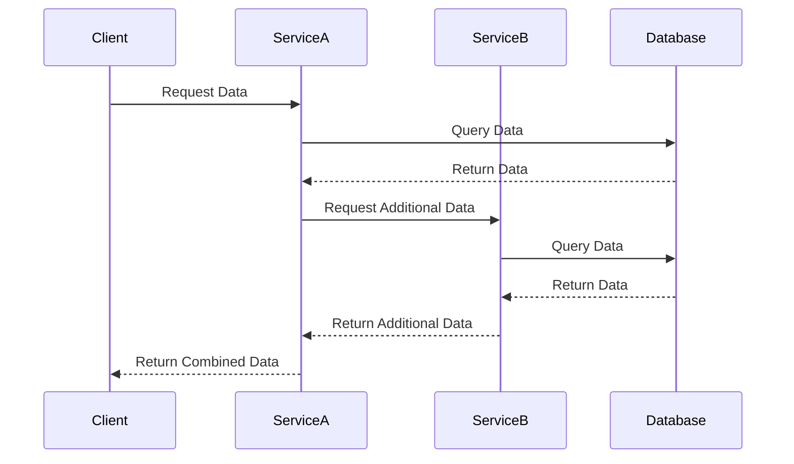

## 16.15 Data Management in Microservices

In the realm of microservices architecture, data management is a critical aspect that can significantly impact the scalability, reliability, and performance of your applications. This section delves into the intricacies of managing data within microservices, particularly in the context of Erlang, a language renowned for its concurrency and fault-tolerance capabilities.

### Understanding Data Ownership in Microservices

One of the fundamental principles of microservices architecture is that each service should own its data. This means that a microservice is responsible for its data storage, retrieval, and manipulation. This approach promotes loose coupling between services, allowing them to evolve independently without affecting others.

#### Key Benefits of Data Ownership

- **Decoupling**: By owning its data, a service can change its data model without impacting other services.
- **Scalability**: Services can be scaled independently based on their data needs.
- **Autonomy**: Services can choose the most appropriate data storage technology for their specific requirements.

### Strategies for Data Replication and Synchronization

In a distributed system, data replication and synchronization are crucial to ensure data availability and consistency across services. Let's explore some strategies to achieve this:

#### Event-Driven Data Replication

In an event-driven architecture, services publish events whenever their data changes. Other services that need this data can subscribe to these events and update their local copies accordingly.

```erlang
% Example of an event-driven data replication in Erlang

-module(event_publisher).
-export([publish_event/1]).

publish_event(Event) ->
    %% Logic to publish event to a message broker
    ok.
```

#### Data Synchronization with Change Data Capture (CDC)

Change Data Capture is a technique that captures changes in a database and propagates them to other systems. This can be implemented using tools like Debezium or custom solutions in Erlang.

```erlang
% Example of a simple CDC implementation in Erlang

-module(cdc_listener).
-export([start/0]).

start() ->
    %% Logic to listen for changes in the database and propagate them
    ok.
```

### Handling Queries Across Multiple Services

In a microservices architecture, queries that span multiple services can be challenging. Here are some strategies to handle such queries:

#### API Composition

API Composition involves aggregating data from multiple services into a single response. This can be done using a dedicated service or a gateway.

```erlang
% Example of API composition in Erlang

-module(api_composer).
-export([compose_response/1]).

compose_response(Request) ->
    %% Logic to fetch data from multiple services and compose a response
    ok.
```

#### CQRS (Command Query Responsibility Segregation)

CQRS is a pattern that separates read and write operations. It allows for optimized data models for queries, which can be particularly useful in microservices.

```erlang
% Example of CQRS pattern in Erlang

-module(cqrs_handler).
-export([handle_command/1, handle_query/1]).

handle_command(Command) ->
    %% Logic to handle write operations
    ok.

handle_query(Query) ->
    %% Logic to handle read operations
    ok.
```

### Embracing Eventual Consistency

In distributed systems, achieving strong consistency can be challenging and may not always be necessary. Eventual consistency is a model where data is allowed to be temporarily inconsistent, with the guarantee that it will become consistent over time.

#### Techniques to Manage Eventual Consistency

- **Conflict Resolution**: Implement strategies to resolve conflicts when data diverges.
- **Versioning**: Use version numbers or timestamps to track changes and resolve conflicts.
- **Compensating Transactions**: Implement compensating actions to correct inconsistencies.

```erlang
% Example of conflict resolution in Erlang

-module(conflict_resolver).
-export([resolve_conflict/2]).

resolve_conflict(Data1, Data2) ->
    %% Logic to resolve conflicts between two data versions
    ok.
```

### Designing Data Models and Access Patterns

Careful design of data models and access patterns is crucial in microservices. Here are some best practices:

#### Domain-Driven Design (DDD)

Domain-Driven Design is an approach that focuses on modeling the domain of the application. It helps in designing data models that align with business requirements.

#### Data Access Patterns

- **Repository Pattern**: Encapsulate data access logic in a repository.
- **Unit of Work Pattern**: Manage transactions and changes as a single unit of work.

```erlang
% Example of a repository pattern in Erlang

-module(data_repository).
-export([get_data/1, save_data/1]).

get_data(Id) ->
    %% Logic to retrieve data by ID
    ok.

save_data(Data) ->
    %% Logic to save data
    ok.
```

### Visualizing Data Management in Microservices

To better understand the flow of data management in microservices, let's visualize it using a sequence diagram.



**Diagram Description**: This sequence diagram illustrates a client requesting data from Service A, which in turn queries its database and requests additional data from Service B. Service B queries its database and returns the data to Service A, which then combines the data and returns it to the client.

### Key Takeaways

- Each microservice should own its data, promoting autonomy and scalability.
- Use event-driven replication and CDC for data synchronization.
- Handle cross-service queries with API composition and CQRS.
- Embrace eventual consistency and implement conflict resolution strategies.
- Design data models and access patterns carefully, using DDD and repository patterns.

### Try It Yourself

Experiment with the code examples provided. Try modifying the event-driven replication to include more complex data structures or implement a simple CQRS pattern for a different use case. Remember, the key to mastering data management in microservices is practice and experimentation.

### References and Further Reading

- [Microservices.io](https://microservices.io/patterns/data/)
- [Domain-Driven Design](https://www.domainlanguage.com/ddd/)
- [Event-Driven Architecture](https://martinfowler.com/articles/201701-event-driven.html)

## Quiz: Data Management in Microservices



### Which principle is fundamental to microservices architecture regarding data?

- [x] Each service should own its data.
- [ ] All services should share a common database.
- [ ] Data should be centralized in a single service.
- [ ] Data ownership is not important in microservices.

> **Explanation:** Each service owning its data is fundamental to microservices architecture, promoting autonomy and scalability.

### What is a common strategy for data synchronization in microservices?

- [x] Event-driven data replication
- [ ] Centralized data storage
- [ ] Manual data updates
- [ ] Synchronous data replication

> **Explanation:** Event-driven data replication is a common strategy for synchronizing data across microservices.

### How can queries that span multiple services be handled?

- [x] API Composition
- [ ] Direct database access
- [ ] Ignoring cross-service queries
- [ ] Using a single service for all queries

> **Explanation:** API Composition involves aggregating data from multiple services into a single response.

### What is eventual consistency?

- [x] A model where data is temporarily inconsistent but will become consistent over time.
- [ ] A model where data is always consistent.
- [ ] A model where data is never consistent.
- [ ] A model where consistency is not important.

> **Explanation:** Eventual consistency allows data to be temporarily inconsistent, with the guarantee of becoming consistent over time.

### Which pattern separates read and write operations in microservices?

- [x] CQRS
- [ ] Repository Pattern
- [ ] Singleton Pattern
- [ ] Observer Pattern

> **Explanation:** CQRS (Command Query Responsibility Segregation) separates read and write operations, optimizing data models for queries.

### What is a benefit of each service owning its data?

- [x] Decoupling
- [ ] Increased complexity
- [ ] Centralized control
- [ ] Reduced scalability

> **Explanation:** Data ownership promotes decoupling, allowing services to evolve independently.

### What technique captures changes in a database and propagates them to other systems?

- [x] Change Data Capture (CDC)
- [ ] Manual data entry
- [ ] Synchronous replication
- [ ] Direct database access

> **Explanation:** Change Data Capture (CDC) captures changes in a database and propagates them to other systems.

### What is the purpose of conflict resolution in eventual consistency?

- [x] To resolve conflicts when data diverges
- [ ] To prevent data changes
- [ ] To centralize data
- [ ] To ignore data inconsistencies

> **Explanation:** Conflict resolution is used to resolve conflicts when data diverges in an eventually consistent system.

### Which design approach focuses on modeling the domain of the application?

- [x] Domain-Driven Design (DDD)
- [ ] Waterfall Design
- [ ] Centralized Design
- [ ] Ad-hoc Design

> **Explanation:** Domain-Driven Design (DDD) focuses on modeling the domain of the application.

### True or False: In microservices, strong consistency is always necessary.

- [ ] True
- [x] False

> **Explanation:** Strong consistency is not always necessary in microservices; eventual consistency can be sufficient in many cases.



Remember, this is just the beginning. As you progress, you'll build more complex and interactive systems. Keep experimenting, stay curious, and enjoy the journey!
