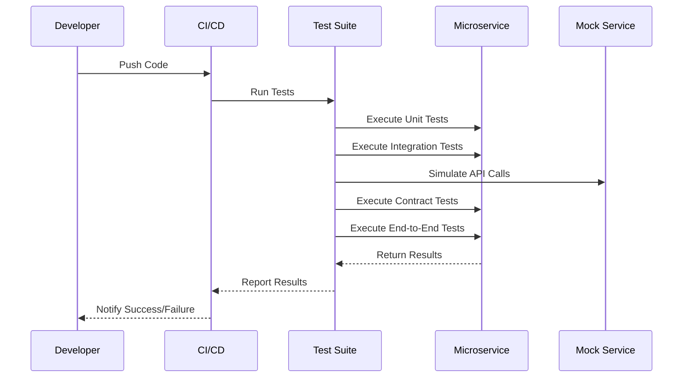

## 16.16 Testing Strategies for Microservices

In the world of microservices, testing becomes a critical component to ensure that each service functions correctly and integrates seamlessly with others. This section will guide you through various testing strategies tailored for microservices architectures in Erlang, focusing on unit, integration, contract, and end-to-end tests. We will also explore the importance of API contract testing, tools and frameworks suitable for Erlang microservices, and strategies for mocking dependencies and simulating failures. Finally, we will emphasize the role of continuous testing and integration in the development pipeline.

### Understanding Testing Levels

Testing microservices involves multiple levels, each serving a specific purpose in ensuring the reliability and functionality of the system. Let's delve into these levels:

#### Unit Testing

Unit testing focuses on testing individual components or functions in isolation. In Erlang, this means testing functions within a module to ensure they perform as expected. Unit tests are typically fast and provide immediate feedback to developers.

**Example:**

```erlang
-module(math_utils).
-export([add/2, subtract/2]).

-spec add(integer(), integer()) -> integer().
add(A, B) -> A + B.

-spec subtract(integer(), integer()) -> integer().
subtract(A, B) -> A - B.
```

```erlang
-module(math_utils_test).
-include_lib("eunit/include/eunit.hrl").

add_test() ->
    ?assertEqual(5, math_utils:add(2, 3)),
    ?assertEqual(0, math_utils:add(0, 0)).

subtract_test() ->
    ?assertEqual(1, math_utils:subtract(3, 2)),
    ?assertEqual(-1, math_utils:subtract(2, 3)).
```

**Key Points:**

- **Isolate Functions:** Test each function independently to ensure correctness.
- **Use EUnit:** Erlang's EUnit framework is ideal for writing and running unit tests.

#### Integration Testing

Integration testing verifies the interaction between different modules or services. In a microservices architecture, this involves testing the communication and data exchange between services.

**Example:**

Consider two services: `UserService` and `OrderService`. Integration tests would ensure that `OrderService` correctly retrieves user data from `UserService`.

```erlang
-module(order_service_test).
-include_lib("eunit/include/eunit.hrl").

setup() ->
    % Mock UserService response
    MockUserService = fun(UserId) -> {ok, #{id => UserId, name => "John Doe"}} end,
    {ok, MockUserService}.

order_creation_test(MockUserService) ->
    UserId = 123,
    {ok, User} = MockUserService(UserId),
    ?assertEqual("John Doe", maps:get(name, User)).
```

**Key Points:**

- **Mock Dependencies:** Use mock functions or services to simulate interactions.
- **Focus on Interactions:** Ensure that services communicate correctly and handle data as expected.

#### Contract Testing

Contract testing ensures that services adhere to predefined API contracts. This is crucial in microservices, where services often communicate over APIs.

**Example:**

Using a tool like [Pact](https://docs.pact.io/), you can define and verify contracts between services.

```json
{
  "consumer": {
    "name": "OrderService"
  },
  "provider": {
    "name": "UserService"
  },
  "interactions": [
    {
      "description": "a request for user data",
      "request": {
        "method": "GET",
        "path": "/users/123"
      },
      "response": {
        "status": 200,
        "headers": {
          "Content-Type": "application/json"
        },
        "body": {
          "id": 123,
          "name": "John Doe"
        }
      }
    }
  ]
}
```

**Key Points:**

- **Define Contracts:** Clearly specify the expected request and response formats.
- **Automate Verification:** Use tools to automatically verify that services adhere to contracts.

#### End-to-End Testing

End-to-end (E2E) testing validates the entire workflow of the application, ensuring that all components work together as expected.

**Example:**

Using a tool like [Common Test](http://erlang.org/doc/apps/common_test/users_guide.html), you can simulate user interactions and verify the application's behavior.

```erlang
-module(e2e_test).
-include_lib("common_test/include/ct.hrl").

init_per_suite(Config) ->
    % Setup environment
    {ok, Config}.

end_per_suite(_Config) ->
    % Cleanup
    ok.

test_order_creation() ->
    % Simulate user creating an order
    UserId = 123,
    OrderId = create_order(UserId),
    ?assertMatch({ok, _}, OrderId).
```

**Key Points:**

- **Simulate Real Scenarios:** Test the application as a whole, simulating real user interactions.
- **Ensure System Integrity:** Verify that all components work together seamlessly.

### Importance of API Contract Testing

In a microservices architecture, services often communicate over APIs. Ensuring that these APIs adhere to predefined contracts is crucial for maintaining system integrity and preventing integration issues.

**Benefits:**

- **Prevent Integration Issues:** Catch mismatches between services early.
- **Facilitate Collaboration:** Provide clear expectations for service interactions.
- **Enable Independent Development:** Allow teams to work independently without fear of breaking changes.

### Tools and Frameworks for Erlang Microservices

Several tools and frameworks can aid in testing Erlang microservices:

- **EUnit:** Ideal for unit testing Erlang functions and modules.
- **Common Test:** Suitable for integration and end-to-end testing.
- **Pact:** Useful for contract testing between services.
- **PropEr:** Enables property-based testing to explore edge cases.

### Mocking Dependencies and Simulating Failures

Mocking dependencies and simulating failures are essential strategies for testing microservices, allowing you to isolate components and test their behavior under various conditions.

**Mocking Dependencies:**

- **Use Mock Functions:** Replace real functions with mock implementations to simulate interactions.
- **Leverage Erlang's Dynamic Nature:** Dynamically replace modules or functions at runtime for testing purposes.

**Simulating Failures:**

- **Introduce Faults:** Simulate network failures, timeouts, or incorrect data to test resilience.
- **Use Chaos Engineering:** Apply chaos engineering principles to test the system's ability to handle unexpected failures.

### Continuous Testing and Integration

Continuous testing and integration are vital for maintaining the quality and reliability of microservices. By integrating testing into the development pipeline, you can catch issues early and ensure that changes do not break existing functionality.

**Best Practices:**

- **Automate Tests:** Use CI/CD tools to automatically run tests on code changes.
- **Integrate with Version Control:** Trigger tests on every commit or pull request.
- **Monitor Test Results:** Continuously monitor test results and address failures promptly.

### Visualizing Testing Strategies

To better understand the flow of testing strategies in microservices, let's visualize the process using a sequence diagram.



**Diagram Description:**

This sequence diagram illustrates the flow of testing strategies in a microservices architecture. The developer pushes code changes, triggering the CI/CD pipeline to run the test suite. The test suite executes various tests, including unit, integration, contract, and end-to-end tests, interacting with the microservice and mock services as needed. Results are reported back to the CI/CD system, which notifies the developer of the outcome.

### Knowledge Check

Let's reinforce what we've learned with a few questions:

- What are the key differences between unit and integration testing?
- Why is contract testing important in microservices?
- How can mocking dependencies aid in testing?
- What role does continuous testing play in microservices development?

### Embrace the Journey

Remember, testing is an ongoing process that evolves with your application. As you implement these strategies, you'll gain insights into your system's behavior and resilience. Keep experimenting, stay curious, and enjoy the journey of building robust microservices with Erlang!

### Quiz: Testing Strategies for Microservices



### What is the primary focus of unit testing in microservices?

- [x] Testing individual functions or components in isolation
- [ ] Testing the entire application workflow
- [ ] Testing interactions between services
- [ ] Testing API contracts

> **Explanation:** Unit testing focuses on testing individual functions or components in isolation to ensure they perform as expected.

### Which testing level verifies the interaction between different modules or services?

- [ ] Unit Testing
- [x] Integration Testing
- [ ] Contract Testing
- [ ] End-to-End Testing

> **Explanation:** Integration testing verifies the interaction between different modules or services, ensuring they communicate and handle data correctly.

### What is the purpose of contract testing in microservices?

- [ ] To test individual functions
- [x] To ensure services adhere to predefined API contracts
- [ ] To simulate user interactions
- [ ] To test the entire application workflow

> **Explanation:** Contract testing ensures that services adhere to predefined API contracts, preventing integration issues and facilitating collaboration.

### Which tool is suitable for unit testing in Erlang?

- [x] EUnit
- [ ] Common Test
- [ ] Pact
- [ ] PropEr

> **Explanation:** EUnit is ideal for unit testing Erlang functions and modules.

### How can mocking dependencies aid in testing microservices?

- [x] By simulating interactions with other services
- [ ] By testing the entire application workflow
- [ ] By ensuring services adhere to API contracts
- [ ] By simulating user interactions

> **Explanation:** Mocking dependencies allows you to simulate interactions with other services, isolating components for testing.

### What is the benefit of continuous testing in microservices development?

- [x] Catching issues early and ensuring changes do not break existing functionality
- [ ] Testing individual functions in isolation
- [ ] Simulating user interactions
- [ ] Ensuring services adhere to API contracts

> **Explanation:** Continuous testing helps catch issues early and ensures that changes do not break existing functionality, maintaining quality and reliability.

### Which testing level involves simulating real user interactions?

- [ ] Unit Testing
- [ ] Integration Testing
- [ ] Contract Testing
- [x] End-to-End Testing

> **Explanation:** End-to-end testing involves simulating real user interactions to validate the entire workflow of the application.

### What is the role of chaos engineering in testing microservices?

- [x] To test the system's ability to handle unexpected failures
- [ ] To test individual functions in isolation
- [ ] To ensure services adhere to API contracts
- [ ] To simulate user interactions

> **Explanation:** Chaos engineering involves introducing faults to test the system's ability to handle unexpected failures, enhancing resilience.

### Which tool is useful for contract testing between services?

- [ ] EUnit
- [ ] Common Test
- [x] Pact
- [ ] PropEr

> **Explanation:** Pact is useful for contract testing between services, ensuring they adhere to predefined API contracts.

### True or False: Continuous integration involves running tests on every commit or pull request.

- [x] True
- [ ] False

> **Explanation:** Continuous integration involves running tests on every commit or pull request to catch issues early and maintain code quality.



By following these testing strategies, you can ensure that your Erlang microservices are robust, reliable, and ready to handle the demands of modern applications. Keep exploring, testing, and refining your approach to build better systems!
