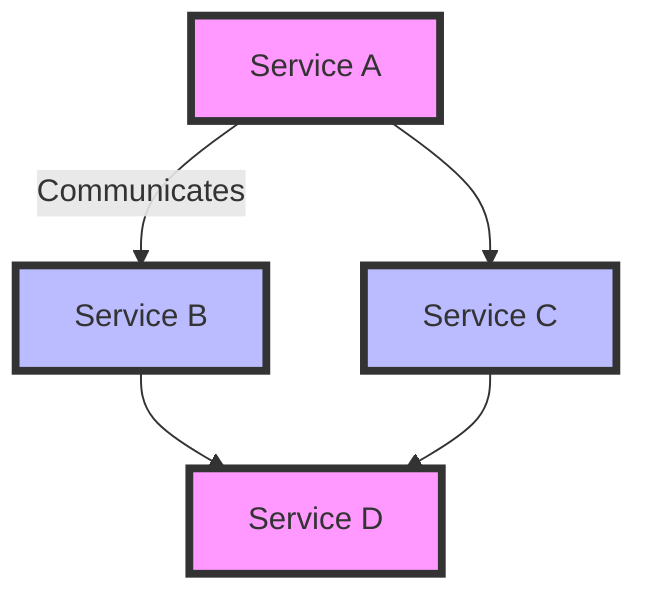
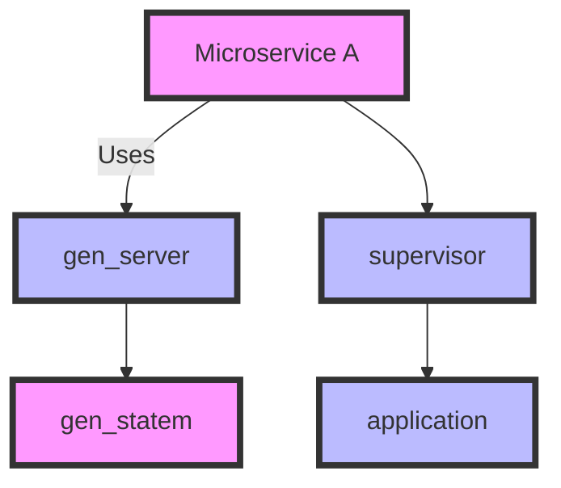

## 16.2 Designing Microservices with Erlang

Designing microservices with Erlang involves leveraging its unique features, such as concurrency, fault tolerance, and the OTP framework, to build scalable and maintainable systems. In this section, we will explore how to identify and define microservices boundaries, the importance of service decoupling and cohesion, guidelines for structuring Erlang applications into microservices, data ownership, communication patterns, and the role of OTP behaviors in structuring microservices.

### Identifying and Defining Microservices Boundaries

The first step in designing microservices is to identify and define the boundaries of each service. This involves understanding the domain and decomposing it into smaller, manageable pieces. Here are some key considerations:

1. **Domain-Driven Design (DDD):** Use DDD principles to identify bounded contexts and aggregate roots. Each bounded context can be a candidate for a microservice.

2. **Business Capabilities:** Align microservices with business capabilities. Each service should represent a distinct business function or process.

3. **Data Ownership:** Define clear data ownership for each service. A microservice should own its data and have its own database.

4. **Team Structure:** Consider the organization of your development teams. Ideally, each team should be responsible for one or more microservices.

5. **Scalability Requirements:** Identify services that require independent scaling. Microservices should be designed to scale independently based on demand.

### Importance of Service Decoupling and Cohesion

Service decoupling and cohesion are critical for the success of a microservices architecture:

- **Decoupling:** Services should be loosely coupled, meaning changes in one service should not require changes in others. This is achieved through well-defined interfaces and communication protocols.

- **Cohesion:** Each service should have high cohesion, meaning its components are closely related and work together to achieve a specific purpose.

Decoupling and cohesion can be visualized as follows:



**Diagram Description:** This diagram illustrates the communication between loosely coupled services (A, B, C, D) in a microservices architecture.

### Structuring Erlang Applications into Microservices

Structuring Erlang applications into microservices requires careful planning and design. Here are some guidelines:

1. **Use OTP Behaviors:** Leverage OTP behaviors such as `gen_server`, `gen_statem`, and `supervisor` to structure your services. These behaviors provide a robust framework for building concurrent and fault-tolerant applications.

2. **Modular Design:** Design your application as a collection of modules, each responsible for a specific functionality. This modular approach aligns well with the microservices architecture.

3. **Service Interfaces:** Define clear interfaces for each service. Use Erlang's module system to encapsulate functionality and expose only necessary functions.

4. **Configuration Management:** Use configuration files or environment variables to manage service-specific settings. This allows for easy deployment and scaling.

5. **Testing and Validation:** Implement comprehensive testing for each service. Use EUnit and Common Test for unit and integration testing.

### Data Ownership and Communication Patterns

Data ownership and communication patterns are crucial in a microservices architecture:

- **Data Ownership:** Each microservice should own its data and have its own database. This ensures data consistency and independence.

- **Communication Patterns:** Use message passing for communication between services. Erlang's lightweight processes and message-passing capabilities make it ideal for this purpose.

- **Asynchronous Communication:** Prefer asynchronous communication to improve scalability and resilience. Use message queues or event streams for decoupled communication.

- **Synchronous Communication:** When synchronous communication is necessary, use HTTP or gRPC for request-response interactions.

### Role of OTP Behaviors in Structuring Microservices

OTP behaviors play a vital role in structuring microservices in Erlang:

- **`gen_server`:** Use `gen_server` for implementing server processes that handle requests and maintain state.

- **`gen_statem`:** Use `gen_statem` for implementing state machines, which are useful for managing complex workflows and state transitions.

- **`supervisor`:** Use `supervisor` to manage process lifecycles and ensure fault tolerance. Supervisors can restart failed processes and maintain system stability.

- **`application`:** Use the `application` behavior to define the entry point and configuration for your microservice.

**Sample Code Snippet: Implementing a Simple Microservice with `gen_server`**

```erlang
-module(my_microservice).
-behaviour(gen_server).

%% API
-export([start_link/0, stop/0, get_state/0, set_state/1]).

%% gen_server callbacks
-export([init/1, handle_call/3, handle_cast/2, terminate/2, code_change/3]).

-record(state, {data = []}).

%% Start the server
start_link() ->
    gen_server:start_link({local, ?MODULE}, ?MODULE, [], []).

%% Stop the server
stop() ->
    gen_server:call(?MODULE, stop).

%% Get the current state
get_state() ->
    gen_server:call(?MODULE, get_state).

%% Set a new state
set_state(NewState) ->
    gen_server:cast(?MODULE, {set_state, NewState}).

%% gen_server callback implementations
init([]) ->
    {ok, #state{}}.

handle_call(get_state, _From, State) ->
    {reply, State#state.data, State};

handle_call(stop, _From, State) ->
    {stop, normal, ok, State};

handle_cast({set_state, NewState}, State) ->
    {noreply, State#state{data = NewState}}.

terminate(_Reason, _State) ->
    ok.

code_change(_OldVsn, State, _Extra) ->
    {ok, State}.
```

**Explanation:** This code defines a simple microservice using the `gen_server` behavior. The service maintains a state and provides functions to start, stop, get, and set the state.

### Try It Yourself

Experiment with the code example by modifying the state management logic. Try adding new functions or changing the data structure used for the state. This will help you understand how `gen_server` works and how you can use it to build microservices.

### Visualizing Microservices Architecture with OTP

Let's visualize a typical microservices architecture using OTP behaviors:



**Diagram Description:** This diagram illustrates the use of OTP behaviors (`gen_server`, `supervisor`, `gen_statem`, `application`) in a microservices architecture.

### References and Links

For further reading on microservices and Erlang, consider the following resources:

- [Domain-Driven Design](https://www.domainlanguage.com/ddd/)
- [Erlang OTP Documentation](https://erlang.org/doc/design_principles/des_princ.html)
- [Microservices Patterns](https://microservices.io/patterns/index.html)

### Knowledge Check

Before we move on, let's review some key concepts:

- What are the benefits of using OTP behaviors in microservices?
- How does data ownership affect microservices design?
- Why is service decoupling important in a microservices architecture?

### Embrace the Journey

Designing microservices with Erlang is a rewarding journey that leverages the language's strengths in concurrency and fault tolerance. Remember, this is just the beginning. As you progress, you'll build more complex and resilient systems. Keep experimenting, stay curious, and enjoy the journey!

## Quiz: Designing Microservices with Erlang



### What is the primary benefit of using Domain-Driven Design (DDD) in microservices?

- [x] Identifying bounded contexts for service boundaries
- [ ] Improving database performance
- [ ] Simplifying user interface design
- [ ] Enhancing network security

> **Explanation:** DDD helps identify bounded contexts, which are natural boundaries for microservices.

### Which OTP behavior is best suited for implementing state machines?

- [ ] gen_server
- [x] gen_statem
- [ ] supervisor
- [ ] application

> **Explanation:** `gen_statem` is specifically designed for implementing state machines.

### What is the role of a supervisor in an Erlang microservice?

- [x] Managing process lifecycles and ensuring fault tolerance
- [ ] Handling HTTP requests
- [ ] Storing data in a database
- [ ] Generating user interfaces

> **Explanation:** Supervisors manage process lifecycles and ensure system stability by restarting failed processes.

### Why is asynchronous communication preferred in microservices?

- [x] It improves scalability and resilience
- [ ] It simplifies database transactions
- [ ] It enhances user interface responsiveness
- [ ] It reduces memory usage

> **Explanation:** Asynchronous communication allows services to operate independently, improving scalability and resilience.

### What is a key characteristic of a loosely coupled service?

- [x] Changes in one service do not require changes in others
- [ ] It shares a database with other services
- [ ] It uses synchronous communication exclusively
- [ ] It is tightly integrated with the user interface

> **Explanation:** Loosely coupled services have well-defined interfaces and do not depend on changes in other services.

### Which communication pattern is ideal for decoupled communication between services?

- [x] Message passing
- [ ] Direct database access
- [ ] Shared memory
- [ ] Remote procedure calls

> **Explanation:** Message passing allows services to communicate without direct dependencies, promoting decoupling.

### What is the primary purpose of the `application` behavior in OTP?

- [x] Defining the entry point and configuration for a microservice
- [ ] Handling HTTP requests
- [ ] Managing user sessions
- [ ] Storing data in a database

> **Explanation:** The `application` behavior defines the entry point and configuration for an OTP application.

### How does data ownership affect microservices design?

- [x] Each service should own its data and have its own database
- [ ] All services should share a single database
- [ ] Data should be stored in a central repository
- [ ] Data ownership is not relevant to microservices

> **Explanation:** Each microservice should own its data to ensure independence and consistency.

### What is a benefit of using `gen_server` in microservices?

- [x] It provides a framework for handling requests and maintaining state
- [ ] It simplifies user interface design
- [ ] It enhances network security
- [ ] It improves database performance

> **Explanation:** `gen_server` provides a robust framework for implementing server processes in Erlang.

### True or False: Erlang's message-passing capabilities make it ideal for microservices communication.

- [x] True
- [ ] False

> **Explanation:** Erlang's lightweight processes and message-passing capabilities are well-suited for microservices communication.


