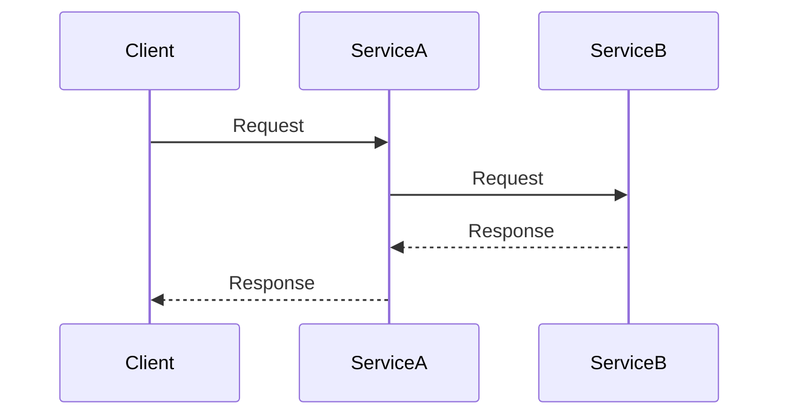
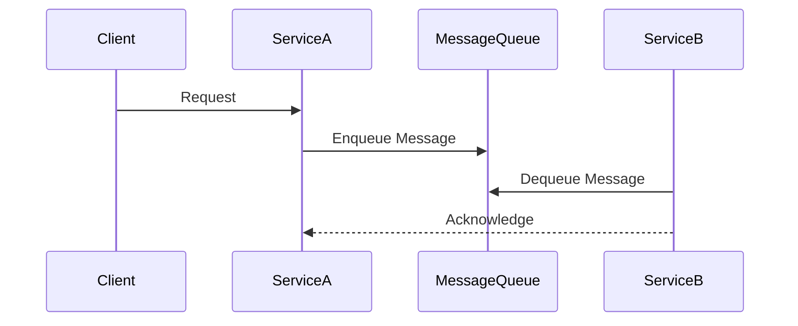

## 16.3 Communication Between Services

In the realm of microservices architecture, communication between services is a critical aspect that determines the overall performance, reliability, and scalability of the system. Erlang, with its robust concurrency model and lightweight processes, provides a solid foundation for building microservices. In this section, we will explore various methods of communication between microservices in Erlang, including synchronous and asynchronous messaging, and discuss best practices for achieving reliable and efficient inter-service communication.

### Understanding Communication Protocols

Microservices can communicate using different protocols, each with its own advantages and trade-offs. The choice of protocol often depends on the specific requirements of the application, such as latency, throughput, and reliability. Let's delve into some of the most commonly used communication protocols in microservices architecture.

#### HTTP/REST

HTTP/REST is a widely used protocol for communication between microservices. It is based on the HTTP protocol and uses standard HTTP methods such as GET, POST, PUT, and DELETE to perform CRUD operations. RESTful services are stateless and can be easily consumed by a wide range of clients.

**Advantages:**
- **Simplicity:** REST is easy to implement and understand, making it a popular choice for web services.
- **Interoperability:** RESTful services can be consumed by any client that can make HTTP requests, including web browsers and mobile devices.
- **Scalability:** REST services can be scaled horizontally by adding more instances behind a load balancer.

**Disadvantages:**
- **Latency:** HTTP/REST can introduce latency due to the overhead of HTTP headers and the stateless nature of the protocol.
- **Limited support for streaming:** REST is not well-suited for real-time data streaming.

**Example using Cowboy and Hackney:**

```erlang
% Cowboy HTTP server setup
{ok, _} = cowboy:start_http(my_http_listener, 100,
    [{port, 8080}],
    [{env, [{dispatch, Dispatch}]}]).

Dispatch = cowboy_router:compile([
    {'_', [
        {"/api/hello", hello_handler, []}
    ]}
]).

% Handler module
-module(hello_handler).
-export([init/2, handle/2, terminate/3]).

init(Req, State) ->
    {cowboy_rest, Req, State}.

handle(Req, State) ->
    {ok, Req2} = cowboy_req:reply(200, #{<<"content-type">> => <<"text/plain">>}, <<"Hello, World!">>, Req),
    {ok, Req2, State}.

terminate(_Reason, _Req, _State) ->
    ok.

% Hackney HTTP client request
{ok, StatusCode, _Headers, ClientRef} = hackney:get("http://localhost:8080/api/hello"),
{ok, Body} = hackney:body(ClientRef),
io:format("Response: ~s~n", [Body]).
```

#### gRPC

gRPC is a modern, high-performance RPC framework that uses HTTP/2 for transport. It supports multiple programming languages and provides features such as bi-directional streaming and built-in authentication.

**Advantages:**
- **Performance:** gRPC is designed for high performance and low latency, making it suitable for real-time applications.
- **Streaming:** gRPC supports bi-directional streaming, allowing for efficient data transfer.
- **Strongly typed contracts:** gRPC uses Protocol Buffers for defining service contracts, ensuring type safety.

**Disadvantages:**
- **Complexity:** gRPC can be more complex to set up and use compared to REST.
- **Limited browser support:** gRPC is not natively supported by web browsers, requiring additional tools for integration.

**Example using Erlang gRPC library:**

```erlang
% Define a gRPC service using Protocol Buffers
syntax = "proto3";

service Greeter {
  rpc SayHello (HelloRequest) returns (HelloReply) {}
}

message HelloRequest {
  string name = 1;
}

message HelloReply {
  string message = 1;
}

% Erlang server implementation
-module(greeter_server).
-behaviour(grpc_server).

-export([init/1, handle_request/2, terminate/2]).

init(_Args) ->
    {ok, #{}}.

handle_request({say_hello, Req}, State) ->
    Name = maps:get(name, Req),
    Reply = #{message => <<"Hello, ">> ++ Name},
    {reply, Reply, State}.

terminate(_Reason, _State) ->
    ok.

% Start the gRPC server
grpc:start_server(greeter_server, 50051).
```

#### Message Queues

Message queues provide asynchronous communication between services, allowing them to decouple and scale independently. They are particularly useful for handling tasks that can be processed asynchronously, such as sending emails or processing background jobs.

**Advantages:**
- **Decoupling:** Services can operate independently, improving fault tolerance and scalability.
- **Load leveling:** Message queues can buffer requests, preventing overload during peak times.
- **Reliability:** Messages can be persisted and retried in case of failures.

**Disadvantages:**
- **Complexity:** Managing message queues can add complexity to the system.
- **Latency:** Asynchronous communication can introduce latency compared to direct calls.

**Example using RabbitMQ and Kafka:**

```erlang
% RabbitMQ producer
{ok, Connection} = amqp_connection:start(#amqp_params_network{host="localhost"}),
{ok, Channel} = amqp_connection:open_channel(Connection),
amqp_channel:call(Channel, #'exchange.declare'{exchange = <<"my_exchange">>, type = <<"direct">>}),
amqp_channel:call(Channel, #'queue.declare'{queue = <<"my_queue">>}),
amqp_channel:call(Channel, #'queue.bind'{queue = <<"my_queue">>, exchange = <<"my_exchange">>, routing_key = <<"my_key">>}),
amqp_channel:call(Channel, #'basic.publish'{exchange = <<"my_exchange">>, routing_key = <<"my_key">>, mandatory = false, immediate = false}, <<"Hello, RabbitMQ!">>).

% Kafka producer using brod
{ok, _} = brod:start_producer("localhost:9092", <<"my_topic">>, []),
brod:produce_sync("localhost:9092", <<"my_topic">>, 0, <<"key">>, <<"Hello, Kafka!">>).
```

### Synchronous vs. Asynchronous Communication

When designing microservices, one of the key decisions is choosing between synchronous and asynchronous communication. Each approach has its own trade-offs and is suitable for different use cases.

#### Synchronous Communication

In synchronous communication, the client waits for a response from the server before proceeding. This approach is straightforward and easy to implement, making it suitable for scenarios where immediate feedback is required.

**Pros:**
- **Simplicity:** Synchronous communication is easy to understand and implement.
- **Immediate feedback:** The client receives an immediate response, making it suitable for interactive applications.

**Cons:**
- **Blocking:** The client is blocked while waiting for a response, which can lead to performance issues.
- **Scalability:** Synchronous communication can become a bottleneck in high-load scenarios.

#### Asynchronous Communication

In asynchronous communication, the client does not wait for a response and can continue processing other tasks. This approach is ideal for scenarios where tasks can be processed in the background or when the response time is not critical.

**Pros:**
- **Non-blocking:** The client can continue processing other tasks, improving performance and scalability.
- **Decoupling:** Services can operate independently, enhancing fault tolerance.

**Cons:**
- **Complexity:** Asynchronous communication can be more complex to implement and manage.
- **Delayed feedback:** The client does not receive immediate feedback, which may not be suitable for interactive applications.

### Best Practices for Inter-Service Communication

To ensure reliable and efficient communication between microservices, consider the following best practices:

1. **Use Circuit Breakers:** Implement circuit breakers to prevent cascading failures and improve system resilience.

2. **Implement Retries and Timeouts:** Use retries and timeouts to handle transient failures and ensure that services do not hang indefinitely.

3. **Use Idempotent Operations:** Design operations to be idempotent, allowing them to be safely retried without unintended side effects.

4. **Monitor and Log Communication:** Implement monitoring and logging to track communication between services and identify issues early.

5. **Secure Communication:** Use encryption and authentication to secure communication between services and protect sensitive data.

6. **Design for Scalability:** Ensure that communication protocols and patterns can scale with the system as it grows.

7. **Use Consistent Data Formats:** Use consistent data formats, such as JSON or Protocol Buffers, to ensure compatibility between services.

### Visualizing Communication Patterns

To better understand the communication patterns between microservices, let's visualize them using Mermaid.js diagrams.

#### Synchronous Communication Flow



**Description:** In synchronous communication, the client sends a request to Service A, which then communicates with Service B. The client waits for the response to complete the interaction.

#### Asynchronous Communication Flow



**Description:** In asynchronous communication, the client sends a request to Service A, which enqueues a message in the message queue. Service B processes the message independently, allowing the client to continue without waiting for a response.

### Try It Yourself

To deepen your understanding of inter-service communication in Erlang, try modifying the code examples provided. Experiment with different protocols, such as switching from HTTP/REST to gRPC, or implementing additional features like retries and circuit breakers. Consider the trade-offs between synchronous and asynchronous communication and how they impact the overall system design.

### Knowledge Check

- What are the main differences between HTTP/REST and gRPC?
- How does asynchronous communication improve scalability?
- What are the benefits of using message queues in microservices architecture?
- Why is it important to implement retries and timeouts in inter-service communication?
- How can you secure communication between microservices?

### Embrace the Journey

Remember, mastering inter-service communication in Erlang is a journey. As you explore different protocols and patterns, you'll gain valuable insights into building robust and scalable microservices. Keep experimenting, stay curious, and enjoy the process of learning and discovery!

## Quiz: Communication Between Services



### Which protocol is known for its simplicity and wide interoperability in microservices communication?

- [x] HTTP/REST
- [ ] gRPC
- [ ] Message Queues
- [ ] WebSockets

> **Explanation:** HTTP/REST is known for its simplicity and wide interoperability, making it a popular choice for web services.

### What is a key advantage of using gRPC over HTTP/REST?

- [ ] Simplicity
- [x] Performance
- [ ] Browser support
- [ ] Statelessness

> **Explanation:** gRPC is designed for high performance and low latency, making it suitable for real-time applications.

### In asynchronous communication, what is a common method for decoupling services?

- [ ] Direct calls
- [ ] Synchronous requests
- [x] Message queues
- [ ] WebSockets

> **Explanation:** Message queues provide asynchronous communication, allowing services to decouple and scale independently.

### What is a disadvantage of synchronous communication?

- [ ] Non-blocking
- [ ] Decoupling
- [x] Blocking
- [ ] Complexity

> **Explanation:** In synchronous communication, the client is blocked while waiting for a response, which can lead to performance issues.

### Which Erlang library is used for HTTP client requests?

- [ ] Cowboy
- [x] Hackney
- [ ] RabbitMQ
- [ ] Brod

> **Explanation:** Hackney is an Erlang library used for making HTTP client requests.

### What is a benefit of using idempotent operations in inter-service communication?

- [x] Safe retries
- [ ] Increased complexity
- [ ] Immediate feedback
- [ ] Statelessness

> **Explanation:** Idempotent operations can be safely retried without unintended side effects, improving reliability.

### Which protocol supports bi-directional streaming?

- [ ] HTTP/REST
- [x] gRPC
- [ ] Message Queues
- [ ] WebSockets

> **Explanation:** gRPC supports bi-directional streaming, allowing for efficient data transfer.

### What is a common tool for monitoring communication between microservices?

- [ ] Circuit breakers
- [ ] Retries
- [x] Logging
- [ ] Load balancers

> **Explanation:** Logging is a common tool for monitoring communication between services and identifying issues.

### What is a trade-off of using message queues for communication?

- [ ] Simplicity
- [ ] Immediate feedback
- [x] Complexity
- [ ] Statelessness

> **Explanation:** Managing message queues can add complexity to the system, despite their benefits.

### True or False: Asynchronous communication always provides immediate feedback to the client.

- [ ] True
- [x] False

> **Explanation:** In asynchronous communication, the client does not receive immediate feedback, as tasks are processed independently.


