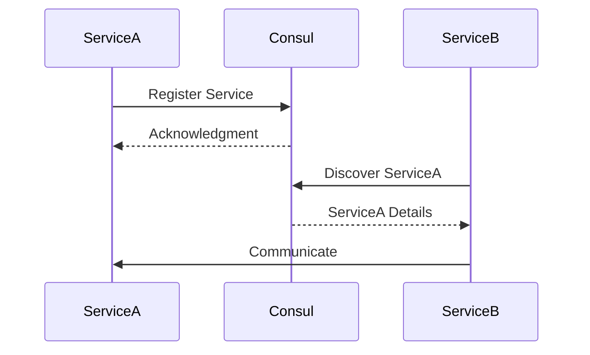

## 16.4 Service Discovery and Registration

In the realm of microservices architecture, service discovery and registration are pivotal components that ensure seamless communication between services. As microservices are inherently dynamic, with services frequently being added, removed, or updated, a robust mechanism for service discovery is essential. This section delves into the importance of service discovery, explores Erlang's built-in mechanisms, and discusses integration with external systems like Consul, etcd, and Eureka. We will also provide practical examples and discuss strategies for load balancing and service health checks.

### Importance of Service Discovery

Service discovery is crucial in dynamic environments where services are constantly changing. It allows services to find and communicate with each other without hardcoding network locations. This flexibility is vital for scaling, fault tolerance, and maintaining a loosely coupled architecture.

#### Key Benefits of Service Discovery:

- **Dynamic Scaling**: Automatically discover new instances as they are added or removed.
- **Fault Tolerance**: Redirect traffic away from failed instances.
- **Decoupling**: Services can evolve independently without needing to update hardcoded configurations.
- **Load Balancing**: Distribute requests evenly across available instances.

### Tools and Protocols for Service Registration

Service registration involves maintaining a registry of available services and their instances. This registry is used by service discovery mechanisms to locate services. Let's explore Erlang's built-in mechanisms and how to integrate with external systems.

#### Erlang's Built-in Mechanisms

Erlang provides several built-in tools for service registration and discovery, leveraging its distributed nature and robust process management capabilities.

##### Global Name Registration

Erlang's `global` module allows for global name registration across nodes in a distributed system. This can be used for simple service discovery.

```erlang
% Register a process globally
global:register_name(my_service, self()).

% Lookup a globally registered process
{ok, Pid} = global:whereis_name(my_service).
```

##### Distributed Erlang

Erlang's distributed capabilities allow nodes to communicate and share information about running processes. This can be used to implement custom service discovery mechanisms.

```erlang
% Connect nodes
net_adm:ping('node1@host').
net_adm:ping('node2@host').

% Send a message to a process on a remote node
{node1, Pid} ! {message, "Hello from node2"}.
```

#### Integrating with External Systems

For more complex service discovery needs, integrating with external systems like Consul, etcd, or Eureka can provide additional features such as health checks, load balancing, and more.

##### Consul

Consul is a popular tool for service discovery and configuration. It provides a simple HTTP API for registering and discovering services.

```erlang
% Register a service with Consul
httpc:request(post, {"http://localhost:8500/v1/agent/service/register", [], "application/json", <<"{\"Name\": \"my_service\", \"Address\": \"127.0.0.1\", \"Port\": 8080}">>}, [], []).

% Discover a service
{ok, {{_, 200, _}, _, Body}} = httpc:request(get, {"http://localhost:8500/v1/catalog/service/my_service", []}, [], []).
```

##### etcd

etcd is a distributed key-value store that can be used for service discovery. It provides a RESTful API for managing service registrations.

```erlang
% Register a service with etcd
httpc:request(put, {"http://localhost:2379/v2/keys/services/my_service", [], "application/x-www-form-urlencoded", "value=127.0.0.1:8080"}, [], []).

% Discover a service
{ok, {{_, 200, _}, _, Body}} = httpc:request(get, {"http://localhost:2379/v2/keys/services/my_service", []}, [], []).
```

##### Eureka

Eureka is a service registry developed by Netflix. It is widely used in Java-based microservices but can be integrated with Erlang using HTTP requests.

```erlang
% Register a service with Eureka
httpc:request(post, {"http://localhost:8761/eureka/apps/MY_SERVICE", [], "application/json", <<"{\"instance\": {\"hostName\": \"localhost\", \"app\": \"MY_SERVICE\", \"ipAddr\": \"127.0.0.1\", \"port\": {\"$\": 8080, \"@enabled\": \"true\"}}}">>}, [], []).

% Discover a service
{ok, {{_, 200, _}, _, Body}} = httpc:request(get, {"http://localhost:8761/eureka/apps/MY_SERVICE", []}, [], []).
```

### Implementing Service Discovery in Erlang Applications

Let's explore how to implement service discovery in Erlang applications using a combination of built-in mechanisms and external tools.

#### Example: Simple Service Discovery with Global Names

In this example, we'll use Erlang's `global` module to register and discover services.

```erlang
-module(service_discovery).
-export([start/0, register_service/1, discover_service/1]).

start() ->
    % Start the node
    net_kernel:start([node1, shortnames]),
    % Connect to other nodes
    net_adm:ping('node2@host').

register_service(ServiceName) ->
    % Register the service globally
    global:register_name(ServiceName, self()).

discover_service(ServiceName) ->
    % Discover the service
    case global:whereis_name(ServiceName) of
        undefined -> {error, not_found};
        Pid -> {ok, Pid}
    end.
```

#### Example: Service Discovery with Consul

Here, we'll use Consul to register and discover services.

```erlang
-module(consul_service_discovery).
-export([register_service/2, discover_service/1]).

register_service(ServiceName, Port) ->
    % Register the service with Consul
    httpc:request(post, {"http://localhost:8500/v1/agent/service/register", [], "application/json", <<"{\"Name\": \"" ++ ServiceName ++ "\", \"Address\": \"127.0.0.1\", \"Port\": " ++ integer_to_list(Port) ++ "}">>}, [], []).

discover_service(ServiceName) ->
    % Discover the service
    case httpc:request(get, {"http://localhost:8500/v1/catalog/service/" ++ ServiceName, []}, [], []) of
        {ok, {{_, 200, _}, _, Body}} -> {ok, Body};
        _ -> {error, not_found}
    end.
```

### Strategies for Load Balancing and Service Health Checks

Load balancing and health checks are essential components of a robust service discovery mechanism. They ensure that requests are distributed evenly across healthy instances.

#### Load Balancing

Load balancing can be achieved using various strategies, such as round-robin, least connections, or random selection. In Erlang, you can implement custom load balancing logic or use external tools like HAProxy or Nginx.

```erlang
% Simple round-robin load balancer
-module(load_balancer).
-export([get_next_instance/1]).

get_next_instance(Instances) ->
    % Rotate the list of instances
    [First | Rest] = Instances,
    Rest ++ [First].
```

#### Service Health Checks

Health checks ensure that only healthy instances receive traffic. They can be implemented using periodic checks or by integrating with external systems like Consul or etcd.

```erlang
-module(health_check).
-export([check_service/1]).

check_service(ServiceName) ->
    % Perform a health check
    case httpc:request(get, {"http://localhost:8500/v1/health/service/" ++ ServiceName, []}, [], []) of
        {ok, {{_, 200, _}, _, Body}} -> {ok, Body};
        _ -> {error, unhealthy}
    end.
```

### Visualizing Service Discovery and Registration

To better understand the flow of service discovery and registration, let's visualize the process using a sequence diagram.



**Caption**: This diagram illustrates the interaction between services and a service registry like Consul. ServiceA registers itself, and ServiceB discovers and communicates with ServiceA.

### References and Links

- [Consul Documentation](https://www.consul.io/docs)
- [etcd Documentation](https://etcd.io/docs)
- [Eureka Documentation](https://github.com/Netflix/eureka/wiki)

### Knowledge Check

- **Question**: What are the benefits of service discovery in microservices?
- **Question**: How can Erlang's `global` module be used for service registration?
- **Question**: What are some external tools for service discovery and registration?

### Embrace the Journey

Remember, mastering service discovery and registration is a journey. As you progress, you'll build more resilient and scalable microservices. Keep experimenting, stay curious, and enjoy the journey!

## Quiz: Service Discovery and Registration



### What is the primary benefit of service discovery in microservices?

- [x] Dynamic scaling and fault tolerance
- [ ] Improved security
- [ ] Reduced development time
- [ ] Enhanced user interface

> **Explanation:** Service discovery allows for dynamic scaling and fault tolerance by enabling services to find and communicate with each other without hardcoding network locations.

### Which Erlang module can be used for global name registration?

- [x] global
- [ ] net_adm
- [ ] httpc
- [ ] kernel

> **Explanation:** The `global` module in Erlang allows for global name registration across nodes in a distributed system.

### What is a common external tool for service discovery?

- [x] Consul
- [ ] Docker
- [ ] Git
- [ ] Jenkins

> **Explanation:** Consul is a popular tool for service discovery and configuration, providing a simple HTTP API for registering and discovering services.

### How can load balancing be achieved in Erlang?

- [x] Implementing custom logic or using external tools like HAProxy
- [ ] Using the `httpc` module
- [ ] Through the `global` module
- [ ] By hardcoding IP addresses

> **Explanation:** Load balancing can be achieved by implementing custom logic in Erlang or using external tools like HAProxy or Nginx.

### What is the purpose of service health checks?

- [x] Ensure only healthy instances receive traffic
- [ ] Increase service speed
- [ ] Reduce memory usage
- [ ] Improve user interface

> **Explanation:** Service health checks ensure that only healthy instances receive traffic, contributing to fault tolerance and reliability.

### Which protocol does etcd use for service registration?

- [x] RESTful API
- [ ] SOAP
- [ ] FTP
- [ ] SMTP

> **Explanation:** etcd uses a RESTful API for managing service registrations, allowing for easy integration with various systems.

### What is the role of the `httpc` module in service discovery?

- [x] Sending HTTP requests for service registration and discovery
- [ ] Managing distributed nodes
- [ ] Handling process communication
- [ ] Performing load balancing

> **Explanation:** The `httpc` module in Erlang is used for sending HTTP requests, which can be utilized for service registration and discovery with external systems.

### Which of the following is a strategy for load balancing?

- [x] Round-robin
- [ ] FIFO
- [ ] LIFO
- [ ] Stack

> **Explanation:** Round-robin is a common strategy for load balancing, distributing requests evenly across available instances.

### What is the significance of the `net_adm` module in Erlang?

- [x] Managing node connections
- [ ] Performing HTTP requests
- [ ] Registering global names
- [ ] Handling service health checks

> **Explanation:** The `net_adm` module in Erlang is used for managing node connections, which is essential in a distributed system.

### True or False: Service discovery is only necessary in large-scale systems.

- [ ] True
- [x] False

> **Explanation:** Service discovery is beneficial in any system with dynamic services, regardless of scale, as it enables flexibility and fault tolerance.


