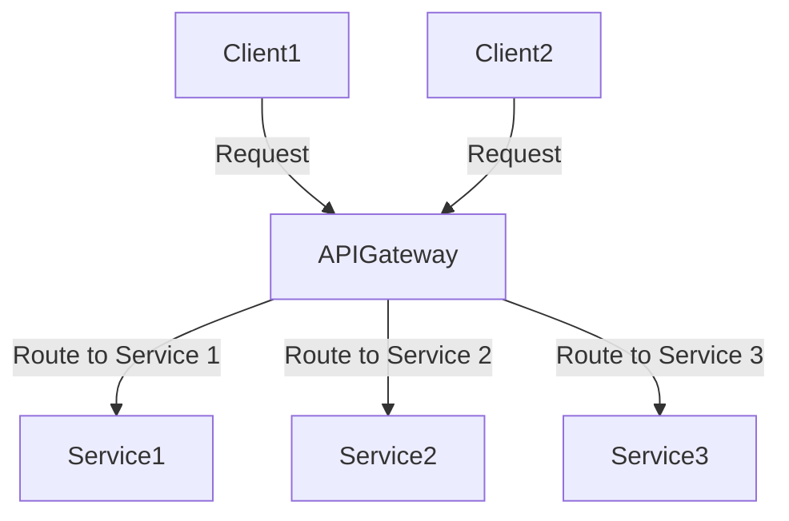

## 16.5 API Gateway Pattern

In the world of microservices, managing client access efficiently and securely is crucial. The API Gateway pattern serves as a powerful architectural solution to this challenge. In this section, we will explore the API Gateway pattern, its purpose, and how it can be effectively implemented in Erlang to manage client access to microservices.

### What is the API Gateway Pattern?

The API Gateway pattern is a design pattern that provides a single entry point for clients to interact with a system of microservices. It acts as a reverse proxy, routing requests from clients to the appropriate microservices. This pattern is essential in microservices architecture as it abstracts the complexity of the underlying services and provides a unified interface for clients.

### Purpose of the API Gateway

The primary purpose of an API Gateway is to simplify client interactions with microservices by providing a single, unified entry point. This approach offers several benefits:

- **Request Routing**: Directs client requests to the appropriate microservice based on the request path or other criteria.
- **Authentication and Authorization**: Ensures that only authorized clients can access the services.
- **Rate Limiting**: Controls the number of requests a client can make in a given time period to prevent abuse.
- **Load Balancing**: Distributes incoming requests across multiple instances of a service to ensure high availability and reliability.
- **Protocol Translation**: Converts client requests from one protocol to another, such as from HTTP to gRPC.
- **Response Aggregation**: Combines responses from multiple services into a single response to the client.

### Implementing an API Gateway in Erlang

Erlang, with its robust concurrency model and fault-tolerant design, is well-suited for building an API Gateway. Let's explore how we can implement an API Gateway using Erlang frameworks.

#### Choosing the Right Framework

Several Erlang frameworks can be used to build an API Gateway, including:

- **Cowboy**: A small, fast, and modern HTTP server for Erlang/OTP.
- **MochiWeb**: A lightweight HTTP server library for Erlang.
- **Yaws**: A high-performance web server particularly well-suited for dynamic content.

For our example, we'll use Cowboy due to its simplicity and performance.

#### Setting Up a Basic API Gateway

Let's start by setting up a basic API Gateway using Cowboy. We'll create a simple gateway that routes requests to different services based on the URL path.

```erlang
-module(api_gateway).
-behaviour(cowboy_http_handler).

-export([init/3, handle/2, terminate/3]).

init(Req, _Opts, _State) ->
    {ok, Req, #{}).

handle(Req, State) ->
    Path = cowboy_req:path(Req),
    case Path of
        "/service1" ->
            % Route to Service 1
            {ok, Resp} = httpc:request(get, {"http://localhost:8081", []}, [], []),
            {ok, Req2} = cowboy_req:reply(200, #{<<"content-type">> => <<"application/json">>}, Resp, Req),
            {ok, Req2, State};
        "/service2" ->
            % Route to Service 2
            {ok, Resp} = httpc:request(get, {"http://localhost:8082", []}, [], []),
            {ok, Req2} = cowboy_req:reply(200, #{<<"content-type">> => <<"application/json">>}, Resp, Req),
            {ok, Req2, State};
        _ ->
            % Default response for unknown paths
            {ok, Req2} = cowboy_req:reply(404, #{<<"content-type">> => <<"text/plain">>}, <<"Not Found">>, Req),
            {ok, Req2, State}
    end.

terminate(_Reason, _Req, _State) ->
    ok.
```

**Explanation:**

- **Module Definition**: We define a module `api_gateway` that implements the `cowboy_http_handler` behavior.
- **Initialization**: The `init/3` function initializes the request and state.
- **Request Handling**: The `handle/2` function routes requests based on the URL path. It uses the `httpc` module to forward requests to the appropriate service.
- **Termination**: The `terminate/3` function cleans up resources when the request is complete.

#### Enhancing the API Gateway

Now that we have a basic API Gateway, let's enhance it with additional features like authentication and rate limiting.

##### Adding Authentication

To add authentication, we can use a simple token-based approach. We'll check for a valid token in the request headers before routing the request.

```erlang
handle(Req, State) ->
    case cowboy_req:header(<<"authorization">>, Req) of
        undefined ->
            {ok, Req2} = cowboy_req:reply(401, #{<<"content-type">> => <<"text/plain">>}, <<"Unauthorized">>, Req),
            {ok, Req2, State};
        Token when is_binary(Token) ->
            % Validate the token (this is a placeholder for actual validation logic)
            case validate_token(Token) of
                true ->
                    route_request(Req, State);
                false ->
                    {ok, Req2} = cowboy_req:reply(403, #{<<"content-type">> => <<"text/plain">>}, <<"Forbidden">>, Req),
                    {ok, Req2, State}
            end
    end.

validate_token(Token) ->
    % Placeholder for token validation logic
    Token == <<"valid_token">>.
```

**Explanation:**

- **Authorization Header**: We check for the `authorization` header in the request.
- **Token Validation**: We validate the token using a placeholder function `validate_token/1`.
- **Routing**: If the token is valid, we proceed to route the request.

##### Implementing Rate Limiting

Rate limiting can be implemented using ETS (Erlang Term Storage) to track the number of requests from each client.

```erlang
init(Req, _Opts, _State) ->
    ets:new(rate_limit, [named_table, public, set]),
    {ok, Req, #{}).

handle(Req, State) ->
    ClientIP = cowboy_req:peer(Req),
    case check_rate_limit(ClientIP) of
        true ->
            % Proceed with request handling
            route_request(Req, State);
        false ->
            {ok, Req2} = cowboy_req:reply(429, #{<<"content-type">> => <<"text/plain">>}, <<"Too Many Requests">>, Req),
            {ok, Req2, State}
    end.

check_rate_limit(ClientIP) ->
    case ets:lookup(rate_limit, ClientIP) of
        [] ->
            ets:insert(rate_limit, {ClientIP, 1}),
            true;
        [{ClientIP, Count}] when Count < 100 ->
            ets:update_element(rate_limit, ClientIP, {2, Count + 1}),
            true;
        _ ->
            false
    end.
```

**Explanation:**

- **ETS Table**: We create an ETS table `rate_limit` to store the request count for each client IP.
- **Rate Check**: The `check_rate_limit/1` function checks if the client has exceeded the allowed number of requests.
- **Request Handling**: If the rate limit is not exceeded, the request is routed; otherwise, a `429 Too Many Requests` response is returned.

### Considerations for Scalability and Fault Tolerance

When implementing an API Gateway, it's important to consider scalability and fault tolerance:

- **Scalability**: Use load balancing to distribute requests across multiple instances of the API Gateway. Consider using Erlang's built-in distribution capabilities to scale horizontally.
- **Fault Tolerance**: Implement supervision trees to monitor and restart failed processes. Leverage Erlang's "Let It Crash" philosophy to handle failures gracefully.
- **Caching**: Implement caching strategies to reduce load on backend services and improve response times.
- **Logging and Monitoring**: Use tools like `observer` and `lager` for logging and monitoring the health of the API Gateway.

### Visualizing the API Gateway Architecture

To better understand the API Gateway pattern, let's visualize its architecture using a Mermaid.js diagram.



**Diagram Description**: This diagram illustrates the API Gateway pattern, where multiple clients send requests to a single API Gateway. The gateway routes these requests to the appropriate microservices (Service1, Service2, Service3) based on the request path or other criteria.

### Erlang Unique Features

Erlang's unique features make it an excellent choice for implementing an API Gateway:

- **Concurrency**: Erlang's lightweight processes and message-passing model allow for efficient handling of concurrent requests.
- **Fault Tolerance**: The "Let It Crash" philosophy and supervision trees ensure high availability and reliability.
- **Hot Code Upgrades**: Erlang supports hot code upgrades, allowing you to update the API Gateway without downtime.

### Differences and Similarities with Other Patterns

The API Gateway pattern is often compared to the Backend for Frontend (BFF) pattern. While both provide a single entry point for clients, the BFF pattern is tailored to specific client needs, whereas the API Gateway serves as a general-purpose entry point for all clients.

### Try It Yourself

Now that we've covered the basics of implementing an API Gateway in Erlang, try modifying the code examples to add new features or integrate with additional services. Experiment with different authentication methods or implement a more sophisticated rate-limiting strategy.

### Key Takeaways

- The API Gateway pattern provides a single entry point for clients to interact with microservices.
- It offers benefits like request routing, authentication, rate limiting, and more.
- Erlang's concurrency and fault tolerance make it well-suited for building an API Gateway.
- Consider scalability and fault tolerance when implementing an API Gateway.

### References and Further Reading

- [Erlang Cowboy Documentation](https://ninenines.eu/docs/en/cowboy/2.9/guide/)
- [Microservices Patterns](https://microservices.io/patterns/apigateway.html)
- [Erlang and OTP in Action](https://www.manning.com/books/erlang-and-otp-in-action)

## Quiz: API Gateway Pattern



### What is the primary purpose of an API Gateway?

- [x] To provide a single entry point for clients to interact with microservices
- [ ] To store data in a distributed database
- [ ] To compile Erlang code
- [ ] To manage user sessions

> **Explanation:** The API Gateway pattern provides a single entry point for clients to interact with a system of microservices.

### Which Erlang framework is commonly used to build an API Gateway?

- [x] Cowboy
- [ ] Phoenix
- [ ] Django
- [ ] Flask

> **Explanation:** Cowboy is a popular Erlang framework used for building HTTP servers, making it suitable for implementing an API Gateway.

### What is one benefit of using an API Gateway?

- [x] Request routing
- [ ] Data encryption
- [ ] File storage
- [ ] Image processing

> **Explanation:** An API Gateway can route client requests to the appropriate microservice based on the request path or other criteria.

### How can rate limiting be implemented in an Erlang API Gateway?

- [x] Using ETS to track request counts
- [ ] Using a relational database
- [ ] Using a file system
- [ ] Using a blockchain

> **Explanation:** ETS (Erlang Term Storage) can be used to track the number of requests from each client, enabling rate limiting.

### What is a key feature of Erlang that benefits API Gateway implementation?

- [x] Concurrency
- [ ] Static typing
- [ ] Object-oriented programming
- [ ] Manual memory management

> **Explanation:** Erlang's concurrency model allows for efficient handling of concurrent requests, making it well-suited for API Gateway implementation.

### Which of the following is NOT a responsibility of an API Gateway?

- [ ] Authentication
- [ ] Rate limiting
- [ ] Protocol translation
- [x] Database management

> **Explanation:** An API Gateway does not manage databases; its responsibilities include authentication, rate limiting, and protocol translation.

### What is the "Let It Crash" philosophy in Erlang?

- [x] A fault-tolerance approach where processes are allowed to fail and restart
- [ ] A method for optimizing code performance
- [ ] A strategy for database replication
- [ ] A technique for managing memory

> **Explanation:** The "Let It Crash" philosophy in Erlang involves allowing processes to fail and restart, contributing to fault tolerance.

### How does an API Gateway enhance security?

- [x] By providing authentication and authorization
- [ ] By encrypting all data
- [ ] By storing passwords
- [ ] By managing user profiles

> **Explanation:** An API Gateway enhances security by providing authentication and authorization mechanisms to ensure only authorized clients can access services.

### What is a common use case for response aggregation in an API Gateway?

- [x] Combining responses from multiple services into a single response
- [ ] Encrypting data before sending it to clients
- [ ] Storing data in a cache
- [ ] Logging all client requests

> **Explanation:** Response aggregation involves combining responses from multiple services into a single response to the client, simplifying client interactions.

### True or False: The API Gateway pattern is identical to the Backend for Frontend (BFF) pattern.

- [ ] True
- [x] False

> **Explanation:** The API Gateway pattern and the Backend for Frontend (BFF) pattern are similar but not identical. The BFF pattern is tailored to specific client needs, while the API Gateway serves as a general-purpose entry point for all clients.



Remember, this is just the beginning. As you progress, you'll build more complex and interactive systems. Keep experimenting, stay curious, and enjoy the journey!
