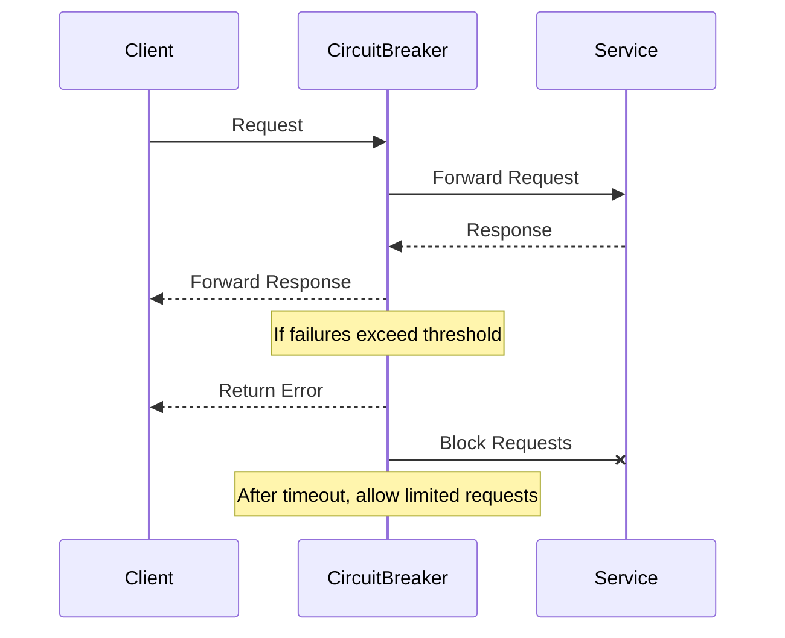

## 16.6 Circuit Breaker Pattern with Erlang Libraries

In the world of microservices, where applications are composed of multiple interconnected services, ensuring resilience and fault tolerance is crucial. The Circuit Breaker pattern is a design pattern used to detect failures and encapsulate the logic of preventing a failure from constantly recurring during maintenance, temporary external system failure, or unexpected system difficulties. In this section, we will explore the Circuit Breaker pattern, its significance, and how to implement it in Erlang using libraries like `fuse`.

### Understanding the Circuit Breaker Pattern

The Circuit Breaker pattern is inspired by electrical circuit breakers, which prevent electrical overloads by breaking the circuit. Similarly, in software, a Circuit Breaker monitors the interactions between services and stops the flow of requests when a failure is detected, allowing the system to recover and preventing cascading failures.

#### Key Concepts

- **Closed State**: The Circuit Breaker allows requests to flow through and monitors for failures.
- **Open State**: The Circuit Breaker stops requests from passing through to prevent further failures.
- **Half-Open State**: The Circuit Breaker allows a limited number of requests to test if the underlying issue has been resolved.

### Significance in Microservices

In microservices architecture, services often depend on each other. A failure in one service can lead to cascading failures across the system. The Circuit Breaker pattern helps in:

- **Preventing Cascading Failures**: By stopping requests to a failing service, it prevents the failure from affecting other services.
- **Graceful Degradation**: Allows the system to degrade gracefully by providing fallback mechanisms.
- **Improving Resilience**: Enhances the overall resilience of the system by managing failures effectively.

### Implementing Circuit Breaker in Erlang

Erlang, known for its concurrency and fault-tolerant capabilities, provides a robust platform for implementing the Circuit Breaker pattern. We will use the `fuse` library, a popular choice for implementing Circuit Breakers in Erlang.

#### Setting Up the `fuse` Library

To get started, ensure you have the `fuse` library installed. You can add it to your `rebar.config`:

```erlang
{deps, [
    {fuse, "1.0.0"}
]}.
```

Run `rebar3 get-deps` to fetch the dependencies.

#### Basic Usage of `fuse`

The `fuse` library provides a simple interface to create and manage Circuit Breakers. Here’s a basic example:

```erlang
% Initialize a fuse with a name, max failures, and a reset time
fuse:start_link(my_service_fuse, {standard, 5, 10000}).

% Check the status of the fuse before making a request
case fuse:ask(my_service_fuse) of
    ok ->
        % Proceed with the request
        Result = make_request(),
        % Reset the fuse on success
        fuse:reset(my_service_fuse),
        Result;
    blown ->
        % Handle the failure gracefully
        handle_failure()
end.
```

In this example, we initialize a fuse named `my_service_fuse` with a maximum of 5 failures allowed before it opens, and a reset time of 10 seconds.

#### Configuring Thresholds and Timeouts

Configuring the right thresholds and timeouts is crucial for the effectiveness of the Circuit Breaker. Consider the following:

- **Failure Threshold**: The number of failures allowed before the Circuit Breaker opens. This should be based on the expected failure rate and the criticality of the service.
- **Timeout**: The time the Circuit Breaker remains open before transitioning to the half-open state. This should be long enough to allow the system to recover but short enough to avoid prolonged downtime.

#### Recovery Strategies

Once the Circuit Breaker is in the half-open state, it allows a limited number of requests to test if the service has recovered. Implement a strategy to handle these requests:

```erlang
case fuse:ask(my_service_fuse) of
    ok ->
        % Attempt to make a request
        case make_request() of
            {ok, Response} ->
                % Reset the fuse on success
                fuse:reset(my_service_fuse),
                Response;
            {error, Reason} ->
                % Trip the fuse again on failure
                fuse:blow(my_service_fuse),
                handle_failure(Reason)
        end;
    blown ->
        % Handle the failure gracefully
        handle_failure()
end.
```

### Monitoring and Alerting

Monitoring the status of Circuit Breakers is essential for maintaining system health. Implement logging and alerting mechanisms to notify when a Circuit Breaker trips:

```erlang
% Log the status of the fuse
fuse:status(my_service_fuse).

% Set up alerts for when the fuse blows
fuse:set_alarm_handler(fun(Alarm) ->
    % Send an alert notification
    send_alert(Alarm)
end).
```

### Visualizing the Circuit Breaker Pattern

To better understand the flow of the Circuit Breaker pattern, let's visualize it using a sequence diagram:



### Erlang Unique Features

Erlang's lightweight processes and message-passing capabilities make it an ideal choice for implementing the Circuit Breaker pattern. The ability to handle thousands of concurrent processes allows for efficient management of service interactions.

### Differences and Similarities

The Circuit Breaker pattern is often confused with the Retry pattern. While both deal with failures, the Retry pattern focuses on retrying failed requests, whereas the Circuit Breaker pattern prevents further requests to a failing service.

### Design Considerations

- **When to Use**: Use the Circuit Breaker pattern when dealing with remote services or resources that may fail.
- **Pitfalls**: Avoid setting thresholds too low, which may lead to frequent tripping, or too high, which may delay failure detection.

### Try It Yourself

Experiment with the `fuse` library by modifying the failure thresholds and timeouts. Observe how the system behaves under different configurations and how it affects the resilience of your application.

### References and Further Reading

- [Circuit Breaker Pattern](https://martinfowler.com/bliki/CircuitBreaker.html) by Martin Fowler
- [fuse GitHub Repository](https://github.com/jlouis/fuse)

### Knowledge Check

- What are the three states of a Circuit Breaker?
- How does the Circuit Breaker pattern prevent cascading failures?
- What is the significance of the half-open state in a Circuit Breaker?

### Embrace the Journey

Remember, implementing the Circuit Breaker pattern is just one step towards building resilient microservices. Keep exploring and experimenting with different patterns to enhance the robustness of your applications. Stay curious and enjoy the journey!

## Quiz: Circuit Breaker Pattern with Erlang Libraries



### What is the primary purpose of the Circuit Breaker pattern?

- [x] To prevent cascading failures in a system
- [ ] To retry failed requests automatically
- [ ] To log errors for debugging
- [ ] To optimize database queries

> **Explanation:** The Circuit Breaker pattern is designed to prevent cascading failures by stopping requests to a failing service.

### Which state allows a limited number of requests to test if a service has recovered?

- [ ] Closed
- [x] Half-Open
- [ ] Open
- [ ] Reset

> **Explanation:** The half-open state allows a limited number of requests to test if the underlying issue has been resolved.

### What library is commonly used in Erlang to implement the Circuit Breaker pattern?

- [ ] Cowboy
- [x] Fuse
- [ ] Lager
- [ ] Ranch

> **Explanation:** The `fuse` library is commonly used in Erlang to implement the Circuit Breaker pattern.

### In the Circuit Breaker pattern, what happens when the failure threshold is exceeded?

- [ ] The system retries the request
- [x] The Circuit Breaker opens
- [ ] The request is logged
- [ ] The service is restarted

> **Explanation:** When the failure threshold is exceeded, the Circuit Breaker opens to prevent further requests.

### What is a key benefit of using the Circuit Breaker pattern in microservices?

- [x] It enhances system resilience
- [ ] It reduces code complexity
- [ ] It increases request throughput
- [ ] It simplifies service discovery

> **Explanation:** The Circuit Breaker pattern enhances system resilience by managing failures effectively.

### How can you monitor the status of a Circuit Breaker in Erlang?

- [ ] By using the `observer` module
- [x] By using the `fuse:status` function
- [ ] By checking the process dictionary
- [ ] By inspecting the message queue

> **Explanation:** The `fuse:status` function can be used to monitor the status of a Circuit Breaker in Erlang.

### What should be considered when configuring a Circuit Breaker?

- [x] Failure thresholds and timeouts
- [ ] Database schema
- [ ] Logging format
- [ ] User interface design

> **Explanation:** Configuring failure thresholds and timeouts is crucial for the effectiveness of a Circuit Breaker.

### What is the role of the `fuse:ask` function in the `fuse` library?

- [ ] To reset the Circuit Breaker
- [x] To check the status of the Circuit Breaker
- [ ] To log a request
- [ ] To open the Circuit Breaker

> **Explanation:** The `fuse:ask` function checks the status of the Circuit Breaker before making a request.

### True or False: The Circuit Breaker pattern is only applicable to microservices.

- [ ] True
- [x] False

> **Explanation:** The Circuit Breaker pattern can be applied to any system where service failures need to be managed, not just microservices.

### What is a common pitfall when implementing the Circuit Breaker pattern?

- [x] Setting thresholds too low or too high
- [ ] Using too many processes
- [ ] Logging too much information
- [ ] Overusing pattern matching

> **Explanation:** Setting thresholds too low or too high can lead to frequent tripping or delayed failure detection.




