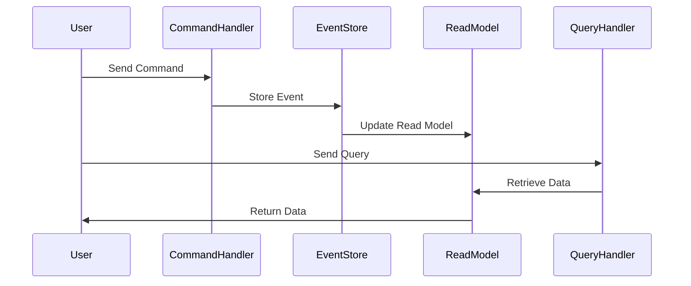

## 16.7 Event Sourcing and CQRS in Microservices

In the realm of microservices architecture, Event Sourcing and Command Query Responsibility Segregation (CQRS) are two powerful patterns that can significantly enhance the scalability and flexibility of your systems. Erlang, with its inherent strengths in concurrency and fault tolerance, provides a robust platform for implementing these patterns. In this section, we will explore how Event Sourcing and CQRS can be applied to microservices, provide examples of implementing these patterns in Erlang, and discuss the benefits and challenges associated with them.

### Understanding Event Sourcing

**Event Sourcing** is a pattern where state changes are captured as a sequence of events. Instead of storing the current state of an entity, you store a log of state-changing events. This approach allows you to reconstruct the state of an entity at any point in time by replaying the events.

#### Key Concepts of Event Sourcing

- **Event Store**: A database that stores events. Each event represents a change in state.
- **Event Replay**: The process of reconstructing the current state by replaying stored events.
- **Eventual Consistency**: The system may not be immediately consistent, but it will become consistent over time as events are processed.

#### Benefits of Event Sourcing

- **Auditability**: Every change is recorded, providing a complete audit trail.
- **Reproducibility**: You can recreate past states by replaying events.
- **Flexibility**: New projections or views can be created by replaying events.

#### Challenges of Event Sourcing

- **Complexity**: Requires careful design to manage event schemas and versioning.
- **Storage**: Event stores can grow large, requiring efficient storage solutions.
- **Eventual Consistency**: Systems must handle the delay in achieving consistency.

### Implementing Event Sourcing in Erlang

Let's explore how to implement Event Sourcing in Erlang. We'll create a simple event-sourced bank account service.

#### Erlang Code Example: Event Sourcing

```erlang
-module(bank_account).
-export([create_account/1, deposit/2, withdraw/2, get_balance/1]).

-record(event, {type, amount, timestamp}).
-record(account, {id, events = []}).

% Create a new account
create_account(Id) ->
    #account{id = Id}.

% Deposit money into the account
deposit(Account, Amount) ->
    Event = #event{type = deposit, amount = Amount, timestamp = erlang:system_time()},
    Account#account{events = [Event | Account#account.events]}.

% Withdraw money from the account
withdraw(Account, Amount) ->
    Event = #event{type = withdraw, amount = Amount, timestamp = erlang:system_time()},
    Account#account{events = [Event | Account#account.events]}.

% Get the current balance by replaying events
get_balance(Account) ->
    lists:foldl(fun(#event{type = deposit, amount = Amount}, Acc) -> Acc + Amount;
                   (#event{type = withdraw, amount = Amount}, Acc) -> Acc - Amount
                end, 0, lists:reverse(Account#account.events)).
```

In this example, we define a `bank_account` module with functions to create an account, deposit, withdraw, and get the balance. The balance is calculated by replaying the events stored in the account.

### Understanding CQRS

**Command Query Responsibility Segregation (CQRS)** is a pattern that separates the read and write operations of a system. In CQRS, commands are responsible for changing the state, while queries are responsible for reading the state.

#### Key Concepts of CQRS

- **Commands**: Operations that change the state of the system.
- **Queries**: Operations that read the state of the system.
- **Separation of Concerns**: By separating commands and queries, you can optimize each independently.

#### Benefits of CQRS

- **Scalability**: Read and write operations can be scaled independently.
- **Flexibility**: Different models can be used for reading and writing.
- **Performance**: Optimized read models can improve query performance.

#### Challenges of CQRS

- **Complexity**: Requires managing separate models for reads and writes.
- **Consistency**: Ensuring consistency between read and write models can be challenging.

### Implementing CQRS in Erlang

Let's implement a simple CQRS pattern in Erlang using the bank account example.

#### Erlang Code Example: CQRS

```erlang
-module(bank_account_cqrs).
-export([execute_command/2, query_balance/1]).

-record(command, {type, amount}).
-record(query, {type}).

% Execute a command to change the state
execute_command(Account, #command{type = deposit, amount = Amount}) ->
    bank_account:deposit(Account, Amount);
execute_command(Account, #command{type = withdraw, amount = Amount}) ->
    bank_account:withdraw(Account, Amount).

% Query the current balance
query_balance(Account) ->
    bank_account:get_balance(Account).
```

In this example, we define a `bank_account_cqrs` module with functions to execute commands and query the balance. The `execute_command/2` function handles both deposit and withdraw commands, while the `query_balance/1` function retrieves the current balance.

### Combining Event Sourcing and CQRS

Event Sourcing and CQRS are often used together to build scalable and flexible systems. In this combination, events are used to capture state changes, and CQRS is used to separate the read and write models.

#### Benefits of Combining Event Sourcing and CQRS

- **Decoupling**: The read and write models are decoupled, allowing for independent scaling and optimization.
- **Scalability**: Systems can handle high loads by distributing read and write operations.
- **Flexibility**: New read models can be created by replaying events.

#### Challenges of Combining Event Sourcing and CQRS

- **Complexity**: Managing events and separate models increases complexity.
- **Consistency**: Ensuring consistency between models requires careful design.

### Erlang Code Example: Combining Event Sourcing and CQRS

Let's extend our previous examples to combine Event Sourcing and CQRS.

```erlang
-module(bank_account_es_cqrs).
-export([execute_command/2, query_balance/1, replay_events/1]).

-record(event, {type, amount, timestamp}).
-record(account, {id, events = []}).

% Execute a command and store the event
execute_command(Account, #command{type = deposit, amount = Amount}) ->
    Event = #event{type = deposit, amount = Amount, timestamp = erlang:system_time()},
    Account#account{events = [Event | Account#account.events]};
execute_command(Account, #command{type = withdraw, amount = Amount}) ->
    Event = #event{type = withdraw, amount = Amount, timestamp = erlang:system_time()},
    Account#account{events = [Event | Account#account.events]}.

% Query the current balance by replaying events
query_balance(Account) ->
    replay_events(Account#account.events).

% Replay events to calculate the balance
replay_events(Events) ->
    lists:foldl(fun(#event{type = deposit, amount = Amount}, Acc) -> Acc + Amount;
                   (#event{type = withdraw, amount = Amount}, Acc) -> Acc - Amount
                end, 0, lists:reverse(Events)).
```

In this example, we define a `bank_account_es_cqrs` module that combines Event Sourcing and CQRS. The `execute_command/2` function stores events, and the `query_balance/1` function calculates the balance by replaying events.

### Visualizing Event Sourcing and CQRS

To better understand the flow of Event Sourcing and CQRS, let's visualize the architecture using a sequence diagram.



**Diagram Description**: This sequence diagram illustrates the flow of commands and queries in a system using Event Sourcing and CQRS. Commands are sent to the `CommandHandler`, which stores events in the `EventStore`. The `ReadModel` is updated based on these events. Queries are sent to the `QueryHandler`, which retrieves data from the `ReadModel`.

### Evaluating Event Sourcing and CQRS

When considering Event Sourcing and CQRS for your microservices architecture, it's important to evaluate these patterns based on your project requirements. Here are some factors to consider:

- **Scalability Needs**: If your system requires high scalability, these patterns can help distribute load and optimize performance.
- **Audit and Traceability**: If auditability and traceability are important, Event Sourcing provides a complete history of changes.
- **Complexity Management**: Consider the complexity these patterns introduce and whether your team has the expertise to manage it.
- **Consistency Requirements**: Evaluate how eventual consistency will impact your system and whether it's acceptable for your use case.

### Conclusion

Event Sourcing and CQRS are powerful patterns that can enhance the scalability and flexibility of microservices architectures. Erlang's strengths in concurrency and fault tolerance make it an excellent choice for implementing these patterns. However, it's important to carefully evaluate the benefits and challenges of these patterns based on your specific project requirements.

Remember, this is just the beginning. As you progress, you'll build more complex and interactive systems. Keep experimenting, stay curious, and enjoy the journey!

## Quiz: Event Sourcing and CQRS in Microservices



### What is Event Sourcing?

- [x] A pattern where state changes are captured as a sequence of events.
- [ ] A pattern that separates read and write operations.
- [ ] A pattern for optimizing database queries.
- [ ] A pattern for managing distributed systems.

> **Explanation:** Event Sourcing captures state changes as a sequence of events, allowing for state reconstruction.

### What is the main benefit of CQRS?

- [x] Scalability by separating read and write operations.
- [ ] Reducing storage requirements.
- [ ] Simplifying database schemas.
- [ ] Improving network latency.

> **Explanation:** CQRS separates read and write operations, allowing for independent scaling and optimization.

### How does Event Sourcing handle state changes?

- [x] By storing events that represent changes.
- [ ] By updating the current state directly.
- [ ] By using a centralized database.
- [ ] By caching state in memory.

> **Explanation:** Event Sourcing stores events that represent state changes, which can be replayed to reconstruct the state.

### What is a challenge of using Event Sourcing?

- [x] Managing event schemas and versioning.
- [ ] Lack of auditability.
- [ ] Difficulty in scaling read operations.
- [ ] Inability to handle large data sets.

> **Explanation:** Event Sourcing requires careful management of event schemas and versioning to handle changes over time.

### What is the role of the Event Store in Event Sourcing?

- [x] To store events that represent state changes.
- [ ] To execute commands and queries.
- [ ] To manage network communication.
- [ ] To optimize database performance.

> **Explanation:** The Event Store is responsible for storing events that represent state changes in Event Sourcing.

### What does CQRS stand for?

- [x] Command Query Responsibility Segregation.
- [ ] Command Queue Resource System.
- [ ] Centralized Query Response System.
- [ ] Concurrent Query Resource Segmentation.

> **Explanation:** CQRS stands for Command Query Responsibility Segregation, a pattern that separates read and write operations.

### How does CQRS improve performance?

- [x] By allowing optimized read models.
- [ ] By reducing the number of database connections.
- [ ] By caching all data in memory.
- [ ] By using a single model for reads and writes.

> **Explanation:** CQRS allows for optimized read models, improving query performance.

### What is a benefit of combining Event Sourcing and CQRS?

- [x] Decoupling of read and write models.
- [ ] Simplifying event management.
- [ ] Reducing storage requirements.
- [ ] Eliminating network latency.

> **Explanation:** Combining Event Sourcing and CQRS decouples read and write models, allowing for independent scaling and optimization.

### What is a challenge of combining Event Sourcing and CQRS?

- [x] Ensuring consistency between models.
- [ ] Lack of auditability.
- [ ] Difficulty in handling large data sets.
- [ ] Inability to scale write operations.

> **Explanation:** Ensuring consistency between models is a challenge when combining Event Sourcing and CQRS.

### True or False: Event Sourcing provides a complete audit trail of changes.

- [x] True
- [ ] False

> **Explanation:** Event Sourcing captures every change as an event, providing a complete audit trail.


