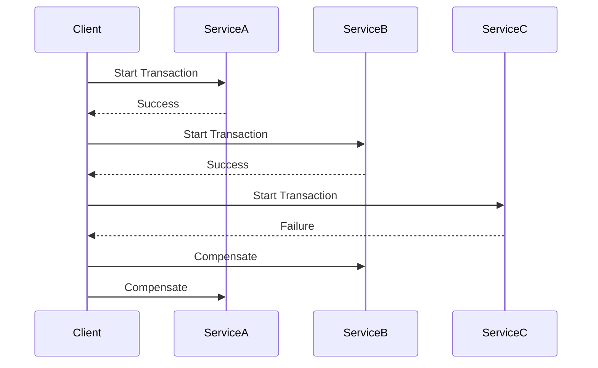

## 16.8 Saga Pattern for Distributed Transactions

In the realm of microservices architecture, managing distributed transactions is a critical challenge. The Saga pattern emerges as a powerful solution to ensure data consistency across multiple services without relying on the traditional two-phase commit protocol. In this section, we will delve into the intricacies of the Saga pattern, its implementation in Erlang, and best practices for maintaining system integrity.

### Understanding the Saga Pattern

The Saga pattern is a design pattern used to manage distributed transactions in microservices. It breaks a transaction into a series of smaller, independent transactions that are coordinated to achieve a consistent outcome. Each of these smaller transactions is called a "saga," and they are executed in a sequence. If one of the transactions fails, compensating actions are triggered to undo the changes made by the previous transactions, ensuring the system remains in a consistent state.

#### Key Concepts

- **Saga**: A sequence of transactions that are coordinated to achieve a business goal.
- **Compensating Action**: An action that reverses the effects of a previously completed transaction in case of failure.
- **Choreography**: A decentralized approach where each service involved in the saga knows what to do and how to react to events.
- **Orchestration**: A centralized approach where a coordinator service manages the saga's execution.

### Role of the Saga Pattern in Ensuring Data Consistency

The Saga pattern plays a crucial role in ensuring data consistency across distributed systems by allowing transactions to be completed in an eventually consistent manner. Unlike the two-phase commit protocol, which locks resources and can lead to bottlenecks, the Saga pattern allows each service to operate independently, thus improving system scalability and resilience.

### Coordinating Transactions Without Two-Phase Commit

The traditional two-phase commit protocol involves locking resources across multiple services, which can lead to performance issues and reduced system availability. The Saga pattern, on the other hand, coordinates transactions through a series of compensating actions and event-driven communication, allowing for greater flexibility and fault tolerance.

#### Choreography vs. Orchestration

- **Choreography**: In this approach, each service involved in the saga listens for events and performs its transaction independently. This method is more scalable but can become complex as the number of services increases.
- **Orchestration**: Here, a central coordinator manages the saga's execution, ensuring that each transaction is completed in the correct order. This approach simplifies the management of the saga but can introduce a single point of failure.

### Implementing Sagas Using Erlang Processes

Erlang's concurrency model, based on lightweight processes and message passing, makes it an ideal choice for implementing the Saga pattern. Let's explore how we can use Erlang processes to manage distributed transactions.

#### Sample Code Snippet

Below is a simple example of implementing a saga using Erlang processes. In this example, we simulate a transaction involving three services: `ServiceA`, `ServiceB`, and `ServiceC`.

```erlang
-module(saga_example).
-export([start_saga/0, service_a/1, service_b/1, service_c/1, compensate/1]).

start_saga() ->
    PidA = spawn(?MODULE, service_a, [self()]),
    receive
        {PidA, success} ->
            PidB = spawn(?MODULE, service_b, [self()]),
            receive
                {PidB, success} ->
                    PidC = spawn(?MODULE, service_c, [self()]),
                    receive
                        {PidC, success} ->
                            io:format("Saga completed successfully~n");
                        {PidC, failure} ->
                            compensate(PidB),
                            compensate(PidA)
                    end;
                {PidB, failure} ->
                    compensate(PidA)
            end;
        {PidA, failure} ->
            io:format("Saga failed at ServiceA~n")
    end.

service_a(Caller) ->
    % Simulate transaction logic
    case random:uniform(2) of
        1 -> Caller ! {self(), success};
        2 -> Caller ! {self(), failure}
    end.

service_b(Caller) ->
    % Simulate transaction logic
    case random:uniform(2) of
        1 -> Caller ! {self(), success};
        2 -> Caller ! {self(), failure}
    end.

service_c(Caller) ->
    % Simulate transaction logic
    case random:uniform(2) of
        1 -> Caller ! {self(), success};
        2 -> Caller ! {self(), failure}
    end.

compensate(Pid) ->
    io:format("Compensating for process ~p~n", [Pid]).
```

In this example, each service is represented by a process that performs a transaction and sends a success or failure message back to the caller. If a failure occurs, compensating actions are triggered to undo the changes made by the previous services.

### Compensating Actions and Failure Handling

Compensating actions are crucial in the Saga pattern as they ensure that the system remains consistent even in the event of a failure. In Erlang, compensating actions can be implemented as separate processes that are triggered when a transaction fails.

#### Best Practices for Compensating Actions

- **Idempotency**: Ensure that compensating actions are idempotent, meaning they can be applied multiple times without changing the result.
- **Isolation**: Compensating actions should be isolated from the main transaction logic to prevent unintended side effects.
- **Logging**: Maintain detailed logs of all transactions and compensating actions to facilitate debugging and auditing.

### Best Practices for Maintaining System Integrity

Implementing the Saga pattern in Erlang requires careful consideration of several factors to maintain system integrity and ensure reliable operations.

#### Key Considerations

- **Error Handling**: Implement robust error handling mechanisms to gracefully manage failures and trigger compensating actions.
- **Concurrency Control**: Use Erlang's lightweight processes and message passing to manage concurrency effectively.
- **Monitoring and Logging**: Continuously monitor the system and maintain detailed logs to detect and resolve issues promptly.
- **Testing**: Thoroughly test the saga implementation to ensure it handles all possible failure scenarios.

### Visualizing the Saga Pattern

To better understand the flow of a saga, let's visualize the process using a sequence diagram.



In this diagram, we see the sequence of transactions and compensating actions in the event of a failure at `ServiceC`.

### Erlang Unique Features

Erlang's unique features, such as lightweight processes, message passing, and fault tolerance, make it particularly well-suited for implementing the Saga pattern. These features allow for efficient management of distributed transactions and ensure system resilience.

### Differences and Similarities with Other Patterns

The Saga pattern is often compared to the two-phase commit protocol. While both aim to ensure data consistency, the Saga pattern offers greater flexibility and scalability by avoiding resource locking. It is also similar to the Event Sourcing pattern, where events are used to track changes, but differs in its focus on compensating actions.

### Conclusion

The Saga pattern is a powerful tool for managing distributed transactions in microservices architectures. By leveraging Erlang's concurrency model and unique features, developers can implement sagas that ensure data consistency and system integrity without the drawbacks of traditional two-phase commit protocols. Remember, this is just the beginning. As you progress, you'll build more complex and interactive systems. Keep experimenting, stay curious, and enjoy the journey!

## Quiz: Saga Pattern for Distributed Transactions



### What is the primary purpose of the Saga pattern in distributed systems?

- [x] To manage distributed transactions and ensure data consistency
- [ ] To improve system performance by reducing latency
- [ ] To simplify the deployment process of microservices
- [ ] To enhance security by encrypting data

> **Explanation:** The Saga pattern is primarily used to manage distributed transactions and ensure data consistency across multiple services.

### How does the Saga pattern differ from the two-phase commit protocol?

- [x] It avoids resource locking and allows for eventual consistency
- [ ] It requires a central coordinator to manage transactions
- [ ] It locks resources across multiple services
- [ ] It is used only for small-scale systems

> **Explanation:** The Saga pattern avoids resource locking and allows for eventual consistency, unlike the two-phase commit protocol which locks resources.

### What are compensating actions in the Saga pattern?

- [x] Actions that reverse the effects of a previously completed transaction
- [ ] Actions that enhance the performance of a transaction
- [ ] Actions that encrypt data for security purposes
- [ ] Actions that simplify the transaction process

> **Explanation:** Compensating actions are used to reverse the effects of a previously completed transaction in case of failure.

### Which Erlang feature is particularly useful for implementing the Saga pattern?

- [x] Lightweight processes and message passing
- [ ] Strong typing and static analysis
- [ ] Object-oriented programming
- [ ] Synchronous communication

> **Explanation:** Erlang's lightweight processes and message passing are particularly useful for implementing the Saga pattern.

### What is the role of a central coordinator in the orchestration approach of the Saga pattern?

- [x] To manage the saga's execution and ensure transactions are completed in order
- [ ] To encrypt data for security purposes
- [ ] To improve system performance by caching data
- [ ] To simplify the deployment process of microservices

> **Explanation:** In the orchestration approach, a central coordinator manages the saga's execution and ensures transactions are completed in the correct order.

### What is a key advantage of using the choreography approach in the Saga pattern?

- [x] It is more scalable as each service operates independently
- [ ] It requires less monitoring and logging
- [ ] It simplifies the transaction process
- [ ] It enhances security by encrypting data

> **Explanation:** The choreography approach is more scalable as each service operates independently, without a central coordinator.

### Why is idempotency important for compensating actions in the Saga pattern?

- [x] To ensure they can be applied multiple times without changing the result
- [ ] To improve system performance by caching data
- [ ] To simplify the deployment process of microservices
- [ ] To enhance security by encrypting data

> **Explanation:** Idempotency ensures that compensating actions can be applied multiple times without changing the result, which is crucial for maintaining consistency.

### What is a common challenge when implementing the Saga pattern in microservices?

- [x] Managing the complexity of compensating actions and failure handling
- [ ] Encrypting data for security purposes
- [ ] Simplifying the deployment process
- [ ] Improving system performance by caching data

> **Explanation:** Managing the complexity of compensating actions and failure handling is a common challenge when implementing the Saga pattern.

### How does Erlang's "let it crash" philosophy align with the Saga pattern?

- [x] It supports fault tolerance by allowing processes to fail and recover
- [ ] It enhances security by encrypting data
- [ ] It simplifies the deployment process of microservices
- [ ] It improves system performance by caching data

> **Explanation:** Erlang's "let it crash" philosophy supports fault tolerance by allowing processes to fail and recover, which aligns with the Saga pattern's approach to handling failures.

### True or False: The Saga pattern can be used to manage distributed transactions in both small and large-scale systems.

- [x] True
- [ ] False

> **Explanation:** The Saga pattern is versatile and can be used to manage distributed transactions in both small and large-scale systems.


