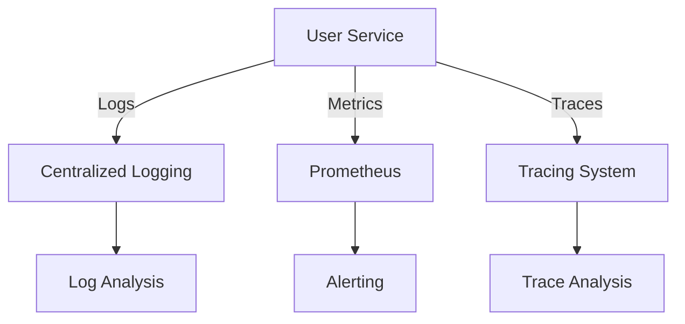

## 16.9 Logging, Monitoring, and Tracing

In the world of microservices, observability is key to maintaining robust, scalable, and efficient systems. This section delves into the essential practices of logging, monitoring, and tracing within Erlang microservices. By the end of this guide, you'll have a solid understanding of how to implement these practices to enhance the observability of your Erlang applications.

### Logging in Erlang Microservices

Logging is the cornerstone of observability. It provides a record of events that occur within your application, which is invaluable for debugging and performance analysis.

#### Logging Strategies

1. **Structured Logging**: Use structured logging formats like JSON to make logs machine-readable and easily parsable. This facilitates integration with log management systems and enhances searchability.

2. **Log Levels**: Implement log levels (e.g., DEBUG, INFO, WARN, ERROR) to control the verbosity of logs. This allows you to filter logs based on the severity of events.

3. **Contextual Information**: Include contextual information such as request IDs, user IDs, and timestamps in your logs to provide more insights into the events.

4. **Centralized Logging**: Use centralized logging solutions to aggregate logs from multiple services, making it easier to analyze and correlate events across your microservices architecture.

#### Recommended Log Structure

A typical JSON log entry might look like this:

```json
{
  "timestamp": "2024-11-23T12:34:56Z",
  "level": "INFO",
  "service": "user-service",
  "message": "User login successful",
  "user_id": "12345",
  "request_id": "abcde-12345"
}
```

### Monitoring Tools for Erlang

Monitoring is crucial for understanding the health and performance of your microservices. It involves collecting metrics and setting up alerts to notify you of potential issues.

#### Observer

[`observer`](http://erlang.org/doc/man/observer.html) is a built-in Erlang tool that provides a graphical interface for monitoring the Erlang runtime system. It allows you to:

- View process information, including memory usage and message queues.
- Monitor system performance metrics such as CPU and memory usage.
- Analyze the supervision tree to understand process hierarchies.

#### Prometheus Integration

Prometheus is a popular open-source monitoring solution that can be integrated with Erlang using exporters like [`prometheus.erl`](https://github.com/deadtrickster/prometheus.erl). This integration allows you to:

- Export Erlang metrics in a format that Prometheus can scrape.
- Set up alerts based on metric thresholds.
- Visualize metrics using Grafana dashboards.

### Distributed Tracing in Erlang

Distributed tracing provides visibility into the flow of requests across microservices, helping you identify bottlenecks and optimize performance.

#### Concepts of Distributed Tracing

1. **Spans**: A span represents a single operation within a trace. It includes metadata such as operation name, start time, and duration.

2. **Traces**: A trace is a collection of spans that represent the end-to-end journey of a request through the system.

3. **Context Propagation**: Context propagation involves passing trace context (e.g., trace ID, span ID) across service boundaries to maintain the trace.

#### Tools for Distributed Tracing

- **OpenTracing**: An open standard for distributed tracing that provides APIs for instrumenting applications.

- **OpenTelemetry**: A more recent initiative that combines OpenTracing and OpenCensus, providing a unified set of APIs and libraries for collecting metrics and traces.

#### Implementing Tracing in Erlang

To implement tracing in Erlang, you can use libraries like `opentelemetry-erlang`. Here's a basic example of how to instrument a function with tracing:

```erlang
-module(user_service).
-export([login/2]).

login(UserId, Password) ->
    SpanCtx = opentelemetry:start_span("user_login"),
    try
        % Simulate user authentication
        case authenticate(UserId, Password) of
            {ok, User} ->
                opentelemetry:set_attribute(SpanCtx, "user_id", UserId),
                opentelemetry:end_span(SpanCtx),
                {ok, User};
            {error, Reason} ->
                opentelemetry:set_status(SpanCtx, error, Reason),
                opentelemetry:end_span(SpanCtx),
                {error, Reason}
        end
    catch
        _:_ ->
            opentelemetry:set_status(SpanCtx, error, "unexpected_error"),
            opentelemetry:end_span(SpanCtx),
            {error, "unexpected_error"}
    end.

authenticate(UserId, Password) ->
    % Placeholder for authentication logic
    {ok, #{user_id => UserId, name => "John Doe"}}.
```

### Benefits of Logging, Monitoring, and Tracing

1. **Debugging**: Quickly identify and resolve issues by analyzing logs and traces.

2. **Performance Optimization**: Use metrics and traces to identify bottlenecks and optimize system performance.

3. **Proactive Monitoring**: Set up alerts to detect and address issues before they impact users.

4. **Improved Observability**: Gain insights into the behavior of your microservices and their interactions.

### Visualizing Observability in Erlang Microservices

To better understand the flow of requests and the interactions between services, let's visualize a simple microservices architecture with logging, monitoring, and tracing components.



**Diagram Description**: This diagram illustrates how the User Service generates logs, metrics, and traces. Logs are sent to a centralized logging system for analysis, metrics are exported to Prometheus for monitoring and alerting, and traces are sent to a tracing system for analysis.

### Try It Yourself

Experiment with the provided code examples by:

- Modifying the log structure to include additional fields.
- Integrating `prometheus.erl` into your Erlang application and visualizing metrics in Grafana.
- Implementing tracing in another Erlang service and analyzing the traces.

### Knowledge Check

- What are the benefits of using structured logging formats like JSON?
- How does Prometheus integration enhance monitoring in Erlang applications?
- What is the role of spans and traces in distributed tracing?

### Summary

Logging, monitoring, and tracing are essential practices for achieving observability in Erlang microservices. By implementing structured logging, integrating monitoring tools like Prometheus, and adopting distributed tracing, you can gain valuable insights into your system's behavior and performance.

Remember, this is just the beginning. As you progress, you'll build more complex and interactive observability solutions. Keep experimenting, stay curious, and enjoy the journey!

## Quiz: Logging, Monitoring, and Tracing



### What is the primary benefit of structured logging in JSON format?

- [x] It makes logs machine-readable and easily parsable.
- [ ] It reduces the size of log files.
- [ ] It eliminates the need for log levels.
- [ ] It automatically encrypts log data.

> **Explanation:** Structured logging in JSON format allows logs to be machine-readable and easily parsable, facilitating integration with log management systems.

### Which tool provides a graphical interface for monitoring the Erlang runtime system?

- [x] observer
- [ ] Prometheus
- [ ] OpenTelemetry
- [ ] Grafana

> **Explanation:** `observer` is a built-in Erlang tool that provides a graphical interface for monitoring the Erlang runtime system.

### What is the role of spans in distributed tracing?

- [x] They represent a single operation within a trace.
- [ ] They aggregate logs from multiple services.
- [ ] They export metrics to Prometheus.
- [ ] They provide a graphical interface for monitoring.

> **Explanation:** Spans represent a single operation within a trace and include metadata such as operation name, start time, and duration.

### How does Prometheus integration benefit Erlang applications?

- [x] It allows exporting Erlang metrics for monitoring and alerting.
- [ ] It provides a graphical interface for monitoring.
- [ ] It automatically encrypts log data.
- [ ] It eliminates the need for log levels.

> **Explanation:** Prometheus integration allows exporting Erlang metrics in a format that Prometheus can scrape, enabling monitoring and alerting.

### What is context propagation in distributed tracing?

- [x] Passing trace context across service boundaries.
- [ ] Aggregating logs from multiple services.
- [ ] Exporting metrics to Prometheus.
- [ ] Providing a graphical interface for monitoring.

> **Explanation:** Context propagation involves passing trace context (e.g., trace ID, span ID) across service boundaries to maintain the trace.

### Which tool combines OpenTracing and OpenCensus for distributed tracing?

- [x] OpenTelemetry
- [ ] Prometheus
- [ ] observer
- [ ] Grafana

> **Explanation:** OpenTelemetry is a recent initiative that combines OpenTracing and OpenCensus, providing a unified set of APIs and libraries for collecting metrics and traces.

### What is the primary purpose of centralized logging?

- [x] To aggregate logs from multiple services for easier analysis.
- [ ] To reduce the size of log files.
- [ ] To eliminate the need for log levels.
- [ ] To automatically encrypt log data.

> **Explanation:** Centralized logging aggregates logs from multiple services, making it easier to analyze and correlate events across your microservices architecture.

### What is the benefit of including contextual information in logs?

- [x] It provides more insights into the events.
- [ ] It reduces the size of log files.
- [ ] It eliminates the need for log levels.
- [ ] It automatically encrypts log data.

> **Explanation:** Including contextual information such as request IDs, user IDs, and timestamps in your logs provides more insights into the events.

### What is the primary benefit of using log levels?

- [x] To control the verbosity of logs.
- [ ] To reduce the size of log files.
- [ ] To eliminate the need for structured logging.
- [ ] To automatically encrypt log data.

> **Explanation:** Log levels allow you to control the verbosity of logs, enabling you to filter logs based on the severity of events.

### True or False: Distributed tracing helps identify bottlenecks in microservices.

- [x] True
- [ ] False

> **Explanation:** Distributed tracing provides visibility into the flow of requests across microservices, helping you identify bottlenecks and optimize performance.




