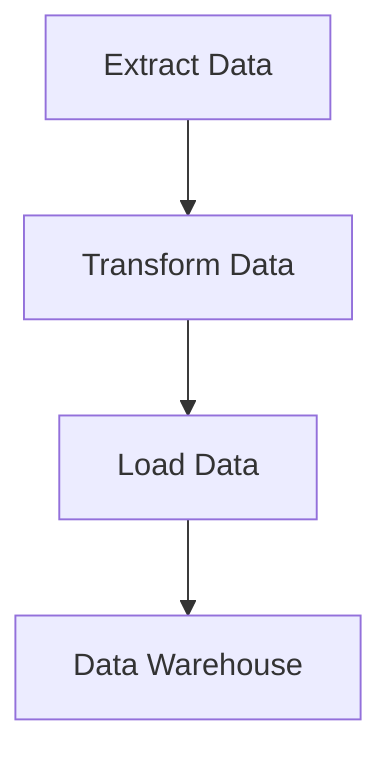

## 17.1 Introduction to Data Engineering in Erlang

Data engineering is a critical field in the modern data-driven world, focusing on the design and construction of systems that enable the collection, storage, and analysis of data. At the heart of data engineering lies the ETL (Extract, Transform, Load) process, which is essential for preparing data for analysis and decision-making. In this section, we will explore how Erlang, a language renowned for its concurrency and fault tolerance, can be leveraged to build efficient ETL pipelines and handle complex data engineering tasks.

### Understanding Data Engineering and ETL

**Data Engineering** involves the development and maintenance of architectures, such as databases and large-scale processing systems. It ensures that data is accessible, reliable, and ready for analysis. The key components of data engineering include data ingestion, data transformation, data storage, and data access.

**ETL (Extract, Transform, Load)** is a process that involves:
- **Extracting** data from various sources, which can be structured or unstructured.
- **Transforming** the data into a format suitable for analysis, which may involve cleaning, aggregating, and enriching the data.
- **Loading** the transformed data into a target system, such as a data warehouse or a database.

### Erlang's Strengths in Data Engineering

Erlang is uniquely suited for data engineering tasks due to its strengths in handling concurrent and distributed systems. Let's delve into some of the reasons why Erlang is advantageous for data engineering:

#### Concurrency and Parallelism

Erlang's lightweight process model allows for massive concurrency, making it ideal for handling large volumes of data in parallel. This capability is crucial for ETL processes, where data extraction, transformation, and loading can be performed concurrently to improve efficiency.

#### Fault Tolerance

Erlang's "Let It Crash" philosophy and robust error handling mechanisms ensure that systems remain resilient in the face of failures. This is particularly important in data engineering, where data integrity and system uptime are critical.

#### Distributed Processing

Erlang's ability to seamlessly handle distributed systems enables the processing of data across multiple nodes. This is beneficial for scaling ETL processes and managing large datasets that exceed the capacity of a single machine.

#### Real-Time Processing

Erlang's low-latency communication and efficient message-passing capabilities make it suitable for real-time data processing, which is increasingly important in applications such as IoT and financial services.

### Scenarios Where Erlang Excels in Data Engineering

Erlang is particularly advantageous in the following data engineering scenarios:

- **Real-Time Data Processing**: Erlang's concurrency model allows for the processing of streaming data in real-time, making it suitable for applications that require immediate insights from data.
  
- **Distributed Data Systems**: Erlang's distributed nature makes it ideal for building systems that need to process data across multiple locations or nodes.

- **Fault-Tolerant Data Pipelines**: With its robust error handling, Erlang can maintain data pipeline integrity even in the event of failures, ensuring continuous data flow.

- **Scalable ETL Processes**: Erlang's ability to handle a large number of concurrent processes allows for scalable ETL operations, accommodating growing data volumes.

### Setting the Stage for Detailed Exploration

In the subsequent sections, we will explore how to implement ETL processes in Erlang, leveraging its unique features to build efficient and scalable data engineering solutions. We will cover topics such as building ETL pipelines, integrating with data stores, handling large datasets, and real-time data processing.

### Code Example: Simple ETL Process in Erlang

Let's look at a simple example of an ETL process in Erlang. This example demonstrates extracting data from a source, transforming it, and loading it into a target system.

```erlang
-module(simple_etl).
-export([run_etl/0]).

% Sample data source
extract() ->
    [{1, "Alice", 30}, {2, "Bob", 25}, {3, "Charlie", 35}].

% Transformation function
transform(Data) ->
    lists:map(fun({Id, Name, Age}) -> {Id, Name, Age + 1} end, Data).

% Loading function
load(Data) ->
    io:format("Loading data: ~p~n", [Data]).

% Run ETL process
run_etl() ->
    Data = extract(),
    TransformedData = transform(Data),
    load(TransformedData).
```

In this example:
- **Extract**: We define a simple data source as a list of tuples.
- **Transform**: We apply a transformation function that increments the age of each person by one.
- **Load**: We print the transformed data to the console.

### Visualizing Erlang's ETL Process

To better understand the flow of an ETL process in Erlang, let's visualize it using a flowchart.



**Figure 1**: This flowchart illustrates the basic steps of an ETL process in Erlang, from data extraction to loading into a data warehouse.

### Try It Yourself

Experiment with the provided code example by modifying the transformation function to apply different operations, such as filtering data or changing the data structure. This will help you understand how Erlang's functional programming paradigm can be applied to data transformation tasks.

### References and Further Reading

- [Erlang Programming Language](https://www.erlang.org/)
- [ETL Process Overview](https://www.talend.com/resources/what-is-etl/)
- [Concurrency in Erlang](https://erlang.org/doc/getting_started/conc_prog.html)

### Knowledge Check

- What are the key components of the ETL process?
- How does Erlang's concurrency model benefit data engineering tasks?
- In what scenarios is Erlang particularly advantageous for data engineering?

### Embrace the Journey

Remember, this is just the beginning of your exploration into data engineering with Erlang. As you progress, you'll discover more advanced techniques and patterns for building robust data pipelines. Keep experimenting, stay curious, and enjoy the journey!

## Quiz: Introduction to Data Engineering in Erlang



### What is the primary purpose of data engineering?

- [x] To design and build systems for data collection, storage, and analysis
- [ ] To create user interfaces for applications
- [ ] To develop mobile applications
- [ ] To write documentation for software

> **Explanation:** Data engineering focuses on creating systems that enable the efficient handling and analysis of data.

### What does ETL stand for in data engineering?

- [x] Extract, Transform, Load
- [ ] Evaluate, Test, Launch
- [ ] Execute, Transfer, Log
- [ ] Edit, Translate, Link

> **Explanation:** ETL stands for Extract, Transform, Load, which are the key steps in preparing data for analysis.

### How does Erlang's concurrency model benefit ETL processes?

- [x] By allowing parallel processing of data
- [ ] By simplifying user interface design
- [ ] By improving database indexing
- [ ] By enhancing graphical rendering

> **Explanation:** Erlang's concurrency model enables parallel processing, which is crucial for efficient ETL operations.

### What is a key advantage of Erlang in distributed data systems?

- [x] Seamless handling of distributed nodes
- [ ] Simplified user authentication
- [ ] Enhanced graphical capabilities
- [ ] Improved file compression

> **Explanation:** Erlang excels in managing distributed systems, making it ideal for distributed data processing.

### Which Erlang feature supports real-time data processing?

- [x] Low-latency communication
- [ ] High-resolution graphics
- [ ] Advanced encryption algorithms
- [ ] Simplified syntax

> **Explanation:** Erlang's low-latency communication is essential for real-time data processing applications.

### What is the "Let It Crash" philosophy in Erlang?

- [x] A fault-tolerance approach that allows processes to fail and recover
- [ ] A method for optimizing code performance
- [ ] A strategy for improving user experience
- [ ] A technique for reducing memory usage

> **Explanation:** The "Let It Crash" philosophy focuses on building systems that can recover from failures automatically.

### In the provided ETL code example, what does the `transform` function do?

- [x] It increments the age of each person by one
- [ ] It extracts data from a source
- [ ] It loads data into a target system
- [ ] It deletes data from a database

> **Explanation:** The `transform` function modifies the data by incrementing the age of each person.

### What is the role of the `load` function in the ETL process?

- [x] To output the transformed data
- [ ] To extract data from a source
- [ ] To transform data into a new format
- [ ] To delete data from a database

> **Explanation:** The `load` function is responsible for outputting or storing the transformed data.

### Which of the following is NOT a benefit of using Erlang for data engineering?

- [ ] Fault tolerance
- [ ] Concurrency
- [ ] Distributed processing
- [x] High-resolution graphics

> **Explanation:** Erlang is not known for high-resolution graphics; its strengths lie in concurrency and distributed processing.

### True or False: Erlang is suitable for building scalable ETL processes.

- [x] True
- [ ] False

> **Explanation:** Erlang's concurrency and distributed processing capabilities make it well-suited for scalable ETL processes.


