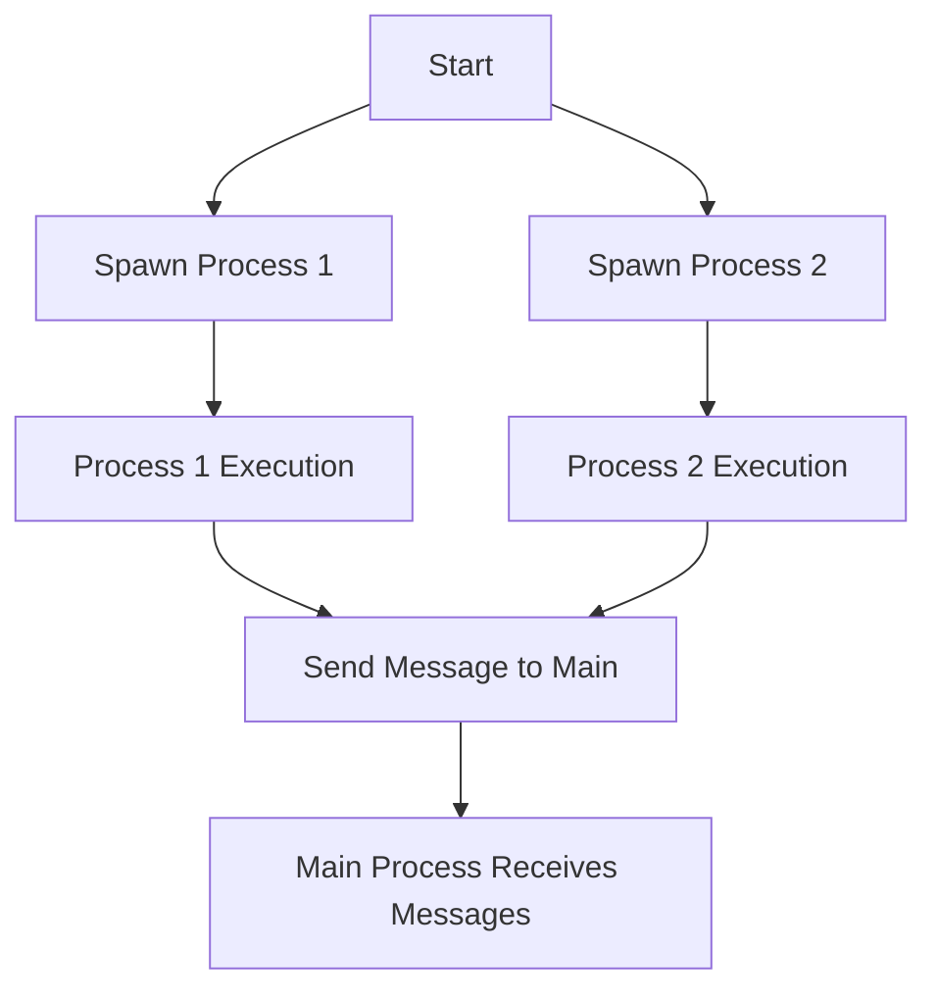

## 17.10 Best Practices and Performance Considerations

In the realm of data engineering, Erlang offers a unique blend of functional programming and concurrency capabilities that can be leveraged to build efficient ETL (Extract, Transform, Load) pipelines. This section delves into best practices for optimizing Erlang applications, focusing on performance tuning, resource management, and scalability planning. By following these guidelines, you can ensure that your Erlang-based data engineering solutions are robust, scalable, and performant.

### Key Practices for Efficient ETL Pipelines

#### 1. Embrace Immutability and Pure Functions

- **Explain the Concept**: Immutability and pure functions are core principles of functional programming. They help in maintaining consistency and predictability in your code.
- **Benefits**: These principles reduce side effects, making your ETL processes easier to debug and test.
- **Code Example**:
  ```erlang
  % Pure function example
  -module(data_transform).
  -export([transform/1]).

  transform(Data) ->
      lists:map(fun(X) -> X * 2 end, Data).
  ```

#### 2. Utilize Concurrency for Parallel Processing

- **Explain the Concept**: Erlang's lightweight processes allow you to handle multiple tasks concurrently, which is ideal for ETL operations that can be parallelized.
- **Benefits**: Concurrency can significantly reduce processing time by utilizing multiple cores.
- **Code Example**:
  ```erlang
  % Spawning processes for parallel data processing
  -module(parallel_etl).
  -export([process_data/1]).

  process_data(Data) ->
      Pid1 = spawn(fun() -> transform(Data) end),
      Pid2 = spawn(fun() -> load(Data) end),
      receive
          {Pid1, Result1} -> io:format("Transform Result: ~p~n", [Result1]);
          {Pid2, Result2} -> io:format("Load Result: ~p~n", [Result2])
      end.
  ```

#### 3. Optimize Data Structures

- **Explain the Concept**: Choosing the right data structures can have a significant impact on performance.
- **Benefits**: Efficient data structures reduce memory usage and improve access times.
- **Code Example**:
  ```erlang
  % Using maps for fast key-value access
  -module(data_storage).
  -export([store_data/1, retrieve_data/2]).

  store_data(Data) ->
      Map = maps:from_list(Data),
      Map.

  retrieve_data(Key, Map) ->
      maps:get(Key, Map).
  ```

### Profiling and Monitoring Tools

#### 1. Use `fprof` for Profiling

- **Explain the Concept**: `fprof` is a profiling tool in Erlang that helps identify performance bottlenecks.
- **Benefits**: It provides detailed reports on function call times and resource usage.
- **Usage**:
  ```shell
  % Start profiling
  fprof:apply(Mod, Fun, Args).
  % Analyze results
  fprof:analyse().
  ```

#### 2. Monitor with `observer`

- **Explain the Concept**: `observer` is a graphical tool for monitoring Erlang systems.
- **Benefits**: It allows you to visualize process activity, memory usage, and more.
- **Usage**:
  ```erlang
  % Start observer
  observer:start().
  ```

### Tips for Optimizing Code and Resource Usage

#### 1. Leverage Tail Call Optimization

- **Explain the Concept**: Tail call optimization allows recursive functions to execute without growing the call stack.
- **Benefits**: It prevents stack overflow and improves performance.
- **Code Example**:
  ```erlang
  % Tail recursive function
  -module(tail_recursion).
  -export([sum/2]).

  sum(0, Acc) -> Acc;
  sum(N, Acc) -> sum(N - 1, Acc + N).
  ```

#### 2. Minimize Process Communication Overhead

- **Explain the Concept**: Excessive message passing between processes can lead to performance degradation.
- **Benefits**: Reducing communication overhead improves system responsiveness.
- **Code Example**:
  ```erlang
  % Efficient message passing
  -module(process_comm).
  -export([send_message/2]).

  send_message(Pid, Message) ->
      Pid ! {self(), Message}.
  ```

### Importance of Scalability Planning

#### 1. Design for Horizontal Scalability

- **Explain the Concept**: Horizontal scalability involves adding more nodes to handle increased load.
- **Benefits**: It allows your system to grow seamlessly as demand increases.
- **Code Example**:
  ```erlang
  % Node communication setup
  -module(distributed_setup).
  -export([connect_nodes/1]).

  connect_nodes(Nodes) ->
      [net_adm:ping(Node) || Node <- Nodes].
  ```

#### 2. Implement Load Balancing

- **Explain the Concept**: Load balancing distributes incoming requests across multiple nodes.
- **Benefits**: It ensures even distribution of workload and prevents bottlenecks.
- **Code Example**:
  ```erlang
  % Simple load balancer
  -module(load_balancer).
  -export([balance/2]).

  balance(Request, Nodes) ->
      Node = lists:nth(random:uniform(length(Nodes)), Nodes),
      gen_server:call(Node, {process, Request}).
  ```

### Ongoing Performance Evaluation and Tuning

#### 1. Regularly Profile and Monitor

- **Explain the Concept**: Continuous profiling and monitoring help identify new bottlenecks as your system evolves.
- **Benefits**: It ensures that your system remains performant over time.
- **Tools**: Use `fprof`, `observer`, and other monitoring tools.

#### 2. Conduct Load Testing

- **Explain the Concept**: Load testing simulates high traffic to evaluate system performance.
- **Benefits**: It helps identify capacity limits and potential failure points.
- **Tools**: Use tools like Tsung for load testing.

### Try It Yourself

Encourage experimentation by modifying the provided code examples. Try changing data structures, adjusting concurrency levels, or implementing additional profiling to see how these changes affect performance.

### Visualizing Erlang's Concurrency Model



**Diagram Description**: This flowchart illustrates the concurrency model in Erlang, where multiple processes are spawned to execute tasks concurrently, and results are communicated back to the main process.

### References and Links

- [Erlang Efficiency Guide](https://erlang.org/doc/efficiency_guide/introduction.html)
- [Erlang Profiling Tools](https://erlang.org/doc/man/fprof.html)
- [Observer User's Guide](https://erlang.org/doc/apps/observer/users_guide.html)

### Knowledge Check

- **Question**: What is the benefit of using tail call optimization in Erlang?
- **Exercise**: Modify the `sum/2` function to handle a list of numbers instead of a single integer.

### Embrace the Journey

Remember, optimizing Erlang for data engineering is an ongoing process. As you gain experience, you'll discover new techniques and tools to enhance performance. Keep experimenting, stay curious, and enjoy the journey!

## Quiz: Best Practices and Performance Considerations



### What is the primary benefit of using pure functions in Erlang?

- [x] They reduce side effects and make code easier to debug.
- [ ] They increase the speed of execution.
- [ ] They allow for mutable state.
- [ ] They enable dynamic typing.

> **Explanation:** Pure functions reduce side effects, making code more predictable and easier to debug.

### Which tool is used for profiling Erlang applications?

- [x] fprof
- [ ] observer
- [ ] dialyzer
- [ ] rebar3

> **Explanation:** `fprof` is a profiling tool used to analyze performance bottlenecks in Erlang applications.

### How does Erlang's concurrency model benefit ETL processes?

- [x] It allows parallel processing, reducing execution time.
- [ ] It simplifies error handling.
- [ ] It supports mutable state.
- [ ] It requires less memory.

> **Explanation:** Erlang's concurrency model enables parallel processing, which can significantly reduce the time required for ETL operations.

### What is the purpose of load balancing in a distributed Erlang system?

- [x] To distribute incoming requests evenly across nodes.
- [ ] To increase the speed of individual processes.
- [ ] To reduce memory usage.
- [ ] To simplify code structure.

> **Explanation:** Load balancing ensures that incoming requests are evenly distributed across nodes, preventing bottlenecks.

### What is a key consideration when designing for horizontal scalability?

- [x] Adding more nodes to handle increased load.
- [ ] Increasing the speed of individual processes.
- [x] Ensuring even distribution of workload.
- [ ] Reducing the number of processes.

> **Explanation:** Horizontal scalability involves adding more nodes to handle increased load and ensuring even distribution of workload.

### Why is regular profiling and monitoring important in Erlang applications?

- [x] To identify new bottlenecks as the system evolves.
- [ ] To increase the speed of individual processes.
- [ ] To reduce memory usage.
- [ ] To simplify code structure.

> **Explanation:** Regular profiling and monitoring help identify new bottlenecks, ensuring the system remains performant over time.

### What is the benefit of using maps for data storage in Erlang?

- [x] Fast key-value access.
- [ ] Reduced memory usage.
- [x] Improved access times.
- [ ] Simplified code structure.

> **Explanation:** Maps provide fast key-value access and improved access times, making them efficient for data storage.

### How can excessive message passing affect Erlang performance?

- [x] It can lead to performance degradation.
- [ ] It simplifies error handling.
- [ ] It reduces memory usage.
- [ ] It increases the speed of execution.

> **Explanation:** Excessive message passing can lead to performance degradation due to increased communication overhead.

### What is the purpose of load testing in Erlang applications?

- [x] To evaluate system performance under high traffic.
- [ ] To increase the speed of individual processes.
- [ ] To reduce memory usage.
- [ ] To simplify code structure.

> **Explanation:** Load testing simulates high traffic to evaluate system performance and identify capacity limits.

### Erlang's lightweight processes are ideal for parallel processing in ETL operations.

- [x] True
- [ ] False

> **Explanation:** Erlang's lightweight processes allow for efficient parallel processing, making them ideal for ETL operations.


