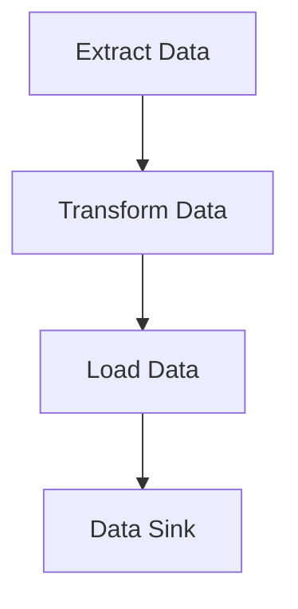

## 17.2 Building ETL Pipelines

In this section, we delve into the construction of ETL (Extract, Transform, Load) pipelines using Erlang. ETL pipelines are essential for data engineering tasks, enabling the movement and transformation of data from various sources to destinations where it can be analyzed and utilized effectively. Erlang's functional and concurrent programming paradigms make it an excellent choice for building robust and scalable ETL systems.

### Overview of ETL Pipeline Stages

ETL pipelines consist of three primary stages:

1. **Extraction**: This stage involves retrieving data from various sources such as databases, files, or APIs. The goal is to gather raw data that will be processed in subsequent stages.

2. **Transformation**: During this stage, the extracted data is cleaned, normalized, and transformed into a format suitable for analysis. This may involve filtering, aggregating, or enriching the data.

3. **Loading**: The final stage involves loading the transformed data into a target system, such as a data warehouse, database, or another storage solution for further analysis or reporting.

### Data Sources and Sinks

ETL pipelines interact with various data sources and sinks. Understanding these components is crucial for designing effective pipelines.

- **Data Sources**: These can include relational databases (e.g., MySQL, PostgreSQL), NoSQL databases (e.g., MongoDB, Cassandra), flat files (e.g., CSV, JSON), and APIs (e.g., RESTful services).

- **Data Sinks**: These are the destinations where the transformed data is stored. They can be similar to data sources, including databases, data warehouses, or even cloud storage solutions.

### Building ETL Pipelines with Erlang

Erlang's concurrency model, based on lightweight processes and message passing, is well-suited for building ETL pipelines. Let's explore how to construct these pipelines using Erlang's features.

#### Using Processes and Message Passing

Erlang processes are independent and communicate through message passing, making them ideal for handling different stages of an ETL pipeline concurrently.

```erlang
-module(etl_pipeline).
-export([start/0, extract/1, transform/1, load/1]).

start() ->
    Extractor = spawn(?MODULE, extract, [self()]),
    Transformer = spawn(?MODULE, transform, [self()]),
    Loader = spawn(?MODULE, load, [self()]),
    
    Extractor ! {start, "data_source"},
    receive
        {done, transformed_data} ->
            Transformer ! {transform, transformed_data}
    end,
    receive
        {done, loaded_data} ->
            Loader ! {load, loaded_data}
    end.

extract(Parent) ->
    receive
        {start, Source} ->
            % Simulate data extraction
            Data = "raw_data",
            Parent ! {done, Data}
    end.

transform(Parent) ->
    receive
        {transform, Data} ->
            % Simulate data transformation
            TransformedData = string:to_upper(Data),
            Parent ! {done, TransformedData}
    end.

load(Parent) ->
    receive
        {load, TransformedData} ->
            % Simulate data loading
            io:format("Loaded data: ~s~n", [TransformedData]),
            Parent ! {done, ok}
    end.
```

In this example, we define three processes: `extract`, `transform`, and `load`. Each process handles a specific stage of the ETL pipeline, communicating through message passing. This approach allows for concurrent execution and efficient resource utilization.

#### Leveraging OTP Behaviors

Erlang's OTP (Open Telecom Platform) provides a set of libraries and design principles for building robust applications. OTP behaviors such as `gen_server` can be used to structure ETL pipeline components.

```erlang
-module(etl_server).
-behaviour(gen_server).

%% API
-export([start_link/0, extract/1, transform/1, load/1]).

%% gen_server callbacks
-export([init/1, handle_call/3, handle_cast/2, handle_info/2, terminate/2, code_change/3]).

start_link() ->
    gen_server:start_link({local, ?MODULE}, ?MODULE, [], []).

extract(Data) ->
    gen_server:call(?MODULE, {extract, Data}).

transform(Data) ->
    gen_server:call(?MODULE, {transform, Data}).

load(Data) ->
    gen_server:call(?MODULE, {load, Data}).

init([]) ->
    {ok, #state{}}.

handle_call({extract, Data}, _From, State) ->
    % Simulate data extraction
    {reply, "extracted_data", State};

handle_call({transform, Data}, _From, State) ->
    % Simulate data transformation
    TransformedData = string:to_upper(Data),
    {reply, TransformedData, State};

handle_call({load, Data}, _From, State) ->
    % Simulate data loading
    io:format("Loaded data: ~s~n", [Data]),
    {reply, ok, State}.

handle_cast(_Msg, State) ->
    {noreply, State}.

handle_info(_Info, State) ->
    {noreply, State}.

terminate(_Reason, _State) ->
    ok.

code_change(_OldVsn, State, _Extra) ->
    {ok, State}.
```

In this example, we use a `gen_server` to encapsulate the ETL pipeline logic. Each stage of the pipeline is represented as a `gen_server` call, allowing for easy management and supervision.

### Error Handling and Data Validation

Error handling and data validation are critical aspects of ETL pipelines. Erlang's "let it crash" philosophy encourages designing systems that can recover from failures gracefully.

#### Error Handling Strategies

- **Supervision Trees**: Use OTP supervisors to monitor pipeline processes and restart them in case of failures.

- **Try-Catch Blocks**: Use try-catch blocks for handling exceptions during data processing.

- **Logging**: Implement logging to capture errors and facilitate debugging.

#### Data Validation Techniques

- **Pattern Matching**: Use pattern matching to validate data structures and ensure data integrity.

- **Guards**: Use guards to enforce constraints on data values.

- **Custom Validation Functions**: Implement custom functions to check data validity and handle invalid data appropriately.

### Visualizing ETL Pipelines

To better understand the flow of data through an ETL pipeline, let's visualize the process using a flowchart.



This diagram illustrates the sequential flow of data from extraction to transformation and finally loading into the data sink.

### Try It Yourself

Experiment with the provided code examples by modifying the data transformation logic or adding additional stages to the pipeline. Consider integrating different data sources and sinks to see how the pipeline handles various data formats.

### References and Further Reading

- [Erlang OTP Design Principles](https://erlang.org/doc/design_principles/des_princ.html)
- [Erlang Programming: A Concurrent Approach to Software Development](https://www.oreilly.com/library/view/erlang-programming/9780596518189/)
- [Functional Programming in Erlang](https://www.erlang.org/doc/reference_manual/functions.html)

### Knowledge Check

- What are the three main stages of an ETL pipeline?
- How can Erlang processes be used to implement ETL stages concurrently?
- What role do OTP behaviors play in structuring ETL pipelines?
- How can pattern matching be used for data validation in Erlang?

### Embrace the Journey

Building ETL pipelines in Erlang is a rewarding endeavor that leverages the language's strengths in concurrency and fault tolerance. As you continue to explore and experiment, you'll gain a deeper understanding of how to construct efficient and reliable data processing systems. Remember, this is just the beginning. Keep experimenting, stay curious, and enjoy the journey!

## Quiz: Building ETL Pipelines



### What are the three main stages of an ETL pipeline?

- [x] Extraction, Transformation, Loading
- [ ] Extraction, Translation, Loading
- [ ] Evaluation, Transformation, Loading
- [ ] Extraction, Transformation, Linking

> **Explanation:** The three main stages of an ETL pipeline are Extraction, Transformation, and Loading.

### How can Erlang processes be used to implement ETL stages concurrently?

- [x] By using message passing between processes
- [ ] By using shared memory between processes
- [ ] By using global variables
- [ ] By using synchronous function calls

> **Explanation:** Erlang processes communicate through message passing, allowing concurrent execution of ETL stages.

### What role do OTP behaviors play in structuring ETL pipelines?

- [x] They provide a framework for building robust and maintainable components
- [ ] They are used for data extraction only
- [ ] They are used for data loading only
- [ ] They are not relevant to ETL pipelines

> **Explanation:** OTP behaviors like `gen_server` provide a structured way to build and manage components in an ETL pipeline.

### How can pattern matching be used for data validation in Erlang?

- [x] By ensuring data structures match expected patterns
- [ ] By using regular expressions
- [ ] By using global variables
- [ ] By using synchronous function calls

> **Explanation:** Pattern matching in Erlang allows for checking data structures against expected patterns, aiding in data validation.

### What is the "let it crash" philosophy in Erlang?

- [x] Encouraging systems to recover from failures automatically
- [ ] Preventing any crashes from occurring
- [ ] Ignoring errors and continuing execution
- [ ] Using global variables to handle errors

> **Explanation:** The "let it crash" philosophy encourages designing systems that can recover from failures automatically, often using supervision trees.

### Which OTP behavior is commonly used for encapsulating ETL pipeline logic?

- [x] `gen_server`
- [ ] `gen_event`
- [ ] `supervisor`
- [ ] `application`

> **Explanation:** `gen_server` is commonly used to encapsulate ETL pipeline logic, providing a structured way to manage state and handle requests.

### What is the purpose of a supervision tree in Erlang?

- [x] To monitor and restart processes in case of failure
- [ ] To manage data extraction
- [ ] To transform data
- [ ] To load data into a sink

> **Explanation:** A supervision tree monitors processes and can restart them in case of failure, ensuring system reliability.

### How can logging be used in ETL pipelines?

- [x] To capture errors and facilitate debugging
- [ ] To transform data
- [ ] To extract data
- [ ] To load data into a sink

> **Explanation:** Logging is used to capture errors and facilitate debugging, providing insights into the pipeline's operation.

### What is a common technique for handling invalid data in Erlang?

- [x] Using custom validation functions
- [ ] Using global variables
- [ ] Using synchronous function calls
- [ ] Using shared memory

> **Explanation:** Custom validation functions can be used to check data validity and handle invalid data appropriately.

### True or False: Erlang's concurrency model is based on shared memory.

- [ ] True
- [x] False

> **Explanation:** Erlang's concurrency model is based on message passing, not shared memory.


