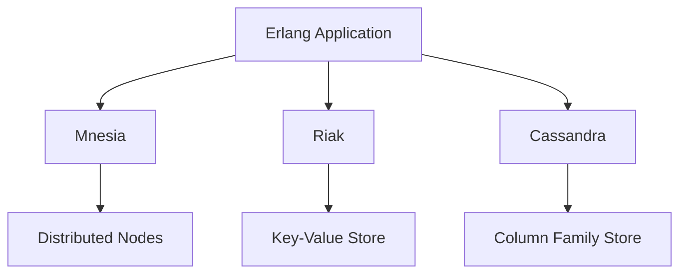

## 17.3 Integrating with Data Stores (Mnesia, Riak, Cassandra)

In this section, we delve into the integration of Erlang ETL (Extract, Transform, Load) processes with various data stores, focusing on Mnesia, Riak, and Cassandra. These databases offer unique features and capabilities that can be leveraged to build robust, scalable, and efficient data-driven applications. We will explore how to interface with these databases, discuss data consistency, partitioning, and replication considerations, and highlight best practices for efficient data access and storage.

### Introduction to Data Stores

Data stores are critical components in any data engineering pipeline. They provide the means to persist, retrieve, and manipulate data efficiently. Erlang, with its strong concurrency model and distributed nature, is well-suited for integrating with various data stores. Let's introduce the three data stores we will focus on:

1. **Mnesia**: A distributed, soft real-time database management system that is part of the Erlang Open Telecom Platform (OTP). It is designed for high availability and fault tolerance, making it ideal for telecom applications.

2. **Riak**: A distributed NoSQL database known for its scalability and fault tolerance. It uses a key-value store model and is built on principles of eventual consistency.

3. **Cassandra**: A highly scalable, distributed NoSQL database designed to handle large amounts of data across many commodity servers. It provides high availability with no single point of failure.

### Interfacing with Mnesia

Mnesia is tightly integrated with Erlang, making it a natural choice for applications that require distributed data storage with strong consistency guarantees. Let's explore how to interface with Mnesia.

#### Setting Up Mnesia

To start using Mnesia, you need to create a schema and define tables. Here's a simple example:

```erlang
% Start Mnesia
mnesia:start().

% Create a schema for the current node
mnesia:create_schema([node()]).

% Define a table
mnesia:create_table(person, [
    {attributes, record_info(fields, person)},
    {disc_copies, [node()]}
]).

% Define the person record
-record(person, {id, name, age}).
```

#### Performing CRUD Operations

Mnesia supports CRUD (Create, Read, Update, Delete) operations. Here's how you can perform these operations:

```erlang
% Insert a record
mnesia:transaction(fun() ->
    mnesia:write(#person{id=1, name="Alice", age=30})
end).

% Read a record
mnesia:transaction(fun() ->
    mnesia:read({person, 1})
end).

% Update a record
mnesia:transaction(fun() ->
    mnesia:write(#person{id=1, name="Alice", age=31})
end).

% Delete a record
mnesia:transaction(fun() ->
    mnesia:delete({person, 1})
end).
```

#### Considerations for Mnesia

- **Consistency**: Mnesia provides strong consistency by default. Transactions ensure that operations are atomic, consistent, isolated, and durable (ACID).
- **Partitioning**: Mnesia supports horizontal partitioning of data across nodes.
- **Replication**: Data can be replicated across multiple nodes for fault tolerance.

### Interfacing with Riak

Riak is a distributed key-value store that offers high availability and eventual consistency. To interface with Riak from Erlang, we use the `riakc` client.

#### Setting Up Riak

First, ensure that Riak is running and accessible. Then, you can connect to Riak using the `riakc` client:

```erlang
% Connect to Riak
{ok, Pid} = riakc_pb_socket:start_link("127.0.0.1", 8087).

% Store a value
riakc_pb_socket:put(Pid, riakc_obj:new(<<"bucket">>, <<"key">>, <<"value">>)).

% Fetch a value
{ok, Obj} = riakc_pb_socket:get(Pid, <<"bucket">>, <<"key">>).
Value = riakc_obj:get_value(Obj).

% Delete a value
riakc_pb_socket:delete(Pid, <<"bucket">>, <<"key">>).
```

#### Considerations for Riak

- **Consistency**: Riak uses eventual consistency, which means that updates are propagated asynchronously.
- **Partitioning**: Riak uses consistent hashing to distribute data across nodes.
- **Replication**: Data is replicated across multiple nodes to ensure availability.

### Interfacing with Cassandra

Cassandra is a distributed database designed for scalability and high availability. The `cqerl` library is a popular choice for interfacing with Cassandra from Erlang.

#### Setting Up Cassandra

Ensure that Cassandra is running and accessible. Then, you can connect to Cassandra using the `cqerl` client:

```erlang
% Connect to Cassandra
{ok, Client} = cqerl:new_client({127, 0, 0, 1}, 9042).

% Create a keyspace
cqerl:query(Client, "CREATE KEYSPACE my_keyspace WITH replication = {'class': 'SimpleStrategy', 'replication_factor': 1};").

% Create a table
cqerl:query(Client, "CREATE TABLE my_keyspace.person (id int PRIMARY KEY, name text, age int);").

% Insert a record
cqerl:query(Client, "INSERT INTO my_keyspace.person (id, name, age) VALUES (1, 'Alice', 30);").

% Read a record
{ok, Result} = cqerl:query(Client, "SELECT * FROM my_keyspace.person WHERE id = 1;").
```

#### Considerations for Cassandra

- **Consistency**: Cassandra offers tunable consistency, allowing you to balance between consistency and availability.
- **Partitioning**: Data is partitioned across nodes using a partition key.
- **Replication**: Data is replicated across multiple nodes for fault tolerance.

### Best Practices for Efficient Data Access and Storage

1. **Understand Your Data Model**: Choose the right data store based on your application's requirements. Mnesia is suitable for applications needing strong consistency, while Riak and Cassandra are better for high availability and eventual consistency.

2. **Optimize Queries**: Use indexing and partitioning to optimize query performance. In Cassandra, design your tables to support your query patterns.

3. **Monitor Performance**: Use monitoring tools to track the performance of your data stores and identify bottlenecks.

4. **Plan for Scalability**: Design your data architecture to scale horizontally by adding more nodes as needed.

5. **Ensure Data Integrity**: Implement proper error handling and validation to ensure data integrity.

### Visualizing Data Store Integration

Below is a diagram illustrating the integration of Erlang with Mnesia, Riak, and Cassandra:



**Diagram Description**: This diagram shows an Erlang application interfacing with three different data stores: Mnesia, Riak, and Cassandra. Mnesia integrates with distributed nodes, Riak uses a key-value store model, and Cassandra employs a column family store model.

### Try It Yourself

Experiment with the code examples provided by modifying them to suit your needs. Try adding new fields to the records, changing the data store configurations, or implementing additional CRUD operations. This hands-on approach will deepen your understanding of integrating Erlang with various data stores.

### Knowledge Check

- What are the key differences between Mnesia, Riak, and Cassandra?
- How does eventual consistency differ from strong consistency?
- What are the benefits of using partitioning and replication in distributed databases?

### Summary

In this section, we explored how to integrate Erlang ETL processes with Mnesia, Riak, and Cassandra. We discussed the unique features of each data store, provided examples of interfacing with them, and highlighted best practices for efficient data access and storage. Remember, the choice of data store depends on your application's specific needs, so consider factors like consistency, availability, and scalability when making your decision.

## Quiz: Integrating with Data Stores (Mnesia, Riak, Cassandra)



### Which Erlang database is part of the OTP and provides strong consistency?

- [x] Mnesia
- [ ] Riak
- [ ] Cassandra
- [ ] None of the above

> **Explanation:** Mnesia is part of the Erlang OTP and provides strong consistency through its transactional model.


### What type of consistency does Riak offer?

- [ ] Strong consistency
- [x] Eventual consistency
- [ ] Immediate consistency
- [ ] None of the above

> **Explanation:** Riak offers eventual consistency, meaning updates are propagated asynchronously across nodes.


### Which library is used to interface with Cassandra from Erlang?

- [ ] riakc
- [x] cqerl
- [ ] mnesia
- [ ] erl_cql

> **Explanation:** The `cqerl` library is used to interface with Cassandra from Erlang.


### What is a key feature of Cassandra that allows it to handle large amounts of data?

- [ ] Strong consistency
- [ ] Single node architecture
- [x] Distributed architecture
- [ ] None of the above

> **Explanation:** Cassandra's distributed architecture allows it to handle large amounts of data across many servers.


### Which data store uses a key-value model?

- [ ] Mnesia
- [x] Riak
- [ ] Cassandra
- [ ] None of the above

> **Explanation:** Riak uses a key-value store model, which is suitable for distributed systems.


### What is the primary advantage of using Mnesia in Erlang applications?

- [x] Tight integration with Erlang
- [ ] High availability
- [ ] Eventual consistency
- [ ] None of the above

> **Explanation:** Mnesia's tight integration with Erlang makes it a natural choice for applications requiring strong consistency.


### Which data store allows for tunable consistency?

- [ ] Mnesia
- [ ] Riak
- [x] Cassandra
- [ ] None of the above

> **Explanation:** Cassandra offers tunable consistency, allowing developers to balance between consistency and availability.


### What is the purpose of partitioning in distributed databases?

- [x] To distribute data across nodes
- [ ] To ensure strong consistency
- [ ] To reduce data redundancy
- [ ] None of the above

> **Explanation:** Partitioning distributes data across nodes, improving scalability and performance.


### Which data store is known for its scalability and fault tolerance?

- [ ] Mnesia
- [x] Riak
- [ ] Cassandra
- [ ] None of the above

> **Explanation:** Riak is known for its scalability and fault tolerance, making it suitable for distributed systems.


### True or False: Mnesia supports horizontal partitioning of data across nodes.

- [x] True
- [ ] False

> **Explanation:** Mnesia supports horizontal partitioning, allowing data to be distributed across multiple nodes.


