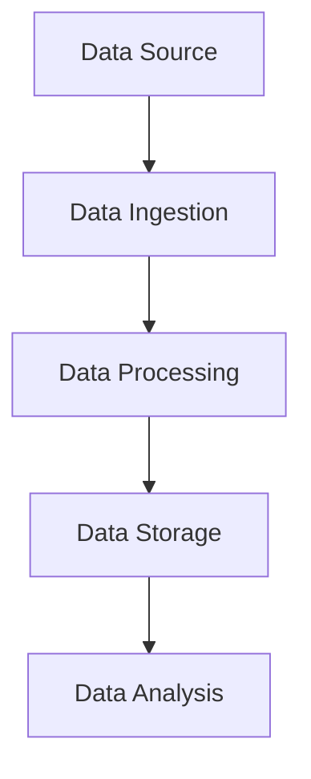

## 17.4 Handling Large Data Sets Efficiently

In today's data-driven world, efficiently handling large datasets is crucial for building scalable and robust applications. Erlang, with its functional and concurrent programming capabilities, offers unique advantages for processing large volumes of data. In this section, we will explore various strategies and techniques for managing large datasets in Erlang, focusing on concurrency, memory management, and scalable infrastructure.

### Understanding the Challenges

Before diving into solutions, it's essential to understand the challenges associated with handling large datasets:

1. **Resource Constraints**: Large datasets can quickly exhaust system memory and processing power.
2. **Concurrency**: Efficiently utilizing multiple cores and processors is vital for performance.
3. **Data Throughput**: Ensuring that data is processed at a rate that matches the application's requirements.
4. **Fault Tolerance**: Handling failures gracefully without data loss or corruption.
5. **Scalability**: The ability to scale horizontally and vertically as data volume grows.

### Strategies for Efficient Data Handling

#### 1. Streaming Data Processing

Streaming data processing involves handling data in real-time as it arrives, rather than processing it in large batches. This approach reduces memory usage and latency, making it ideal for applications that require immediate data insights.

**Key Concepts**:
- **Data Streams**: Continuous flow of data that can be processed incrementally.
- **Backpressure**: Mechanism to control the flow of data to prevent overwhelming the system.

**Example**: Implementing a simple streaming data processor in Erlang.

```erlang
-module(stream_processor).
-export([start/0, process_stream/1]).

start() ->
    % Simulate a data stream
    Stream = lists:seq(1, 1000000),
    process_stream(Stream).

process_stream([]) ->
    ok;
process_stream([H | T]) ->
    % Process each data item
    io:format("Processing: ~p~n", [H]),
    process_stream(T).
```

**Explanation**: This example demonstrates a basic streaming processor that handles a list of numbers. Each number is processed individually, reducing memory usage compared to processing the entire list at once.

#### 2. Leveraging Erlang's Concurrency Model

Erlang's lightweight processes and message-passing model make it well-suited for parallel data processing. By distributing tasks across multiple processes, you can take advantage of multi-core systems to improve throughput and responsiveness.

**Example**: Parallel processing using Erlang processes.

```erlang
-module(parallel_processor).
-export([start/0, process_data/1]).

start() ->
    % Create a list of data to process
    Data = lists:seq(1, 1000000),
    % Spawn processes to handle data in parallel
    Pids = [spawn(fun() -> process_data(DataChunk) end) || DataChunk <- chunk_data(Data, 10000)],
    % Wait for all processes to complete
    [receive done -> ok end || _ <- Pids].

process_data(DataChunk) ->
    lists:foreach(fun(Item) -> io:format("Processing: ~p~n", [Item]) end, DataChunk),
    % Signal completion
    self() ! done.

chunk_data(Data, ChunkSize) ->
    lists:sublist(Data, ChunkSize).
```

**Explanation**: This example demonstrates parallel processing by dividing the data into chunks and spawning separate processes to handle each chunk. This approach maximizes CPU utilization and reduces processing time.

#### 3. Memory Management Techniques

Efficient memory management is crucial when dealing with large datasets. Erlang provides several techniques to manage memory usage effectively:

- **Garbage Collection**: Erlang's per-process garbage collection helps manage memory efficiently by collecting unused data.
- **ETS (Erlang Term Storage)**: Use ETS tables for in-memory storage of large datasets, allowing fast access and updates.

**Example**: Using ETS for efficient data storage.

```erlang
-module(ets_example).
-export([start/0, store_data/1, retrieve_data/1]).

start() ->
    % Create an ETS table
    Table = ets:new(data_table, [set, public]),
    % Store data in the table
    store_data(Table),
    % Retrieve data from the table
    retrieve_data(Table).

store_data(Table) ->
    lists:foreach(fun(N) -> ets:insert(Table, {N, N * N}) end, lists:seq(1, 1000)).

retrieve_data(Table) ->
    lists:foreach(fun(N) -> io:format("Data: ~p~n", [ets:lookup(Table, N)]) end, lists:seq(1, 10)).
```

**Explanation**: This example demonstrates using ETS to store and retrieve data efficiently. ETS tables provide fast access to large datasets, making them ideal for in-memory storage.

#### 4. Batching and Windowing

Batching and windowing are techniques used to process data in manageable chunks, reducing memory usage and improving performance.

- **Batching**: Grouping data into fixed-size batches for processing.
- **Windowing**: Processing data within a specific time window.

**Example**: Implementing batching in Erlang.

```erlang
-module(batch_processor).
-export([start/0, process_batches/1]).

start() ->
    % Create a list of data to process
    Data = lists:seq(1, 1000000),
    % Process data in batches
    process_batches(Data).

process_batches(Data) ->
    BatchSize = 1000,
    Batches = lists:sublist(Data, BatchSize),
    lists:foreach(fun(Batch) -> process_batch(Batch) end, Batches).

process_batch(Batch) ->
    lists:foreach(fun(Item) -> io:format("Processing: ~p~n", [Item]) end, Batch).
```

**Explanation**: This example demonstrates batching by dividing the data into fixed-size batches and processing each batch separately. This approach reduces memory usage and improves performance.

### Scalable Infrastructure Components

When handling large datasets, it's essential to leverage scalable infrastructure components to ensure your application can handle increased data volume. Consider the following:

- **Distributed Systems**: Use distributed systems like Apache Kafka or RabbitMQ for data ingestion and processing.
- **Cloud Services**: Leverage cloud services for scalable storage and processing power.
- **Load Balancing**: Implement load balancing to distribute data processing across multiple nodes.

### Visualizing Data Flow

To better understand the data flow in a streaming data processing system, consider the following diagram:



**Description**: This diagram illustrates the flow of data from the source to ingestion, processing, storage, and analysis. Each stage can be scaled independently to handle large datasets efficiently.

### Knowledge Check

To reinforce your understanding, consider the following questions:

1. What are the benefits of streaming data processing over batch processing?
2. How does Erlang's concurrency model aid in handling large datasets?
3. What are the advantages of using ETS for in-memory data storage?
4. How can batching improve data processing performance?
5. What role do scalable infrastructure components play in handling large datasets?

### Summary

In this section, we've explored various strategies for handling large datasets efficiently in Erlang. By leveraging streaming data processing, Erlang's concurrency model, memory management techniques, and scalable infrastructure components, you can build robust applications capable of processing large volumes of data. Remember, the key to success is understanding the challenges and applying the right techniques to overcome them.

### Embrace the Journey

Handling large datasets is a complex task, but with the right tools and techniques, you can achieve great results. Keep experimenting, stay curious, and enjoy the journey of building scalable and efficient data processing applications in Erlang.

## Quiz: Handling Large Data Sets Efficiently



### What is the primary advantage of streaming data processing?

- [x] Reduces memory usage and latency
- [ ] Increases data throughput
- [ ] Simplifies data storage
- [ ] Enhances data security

> **Explanation:** Streaming data processing reduces memory usage and latency by processing data in real-time as it arrives.

### How does Erlang's concurrency model benefit data processing?

- [x] It allows parallel processing using lightweight processes
- [ ] It simplifies data storage
- [ ] It enhances data security
- [ ] It reduces data latency

> **Explanation:** Erlang's concurrency model allows parallel processing using lightweight processes, improving data processing efficiency.

### What is the role of ETS in Erlang?

- [x] Provides fast in-memory storage for large datasets
- [ ] Simplifies data serialization
- [ ] Enhances data security
- [ ] Reduces data latency

> **Explanation:** ETS provides fast in-memory storage for large datasets, allowing efficient data access and updates.

### What is the purpose of batching in data processing?

- [x] Reduces memory usage and improves performance
- [ ] Increases data throughput
- [ ] Simplifies data storage
- [ ] Enhances data security

> **Explanation:** Batching reduces memory usage and improves performance by processing data in manageable chunks.

### Which infrastructure component is essential for scalable data processing?

- [x] Distributed systems like Apache Kafka
- [ ] Local file storage
- [ ] Single-threaded processing
- [ ] Manual data entry

> **Explanation:** Distributed systems like Apache Kafka are essential for scalable data processing, allowing efficient data ingestion and processing.

### What is backpressure in streaming data processing?

- [x] A mechanism to control data flow and prevent system overload
- [ ] A method to increase data throughput
- [ ] A technique for data serialization
- [ ] A way to enhance data security

> **Explanation:** Backpressure is a mechanism to control data flow and prevent system overload in streaming data processing.

### How can windowing improve data processing?

- [x] By processing data within specific time windows
- [ ] By increasing data throughput
- [ ] By simplifying data storage
- [ ] By enhancing data security

> **Explanation:** Windowing improves data processing by processing data within specific time windows, reducing memory usage and latency.

### What is the benefit of using cloud services for data processing?

- [x] Provides scalable storage and processing power
- [ ] Simplifies data serialization
- [ ] Enhances data security
- [ ] Reduces data latency

> **Explanation:** Cloud services provide scalable storage and processing power, allowing efficient handling of large datasets.

### How does load balancing aid in data processing?

- [x] Distributes data processing across multiple nodes
- [ ] Simplifies data storage
- [ ] Enhances data security
- [ ] Reduces data latency

> **Explanation:** Load balancing distributes data processing across multiple nodes, improving scalability and performance.

### True or False: Erlang's garbage collection is per-process.

- [x] True
- [ ] False

> **Explanation:** Erlang's garbage collection is per-process, allowing efficient memory management for each process.




