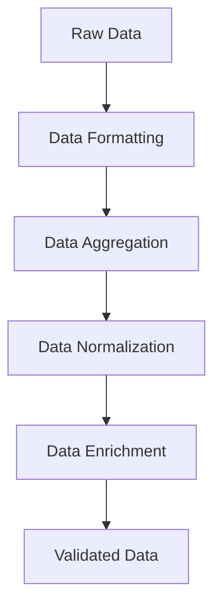

## 17.5 Data Transformation and Enrichment

Data transformation and enrichment are crucial steps in the Extract, Transform, Load (ETL) process, enabling businesses to convert raw data into meaningful insights. In this section, we will explore how Erlang, with its functional programming paradigm, can be effectively used to perform data transformation and enrichment tasks. We will cover common transformation tasks, demonstrate the application of business logic, and highlight the importance of data quality and integrity.

### Introduction to Data Transformation and Enrichment

Data transformation involves converting data from its original format into a format that is more suitable for analysis or storage. This can include tasks such as formatting, aggregation, and normalization. Enrichment, on the other hand, involves enhancing the data by adding additional information or context, often from external sources.

#### Common Data Transformation Tasks

1. **Formatting**: Adjusting data types, date formats, or string representations to ensure consistency.
2. **Aggregation**: Summarizing data by calculating totals, averages, or other statistical measures.
3. **Normalization**: Scaling data to a common range or format to facilitate comparison.
4. **Filtering**: Removing unnecessary or irrelevant data to focus on what's important.
5. **Sorting**: Arranging data in a specific order to improve readability or analysis.

### Applying Business Logic to Data

Business logic refers to the custom rules or algorithms that dictate how data should be processed to meet specific business needs. In Erlang, we can leverage pattern matching and higher-order functions to apply business logic efficiently.

#### Example: Applying Business Logic with Pattern Matching

Let's consider a scenario where we need to apply a discount to a list of product prices based on certain conditions:

```erlang
-module(data_transform).
-export([apply_discount/1]).

apply_discount(Products) ->
    lists:map(fun apply_discount_logic/1, Products).

apply_discount_logic({Product, Price}) when Price > 100 ->
    {Product, Price * 0.9}; % Apply 10% discount for prices over 100
apply_discount_logic({Product, Price}) ->
    {Product, Price}. % No discount for other prices
```

In this example, we use pattern matching to apply a 10% discount to products priced over 100. The `apply_discount/1` function uses `lists:map/2` to apply the `apply_discount_logic/1` function to each product in the list.

### Functional Programming Techniques for Data Transformation

Erlang's functional programming features, such as immutability, higher-order functions, and pattern matching, make it well-suited for data transformation tasks. These features enable concise and expressive code that is easy to reason about.

#### Using Higher-Order Functions

Higher-order functions, such as `map`, `filter`, and `fold`, are powerful tools for transforming data in Erlang.

- **Map**: Applies a function to each element in a list, returning a new list with the results.
- **Filter**: Selects elements from a list that satisfy a given predicate.
- **Fold**: Accumulates a result by applying a function to each element in a list, along with an accumulator.

#### Example: Data Transformation with Higher-Order Functions

Consider a dataset of sales transactions, where we want to calculate the total sales for each product category:

```erlang
-module(sales_transform).
-export([total_sales_by_category/1]).

total_sales_by_category(Sales) ->
    lists:foldl(fun accumulate_sales/2, #{}, Sales).

accumulate_sales({Category, Amount}, Acc) ->
    maps:update_with(Category, fun(Old) -> Old + Amount end, Amount, Acc).
```

In this example, we use `lists:foldl/3` to iterate over the sales transactions, accumulating the total sales for each category in a map. The `maps:update_with/4` function updates the map with the new sales amount.

### Tools and Libraries for Data Manipulation

Erlang provides several libraries and tools that facilitate data manipulation, making it easier to perform complex transformations and enrichments.

#### ETS (Erlang Term Storage)

ETS is a powerful in-memory storage system that allows for fast access to large datasets. It can be used to store intermediate results during data transformation processes.

#### Example: Using ETS for Data Enrichment

Suppose we have a dataset of user activities, and we want to enrich it with user information stored in an ETS table:

```erlang
-module(user_enrichment).
-export([enrich_user_data/1]).

enrich_user_data(Activities) ->
    ets:new(user_info, [named_table, public]),
    % Assume user_info table is populated with user data
    lists:map(fun enrich_activity/1, Activities).

enrich_activity({UserId, Activity}) ->
    case ets:lookup(user_info, UserId) of
        [{UserId, UserData}] ->
            {UserId, UserData, Activity};
        [] ->
            {UserId, undefined, Activity}
    end.
```

In this example, we use an ETS table to store user information and enrich each activity with the corresponding user data. The `enrich_activity/1` function looks up the user data in the ETS table and combines it with the activity.

### Importance of Data Quality and Integrity

Ensuring data quality and integrity is essential for reliable analysis and decision-making. Data transformation and enrichment processes should include validation steps to detect and handle errors or inconsistencies.

#### Data Validation Techniques

1. **Schema Validation**: Ensuring data conforms to a predefined schema or structure.
2. **Range Checks**: Verifying that numerical values fall within acceptable ranges.
3. **Uniqueness Constraints**: Ensuring that certain fields, such as IDs, are unique across the dataset.

#### Example: Data Validation in Erlang

Let's implement a simple validation function that checks if a list of records conforms to a schema:

```erlang
-module(data_validation).
-export([validate_records/1]).

validate_records(Records) ->
    lists:map(fun validate_record/1, Records).

validate_record({Id, Name, Age}) when is_integer(Id), is_binary(Name), Age >= 0 ->
    {ok, {Id, Name, Age}};
validate_record(Record) ->
    {error, Record}.
```

In this example, the `validate_record/1` function checks that each record has an integer ID, a binary name, and a non-negative age. Records that do not meet these criteria are marked as errors.

### Try It Yourself

Now that we've covered the basics of data transformation and enrichment in Erlang, it's time to experiment with the concepts. Try modifying the code examples to:

- Apply different business logic rules.
- Use other higher-order functions for transformation.
- Implement additional validation checks.

### Visualizing Data Transformation Processes

To better understand the flow of data transformation and enrichment, let's visualize the process using a flowchart:



This flowchart illustrates the sequential steps involved in transforming and enriching data, from raw input to validated output.

### References and Further Reading

- [Erlang Documentation](https://www.erlang.org/docs)
- [ETS User Guide](https://erlang.org/doc/man/ets.html)
- [Functional Programming Concepts](https://en.wikipedia.org/wiki/Functional_programming)

### Knowledge Check

- What are the common tasks involved in data transformation?
- How can business logic be applied to data in Erlang?
- What are the benefits of using higher-order functions for data transformation?
- How does ETS facilitate data enrichment?
- Why is data quality and integrity important in ETL processes?

### Embrace the Journey

Remember, mastering data transformation and enrichment in Erlang is a journey. As you continue to explore and experiment, you'll discover more efficient ways to process and analyze data. Keep learning, stay curious, and enjoy the process!

## Quiz: Data Transformation and Enrichment



### What is a common task in data transformation?

- [x] Formatting
- [ ] Deletion
- [ ] Encryption
- [ ] Compression

> **Explanation:** Formatting is a common task in data transformation, involving adjusting data types or formats for consistency.

### Which Erlang feature is useful for applying business logic to data?

- [x] Pattern Matching
- [ ] Macros
- [ ] ETS
- [ ] NIFs

> **Explanation:** Pattern matching in Erlang allows for concise and efficient application of business logic to data.

### What is the purpose of data enrichment?

- [x] Adding additional information or context to data
- [ ] Removing redundant data
- [ ] Encrypting sensitive data
- [ ] Compressing data for storage

> **Explanation:** Data enrichment involves enhancing data by adding additional information or context, often from external sources.

### Which higher-order function is used to apply a function to each element in a list?

- [x] Map
- [ ] Filter
- [ ] Fold
- [ ] Reduce

> **Explanation:** The `map` function applies a given function to each element in a list, returning a new list with the results.

### What is the role of ETS in data transformation?

- [x] Provides fast access to large datasets
- [ ] Encrypts data for security
- [ ] Compresses data for storage
- [ ] Validates data against a schema

> **Explanation:** ETS (Erlang Term Storage) is used for fast access to large datasets, facilitating data transformation and enrichment.

### Why is data validation important in ETL processes?

- [x] Ensures data quality and integrity
- [ ] Increases data storage efficiency
- [ ] Enhances data encryption
- [ ] Reduces data redundancy

> **Explanation:** Data validation is crucial for ensuring data quality and integrity, which is essential for reliable analysis and decision-making.

### Which function is used to accumulate a result by applying a function to each element in a list?

- [x] Fold
- [ ] Map
- [ ] Filter
- [ ] Sort

> **Explanation:** The `fold` function accumulates a result by applying a function to each element in a list, along with an accumulator.

### What is a benefit of using functional programming for data transformation?

- [x] Concise and expressive code
- [ ] Faster execution speed
- [ ] Easier integration with C libraries
- [ ] Automatic memory management

> **Explanation:** Functional programming features, such as immutability and higher-order functions, enable concise and expressive code for data transformation.

### What does the `maps:update_with/4` function do?

- [x] Updates a map with a new value
- [ ] Deletes a key from a map
- [ ] Merges two maps
- [ ] Converts a list to a map

> **Explanation:** The `maps:update_with/4` function updates a map with a new value, using a specified update function.

### True or False: Data enrichment can involve adding external data to enhance the original dataset.

- [x] True
- [ ] False

> **Explanation:** True. Data enrichment often involves adding external data to provide additional context or information to the original dataset.


