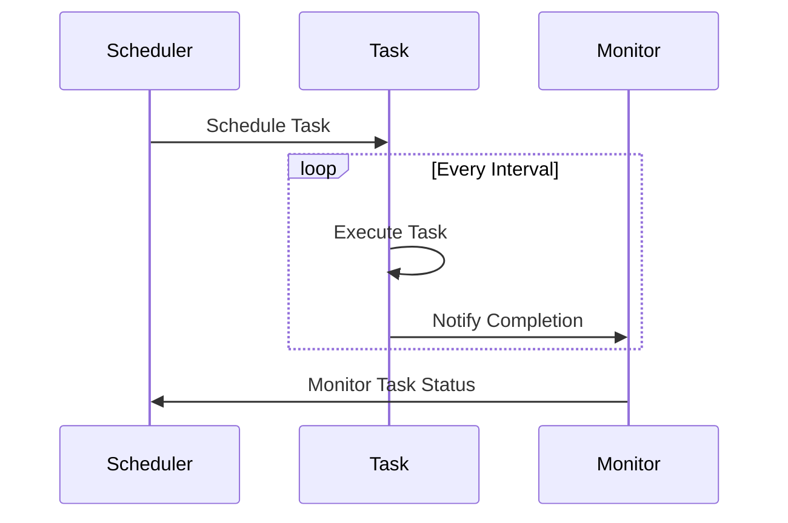

## 17.6 Scheduling and Automation with Erlang Processes

In this section, we delve into the powerful capabilities of Erlang for scheduling and automating ETL (Extract, Transform, Load) tasks. Erlang's robust concurrency model and fault-tolerant design make it an excellent choice for building scalable and reliable automation frameworks. We'll explore how to schedule periodic tasks, automate data extraction and processing jobs, and manage scheduled processes effectively.

### Introduction to Scheduling and Automation in Erlang

Scheduling and automation are critical components of data engineering, especially in ETL processes where data needs to be extracted, transformed, and loaded at regular intervals. Erlang provides several built-in functions and libraries that facilitate the scheduling of tasks, allowing developers to automate repetitive processes efficiently.

### Scheduling Periodic Tasks

Erlang's lightweight processes and message-passing capabilities make it ideal for scheduling periodic tasks. We can use Erlang's built-in functions or third-party libraries like [`cron`](https://github.com/erlware/cron) to schedule tasks at specific intervals.

#### Using Erlang's Built-in Functions

Erlang's `timer` module provides functions for scheduling tasks. The `timer:send_interval/2` function can be used to send a message to a process at regular intervals.

```erlang
-module(scheduler).
-export([start/0, handle_info/2]).

start() ->
    %% Schedule a task to run every 5 seconds
    timer:send_interval(5000, self(), do_task),
    loop().

loop() ->
    receive
        do_task ->
            %% Perform the scheduled task
            io:format("Task executed at ~p~n", [erlang:now()]),
            loop();
        stop ->
            io:format("Scheduler stopped.~n");
        _ ->
            loop()
    end.

handle_info(do_task, State) ->
    %% Handle the task execution
    io:format("Handling task at ~p~n", [erlang:now()]),
    {noreply, State}.
```

In this example, the `start/0` function sets up a task to run every 5 seconds. The `loop/0` function waits for the `do_task` message and executes the task when it arrives.

#### Using the `cron` Library

The `cron` library offers more advanced scheduling capabilities, similar to Unix cron jobs. It allows you to specify complex schedules using cron expressions.

```erlang
%% Add the cron library to your project dependencies
%% {cron, ".*", {git, "https://github.com/erlware/cron.git", {branch, "master"}}}

-module(cron_scheduler).
-export([start/0, handle_info/2]).

start() ->
    %% Schedule a task using a cron expression
    cron:cron("*/5 * * * *", fun() -> execute_task() end).

execute_task() ->
    %% Perform the scheduled task
    io:format("Cron task executed at ~p~n", [erlang:now()]).

handle_info({cron, _JobId}, State) ->
    %% Handle the cron job execution
    io:format("Handling cron job at ~p~n", [erlang:now()]),
    {noreply, State}.
```

The `cron` library allows you to define tasks with cron expressions, providing flexibility in scheduling.

### Automating Data Extraction and Processing Jobs

Automating ETL tasks involves extracting data from various sources, transforming it to fit operational needs, and loading it into a target system. Erlang's concurrency model is well-suited for handling multiple data streams simultaneously.

#### Example: Automating Data Extraction

Let's consider a scenario where we need to extract data from an API every hour and store it in a database.

```erlang
-module(data_extractor).
-export([start/0, extract_data/0]).

start() ->
    %% Schedule data extraction every hour
    timer:send_interval(3600000, self(), extract_data),
    loop().

loop() ->
    receive
        extract_data ->
            %% Extract data from the API
            Data = httpc:request(get, {"http://api.example.com/data", []}, [], []),
            %% Process and store the data
            process_and_store(Data),
            loop();
        _ ->
            loop()
    end.

process_and_store({ok, {_, _, Body}}) ->
    %% Process the data and store it in the database
    io:format("Data extracted and stored: ~p~n", [Body]);
process_and_store({error, Reason}) ->
    io:format("Failed to extract data: ~p~n", [Reason]).
```

In this example, the `extract_data/0` function is scheduled to run every hour, extracting data from an API and processing it.

### Monitoring and Managing Scheduled Processes

Monitoring and managing scheduled processes is crucial to ensure that tasks are executed as expected and any issues are promptly addressed.

#### Process Monitoring

Erlang provides built-in support for process monitoring, allowing you to track the status of scheduled tasks.

```erlang
-module(process_monitor).
-export([start/0, monitor_process/1]).

start() ->
    %% Start and monitor a scheduled task
    Pid = spawn(scheduler, start, []),
    monitor_process(Pid).

monitor_process(Pid) ->
    %% Monitor the process and handle termination
    receive
        {'DOWN', _Ref, process, Pid, Reason} ->
            io:format("Process ~p terminated: ~p~n", [Pid, Reason]);
        _ ->
            monitor_process(Pid)
    end.
```

The `monitor_process/1` function sets up monitoring for a process, allowing you to handle termination events.

#### Managing System Load

When scheduling tasks, it's important to consider the system load and ensure that tasks do not overwhelm the system. Erlang's lightweight processes help mitigate this, but careful planning is still necessary.

- **Load Balancing**: Distribute tasks across multiple nodes to balance the load.
- **Rate Limiting**: Implement rate limiting to control the frequency of task execution.
- **Resource Management**: Monitor system resources and adjust task schedules accordingly.

### Building Robust Automation Frameworks

To build robust automation frameworks, consider the following best practices:

- **Fault Tolerance**: Design tasks to be idempotent and handle failures gracefully.
- **Scalability**: Ensure the framework can scale to handle increased data volumes.
- **Logging and Auditing**: Implement logging to track task execution and audit trails.
- **Security**: Secure data transmission and access to sensitive information.

### Visualizing Scheduling and Automation

To better understand the flow of scheduling and automation in Erlang, let's visualize the process using a sequence diagram.



This diagram illustrates the interaction between the scheduler, task, and monitor, highlighting the periodic execution and monitoring of tasks.

### Try It Yourself

Experiment with the provided examples by modifying the task intervals or adding new tasks. Consider integrating external data sources or databases to automate real-world ETL processes.

### References and Further Reading

- [Erlang Timer Module](https://erlang.org/doc/man/timer.html)
- [Erlang `cron` Library](https://github.com/erlware/cron)
- [Erlang Process Monitoring](https://erlang.org/doc/reference_manual/processes.html#monitoring-processes)

### Knowledge Check

- What are the benefits of using Erlang for scheduling and automation?
- How can you ensure tasks are executed at precise intervals?
- What strategies can you use to manage system load when scheduling tasks?

### Embrace the Journey

Remember, mastering scheduling and automation in Erlang is a journey. As you experiment and build more complex automation frameworks, you'll gain deeper insights into Erlang's capabilities. Keep exploring, stay curious, and enjoy the process!

## Quiz: Scheduling and Automation with Erlang Processes



### What is the primary benefit of using Erlang for scheduling tasks?

- [x] Concurrency and fault tolerance
- [ ] Simplicity and ease of use
- [ ] High-level abstractions
- [ ] Built-in database support

> **Explanation:** Erlang's concurrency model and fault tolerance make it ideal for scheduling tasks.

### Which Erlang module provides functions for scheduling tasks?

- [x] `timer`
- [ ] `calendar`
- [ ] `os`
- [ ] `file`

> **Explanation:** The `timer` module provides functions for scheduling tasks in Erlang.

### How can you monitor a scheduled process in Erlang?

- [x] Using process monitoring with `monitor/1`
- [ ] By checking system logs
- [ ] Through manual inspection
- [ ] By using a third-party tool

> **Explanation:** Erlang provides built-in support for process monitoring using `monitor/1`.

### What is a key consideration when scheduling tasks in Erlang?

- [x] Managing system load
- [ ] Ensuring high-level abstractions
- [ ] Using complex algorithms
- [ ] Avoiding concurrency

> **Explanation:** Managing system load is crucial to ensure tasks do not overwhelm the system.

### Which library allows scheduling tasks using cron expressions?

- [x] `cron`
- [ ] `calendar`
- [ ] `os`
- [ ] `file`

> **Explanation:** The `cron` library allows scheduling tasks using cron expressions.

### What is an important practice for building robust automation frameworks?

- [x] Implementing fault tolerance
- [ ] Using complex algorithms
- [ ] Avoiding logging
- [ ] Limiting scalability

> **Explanation:** Implementing fault tolerance is crucial for building robust automation frameworks.

### How can you ensure tasks are executed at precise intervals?

- [x] Using accurate scheduling mechanisms
- [ ] By manually checking execution times
- [ ] Through complex algorithms
- [ ] By avoiding concurrency

> **Explanation:** Using accurate scheduling mechanisms ensures tasks are executed at precise intervals.

### What is a benefit of using the `cron` library in Erlang?

- [x] Flexibility in scheduling with cron expressions
- [ ] Built-in database support
- [ ] High-level abstractions
- [ ] Simplicity and ease of use

> **Explanation:** The `cron` library provides flexibility in scheduling with cron expressions.

### How can you handle failures in scheduled tasks?

- [x] Design tasks to be idempotent
- [ ] Avoid logging
- [ ] Use complex algorithms
- [ ] Limit scalability

> **Explanation:** Designing tasks to be idempotent helps handle failures gracefully.

### Erlang's concurrency model is well-suited for handling multiple data streams simultaneously.

- [x] True
- [ ] False

> **Explanation:** Erlang's concurrency model is designed to handle multiple data streams efficiently.


