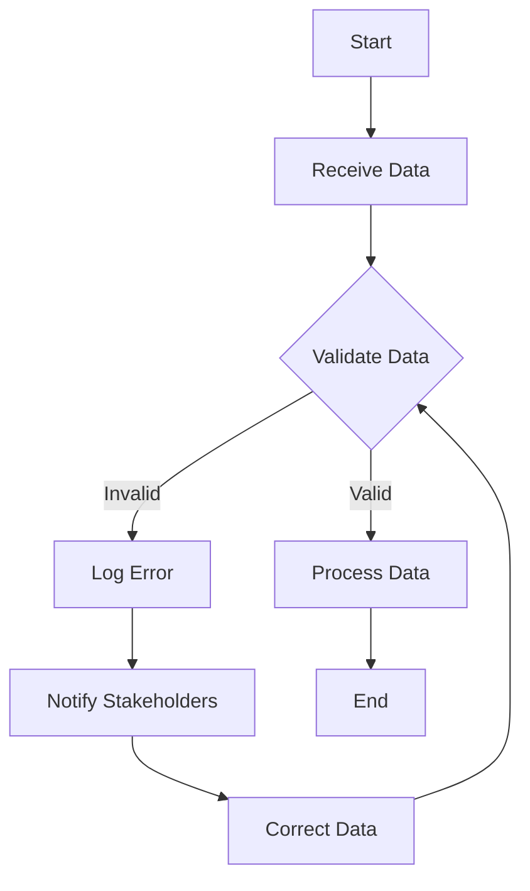

## 17.7 Data Validation and Quality Assurance

In the realm of data engineering, ensuring the integrity and quality of data is paramount. As data flows through ETL (Extract, Transform, Load) processes, it is crucial to validate and assure its quality to prevent downstream errors and maintain trust in data-driven decisions. In this section, we will delve into the principles and practices of data validation and quality assurance within Erlang ETL processes.

### Understanding Data Validation

Data validation is the process of ensuring that data is accurate, complete, and consistent before it is processed or stored. This involves checking data against predefined rules or constraints to identify any discrepancies or errors.

#### Common Data Validation Checks

1. **Format Validation**: Ensure data adheres to a specific format, such as date formats (YYYY-MM-DD), email addresses, or phone numbers.
2. **Completeness Check**: Verify that all required fields are present and contain data.
3. **Consistency Check**: Ensure data is consistent across different datasets or within the same dataset over time.
4. **Range Validation**: Check that numerical data falls within a specified range.
5. **Uniqueness Check**: Ensure that data entries are unique where required, such as unique IDs or email addresses.

### Implementing Validation Rules in Erlang

Erlang, with its robust pattern matching and functional programming capabilities, provides a powerful platform for implementing data validation rules. Let's explore how to implement some common validation checks in Erlang.

#### Example: Format Validation

```erlang
-module(data_validator).
-export([validate_email_format/1]).

% Validate email format using a simple regex pattern
validate_email_format(Email) ->
    case re:run(Email, "^[A-Za-z0-9._%+-]+@[A-Za-z0-9.-]+\.[A-Za-z]{2,}$") of
        {match, _} -> {ok, Email};
        nomatch -> {error, "Invalid email format"}
    end.
```

In this example, we use Erlang's `re` module to perform a regular expression match on an email string, ensuring it adheres to a basic email format.

#### Example: Completeness Check

```erlang
-module(data_validator).
-export([check_completeness/1]).

% Check if all required fields are present in a map
check_completeness(Data) ->
    RequiredFields = [name, email, age],
    case lists:all(fun(Field) -> maps:is_key(Field, Data) end, RequiredFields) of
        true -> {ok, Data};
        false -> {error, "Missing required fields"}
    end.
```

Here, we verify that all required fields are present in a map using the `lists:all/2` function.

### Handling Invalid Data

When invalid data is detected, it is essential to handle it appropriately to maintain data quality. Common strategies include:

1. **Logging**: Record invalid data entries for further analysis.
2. **Alerting**: Notify relevant stakeholders about data quality issues.
3. **Corrective Actions**: Implement automated or manual processes to correct data errors.

#### Example: Logging Invalid Data

```erlang
-module(data_logger).
-export([log_invalid_data/2]).

% Log invalid data to a file
log_invalid_data(Data, Reason) ->
    File = "invalid_data.log",
    LogEntry = io_lib:format("Invalid data: ~p, Reason: ~s~n", [Data, Reason]),
    file:write_file(File, LogEntry, [append]).
```

This function logs invalid data entries to a file, providing a record for future reference.

### The Role of Testing and Monitoring

Testing and monitoring are critical components of data quality assurance. They help identify issues early and ensure that validation rules are functioning as expected.

#### Testing Validation Rules

Implement unit tests to verify the correctness of validation functions. Erlang's `eunit` framework can be used for this purpose.

```erlang
-module(data_validator_tests).
-include_lib("eunit/include/eunit.hrl").

validate_email_format_test() ->
    ?assertEqual({ok, "test@example.com"}, data_validator:validate_email_format("test@example.com")),
    ?assertEqual({error, "Invalid email format"}, data_validator:validate_email_format("invalid-email")).
```

#### Monitoring Data Quality

Set up monitoring systems to track data quality metrics over time. This can include dashboards that display the number of invalid entries detected, trends in data quality, and alerts for significant deviations.

### Proactive Measures to Prevent Data Corruption

Preventing data corruption is more effective than correcting it after the fact. Here are some proactive measures to consider:

1. **Data Validation at Entry Points**: Implement validation checks at the point of data entry to catch errors early.
2. **Regular Audits**: Conduct regular audits of data to identify and address potential issues.
3. **Data Quality Metrics**: Define and track key data quality metrics to monitor the health of your data.
4. **Training and Awareness**: Educate data handlers about the importance of data quality and best practices for maintaining it.

### Visualizing Data Validation Workflow

To better understand the data validation process, let's visualize a typical workflow using a flowchart.



**Figure 1**: A flowchart illustrating the data validation workflow, highlighting the steps involved in handling valid and invalid data.

### Knowledge Check

Before we conclude, let's reinforce our understanding with a few questions:

- What are some common data validation checks?
- How can Erlang's pattern matching be utilized in data validation?
- What are some strategies for handling invalid data?
- Why is monitoring important in data quality assurance?
- What proactive measures can be taken to prevent data corruption?

### Conclusion

Data validation and quality assurance are critical components of any data engineering process. By implementing robust validation rules, handling invalid data effectively, and continuously monitoring data quality, we can ensure the integrity and reliability of our data. Remember, maintaining data quality is an ongoing process that requires vigilance and proactive measures.

## Quiz: Data Validation and Quality Assurance



### What is the primary purpose of data validation?

- [x] To ensure data accuracy, completeness, and consistency
- [ ] To increase data processing speed
- [ ] To reduce storage costs
- [ ] To enhance user interface design

> **Explanation:** Data validation ensures that data is accurate, complete, and consistent before processing or storage.

### Which Erlang module is commonly used for regular expression operations?

- [x] `re`
- [ ] `lists`
- [ ] `maps`
- [ ] `string`

> **Explanation:** The `re` module in Erlang is used for regular expression operations.

### What is a common strategy for handling invalid data?

- [x] Logging
- [ ] Ignoring
- [ ] Deleting
- [ ] Encrypting

> **Explanation:** Logging invalid data is a common strategy to record and analyze data quality issues.

### Why is testing important in data validation?

- [x] To verify the correctness of validation functions
- [ ] To increase the complexity of the code
- [ ] To reduce the number of developers needed
- [ ] To enhance the visual appeal of the application

> **Explanation:** Testing ensures that validation functions work correctly and catch errors as expected.

### What is a proactive measure to prevent data corruption?

- [x] Data validation at entry points
- [ ] Increasing server capacity
- [ ] Using more complex algorithms
- [ ] Reducing the number of data sources

> **Explanation:** Implementing data validation at entry points helps catch errors early and prevent data corruption.

### What does a completeness check ensure?

- [x] All required fields are present and contain data
- [ ] Data is encrypted
- [ ] Data processing is faster
- [ ] Data is stored in multiple locations

> **Explanation:** A completeness check verifies that all required fields are present and contain data.

### How can Erlang's pattern matching be utilized in data validation?

- [x] By matching data against predefined patterns to identify discrepancies
- [ ] By encrypting data
- [ ] By compressing data
- [ ] By visualizing data

> **Explanation:** Erlang's pattern matching can be used to match data against predefined patterns to identify discrepancies.

### What is the role of monitoring in data quality assurance?

- [x] To track data quality metrics and identify issues early
- [ ] To increase data processing speed
- [ ] To reduce storage costs
- [ ] To enhance user interface design

> **Explanation:** Monitoring helps track data quality metrics and identify issues early.

### What is the benefit of regular data audits?

- [x] To identify and address potential data quality issues
- [ ] To increase data processing speed
- [ ] To reduce storage costs
- [ ] To enhance user interface design

> **Explanation:** Regular data audits help identify and address potential data quality issues.

### True or False: Data validation should only be performed at the end of the ETL process.

- [ ] True
- [x] False

> **Explanation:** Data validation should be performed at multiple stages, including at entry points, to catch errors early.



Remember, this is just the beginning. As you progress, you'll build more complex and reliable data validation systems. Keep experimenting, stay curious, and enjoy the journey!
