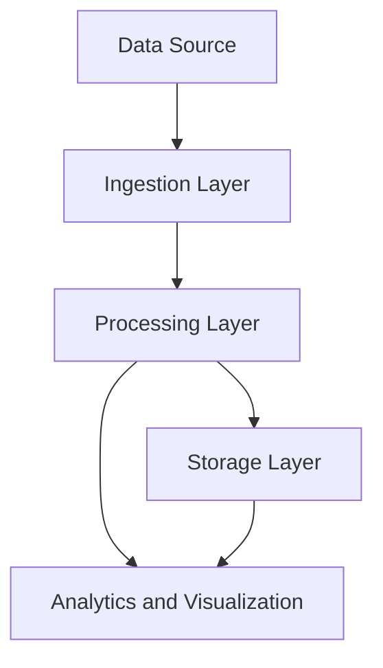

## 17.8 Real-Time Data Processing and Streaming

Real-time data processing and streaming have become essential in today's fast-paced digital world, where the ability to process and analyze data as it arrives can provide significant competitive advantages. Erlang, with its robust concurrency model and efficient message-passing capabilities, is well-suited for building systems that handle real-time data streams. In this section, we will delve into the concepts, tools, and techniques for real-time data processing in Erlang.

### Understanding Real-Time Data Processing

Real-time data processing involves the continuous input, processing, and output of data, typically with minimal latency. This is in contrast to batch processing, where data is collected over a period and processed in bulk. Real-time processing is crucial for applications that require immediate insights or actions, such as financial trading platforms, IoT systems, and live analytics dashboards.

#### Batch Processing vs. Real-Time Streaming

- **Batch Processing**: Involves collecting data over a period and processing it all at once. This approach is suitable for tasks that do not require immediate results, such as monthly financial reports or historical data analysis.

- **Real-Time Streaming**: Involves processing data as it arrives, allowing for immediate insights and actions. This approach is essential for applications like fraud detection, live monitoring, and real-time recommendations.

### Key Concepts in Real-Time Streaming

1. **Latency**: The time it takes for data to be processed and produce an output. Low latency is critical in real-time systems to ensure timely responses.

2. **Throughput**: The amount of data processed in a given time frame. High throughput is necessary to handle large volumes of data efficiently.

3. **Scalability**: The ability to handle increasing amounts of data by adding resources. Erlang's lightweight processes and distributed nature make it inherently scalable.

4. **Fault Tolerance**: The ability to continue operating in the event of failures. Erlang's "let it crash" philosophy and supervision trees provide robust fault tolerance.

### Erlang's Strengths in Real-Time Processing

Erlang's design makes it particularly well-suited for real-time data processing:

- **Concurrency**: Erlang's lightweight processes allow for massive concurrency, enabling the handling of numerous data streams simultaneously.

- **Message Passing**: Erlang's message-passing model facilitates communication between processes without shared state, reducing the risk of data corruption and race conditions.

- **Fault Tolerance**: Built-in support for fault tolerance through OTP (Open Telecom Platform) behaviors like supervisors ensures system reliability.

### Handling Streaming Data Sources

Erlang can interface with various streaming data sources, such as Kafka and MQTT, to ingest and process data in real time.

#### Example: Integrating with Kafka

Apache Kafka is a popular distributed event streaming platform. Erlang can interact with Kafka using libraries like `brod` or `kafka_ex`.

```erlang
% Example of consuming messages from a Kafka topic using brod

-module(kafka_consumer).
-behaviour(gen_server).

%% API
-export([start_link/0, stop/0]).

%% gen_server callbacks
-export([init/1, handle_call/3, handle_cast/2, handle_info/2, terminate/2, code_change/3]).

start_link() ->
    gen_server:start_link({local, ?MODULE}, ?MODULE, [], []).

stop() ->
    gen_server:call(?MODULE, stop).

init([]) ->
    {ok, _} = brod:start_client([{"localhost", 9092}], client_id),
    {ok, _} = brod:start_consumer(client_id, "my_topic", self()),
    {ok, #state{}}.

handle_call(stop, _From, State) ->
    {stop, normal, ok, State};

handle_call(_Request, _From, State) ->
    {reply, ok, State}.

handle_cast(_Msg, State) ->
    {noreply, State}.

handle_info({brod_message, _Topic, _Partition, _Offset, Key, Value}, State) ->
    io:format("Received message: ~p ~p~n", [Key, Value]),
    {noreply, State};

handle_info(_Info, State) ->
    {noreply, State}.

terminate(_Reason, _State) ->
    ok.

code_change(_OldVsn, State, _Extra) ->
    {ok, State}.
```

In this example, we use the `brod` library to consume messages from a Kafka topic. The `handle_info/2` callback processes incoming messages, demonstrating Erlang's ability to handle streaming data efficiently.

#### Example: Integrating with MQTT

MQTT is a lightweight messaging protocol often used in IoT applications. Erlang can work with MQTT using libraries like `emqtt` or `emqttd`.

```erlang
% Example of subscribing to an MQTT topic using emqtt

-module(mqtt_subscriber).
-behaviour(gen_server).

%% API
-export([start_link/0, stop/0]).

%% gen_server callbacks
-export([init/1, handle_call/3, handle_cast/2, handle_info/2, terminate/2, code_change/3]).

start_link() ->
    gen_server:start_link({local, ?MODULE}, ?MODULE, [], []).

stop() ->
    gen_server:call(?MODULE, stop).

init([]) ->
    {ok, _} = emqtt:start_link([{host, "localhost"}, {port, 1883}]),
    emqtt:subscribe("my/topic", 0),
    {ok, #state{}}.

handle_call(stop, _From, State) ->
    {stop, normal, ok, State};

handle_call(_Request, _From, State) ->
    {reply, ok, State}.

handle_cast(_Msg, State) ->
    {noreply, State}.

handle_info({mqtt, _Topic, Message}, State) ->
    io:format("Received MQTT message: ~p~n", [Message]),
    {noreply, State};

handle_info(_Info, State) ->
    {noreply, State}.

terminate(_Reason, _State) ->
    ok.

code_change(_OldVsn, State, _Extra) ->
    {ok, State}.
```

This example demonstrates subscribing to an MQTT topic and processing incoming messages using the `emqtt` library.

### Frameworks and Libraries for Stream Processing

Several Erlang frameworks and libraries facilitate real-time stream processing:

- **RabbitMQ**: A message broker that supports various messaging protocols, including AMQP. Erlang's native support for RabbitMQ makes it a powerful tool for stream processing.

- **Riak**: A distributed database that can be used for real-time data storage and retrieval.

- **Fluentd**: An open-source data collector that can be integrated with Erlang for log and event data processing.

### Use Cases for Real-Time Data Processing

Real-time data processing is applicable in various domains:

- **Real-Time Analytics**: Analyzing data as it arrives to provide immediate insights, such as monitoring website traffic or social media trends.

- **Monitoring and Alerting**: Continuously monitoring systems and triggering alerts based on predefined conditions, such as detecting anomalies in server performance.

- **IoT Applications**: Processing data from IoT devices in real time to enable smart home automation or industrial monitoring.

### Considerations for Latency and Throughput

When designing real-time data processing systems, consider the following:

- **Minimize Latency**: Optimize data processing pipelines to reduce latency. This may involve using in-memory data stores or optimizing network communication.

- **Maximize Throughput**: Ensure the system can handle high data volumes by scaling horizontally and using efficient data structures.

- **Balance Load**: Distribute processing tasks evenly across available resources to prevent bottlenecks.

- **Ensure Fault Tolerance**: Implement robust error handling and recovery mechanisms to maintain system reliability.

### Visualizing Real-Time Data Processing

To better understand the flow of data in a real-time processing system, consider the following diagram:



**Description**: This diagram illustrates a typical real-time data processing pipeline, where data flows from the source through ingestion and processing layers before being stored or visualized.

### Try It Yourself

Experiment with the provided code examples by modifying the Kafka or MQTT configurations to connect to your own data sources. Try implementing additional processing logic in the `handle_info/2` callbacks to perform real-time analytics or monitoring.

### Knowledge Check

- What are the key differences between batch processing and real-time streaming?
- How does Erlang's concurrency model benefit real-time data processing?
- What are some common use cases for real-time data processing?
- How can you minimize latency in a real-time processing system?

### Summary

Real-time data processing and streaming in Erlang leverage its concurrency and messaging capabilities to handle data efficiently and reliably. By understanding the key concepts and utilizing the right tools and frameworks, you can build robust systems that provide immediate insights and actions.

## Quiz: Real-Time Data Processing and Streaming



### What is a key difference between batch processing and real-time streaming?

- [x] Batch processing collects data over time, while real-time streaming processes data as it arrives.
- [ ] Batch processing is faster than real-time streaming.
- [ ] Real-time streaming is only used for small data sets.
- [ ] Batch processing requires more resources than real-time streaming.

> **Explanation:** Batch processing involves collecting data over a period and processing it all at once, whereas real-time streaming processes data as it arrives.

### Which Erlang feature is particularly beneficial for real-time data processing?

- [x] Concurrency model
- [ ] Object-oriented programming
- [ ] Static typing
- [ ] Manual memory management

> **Explanation:** Erlang's concurrency model, with lightweight processes and message passing, is particularly beneficial for real-time data processing.

### What is a common use case for real-time data processing?

- [x] Real-time analytics
- [ ] Monthly financial reports
- [ ] Historical data analysis
- [ ] Data archiving

> **Explanation:** Real-time analytics is a common use case for real-time data processing, as it requires immediate insights from incoming data.

### How can you minimize latency in a real-time processing system?

- [x] Optimize data processing pipelines
- [ ] Increase batch size
- [ ] Use disk-based storage
- [ ] Reduce network bandwidth

> **Explanation:** Minimizing latency involves optimizing data processing pipelines to ensure quick data handling and response.

### Which library can be used to integrate Erlang with Kafka?

- [x] brod
- [ ] emqtt
- [ ] cowboy
- [ ] mochiweb

> **Explanation:** The `brod` library is commonly used to integrate Erlang with Kafka for consuming and producing messages.

### What is the "let it crash" philosophy in Erlang?

- [x] Allowing processes to fail and restart automatically
- [ ] Preventing any process from crashing
- [ ] Manually handling all errors
- [ ] Avoiding concurrency

> **Explanation:** The "let it crash" philosophy in Erlang involves allowing processes to fail and restart automatically, ensuring system reliability.

### What is a benefit of using MQTT in IoT applications?

- [x] Lightweight messaging protocol
- [ ] High latency
- [ ] Complex setup
- [ ] Requires large bandwidth

> **Explanation:** MQTT is a lightweight messaging protocol, making it suitable for IoT applications with constrained resources.

### What is a key consideration for throughput in real-time systems?

- [x] High data volume handling
- [ ] Low data volume handling
- [ ] Manual data processing
- [ ] Single-threaded execution

> **Explanation:** High throughput is necessary to handle large volumes of data efficiently in real-time systems.

### Which Erlang library is used for message brokering?

- [x] RabbitMQ
- [ ] Kafka
- [ ] Fluentd
- [ ] Riak

> **Explanation:** RabbitMQ is a message broker that supports various messaging protocols and is used in Erlang for stream processing.

### True or False: Erlang's message-passing model reduces the risk of data corruption.

- [x] True
- [ ] False

> **Explanation:** Erlang's message-passing model reduces the risk of data corruption by avoiding shared state and race conditions.



Remember, this is just the beginning. As you progress, you'll build more complex and interactive real-time data processing systems. Keep experimenting, stay curious, and enjoy the journey!
