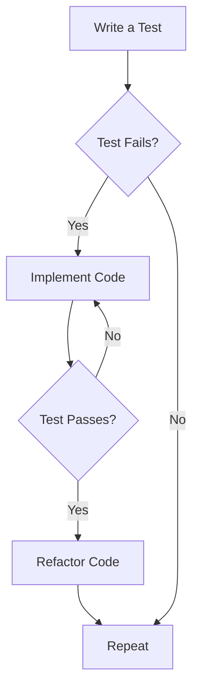

## 18.1 Test-Driven Development (TDD) with EUnit

Test-Driven Development (TDD) is a software development approach where tests are written before the actual code. This methodology emphasizes writing a test for a specific functionality, implementing the code to pass the test, and then refactoring the code while ensuring the test still passes. In Erlang, EUnit is a powerful tool for implementing TDD, providing a framework for writing and running unit tests.

### Understanding Test-Driven Development (TDD)

#### Principles of TDD

1. **Write a Test First**: Begin by writing a test for a new feature or functionality. This test will initially fail since the feature is not yet implemented.
2. **Implement the Code**: Write the minimum amount of code necessary to pass the test.
3. **Refactor**: Clean up the code, improving its structure and readability while ensuring the test still passes.
4. **Repeat**: Continue this cycle for each new feature or functionality.

#### Benefits of TDD

- **Improved Code Quality**: Writing tests first ensures that the code meets the specified requirements and reduces the likelihood of defects.
- **Better Design**: TDD encourages developers to think about the design and architecture of their code before implementation.
- **Easier Maintenance**: With a comprehensive suite of tests, future changes and refactoring become safer and more manageable.
- **Documentation**: Tests serve as documentation, providing clear examples of how the code is intended to be used.

### Introduction to EUnit

EUnit is a lightweight unit testing framework for Erlang, designed to be easy to use and integrate into the development process. It allows developers to write concise and expressive tests, making it an ideal choice for TDD.

#### Key Features of EUnit

- **Simplicity**: EUnit tests are written in Erlang, making them easy to read and write.
- **Integration**: EUnit integrates seamlessly with Erlang projects, allowing tests to be run as part of the build process.
- **Flexibility**: EUnit supports a variety of test structures, including simple assertions, test generators, and fixtures.

### Writing EUnit Tests

Let's explore how to write EUnit tests by considering a simple example. Suppose we want to implement a module that performs basic arithmetic operations.

#### Step 1: Write a Test

Before implementing the arithmetic operations, we write a test to specify the expected behavior.

```erlang
-module(arithmetic_tests).
-include_lib("eunit/include/eunit.hrl").

add_test() ->
    ?assertEqual(5, arithmetic:add(2, 3)).

subtract_test() ->
    ?assertEqual(1, arithmetic:subtract(3, 2)).
```

In this example, we define two tests: `add_test` and `subtract_test`. Each test uses the `?assertEqual` macro to verify that the result of the arithmetic operation matches the expected value.

#### Step 2: Implement the Code

Next, we implement the `arithmetic` module to pass the tests.

```erlang
-module(arithmetic).
-export([add/2, subtract/2]).

add(X, Y) ->
    X + Y.

subtract(X, Y) ->
    X - Y.
```

The `arithmetic` module provides two functions, `add/2` and `subtract/2`, which perform the addition and subtraction operations, respectively.

#### Step 3: Run the Tests

To run the tests, use the following command in the Erlang shell:

```shell
$ erl -make
$ erl -noshell -s arithmetic_tests test -s init stop
```

If the tests pass, the shell will exit without errors. If any tests fail, EUnit will provide detailed output indicating which tests failed and why.

### Enhancing Code Quality with TDD

TDD enhances code quality by ensuring that each piece of functionality is thoroughly tested before implementation. This approach helps identify defects early in the development process, reducing the cost and effort required to fix them.

#### Best Practices for TDD with EUnit

1. **Write Clear and Concise Tests**: Each test should focus on a single aspect of functionality, making it easier to identify the cause of any failures.
2. **Use Descriptive Test Names**: Test names should clearly describe the behavior being tested, serving as documentation for the code.
3. **Organize Tests into Suites**: Group related tests into test suites to improve organization and readability.
4. **Run Tests Frequently**: Run tests frequently during development to catch defects early and ensure that changes do not introduce new issues.

### Structuring Tests and Test Suites

EUnit provides several options for structuring tests and test suites, allowing developers to organize their tests in a way that best suits their project.

#### Simple Test Functions

Simple test functions are the most basic form of EUnit tests. They are defined as functions that return a list of assertions.

```erlang
simple_test() ->
    [ ?assertEqual(4, arithmetic:add(2, 2)),
      ?assertEqual(0, arithmetic:subtract(2, 2)) ].
```

#### Test Generators

Test generators allow for more complex test scenarios by generating a list of tests to be executed.

```erlang
add_tests_() ->
    [?_assertEqual(5, arithmetic:add(2, 3)),
     ?_assertEqual(7, arithmetic:add(3, 4))].
```

#### Test Fixtures

Test fixtures provide a way to set up and tear down the environment for a group of tests, ensuring that each test runs in a consistent state.

```erlang
setup_test_() ->
    {setup,
     fun setup/0,
     fun cleanup/1,
     fun test/0}.

setup() ->
    % Setup code here
    ok.

cleanup(_State) ->
    % Cleanup code here
    ok.

test() ->
    ?assertEqual(5, arithmetic:add(2, 3)).
```

### Encouraging TDD in Development Workflows

Adopting TDD in development workflows can lead to significant improvements in code quality and maintainability. Here are some tips for encouraging TDD in your team:

1. **Lead by Example**: Demonstrate the benefits of TDD by using it in your own work and sharing your experiences with your team.
2. **Provide Training**: Offer training sessions or workshops to help team members learn how to effectively use TDD and EUnit.
3. **Integrate TDD into the Build Process**: Configure your build system to run tests automatically, ensuring that all code is tested before it is deployed.
4. **Celebrate Successes**: Recognize and celebrate the successes of team members who adopt TDD, reinforcing the value of this approach.

### Try It Yourself

To deepen your understanding of TDD with EUnit, try modifying the `arithmetic` module to include additional operations, such as multiplication and division. Write tests for these new operations before implementing them, following the TDD process.

### Visualizing the TDD Process

Below is a flowchart illustrating the TDD process, from writing a test to refactoring the code.



This flowchart highlights the iterative nature of TDD, emphasizing the importance of writing tests first and continuously improving the code.

### References and Further Reading

- [Erlang EUnit Documentation](http://erlang.org/doc/apps/eunit/chapter.html)
- [Test-Driven Development by Example by Kent Beck](https://www.amazon.com/Test-Driven-Development-Kent-Beck/dp/0321146530)
- [The Art of Unit Testing by Roy Osherove](https://www.amazon.com/Art-Unit-Testing-examples/dp/1617290890)

### Knowledge Check

- What are the three main steps of the TDD process?
- How does TDD improve code quality and design?
- What are some best practices for writing EUnit tests?
- How can test fixtures be used to ensure consistent test environments?

### Embrace the Journey

Remember, adopting TDD is a journey that requires practice and patience. As you become more comfortable with this approach, you'll find that it leads to more robust and maintainable code. Keep experimenting, stay curious, and enjoy the journey!

## Quiz: Test-Driven Development (TDD) with EUnit



### What is the first step in the TDD process?

- [x] Write a test
- [ ] Implement the code
- [ ] Refactor the code
- [ ] Run the tests

> **Explanation:** The first step in TDD is to write a test for the desired functionality.

### Which of the following is a benefit of TDD?

- [x] Improved code quality
- [x] Better design
- [ ] Increased development time
- [ ] Less documentation

> **Explanation:** TDD leads to improved code quality and better design by ensuring that code meets specified requirements.

### What does EUnit provide for Erlang developers?

- [x] A framework for writing and running unit tests
- [ ] A tool for code refactoring
- [ ] A library for data serialization
- [ ] A debugger for Erlang applications

> **Explanation:** EUnit is a unit testing framework for Erlang, allowing developers to write and run tests.

### How does TDD help with code maintenance?

- [x] By providing a comprehensive suite of tests
- [ ] By reducing the need for comments
- [ ] By eliminating the need for documentation
- [ ] By increasing code complexity

> **Explanation:** TDD provides a comprehensive suite of tests that make future changes and refactoring safer and more manageable.

### What is a test fixture in EUnit?

- [x] A setup and teardown environment for tests
- [ ] A type of test generator
- [ ] A tool for code profiling
- [ ] A method for data serialization

> **Explanation:** Test fixtures in EUnit provide a way to set up and tear down the environment for a group of tests.

### What is the purpose of refactoring in TDD?

- [x] To improve code structure and readability
- [ ] To add new features
- [ ] To remove tests
- [ ] To increase code complexity

> **Explanation:** Refactoring in TDD is done to improve the structure and readability of the code while ensuring tests still pass.

### How can TDD be integrated into the build process?

- [x] By configuring the build system to run tests automatically
- [ ] By writing tests after deployment
- [ ] By ignoring test failures
- [ ] By using manual testing only

> **Explanation:** Integrating TDD into the build process involves configuring the build system to run tests automatically.

### What is the role of assertions in EUnit tests?

- [x] To verify that the code behaves as expected
- [ ] To generate test data
- [ ] To refactor code
- [ ] To document code

> **Explanation:** Assertions in EUnit tests are used to verify that the code behaves as expected.

### What is a key characteristic of a well-written test?

- [x] It focuses on a single aspect of functionality
- [ ] It tests multiple features at once
- [ ] It is written after the code is implemented
- [ ] It is complex and difficult to understand

> **Explanation:** A well-written test focuses on a single aspect of functionality, making it easier to identify the cause of any failures.

### True or False: TDD eliminates the need for code documentation.

- [ ] True
- [x] False

> **Explanation:** While TDD provides tests that serve as documentation, it does not eliminate the need for code documentation.




