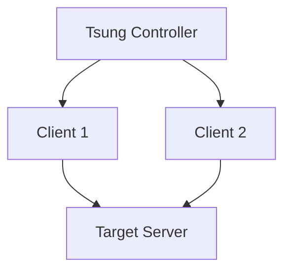

## 18.10 Load Testing with Tsung

In the realm of software development, ensuring that your application can handle the expected load is crucial. Load testing is a key part of this process, and Tsung is a powerful tool that can help you achieve this. In this section, we'll explore how to use Tsung, a multi-protocol distributed load testing tool, to simulate user load and improve system performance in Erlang applications.

### Introduction to Tsung

[Tsung](http://tsung.erlang-projects.org/) is an open-source, multi-protocol distributed load testing tool written in Erlang. It is designed to simulate a large number of users and can be used to test various protocols, including HTTP, WebSocket, XMPP, and more. Tsung is highly scalable, allowing you to run distributed tests across multiple machines, making it ideal for testing the performance of large-scale systems.

#### Key Features of Tsung

- **Multi-Protocol Support**: Tsung supports multiple protocols, including HTTP, WebSocket, XMPP, and more, making it versatile for different types of applications.
- **Distributed Testing**: Tsung can run tests across multiple machines, allowing you to simulate thousands of users.
- **Realistic User Simulation**: Tsung can simulate realistic user behavior, including session handling, think times, and more.
- **Comprehensive Metrics**: Tsung provides detailed metrics and reports, helping you analyze the performance of your system.
- **Extensibility**: Tsung is highly configurable and can be extended to support custom protocols and scenarios.

### Configuring Test Scenarios

To effectively use Tsung, you need to configure test scenarios that simulate the expected user behavior. This involves defining the protocol, user sessions, and the load pattern. Let's explore how to configure a basic test scenario for an HTTP application.

#### Example: Configuring an HTTP Test Scenario

1. **Install Tsung**: Before you start, ensure that Tsung is installed on your system. You can download it from the [official website](http://tsung.erlang-projects.org/).

2. **Create a Configuration File**: Tsung uses XML configuration files to define test scenarios. Here's a basic example for an HTTP test:

   ```xml
   <?xml version="1.0"?>
   <!DOCTYPE tsung SYSTEM "/usr/local/share/tsung/tsung-1.0.dtd">
   <tsung loglevel="notice" version="1.0">
     <clients>
       <client host="localhost" use_controller_vm="true" maxusers="1000"/>
     </clients>
     <servers>
       <server host="yourserver.com" port="80" type="tcp"/>
     </servers>
     <load>
       <arrivalphase phase="1" duration="10" unit="minute">
         <users interarrival="1" unit="second"/>
       </arrivalphase>
     </load>
     <sessions>
       <session name="example_session" probability="100" type="ts_http">
         <request>
           <http url="/" method="GET"/>
         </request>
       </session>
     </sessions>
   </tsung>
   ```

   - **Clients**: Define the client machines that will generate the load. In this example, we're using the local machine.
   - **Servers**: Specify the target server and port.
   - **Load**: Define the load pattern, including the number of users and the duration of the test.
   - **Sessions**: Define user sessions, including the requests to be made.

3. **Run the Test**: Use the following command to run the test:

   ```bash
   tsung start -f your_config_file.xml
   ```

4. **Monitor the Test**: Tsung provides real-time monitoring of the test. You can view the progress and metrics in the terminal.

### Running Distributed Tests

One of Tsung's strengths is its ability to run distributed tests across multiple machines. This allows you to simulate a large number of users and test the scalability of your system.

#### Setting Up Distributed Testing

1. **Configure SSH Access**: Ensure that you have SSH access to all client machines. Tsung uses SSH to communicate with remote clients.

2. **Update the Configuration File**: Modify the `<clients>` section to include multiple client machines:

   ```xml
   <clients>
     <client host="client1.example.com" maxusers="500"/>
     <client host="client2.example.com" maxusers="500"/>
   </clients>
   ```

3. **Start the Test**: Use the `tsung start` command as before. Tsung will automatically distribute the load across the specified client machines.

### Collecting and Analyzing Metrics

After running a test, Tsung generates detailed reports and metrics that can help you analyze the performance of your system.

#### Viewing the Results

1. **Generate the Report**: After the test completes, use the following command to generate an HTML report:

   ```bash
   tsung_stats.pl --stats_dir=~/.tsung/log/YYYYMMDD-HHMM
   ```

2. **Analyze the Report**: Open the generated HTML report in a web browser. The report includes various metrics, such as response times, throughput, and error rates.

   

   *Figure: Example of a Tsung report showing response times and throughput.*

### Improving System Performance

Analyzing the results from Tsung can help you identify bottlenecks and areas for improvement in your system. Here are some common strategies for improving performance:

- **Optimize Database Queries**: Slow database queries can significantly impact performance. Use indexing and query optimization techniques to improve response times.
- **Enhance Caching**: Implement caching strategies to reduce the load on your servers and improve response times.
- **Scale Horizontally**: If your application is CPU or memory-bound, consider scaling horizontally by adding more servers.
- **Optimize Code**: Review your code for inefficiencies and optimize critical paths.

### Encouraging Load Testing Before Production

Conducting load tests before deploying your application to production is crucial. It helps ensure that your system can handle the expected load and provides an opportunity to address performance issues before they impact users.

### Try It Yourself

Experiment with Tsung by modifying the configuration file to simulate different user behaviors and load patterns. Try testing other protocols, such as WebSocket or XMPP, to gain a deeper understanding of Tsung's capabilities.

### Visualizing Tsung's Architecture

To better understand how Tsung operates, let's visualize its architecture using a Mermaid.js diagram:



*Figure: Tsung's architecture showing the controller distributing load across multiple clients.*

### References and Further Reading

- [Tsung Official Website](http://tsung.erlang-projects.org/)
- [Tsung User Guide](http://tsung.erlang-projects.org/user_manual.html)
- [Erlang and Tsung Integration](https://erlang.org/doc/apps/tsung/)

### Knowledge Check

- What are the key features of Tsung?
- How do you configure a basic HTTP test scenario in Tsung?
- What are the benefits of running distributed tests with Tsung?
- How can you analyze the results from a Tsung test?
- What strategies can you use to improve system performance based on Tsung's metrics?

### Embrace the Journey

Remember, load testing is an ongoing process. As your application evolves, continue to test and optimize its performance. Keep experimenting with different scenarios, stay curious, and enjoy the journey of building robust and scalable Erlang applications!

## Quiz: Load Testing with Tsung



### What is Tsung primarily used for?

- [x] Load testing
- [ ] Unit testing
- [ ] Integration testing
- [ ] Security testing

> **Explanation:** Tsung is a tool specifically designed for load testing, allowing developers to simulate user load on their applications.

### Which protocols does Tsung support?

- [x] HTTP
- [x] WebSocket
- [ ] FTP
- [x] XMPP

> **Explanation:** Tsung supports multiple protocols, including HTTP, WebSocket, and XMPP, but not FTP.

### How do you run a Tsung test?

- [x] Use the `tsung start` command
- [ ] Use the `tsung run` command
- [ ] Use the `tsung execute` command
- [ ] Use the `tsung launch` command

> **Explanation:** The `tsung start` command is used to initiate a Tsung test.

### What is a key benefit of distributed testing with Tsung?

- [x] Simulating a large number of users
- [ ] Reducing test execution time
- [ ] Simplifying test configuration
- [ ] Enhancing test security

> **Explanation:** Distributed testing allows Tsung to simulate a large number of users by distributing the load across multiple machines.

### What can you analyze with Tsung's reports?

- [x] Response times
- [x] Throughput
- [ ] Code coverage
- [x] Error rates

> **Explanation:** Tsung's reports provide insights into response times, throughput, and error rates, but not code coverage.

### What is a common strategy to improve performance based on Tsung's metrics?

- [x] Optimize database queries
- [ ] Increase server disk space
- [ ] Reduce code comments
- [ ] Decrease test duration

> **Explanation:** Optimizing database queries is a common strategy to improve performance based on load testing metrics.

### What is the purpose of the `<sessions>` tag in a Tsung configuration file?

- [x] Define user sessions and requests
- [ ] Specify client machines
- [ ] Set test duration
- [ ] Configure server details

> **Explanation:** The `<sessions>` tag is used to define user sessions and the requests they will make during the test.

### How can Tsung help before production deployment?

- [x] Identify performance bottlenecks
- [ ] Ensure code readability
- [ ] Validate user interfaces
- [ ] Check for syntax errors

> **Explanation:** Tsung helps identify performance bottlenecks, ensuring the system can handle the expected load before production deployment.

### Is Tsung capable of real-time monitoring during tests?

- [x] True
- [ ] False

> **Explanation:** Tsung provides real-time monitoring of tests, allowing you to view progress and metrics as the test runs.

### What is the first step in setting up distributed testing with Tsung?

- [x] Configure SSH access to client machines
- [ ] Install Tsung on the server
- [ ] Write test scripts
- [ ] Generate HTML reports

> **Explanation:** Configuring SSH access to client machines is the first step in setting up distributed testing with Tsung.


