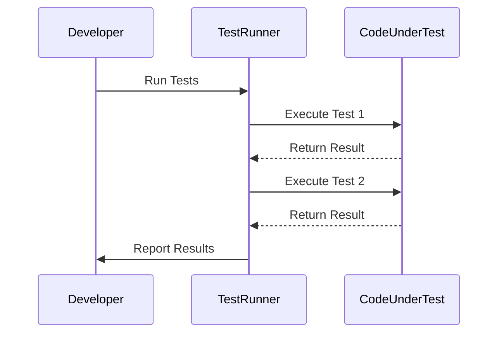

## 18.11 Writing Effective Tests

Testing is a crucial aspect of software development, ensuring that your code behaves as expected and continues to do so as it evolves. In Erlang, writing effective tests involves understanding the unique aspects of the language, such as its concurrency model and functional nature. This section will guide you through the principles of writing meaningful, maintainable, and effective tests in Erlang.

### Characteristics of Good Tests

Good tests share several key characteristics that make them reliable and valuable:

1. **Isolated**: Tests should be independent of each other. This means that the outcome of one test should not affect another. Isolation ensures that tests can be run in any order without causing failures due to shared state or dependencies.

2. **Repeatable**: Tests should produce the same results every time they are run, regardless of the environment or the order in which they are executed. Repeatability is crucial for identifying regressions and ensuring consistent behavior.

3. **Clear**: Tests should be easy to read and understand. Clear tests make it easier for developers to understand what is being tested and why a test might be failing.

4. **Focused on Behavior**: Tests should validate the behavior of the code rather than its implementation. This means testing the expected outcomes and side effects rather than the specific way the code achieves those outcomes.

5. **Valuable as Documentation**: Tests can serve as documentation for the expected behavior of the system. Well-written tests can help new developers understand how the system is supposed to work.

### Guidelines for Naming Conventions and Test Organization

Organizing your tests effectively can make a big difference in their maintainability and readability. Here are some guidelines to consider:

- **Use Descriptive Names**: Test names should clearly describe what the test is verifying. This helps in quickly understanding the purpose of the test without needing to read the implementation.

- **Organize Tests by Functionality**: Group tests by the functionality they are testing. This can be done by organizing tests into modules or directories that mirror the structure of the application code.

- **Follow a Consistent Structure**: Use a consistent structure for your test files and functions. This makes it easier to navigate and understand the tests.

- **Use Setup and Teardown Functions**: If your tests require setup or teardown steps, use dedicated functions to handle these. This keeps your test functions focused on the actual testing logic.

### Avoiding Common Pitfalls

When writing tests, it's important to avoid common pitfalls that can lead to unreliable or hard-to-maintain tests:

- **Avoid Dependencies Between Tests**: Ensure that tests do not depend on each other. Each test should set up its own environment and not rely on the state left by other tests.

- **Minimize External Dependencies**: Tests should minimize dependencies on external systems or services. Use mocks or stubs to simulate external interactions, ensuring that tests remain fast and reliable.

- **Avoid Overly Complex Tests**: Keep tests simple and focused. Overly complex tests can be difficult to understand and maintain, reducing their effectiveness.

- **Don't Test Implementation Details**: Focus on testing the behavior of the code rather than its implementation. This allows you to refactor the code without needing to rewrite the tests.

### Writing Tests That Validate Behavior

Validating behavior rather than implementation is a key principle in writing effective tests. Here are some strategies to achieve this:

- **Use Black-Box Testing**: Treat the code under test as a black box, focusing on its inputs and outputs. This approach helps ensure that tests are validating the correct behavior.

- **Test Edge Cases and Error Conditions**: Ensure that your tests cover edge cases and error conditions. This helps identify potential issues that might not be apparent in normal operation.

- **Use Property-Based Testing**: Consider using property-based testing to validate the behavior of your code over a wide range of inputs. This can help uncover edge cases and unexpected behavior.

### The Value of Tests as Documentation

Tests can serve as valuable documentation for your codebase. Here are some ways to leverage tests as documentation:

- **Document Expected Behavior**: Use tests to document the expected behavior of your code. This can be especially useful for complex logic or edge cases.

- **Provide Examples of Usage**: Tests can serve as examples of how to use your code. This can be helpful for new developers or when integrating with other systems.

- **Highlight Important Business Rules**: Use tests to highlight important business rules or constraints. This can help ensure that these rules are not inadvertently violated during development.

### Code Example: Writing Effective Tests in Erlang

Let's look at a simple example of writing effective tests in Erlang using the EUnit testing framework.

```erlang
-module(math_tests).
-include_lib("eunit/include/eunit.hrl").

% Test for addition
addition_test() ->
    ?assertEqual(5, math:add(2, 3)).

% Test for subtraction
subtraction_test() ->
    ?assertEqual(1, math:subtract(3, 2)).

% Test for multiplication
multiplication_test() ->
    ?assertEqual(6, math:multiply(2, 3)).

% Test for division with edge case
division_test() ->
    ?assertEqual(2, math:divide(6, 3)),
    ?assertError(badarg, math:divide(6, 0)). % Test for division by zero
```

In this example, we have a module `math_tests` that tests basic arithmetic operations. Each test is focused on a specific operation and includes an edge case for division by zero. The tests are isolated, repeatable, and clearly named, making them easy to understand and maintain.

### Visualizing Test Execution Flow

To better understand the flow of test execution, let's visualize it using a sequence diagram.



This diagram illustrates the interaction between the developer, the test runner, and the code under test. The developer initiates the test run, the test runner executes each test, and the results are reported back to the developer.

### Try It Yourself

To get hands-on experience, try modifying the code example above:

- Add a new test for a `power` function that raises a number to a given power.
- Introduce a bug in the `subtract` function and observe how the test catches it.
- Experiment with property-based testing using the PropEr library to validate the behavior of the `add` function over a range of inputs.

### Knowledge Check

- What are the key characteristics of good tests?
- How can tests serve as documentation for your codebase?
- Why is it important to avoid dependencies between tests?

### Summary

Writing effective tests in Erlang involves focusing on isolation, repeatability, clarity, and behavior validation. By following best practices and avoiding common pitfalls, you can create tests that are reliable, maintainable, and valuable as documentation. Remember, testing is not just about finding bugs; it's about ensuring that your code behaves as expected and continues to do so as it evolves.

## Quiz: Writing Effective Tests



### What is a key characteristic of a good test?

- [x] Isolated
- [ ] Dependent on other tests
- [ ] Complex
- [ ] Implementation-focused

> **Explanation:** Good tests should be isolated, meaning they do not depend on other tests and can be run independently.

### Why should tests be repeatable?

- [x] To ensure consistent results
- [ ] To make them more complex
- [ ] To depend on external systems
- [ ] To test implementation details

> **Explanation:** Repeatability ensures that tests produce the same results every time they are run, which is crucial for identifying regressions.

### What should tests focus on validating?

- [x] Behavior
- [ ] Implementation details
- [ ] External dependencies
- [ ] Complexity

> **Explanation:** Tests should focus on validating the behavior of the code, ensuring that it meets the expected outcomes.

### How can tests serve as documentation?

- [x] By documenting expected behavior
- [ ] By being complex
- [ ] By focusing on implementation
- [ ] By being dependent on other tests

> **Explanation:** Tests can serve as documentation by clearly outlining the expected behavior and usage of the code.

### What is a common pitfall to avoid in testing?

- [x] Dependencies between tests
- [ ] Isolated tests
- [ ] Clear test names
- [ ] Behavior-focused tests

> **Explanation:** Dependencies between tests can lead to unreliable results and should be avoided.

### How should tests be organized?

- [x] By functionality
- [ ] Randomly
- [ ] By complexity
- [ ] By implementation details

> **Explanation:** Organizing tests by functionality helps in maintaining and understanding the tests better.

### What is the benefit of using descriptive names for tests?

- [x] Easier understanding of test purpose
- [ ] Making tests more complex
- [ ] Focusing on implementation
- [ ] Creating dependencies

> **Explanation:** Descriptive names make it easier to understand the purpose of the test without needing to read the implementation.

### Why is it important to minimize external dependencies in tests?

- [x] To ensure tests are fast and reliable
- [ ] To make tests more complex
- [ ] To focus on implementation
- [ ] To create dependencies

> **Explanation:** Minimizing external dependencies ensures that tests remain fast and reliable, reducing the chance of failures due to external factors.

### What is the role of setup and teardown functions in tests?

- [x] To handle setup and cleanup tasks
- [ ] To make tests more complex
- [ ] To create dependencies
- [ ] To focus on implementation

> **Explanation:** Setup and teardown functions handle setup and cleanup tasks, keeping test functions focused on the actual testing logic.

### True or False: Tests should validate implementation details.

- [ ] True
- [x] False

> **Explanation:** Tests should focus on validating behavior rather than implementation details, allowing for refactoring without rewriting tests.



Remember, this is just the beginning. As you progress, you'll build more complex and interactive tests. Keep experimenting, stay curious, and enjoy the journey!
