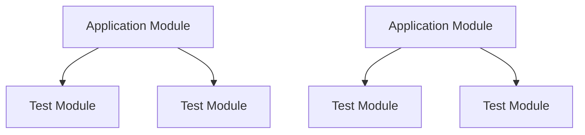

## 18.12 Test Organization and Management

In the world of software development, testing is a critical component that ensures the reliability and quality of applications. In Erlang, a language known for its robustness in building concurrent and distributed systems, organizing and managing tests effectively becomes even more crucial. This section delves into strategies for structuring test directories, managing dependencies, and utilizing tools for test discovery and execution, all while maintaining a clean and scalable test suite.

### Structuring Test Directories and Files

Organizing test directories and files is the foundation of a maintainable test suite. A well-structured test directory not only makes it easier to locate and run tests but also simplifies the process of adding new tests as the codebase grows.

#### Directory Structure

A common approach is to mirror the application's directory structure within the test directory. This means that for each module in your application, there is a corresponding test file or directory. This structure helps in maintaining a clear relationship between the code and its tests.

```
my_app/
├── src/
│   ├── module1.erl
│   ├── module2.erl
│   └── ...
└── test/
    ├── module1_tests.erl
    ├── module2_tests.erl
    └── ...
```

#### Naming Conventions

Adopt consistent naming conventions for test files. A common practice is to append `_tests` to the module name. This convention makes it easy to identify test files and associate them with their respective modules.

#### Test File Organization

Within each test file, organize tests by functionality or feature. Group related tests together, and use descriptive names for test functions to convey their purpose clearly. This practice enhances readability and makes it easier to understand the scope of each test.

### Grouping Tests by Functionality or Modules

Grouping tests by functionality or modules is another effective strategy for organizing tests. This approach allows you to focus on specific areas of the application and ensures comprehensive coverage.

#### Functional Grouping

Functional grouping involves organizing tests based on the features or functionalities they cover. This approach is particularly useful for applications with distinct features or components.

```erlang
-module(user_management_tests).
-include_lib("eunit/include/eunit.hrl").

user_creation_test() ->
    % Test user creation functionality
    ?assertEqual({ok, User}, user_management:create_user("Alice")).

user_deletion_test() ->
    % Test user deletion functionality
    ?assertEqual(ok, user_management:delete_user(UserId)).
```

#### Module-Based Grouping

Module-based grouping aligns tests with the modules they test. This approach is beneficial for maintaining a clear relationship between the code and its tests, especially in large codebases.

```erlang
-module(module1_tests).
-include_lib("eunit/include/eunit.hrl").

module1_function1_test() ->
    % Test function1 in module1
    ?assertEqual(ExpectedResult, module1:function1(Args)).

module1_function2_test() ->
    % Test function2 in module1
    ?assertEqual(ExpectedResult, module1:function2(Args)).
```

### Managing Test Dependencies and Fixtures

Managing dependencies and fixtures is crucial for ensuring that tests are isolated, repeatable, and reliable. Proper management of these elements prevents tests from affecting each other and ensures consistent results.

#### Test Dependencies

Identify and manage dependencies required for tests. This includes external libraries, databases, or services that tests rely on. Use tools like Rebar3 to manage dependencies efficiently.

```erlang
{deps, [
    {eunit, "2.3.0"},
    {meck, "0.9.2"}
]}.
```

#### Test Fixtures

Test fixtures are used to set up the environment required for tests to run. This includes initializing databases, creating mock objects, or setting up network connections. Use setup and teardown functions to manage fixtures.

```erlang
setup() ->
    % Initialize test environment
    ok.

teardown() ->
    % Clean up test environment
    ok.

my_test() ->
    setup(),
    % Perform test
    teardown().
```

### Tools for Test Discovery and Execution

Utilizing tools for test discovery and execution streamlines the testing process and ensures that all tests are run consistently.

#### EUnit

EUnit is a lightweight unit testing framework for Erlang. It provides a simple way to define and run tests directly within Erlang modules.

```erlang
-module(my_module_tests).
-include_lib("eunit/include/eunit.hrl").

my_test_() ->
    [?_assertEqual(Expected, my_module:function(Args))].
```

#### Common Test

Common Test is a more comprehensive testing framework suitable for integration and system testing. It supports test suites, test cases, and provides detailed reports.

```erlang
-module(my_suite).
-include_lib("common_test/include/ct.hrl").

all() -> [test_case1, test_case2].

test_case1(Config) ->
    % Test case logic
    ok.

test_case2(Config) ->
    % Test case logic
    ok.
```

#### Test Discovery

Automate test discovery using tools like Rebar3, which can automatically locate and run tests based on naming conventions and directory structure.

```shell
$ rebar3 eunit
```

### Maintaining a Clean and Scalable Test Suite

As the codebase grows, maintaining a clean and scalable test suite becomes essential. Here are some tips to achieve this:

- **Regularly Review and Refactor Tests**: Periodically review tests to ensure they are relevant and up-to-date. Refactor tests to improve readability and maintainability.
- **Avoid Test Interdependencies**: Ensure tests are independent and do not rely on the state or results of other tests. This practice prevents cascading failures and simplifies debugging.
- **Use Mocks and Stubs**: Use mocking libraries like Meck to isolate tests from external dependencies. This approach enhances test reliability and speed.
- **Monitor Test Coverage**: Use tools like Cover to monitor test coverage and identify untested code paths. Aim for comprehensive coverage without sacrificing test quality.
- **Optimize Test Execution**: Parallelize test execution to reduce overall test time. Use tools that support parallel execution to leverage multi-core systems.

### Visualizing Test Organization

To better understand the organization of tests, consider the following diagram that illustrates the relationship between application modules and their corresponding test files.



**Diagram Description**: This diagram shows how application modules are linked to their corresponding test modules, emphasizing the importance of maintaining a clear relationship between code and tests.

### References and Links

- [Erlang EUnit Documentation](https://erlang.org/doc/apps/eunit/chapter.html)
- [Common Test User's Guide](https://erlang.org/doc/apps/common_test/users_guide.html)
- [Rebar3 Documentation](https://rebar3.org/docs)

### Knowledge Check

- **Question**: What is the benefit of mirroring the application's directory structure in the test directory?
- **Challenge**: Refactor a test suite to use functional grouping instead of module-based grouping.

### Embrace the Journey

Remember, organizing and managing tests is an ongoing process that evolves with your codebase. As you continue to develop and expand your application, revisit your test organization strategies to ensure they remain effective. Keep experimenting, stay curious, and enjoy the journey of building robust and reliable Erlang applications!

## Quiz: Test Organization and Management



### What is a common practice for naming test files in Erlang?

- [x] Append `_tests` to the module name
- [ ] Use the prefix `test_`
- [ ] Use the suffix `_spec`
- [ ] Use the prefix `spec_`

> **Explanation:** Appending `_tests` to the module name is a common practice for naming test files in Erlang, making it easy to identify test files and associate them with their respective modules.

### What is the purpose of using setup and teardown functions in tests?

- [x] To initialize and clean up the test environment
- [ ] To execute tests in parallel
- [ ] To group tests by functionality
- [ ] To automate test discovery

> **Explanation:** Setup and teardown functions are used to initialize and clean up the test environment, ensuring that tests run in a consistent and isolated manner.

### Which tool is suitable for integration and system testing in Erlang?

- [ ] EUnit
- [x] Common Test
- [ ] Dialyzer
- [ ] PropEr

> **Explanation:** Common Test is a comprehensive testing framework suitable for integration and system testing in Erlang.

### How can you automate test discovery in Erlang?

- [ ] By using Dialyzer
- [ ] By using PropEr
- [x] By using Rebar3
- [ ] By using Meck

> **Explanation:** Rebar3 can automate test discovery by locating and running tests based on naming conventions and directory structure.

### What is a benefit of using mocks and stubs in tests?

- [x] To isolate tests from external dependencies
- [ ] To increase test coverage
- [ ] To reduce test execution time
- [ ] To group tests by functionality

> **Explanation:** Mocks and stubs are used to isolate tests from external dependencies, enhancing test reliability and speed.

### Why is it important to avoid test interdependencies?

- [x] To prevent cascading failures and simplify debugging
- [ ] To increase test coverage
- [ ] To reduce test execution time
- [ ] To automate test discovery

> **Explanation:** Avoiding test interdependencies prevents cascading failures and simplifies debugging, ensuring that tests are independent and reliable.

### What is the role of Cover in Erlang testing?

- [ ] To execute tests in parallel
- [x] To monitor test coverage
- [ ] To automate test discovery
- [ ] To manage test dependencies

> **Explanation:** Cover is used to monitor test coverage and identify untested code paths in Erlang applications.

### How can you optimize test execution in Erlang?

- [ ] By using setup and teardown functions
- [ ] By using mocks and stubs
- [x] By parallelizing test execution
- [ ] By grouping tests by functionality

> **Explanation:** Parallelizing test execution can optimize test execution time by leveraging multi-core systems.

### What is the benefit of functional grouping of tests?

- [x] It allows focusing on specific areas of the application
- [ ] It increases test coverage
- [ ] It reduces test execution time
- [ ] It automates test discovery

> **Explanation:** Functional grouping allows focusing on specific areas of the application, ensuring comprehensive coverage of features or components.

### True or False: Test organization strategies should remain static as the codebase grows.

- [ ] True
- [x] False

> **Explanation:** Test organization strategies should evolve with the codebase to ensure they remain effective and maintainable.




