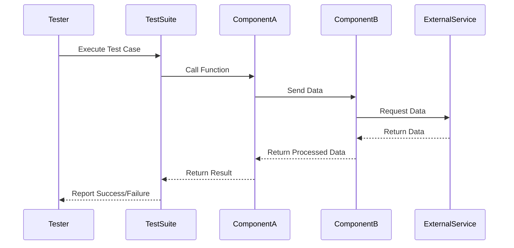

## 18.13 Integration Testing with Common Test

Integration testing is a crucial phase in the software development lifecycle, especially when working with complex systems where multiple components interact. In Erlang, Common Test is a powerful framework that facilitates integration testing by allowing developers to test the interactions between different system components. This section will guide you through the process of setting up and executing integration tests using Common Test, managing test environments, and simulating real-world scenarios to ensure your system's robustness and reliability.

### Understanding Integration Testing

Integration testing focuses on verifying the interactions between different components or modules of a system. Unlike unit testing, which tests individual components in isolation, integration testing ensures that these components work together as expected. This type of testing is essential for identifying issues that may arise from component interactions, such as data format mismatches, incorrect API usage, or unexpected side effects.

### The Role of Common Test in Integration Testing

Common Test is an Erlang-based testing framework designed for writing and executing automated tests. It is particularly well-suited for integration testing due to its ability to handle complex test scenarios, manage test dependencies, and provide detailed reports. Common Test supports various types of testing, including unit, integration, and system testing, making it a versatile tool for comprehensive test coverage.

### Setting Up Common Test Suites

To begin integration testing with Common Test, you need to set up test suites that define the scope and structure of your tests. A test suite in Common Test is a collection of test cases that are executed together. Each test case is a function that performs a specific test scenario.

#### Creating a Test Suite

1. **Define the Test Suite Module**: Create a new Erlang module for your test suite. The module should export the `all/0` function, which returns a list of test cases to be executed.

```erlang
-module(my_integration_tests).
-compile(export_all).

all() ->
    [test_case1, test_case2].

test_case1(Config) ->
    % Test logic for case 1
    ok.

test_case2(Config) ->
    % Test logic for case 2
    ok.
```

2. **Implement Test Cases**: Each test case is a function that takes a configuration parameter and returns `ok` or `{fail, Reason}`. Use assertions to validate expected outcomes.

```erlang
test_case1(_Config) ->
    Result = my_module:function_under_test(),
    ?assertEqual(expected_result, Result).
```

3. **Configure the Test Environment**: Use the `init_per_suite/1` and `end_per_suite/1` callbacks to set up and tear down the test environment for the entire suite.

```erlang
init_per_suite(Config) ->
    % Setup code
    {ok, Config}.

end_per_suite(_Config) ->
    % Teardown code
    ok.
```

### Managing Test Environments and Dependencies

Integration tests often require a specific environment setup, including databases, external services, and configuration files. Managing these dependencies is crucial for reliable test execution.

#### Handling External Dependencies

1. **Mocking and Stubbing**: Use mocking and stubbing techniques to simulate external dependencies. This approach allows you to test component interactions without relying on actual external systems.

2. **Test Databases**: Set up a dedicated test database that can be reset before each test run. This ensures that tests do not interfere with each other and that the database is in a known state.

3. **Configuration Management**: Use configuration files or environment variables to manage settings specific to the test environment. This includes database connections, API endpoints, and feature flags.

### Simulating Real-World Scenarios

To ensure that your integration tests reflect real-world usage, simulate scenarios that your system is likely to encounter in production. This includes handling edge cases, error conditions, and performance bottlenecks.

#### Example: Simulating a User Login Flow

Consider a scenario where you need to test a user login flow involving multiple components, such as a web server, authentication service, and database.

```erlang
test_user_login_flow(_Config) ->
    % Simulate user input
    UserInput = #{username => "test_user", password => "password123"},
    
    % Call the login function
    {ok, Session} = auth_service:login(UserInput),
    
    % Verify the session is created
    ?assert(Session =:= expected_session_data).
```

### Importance of Integration Tests for System Validation

Integration tests play a vital role in validating the overall system behavior. They help identify issues that may not be apparent during unit testing, such as:

- **Data Flow Errors**: Ensure that data is correctly passed between components.
- **API Contract Violations**: Verify that components adhere to expected API contracts.
- **Concurrency Issues**: Test the system's behavior under concurrent access.
- **Performance Bottlenecks**: Identify slow interactions between components.

### Visualizing Integration Testing Workflow

To better understand the integration testing process, let's visualize the workflow using a sequence diagram. This diagram illustrates the interactions between components during a typical integration test.



### Try It Yourself

Now that we've covered the basics, try setting up your own integration test suite using Common Test. Experiment with different scenarios and configurations to see how your system behaves under various conditions. Here are a few suggestions:

- **Modify Test Cases**: Add new test cases to cover additional scenarios.
- **Simulate Failures**: Introduce failures in external dependencies to test error handling.
- **Test Concurrency**: Simulate concurrent access to shared resources.

### References and Further Reading

- [Erlang Common Test User's Guide](http://erlang.org/doc/apps/common_test/users_guide.html)
- [Erlang Documentation](http://erlang.org/doc/)
- [Testing Erlang Applications](https://learnyousomeerlang.com/testing)

### Knowledge Check

Before we conclude, let's reinforce what we've learned with a few questions and exercises. Consider the following:

- **What are the key differences between unit testing and integration testing?**
- **How can you manage external dependencies in your integration tests?**
- **Why is it important to simulate real-world scenarios in integration tests?**

### Embrace the Journey

Remember, integration testing is an ongoing process that evolves with your system. As you continue to develop and refine your tests, you'll gain deeper insights into your system's behavior and improve its overall quality. Keep experimenting, stay curious, and enjoy the journey!

## Quiz: Integration Testing with Common Test



### What is the primary purpose of integration testing?

- [x] To verify interactions between system components
- [ ] To test individual functions in isolation
- [ ] To ensure code coverage
- [ ] To validate user interfaces

> **Explanation:** Integration testing focuses on verifying the interactions between different components or modules of a system.

### Which Erlang framework is commonly used for integration testing?

- [x] Common Test
- [ ] EUnit
- [ ] PropEr
- [ ] Dialyzer

> **Explanation:** Common Test is a powerful Erlang-based testing framework designed for writing and executing automated tests, particularly well-suited for integration testing.

### What function must a Common Test suite module export?

- [x] all/0
- [ ] init/0
- [ ] start/0
- [ ] run/0

> **Explanation:** The `all/0` function returns a list of test cases to be executed in a Common Test suite.

### How can you manage external dependencies in integration tests?

- [x] Use mocking and stubbing
- [ ] Ignore them
- [ ] Hardcode values
- [ ] Use only real services

> **Explanation:** Mocking and stubbing are techniques used to simulate external dependencies, allowing tests to run without relying on actual external systems.

### Why is it important to simulate real-world scenarios in integration tests?

- [x] To ensure the system behaves as expected in production
- [ ] To reduce test execution time
- [ ] To simplify test cases
- [ ] To avoid writing unit tests

> **Explanation:** Simulating real-world scenarios helps ensure that the system behaves as expected under conditions it will encounter in production.

### What is the role of the `init_per_suite/1` callback in Common Test?

- [x] To set up the test environment for the entire suite
- [ ] To execute each test case
- [ ] To tear down the test environment after each test
- [ ] To initialize individual test cases

> **Explanation:** The `init_per_suite/1` callback is used to set up the test environment for the entire suite.

### Which of the following is a benefit of integration testing?

- [x] Identifying data flow errors
- [ ] Increasing code complexity
- [ ] Reducing code readability
- [ ] Decreasing test coverage

> **Explanation:** Integration testing helps identify data flow errors, ensuring that data is correctly passed between components.

### What does the sequence diagram in the article illustrate?

- [x] Interactions between components during an integration test
- [ ] The architecture of a web application
- [ ] The flow of a user interface
- [ ] The structure of a database

> **Explanation:** The sequence diagram illustrates the interactions between components during a typical integration test.

### True or False: Integration tests can replace unit tests.

- [ ] True
- [x] False

> **Explanation:** Integration tests complement unit tests by focusing on component interactions, but they do not replace the need for testing individual components in isolation.

### What should you do if an integration test fails due to an external service being unavailable?

- [x] Investigate the issue and consider using a mock or stub
- [ ] Ignore the failure
- [ ] Remove the test case
- [ ] Disable the test suite

> **Explanation:** Investigating the issue and considering the use of a mock or stub can help address failures due to unavailable external services.


