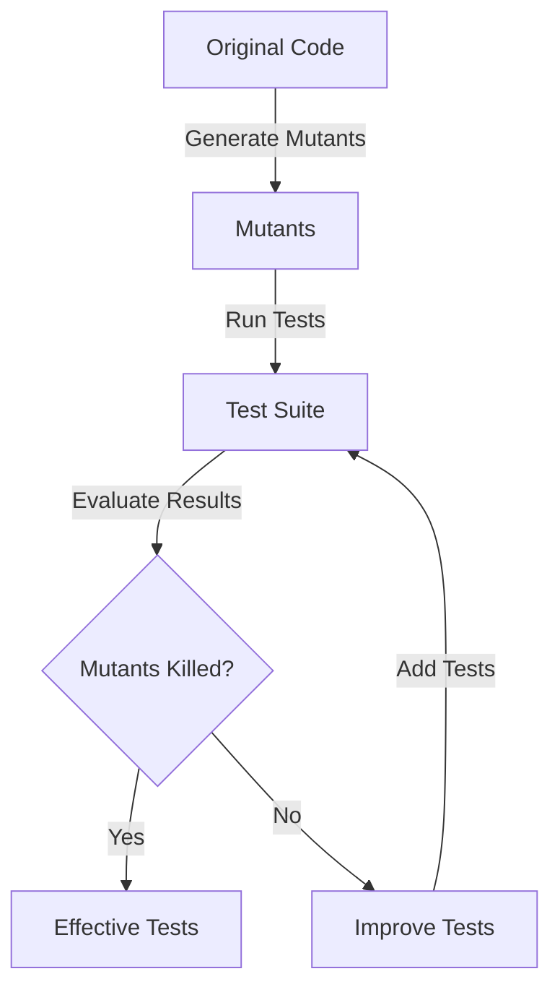

## 18.14 Mutation Testing with `mu2`

In the realm of software testing, ensuring the robustness and effectiveness of test suites is paramount. Mutation testing is a powerful technique that helps developers assess the quality of their tests by introducing small changes, or "mutations," to the codebase and evaluating whether the existing tests can detect these changes. In this section, we will delve into mutation testing using `mu2`, a tool specifically designed for Erlang applications. We will explore how `mu2` works, provide examples of running mutation tests, and discuss how this technique can be leveraged to identify weaknesses in test suites and ultimately improve test quality.

### Understanding Mutation Testing

Mutation testing is a method used to evaluate the effectiveness of a test suite by introducing small syntactic changes to the source code and checking if the tests can detect these changes. These changes, known as "mutants," are typically simple modifications such as altering a conditional statement, changing an arithmetic operator, or modifying a constant value. The goal is to ensure that the test suite is robust enough to catch these intentional errors.

#### Key Concepts of Mutation Testing

- **Mutants**: Variants of the original code with small changes.
- **Mutation Operators**: Rules that define how mutants are created (e.g., changing `==` to `!=`).
- **Killed Mutants**: Mutants that are detected by the test suite, indicating effective tests.
- **Survived Mutants**: Mutants that are not detected, suggesting potential weaknesses in the tests.

### Introducing `mu2`

[`mu2`](https://github.com/jlouis/mu2) is a mutation testing tool for Erlang that automates the process of generating and evaluating mutants. It modifies the source code to create mutants and runs the test suite against these mutants to determine which ones are detected (killed) and which ones are not (survived).

#### Features of `mu2`

- **Automated Mutation Generation**: `mu2` automatically generates mutants based on predefined mutation operators.
- **Integration with Erlang Test Suites**: It seamlessly integrates with existing Erlang test frameworks such as EUnit and Common Test.
- **Comprehensive Reporting**: Provides detailed reports on the effectiveness of the test suite, highlighting areas for improvement.

### Setting Up `mu2`

To get started with `mu2`, you need to install it and set up your Erlang project for mutation testing. Follow these steps to integrate `mu2` into your development workflow:

1. **Install `mu2`**: Clone the `mu2` repository and build the tool using Erlang's build tools.
   ```shell
   git clone https://github.com/jlouis/mu2.git
   cd mu2
   make
   ```

2. **Configure Your Project**: Ensure your Erlang project is set up with a compatible test suite (e.g., EUnit or Common Test).

3. **Run Mutation Tests**: Use `mu2` to generate mutants and run your test suite against them.
   ```shell
   ./mu2 run path/to/your/project
   ```

### Running Mutation Tests with `mu2`

Let's walk through an example of running mutation tests on a simple Erlang module using `mu2`. Consider the following Erlang module `calculator.erl`:

```erlang
-module(calculator).
-export([add/2, subtract/2]).

%% Adds two numbers
-spec add(integer(), integer()) -> integer().
add(A, B) ->
    A + B.

%% Subtracts the second number from the first
-spec subtract(integer(), integer()) -> integer().
subtract(A, B) ->
    A - B.
```

#### Writing Tests

First, we need to write tests for the `calculator` module using EUnit:

```erlang
-module(calculator_tests).
-include_lib("eunit/include/eunit.hrl").

add_test() ->
    ?assertEqual(5, calculator:add(2, 3)),
    ?assertEqual(0, calculator:add(0, 0)).

subtract_test() ->
    ?assertEqual(1, calculator:subtract(3, 2)),
    ?assertEqual(-1, calculator:subtract(2, 3)).
```

#### Running `mu2`

With the tests in place, we can run `mu2` to perform mutation testing:

```shell
./mu2 run path/to/calculator
```

`mu2` will generate mutants by applying mutation operators to the `calculator` module and execute the test suite to determine which mutants are killed.

### Interpreting Mutation Test Results

After running `mu2`, you will receive a report detailing the mutants that were generated and whether they were killed or survived. Here's an example of what the report might look like:

```
Mutant 1: Changed `+` to `-` in `add/2` - Killed
Mutant 2: Changed `-` to `+` in `subtract/2` - Survived
```

#### Analyzing the Results

- **Killed Mutants**: These indicate that the test suite successfully detected the introduced changes, demonstrating its effectiveness.
- **Survived Mutants**: These suggest that the test suite may have gaps, as it failed to detect the changes. In the example above, the test suite did not catch the change in the `subtract/2` function, indicating a potential area for improvement.

### Improving Test Quality with Mutation Testing

Mutation testing with `mu2` provides valuable insights into the strengths and weaknesses of your test suite. By analyzing survived mutants, you can identify specific areas where additional tests or more rigorous assertions are needed. This iterative process of refining tests based on mutation testing results leads to a more robust and comprehensive test suite.

#### Best Practices for Mutation Testing

- **Focus on Critical Code Paths**: Prioritize mutation testing for critical parts of your application where failures would have significant impact.
- **Iterate and Refine**: Use mutation testing results to iteratively improve your test suite, adding tests to cover missed cases.
- **Balance Test Coverage and Performance**: While mutation testing is powerful, it can be resource-intensive. Balance the depth of mutation testing with the performance impact on your development workflow.

### Visualizing Mutation Testing Workflow

To better understand the mutation testing process, let's visualize the workflow using a Mermaid.js diagram:



**Diagram Description**: This diagram illustrates the mutation testing workflow, starting with the original code, generating mutants, running tests, and evaluating results to determine if mutants are killed. If not, the process iterates to improve the test suite.

### Encouragement for Using Mutation Testing

Remember, mutation testing is a journey towards achieving higher test quality. By embracing this technique, you are taking proactive steps to ensure your Erlang applications are robust and reliable. Keep experimenting with `mu2`, stay curious about the insights it provides, and enjoy the process of refining your test suites.

### References and Further Reading

- [mu2 GitHub Repository](https://github.com/jlouis/mu2)
- [Erlang EUnit Documentation](https://erlang.org/doc/apps/eunit/chapter.html)
- [Common Test User's Guide](https://erlang.org/doc/apps/common_test/users_guide.html)

## Quiz: Mutation Testing with `mu2`



### What is the primary goal of mutation testing?

- [x] To assess the effectiveness of a test suite by introducing code changes
- [ ] To increase code coverage by adding more tests
- [ ] To refactor code for better performance
- [ ] To document code changes for future reference

> **Explanation:** Mutation testing aims to evaluate the robustness of a test suite by introducing small changes to the code and checking if the tests can detect these changes.

### What are "mutants" in the context of mutation testing?

- [x] Variants of the original code with small changes
- [ ] New features added to the codebase
- [ ] Bugs introduced during development
- [ ] Test cases that fail unexpectedly

> **Explanation:** Mutants are versions of the original code with small syntactic changes introduced to test the effectiveness of the test suite.

### Which tool is used for mutation testing in Erlang?

- [x] mu2
- [ ] Dialyzer
- [ ] PropEr
- [ ] QuickCheck

> **Explanation:** `mu2` is a tool specifically designed for mutation testing in Erlang applications.

### What does a "killed mutant" indicate?

- [x] The test suite successfully detected the introduced change
- [ ] The code has a bug that needs fixing
- [ ] The test suite failed to detect the change
- [ ] The mutant needs to be manually reviewed

> **Explanation:** A killed mutant indicates that the test suite was able to detect the change, demonstrating its effectiveness.

### How can mutation testing improve test quality?

- [x] By identifying weaknesses in the test suite
- [ ] By reducing the number of tests needed
- [x] By highlighting areas for additional tests
- [ ] By automating code refactoring

> **Explanation:** Mutation testing helps identify gaps in the test suite and suggests areas where additional tests are needed to improve quality.

### What is the role of mutation operators in mutation testing?

- [x] They define how mutants are created
- [ ] They execute the test suite
- [ ] They report test results
- [ ] They refactor the code

> **Explanation:** Mutation operators are rules that define how mutants are generated by introducing specific changes to the code.

### What should you do if a mutant survives the test suite?

- [x] Add or refine tests to cover the missed case
- [ ] Ignore it as a false positive
- [x] Analyze the test suite for gaps
- [ ] Remove the mutant from the codebase

> **Explanation:** If a mutant survives, it indicates a potential gap in the test suite, and additional tests should be added to cover the missed case.

### What is the first step in setting up `mu2` for mutation testing?

- [x] Install `mu2` and configure your project
- [ ] Write new test cases
- [ ] Refactor the codebase
- [ ] Document the test suite

> **Explanation:** The first step is to install `mu2` and ensure your project is configured for mutation testing.

### What does a "survived mutant" suggest about the test suite?

- [x] The test suite may have gaps
- [ ] The code is bug-free
- [ ] The tests are too comprehensive
- [ ] The mutant is irrelevant

> **Explanation:** A survived mutant suggests that the test suite failed to detect the change, indicating potential gaps.

### True or False: Mutation testing is only useful for large codebases.

- [ ] True
- [x] False

> **Explanation:** Mutation testing is beneficial for codebases of all sizes, as it helps improve test quality by identifying weaknesses in the test suite.



By incorporating mutation testing into your development process, you can significantly enhance the quality and reliability of your Erlang applications. Keep refining your test suites, embrace the insights provided by `mu2`, and continue your journey towards robust software development.
