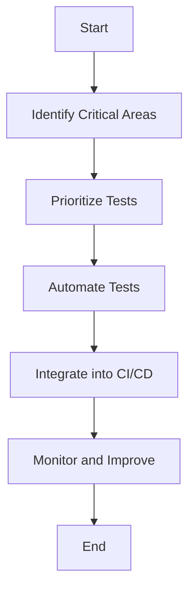

## 18.15 Testing Strategies for Large-Scale Systems

In the realm of large-scale systems, testing becomes a critical component to ensure reliability, performance, and scalability. As systems grow in complexity, so do the challenges associated with testing them. This section delves into the strategies and best practices for testing large-scale systems, particularly in the context of Erlang applications. We will explore how to scale test infrastructure, manage resources effectively, prioritize tests, and foster a robust testing culture within your organization.

### Scaling Test Infrastructure and Managing Resources

As systems expand, the need for a scalable test infrastructure becomes paramount. A well-designed test infrastructure can handle increased load, support parallel test execution, and provide quick feedback to developers.

#### 1. Distributed Testing Environments

Leverage distributed testing environments to run tests concurrently across multiple nodes. This approach not only speeds up the testing process but also mimics real-world scenarios where your application runs on distributed systems.

```erlang
% Example of setting up a distributed test environment
-module(distributed_test).
-export([run_tests/0]).

run_tests() ->
    % Start nodes
    Node1 = spawn_node('node1@localhost'),
    Node2 = spawn_node('node2@localhost'),
    
    % Run tests concurrently
    [rpc:call(Node, my_test_module, run, []) || Node <- [Node1, Node2]].

spawn_node(Name) ->
    % Function to spawn a new node
    {ok, _} = net_adm:ping(Name),
    Name.
```

#### 2. Containerization and Virtualization

Utilize containerization tools like Docker to create isolated test environments. Containers ensure consistency across different test runs and make it easier to manage dependencies.

#### 3. Resource Allocation and Management

Implement resource management strategies to allocate CPU, memory, and I/O resources efficiently. Use tools like Kubernetes to orchestrate test environments and manage resources dynamically.

### Prioritizing Tests and Focusing on Critical Areas

In large-scale systems, it's impractical to test everything exhaustively. Prioritizing tests based on risk and criticality ensures that the most important parts of the system are thoroughly tested.

#### 1. Risk-Based Testing

Identify high-risk areas of your application and focus testing efforts on these components. Use historical data and expert judgment to assess risk.

#### 2. Test Coverage Analysis

Utilize tools like Cover to analyze test coverage and identify untested code paths. Aim for high coverage in critical modules, but remember that 100% coverage is not always necessary or feasible.

```erlang
% Example of using Cover for test coverage analysis
-module(coverage_example).
-export([start/0]).

start() ->
    cover:compile_module(my_module),
    cover:analyse(my_module).
```

#### 3. Regression Testing

Implement regression testing to ensure that new changes do not break existing functionality. Automated regression tests can be run frequently to catch issues early.

### The Role of Automated Testing in Continuous Delivery

Automated testing is a cornerstone of continuous delivery, enabling rapid feedback and reducing the risk of defects in production.

#### 1. Continuous Integration and Deployment (CI/CD)

Integrate automated tests into your CI/CD pipeline to ensure that every code change is tested before it reaches production. Use tools like Jenkins or GitLab CI to automate the process.

#### 2. Test Automation Frameworks

Adopt test automation frameworks like Common Test or EUnit to write and manage automated tests. These frameworks provide a structured approach to testing and support various types of tests, including unit, integration, and system tests.

```erlang
% Example of a simple EUnit test
-module(my_module_tests).
-include_lib("eunit/include/eunit.hrl").

my_function_test() ->
    ?assertEqual(expected_result, my_module:my_function(input)).
```

### Coordinating Tests Across Multiple Teams or Services

In large organizations, multiple teams may work on different parts of the system. Coordinating tests across these teams is crucial to ensure system-wide quality.

#### 1. Cross-Team Collaboration

Foster collaboration between teams by establishing clear communication channels and shared testing goals. Use tools like Slack or Microsoft Teams for real-time communication.

#### 2. Service-Level Agreements (SLAs)

Define SLAs for testing to ensure that each team meets the required quality standards. SLAs can include metrics like test coverage, defect density, and response time for fixing critical bugs.

#### 3. Integration Testing

Conduct integration testing to verify that different services work together as expected. Use tools like Docker Compose to simulate complex environments and test service interactions.

### Fostering a Testing Culture Within the Organization

A strong testing culture is essential for maintaining high-quality standards in large-scale systems. Encourage everyone in the organization to take ownership of quality.

#### 1. Training and Education

Provide training and resources to help team members improve their testing skills. Encourage participation in workshops, webinars, and conferences.

#### 2. Recognition and Incentives

Recognize and reward teams and individuals who contribute to improving the testing process. Incentives can motivate teams to prioritize quality.

#### 3. Continuous Improvement

Promote a culture of continuous improvement by regularly reviewing and refining testing processes. Conduct retrospectives to identify areas for improvement and implement changes.

### Visualizing Testing Strategies

To better understand the testing strategies discussed, let's visualize the process using a flowchart.



**Figure 1**: Flowchart illustrating the testing strategy process for large-scale systems.

### Knowledge Check

To reinforce your understanding of testing strategies for large-scale systems, consider the following questions:

- How can distributed testing environments improve test efficiency?
- What are the benefits of containerization in testing?
- Why is it important to prioritize tests based on risk?
- How does automated testing support continuous delivery?
- What role does cross-team collaboration play in testing large-scale systems?

### Embrace the Journey

Remember, testing is not just a phase in the development process; it's an ongoing effort that requires dedication and collaboration. As you implement these strategies, you'll not only improve the quality of your systems but also foster a culture of excellence within your organization. Keep experimenting, stay curious, and enjoy the journey!

## Quiz: Testing Strategies for Large-Scale Systems



### What is a key benefit of using distributed testing environments?

- [x] They allow tests to run concurrently across multiple nodes.
- [ ] They reduce the need for automated tests.
- [ ] They eliminate the need for test coverage analysis.
- [ ] They simplify the test prioritization process.

> **Explanation:** Distributed testing environments enable tests to run concurrently across multiple nodes, speeding up the testing process and mimicking real-world distributed systems.

### How does containerization benefit testing?

- [x] It ensures consistency across test runs.
- [ ] It eliminates the need for test automation frameworks.
- [ ] It reduces the importance of regression testing.
- [ ] It simplifies the creation of SLAs.

> **Explanation:** Containerization ensures consistency across test runs by providing isolated environments, making it easier to manage dependencies.

### Why is risk-based testing important?

- [x] It focuses testing efforts on high-risk areas.
- [ ] It guarantees 100% test coverage.
- [ ] It eliminates the need for regression testing.
- [ ] It simplifies the CI/CD process.

> **Explanation:** Risk-based testing focuses efforts on high-risk areas, ensuring that the most critical parts of the system are thoroughly tested.

### What is a primary role of automated testing in continuous delivery?

- [x] It provides rapid feedback and reduces production defects.
- [ ] It eliminates the need for manual testing.
- [ ] It guarantees zero defects in production.
- [ ] It simplifies test coordination across teams.

> **Explanation:** Automated testing provides rapid feedback and reduces the risk of defects in production, supporting continuous delivery.

### How can cross-team collaboration improve testing?

- [x] By establishing clear communication channels and shared goals.
- [ ] By reducing the need for integration testing.
- [ ] By ensuring 100% test coverage.
- [ ] By simplifying test automation.

> **Explanation:** Cross-team collaboration improves testing by establishing clear communication channels and shared goals, ensuring system-wide quality.

### What is the purpose of SLAs in testing?

- [x] To ensure teams meet required quality standards.
- [ ] To eliminate the need for automated tests.
- [ ] To guarantee zero defects in production.
- [ ] To simplify test prioritization.

> **Explanation:** SLAs ensure that each team meets the required quality standards, including metrics like test coverage and defect density.

### How does integration testing benefit large-scale systems?

- [x] It verifies that different services work together as expected.
- [ ] It eliminates the need for unit testing.
- [ ] It guarantees zero defects in production.
- [ ] It simplifies test automation.

> **Explanation:** Integration testing verifies that different services work together as expected, ensuring system-wide functionality.

### What is a key component of fostering a testing culture?

- [x] Providing training and resources for team members.
- [ ] Eliminating manual testing.
- [ ] Guaranteeing 100% test coverage.
- [ ] Simplifying test automation.

> **Explanation:** Providing training and resources helps team members improve their testing skills, fostering a strong testing culture.

### Why is continuous improvement important in testing?

- [x] It helps identify areas for improvement and implement changes.
- [ ] It guarantees zero defects in production.
- [ ] It eliminates the need for automated tests.
- [ ] It simplifies test prioritization.

> **Explanation:** Continuous improvement helps identify areas for improvement and implement changes, enhancing the overall testing process.

### True or False: Testing is only a phase in the development process.

- [ ] True
- [x] False

> **Explanation:** Testing is an ongoing effort that requires dedication and collaboration throughout the development process.




