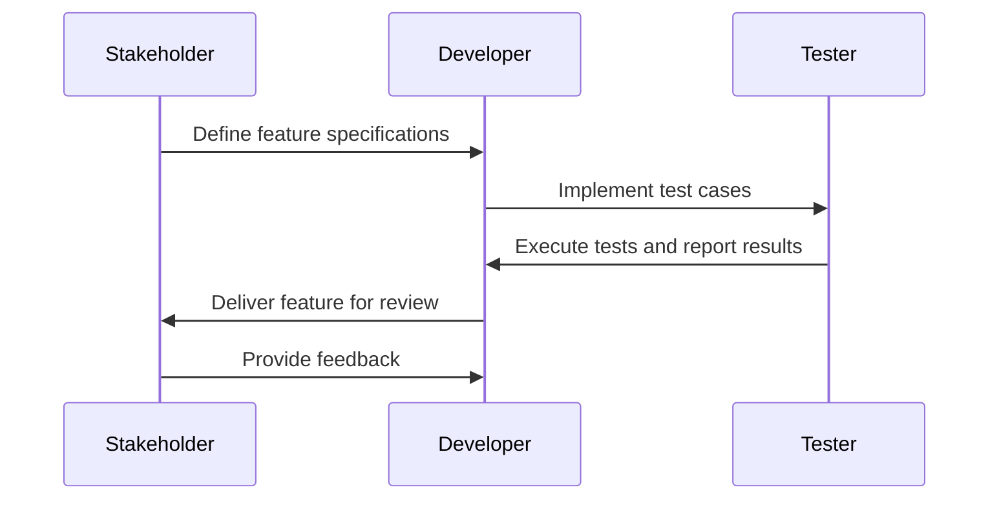

## 18.2 Behavior-Driven Development (BDD) with Common Test

Behavior-Driven Development (BDD) is a software development approach that emphasizes collaboration between developers, testers, and non-technical stakeholders. It extends Test-Driven Development (TDD) by writing test cases in natural language that describes the behavior of the application. In Erlang, Common Test is a powerful tool that can be used to implement BDD, allowing you to write tests that reflect system behavior and improve communication and collaboration among team members.

### Understanding BDD and Its Differences from TDD

**Behavior-Driven Development (BDD)** focuses on the behavior of an application from the user's perspective. It encourages writing tests in a language that non-technical stakeholders can understand, often using a Given-When-Then format. This approach ensures that all team members have a shared understanding of the application requirements.

**Test-Driven Development (TDD)**, on the other hand, is a development process where tests are written before the code. TDD focuses on the correctness of the code and often involves writing unit tests that check individual components.

#### Key Differences:

- **Language and Readability**: BDD uses natural language constructs, making it more accessible to non-developers. TDD typically uses technical language.
- **Focus**: BDD emphasizes behavior and user experience, while TDD focuses on implementation and correctness.
- **Collaboration**: BDD fosters collaboration among all stakeholders, whereas TDD is primarily a developer-centric practice.

### Writing Feature-Oriented Tests with Common Test

Common Test is an Erlang testing framework that supports writing and executing test cases. It is well-suited for BDD because it allows you to define test cases that describe the expected behavior of the system.

#### Setting Up Common Test

To get started with Common Test, you need to create a test suite. A test suite in Common Test is an Erlang module that defines test cases. Here's a simple example:

```erlang
-module(my_app_SUITE).
-include_lib("common_test/include/ct.hrl").

%% Exported functions
-export([all/0, init_per_suite/1, end_per_suite/1, my_feature_test/1]).

%% Define all test cases
all() -> [my_feature_test].

%% Setup and teardown
init_per_suite(Config) -> Config.
end_per_suite(_Config) -> ok.

%% Test case
my_feature_test(_Config) ->
    %% Given
    User = create_user("Alice"),
    
    %% When
    Result = perform_action(User, "login"),
    
    %% Then
    ?assertEqual(success, Result).
```

In this example, we define a test suite `my_app_SUITE` with a single test case `my_feature_test`. The test case uses the Given-When-Then format to describe the behavior of a user logging into the system.

### Test Specifications Describing Behaviors

In BDD, test specifications are written to describe the behavior of the system. These specifications are often written in a natural language format that can be understood by all stakeholders.

#### Example of a Test Specification

```erlang
%% Feature: User Login
%% As a registered user
%% I want to log into the system
%% So that I can access my account

%% Scenario: Successful login
%% Given a registered user "Alice"
%% When the user attempts to log in
%% Then the login should be successful

my_feature_test(_Config) ->
    %% Given
    User = create_user("Alice"),
    
    %% When
    Result = perform_action(User, "login"),
    
    %% Then
    ?assertEqual(success, Result).
```

This test specification describes a feature (User Login) and a scenario (Successful login) using a Given-When-Then format. The corresponding Erlang test case implements this specification.

### Integrating BDD into Agile Development Processes

BDD fits naturally into agile development processes by promoting collaboration and communication. Here's how you can integrate BDD into your agile workflow:

1. **Collaborative Specification Workshops**: Conduct workshops with stakeholders to write feature specifications. Use these sessions to gather requirements and ensure everyone understands the desired behavior.

2. **Living Documentation**: Use BDD specifications as living documentation that evolves with the project. This documentation serves as a reference for both technical and non-technical team members.

3. **Continuous Feedback**: Implement BDD in your continuous integration pipeline to provide immediate feedback on the behavior of the system. This helps catch issues early and ensures that the system behaves as expected.

4. **Iterative Development**: Use BDD to guide iterative development. Write specifications for each feature or user story, implement the feature, and then verify it with automated tests.

### Benefits of BDD for Communication and Collaboration

BDD offers several benefits that enhance communication and collaboration within development teams:

- **Shared Understanding**: BDD creates a shared understanding of the system behavior among all stakeholders, reducing misunderstandings and miscommunications.

- **Improved Collaboration**: By involving non-technical stakeholders in the specification process, BDD fosters collaboration and ensures that everyone is on the same page.

- **Clear Requirements**: BDD specifications serve as clear and concise requirements that guide development and testing.

- **Reduced Rework**: By catching issues early and ensuring that the system behaves as expected, BDD reduces the need for rework and increases development efficiency.

### Code Examples and Exercises

Let's explore some more examples and encourage you to try them yourself.

#### Example: User Registration

```erlang
-module(user_registration_SUITE).
-include_lib("common_test/include/ct.hrl").

-export([all/0, init_per_suite/1, end_per_suite/1, user_registration_test/1]).

all() -> [user_registration_test].

init_per_suite(Config) -> Config.
end_per_suite(_Config) -> ok.

user_registration_test(_Config) ->
    %% Given
    UserDetails = #{name => "Bob", email => "bob@example.com"},
    
    %% When
    RegistrationResult = register_user(UserDetails),
    
    %% Then
    ?assertEqual({ok, UserId}, RegistrationResult).
```

**Try It Yourself**: Modify the `user_registration_test` to include a scenario where the registration fails due to an already existing email.

### Visualizing BDD Workflow

To better understand the BDD workflow, let's visualize the process using a Mermaid.js diagram.



**Description**: This diagram illustrates the BDD workflow, highlighting the collaboration between stakeholders, developers, and testers.

### References and Further Reading

- [Cucumber: BDD for Developers](https://cucumber.io/)
- [Common Test User's Guide](http://erlang.org/doc/apps/common_test/users_guide.html)
- [Agile Alliance: Behavior-Driven Development](https://www.agilealliance.org/glossary/bdd/)

### Knowledge Check

- What is the primary focus of BDD compared to TDD?
- How does BDD improve collaboration among team members?
- Can you describe a scenario where BDD might be more beneficial than TDD?

### Embrace the Journey

Remember, adopting BDD is a journey that enhances your development process. As you progress, you'll find that BDD not only improves the quality of your software but also strengthens your team's collaboration and communication. Keep experimenting, stay curious, and enjoy the journey!

## Quiz: Behavior-Driven Development (BDD) with Common Test



### What is the primary focus of BDD?

- [x] Describing system behavior from the user's perspective
- [ ] Ensuring code correctness
- [ ] Writing unit tests
- [ ] Optimizing performance

> **Explanation:** BDD focuses on describing the system behavior from the user's perspective, using natural language to ensure all stakeholders understand the requirements.

### How does BDD differ from TDD?

- [x] BDD uses natural language constructs
- [ ] BDD focuses on code correctness
- [ ] BDD is developer-centric
- [ ] BDD does not involve stakeholders

> **Explanation:** BDD uses natural language constructs to describe behavior, making it accessible to non-technical stakeholders, unlike TDD which is more technical and developer-centric.

### What is a key benefit of BDD?

- [x] Improved collaboration among stakeholders
- [ ] Faster code execution
- [ ] Reduced code complexity
- [ ] Increased code coverage

> **Explanation:** BDD improves collaboration among stakeholders by involving them in the specification process and ensuring a shared understanding of system behavior.

### Which format is commonly used in BDD specifications?

- [x] Given-When-Then
- [ ] Arrange-Act-Assert
- [ ] Setup-Execute-Verify
- [ ] Input-Process-Output

> **Explanation:** The Given-When-Then format is commonly used in BDD to describe scenarios in a way that is understandable to all stakeholders.

### What tool is used in Erlang for implementing BDD?

- [x] Common Test
- [ ] QuickCheck
- [ ] EUnit
- [ ] Dialyzer

> **Explanation:** Common Test is the tool used in Erlang for implementing BDD, allowing you to write tests that reflect system behavior.

### What is the role of stakeholders in BDD?

- [x] Define feature specifications
- [ ] Write unit tests
- [ ] Optimize code performance
- [ ] Manage deployment

> **Explanation:** Stakeholders play a crucial role in BDD by defining feature specifications and ensuring that the system behavior aligns with business requirements.

### How can BDD be integrated into agile processes?

- [x] Through collaborative specification workshops
- [ ] By writing more unit tests
- [ ] By focusing on code optimization
- [ ] By reducing stakeholder involvement

> **Explanation:** BDD can be integrated into agile processes through collaborative specification workshops that involve all stakeholders in defining system behavior.

### What is a common outcome of using BDD?

- [x] Reduced rework and increased efficiency
- [ ] Increased code complexity
- [ ] Slower development cycles
- [ ] Decreased stakeholder involvement

> **Explanation:** BDD reduces rework and increases efficiency by catching issues early and ensuring that the system behaves as expected.

### What does the Given-When-Then format help achieve?

- [x] Clear and concise behavior specifications
- [ ] Detailed code implementation
- [ ] Complex algorithm design
- [ ] Performance optimization

> **Explanation:** The Given-When-Then format helps achieve clear and concise behavior specifications that are understandable to all stakeholders.

### True or False: BDD is only beneficial for developers.

- [ ] True
- [x] False

> **Explanation:** False. BDD is beneficial for all stakeholders, including developers, testers, and business analysts, as it fosters collaboration and ensures a shared understanding of system behavior.


