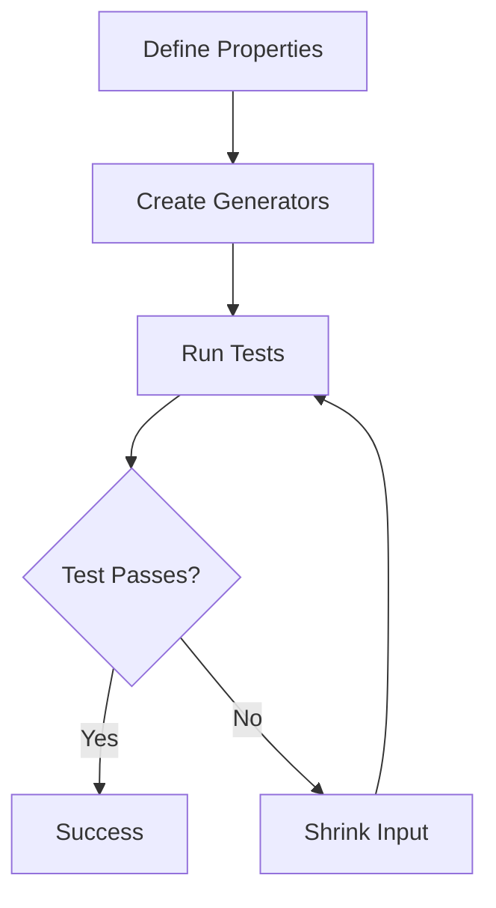

## 18.3 Property-Based Testing with PropEr and QuviQ QuickCheck

In the realm of software development, ensuring the correctness and robustness of code is paramount. Traditional testing methods often involve writing specific test cases with predetermined inputs and expected outputs. However, this approach can miss edge cases and unexpected scenarios. Enter property-based testing, a powerful technique that allows us to define the properties our code should satisfy and automatically generates a wide range of inputs to test these properties. In this section, we will delve into property-based testing in Erlang using two prominent tools: PropEr and QuviQ QuickCheck.

### Understanding Property-Based Testing

Property-based testing shifts the focus from specific test cases to the properties that a function or system should uphold. Instead of writing individual test cases, we define properties that describe the expected behavior of the code. The testing framework then generates numerous random inputs to verify these properties, uncovering edge cases and potential bugs that might not be evident with traditional testing methods.

#### Key Concepts

- **Properties**: Assertions about the expected behavior of the code. For example, a property might state that sorting a list should always result in a list where each element is less than or equal to the next.
- **Generators**: Functions that produce random inputs for testing. Generators can create simple data types like integers or complex structures like lists of tuples.
- **Shrinking**: When a test fails, the framework attempts to simplify the input to the smallest form that still causes the failure, making it easier to diagnose the issue.

### Introducing PropEr and QuviQ QuickCheck

Erlang developers have access to two powerful tools for property-based testing: PropEr and QuviQ QuickCheck. Both tools offer robust features for defining properties, generating inputs, and shrinking failing cases.

#### PropEr

[PropEr](https://github.com/proper-testing/proper) is an open-source property-based testing tool for Erlang. It integrates seamlessly with EUnit and Common Test, making it a versatile choice for Erlang projects.

#### QuviQ QuickCheck

[QuviQ QuickCheck](https://www.quviq.com/products/erlang-quickcheck/) is a commercial tool that offers advanced features and support for property-based testing in Erlang. It is known for its powerful shrinking capabilities and extensive library of predefined generators.

### Defining Properties and Generators

To effectively use property-based testing, we must define meaningful properties and create generators for the inputs our code will handle. Let's explore how to do this with PropEr and QuviQ QuickCheck.

#### Example: Testing a Sorting Function

Consider a simple sorting function. We want to ensure that the function correctly sorts any list of integers. Here's how we can define a property for this:

```erlang
-module(sort_test).
-include_lib("proper/include/proper.hrl").

prop_sorted() ->
    ?FORALL(L, list(integer()),
        lists:sort(L) == lists:sort(lists:sort(L))).
```

In this example, we use the `?FORALL` macro to specify that for any list of integers `L`, sorting it should yield the same result as sorting it twice. This property ensures idempotency of the sorting function.

#### Generators

Generators are crucial for creating diverse inputs. PropEr and QuickCheck provide a variety of built-in generators, and you can also define custom ones.

```erlang
integer_gen() ->
    ?SUCHTHAT(X, integer(), X > 0).

list_of_positive_integers() ->
    list(integer_gen()).
```

Here, `integer_gen` generates positive integers, and `list_of_positive_integers` creates lists of these integers.

### Uncovering Edge Cases and Hidden Bugs

One of the greatest strengths of property-based testing is its ability to uncover edge cases and hidden bugs. By generating a wide range of inputs, these tests can reveal scenarios that might not be considered during manual test case creation.

#### Example: Discovering a Bug

Suppose our sorting function has a bug that causes it to fail when sorting lists with duplicate elements. A property-based test might generate such a list and expose the issue, allowing us to address it before it affects production.

### Incorporating Property-Based Tests

Incorporating property-based tests into your testing strategy can significantly enhance code quality, especially for critical code paths. Here are some tips for effective integration:

- **Start Small**: Begin with simple properties and gradually increase complexity as you become more comfortable with the tools.
- **Focus on Critical Paths**: Prioritize property-based tests for functions and modules that are crucial to your application's functionality.
- **Combine with Traditional Tests**: Use property-based tests alongside traditional unit tests to cover both general behavior and specific edge cases.

### Try It Yourself

To truly grasp the power of property-based testing, try modifying the examples provided. Experiment with different properties and generators to see how they affect the test outcomes. Consider writing a property-based test for a function in your current project and observe the insights it provides.

### Visualizing Property-Based Testing

To better understand the workflow of property-based testing, let's visualize the process using a flowchart.



This flowchart illustrates the iterative process of defining properties, generating inputs, running tests, and shrinking inputs when a test fails.

### References and Further Reading

For more information on property-based testing and the tools discussed, consider exploring the following resources:

- [PropEr GitHub Repository](https://github.com/proper-testing/proper)
- [QuviQ QuickCheck Official Site](https://www.quviq.com/products/erlang-quickcheck/)
- [Erlang Documentation](https://www.erlang.org/docs)

### Knowledge Check

To reinforce your understanding of property-based testing, consider the following questions:

- What is the primary advantage of property-based testing over traditional testing methods?
- How do generators contribute to the effectiveness of property-based testing?
- Why is shrinking an important feature in property-based testing frameworks?

### Embrace the Journey

Remember, mastering property-based testing is a journey. As you continue to explore and experiment with these tools, you'll uncover new insights and techniques to enhance your code's robustness. Stay curious, keep testing, and enjoy the process!

## Quiz: Property-Based Testing with PropEr and QuviQ QuickCheck



### What is the primary advantage of property-based testing?

- [x] It tests code against a wide range of inputs automatically.
- [ ] It requires less setup than traditional testing.
- [ ] It only tests edge cases.
- [ ] It eliminates the need for any manual testing.

> **Explanation:** Property-based testing automatically generates a wide range of inputs to test code, uncovering edge cases and potential bugs.

### Which tool is known for its powerful shrinking capabilities?

- [ ] PropEr
- [x] QuviQ QuickCheck
- [ ] EUnit
- [ ] Common Test

> **Explanation:** QuviQ QuickCheck is renowned for its advanced shrinking capabilities, simplifying failing test cases to the smallest form.

### What is a generator in the context of property-based testing?

- [x] A function that produces random inputs for testing.
- [ ] A tool for debugging code.
- [ ] A method for optimizing performance.
- [ ] A library for managing dependencies.

> **Explanation:** Generators create random inputs that are used to test properties in property-based testing.

### What does the `?FORALL` macro do in PropEr?

- [x] It specifies that a property should hold for all generated inputs.
- [ ] It generates random inputs for testing.
- [ ] It shrinks failing test cases.
- [ ] It defines a new property.

> **Explanation:** The `?FORALL` macro in PropEr is used to define properties that should hold true for all generated inputs.

### How can property-based testing uncover hidden bugs?

- [x] By generating a wide range of inputs that might not be considered manually.
- [ ] By focusing only on edge cases.
- [ ] By eliminating the need for traditional tests.
- [ ] By simplifying the codebase.

> **Explanation:** Property-based testing generates diverse inputs, revealing scenarios that might not be covered by manually written test cases.

### What is the purpose of shrinking in property-based testing?

- [x] To simplify failing test cases to the smallest form.
- [ ] To generate more complex inputs.
- [ ] To increase test coverage.
- [ ] To optimize code performance.

> **Explanation:** Shrinking reduces failing test cases to their simplest form, making it easier to diagnose and fix issues.

### Which of the following is a key concept in property-based testing?

- [x] Properties
- [x] Generators
- [ ] Debuggers
- [ ] Compilers

> **Explanation:** Properties and generators are fundamental concepts in property-based testing, defining expected behavior and creating inputs.

### What is the role of the `integer_gen` function in the example?

- [x] It generates positive integers for testing.
- [ ] It sorts a list of integers.
- [ ] It defines a new property.
- [ ] It shrinks failing test cases.

> **Explanation:** The `integer_gen` function is a generator that produces positive integers for testing purposes.

### Why should property-based tests be prioritized for critical code paths?

- [x] They enhance code quality by uncovering edge cases.
- [ ] They are easier to write than traditional tests.
- [ ] They eliminate the need for manual testing.
- [ ] They reduce the overall code complexity.

> **Explanation:** Property-based tests are particularly valuable for critical code paths as they can reveal edge cases and potential issues.

### True or False: Property-based testing can replace all traditional testing methods.

- [ ] True
- [x] False

> **Explanation:** While property-based testing is powerful, it complements rather than replaces traditional testing methods, providing broader coverage and insight.


